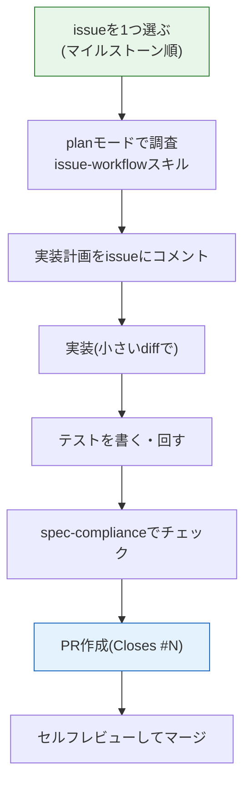

# AI駆動開発の型(応用編)

[AI開発](/ai/)ではClaude Codeのセットアップ、CLAUDE.md、skills、permissionの基本を学びました。このページでは、それらを応用編のプロジェクトでどう使うかをまとめます。ここでの型は3プロジェクト共通です。

## 仕様リポジトリに入っているもの

各プロジェクトの仕様リポジトリには、AI駆動開発のための設定があらかじめ入っています。

| ファイル | 役割 |
| --- | --- |
| `CLAUDE.md` | Claude Codeが毎セッション読む、リポジトリの前提とドキュメントの読み順 |
| `AGENTS.md` | Codexなど他のコーディングエージェント用。内容はCLAUDE.mdと同じ |
| `.claude/skills/` | Claude Code用のスキル(下表) |
| `.agents/skills/` | 同じスキルのミラー。Codexなどから参照する用 |

「Use this template」で自分のリポジトリを作ると、これらもすべて付いてきます。つまり、**cloneして `claude` を起動した瞬間から、AIがプロジェクトの仕様を前提に動く**状態になっています。

## 共通スキル

| スキル | 使うタイミング | やってくれること |
| --- | --- | --- |
| `project-onboarding` | 最初の1回 | docsの読み順の案内、プロジェクトの全体像の説明 |
| `setup-github-project` | 最初の1回 | 自分のリポジトリへのラベル・マイルストーン・issueの複製 |
| `issue-workflow` | issueに着手するたび | issue読解 → 仕様の該当箇所の特定 → 実装計画 → 実装 → テスト → PR作成 |
| `spec-compliance` | PRを出す前 | 実装と要件定義・DB設計・API設計との突合チェック |

これに加えて、各プロジェクトにドメイン固有のスキルが1つずつあります(例: 予約システムの `reservation-domain` は空き枠計算のアルゴリズム仕様を持っています)。

## 1つのissueを進める型

ポイントは3つです。

1. **調査と計画はplanモードで行う。** いきなり書かせると、仕様を読み飛ばした実装になりがちです。「このissueに関係する仕様をdocsから探して、実装計画を出して」から始めます
2. **計画をissueのコメントに残す。** 実務でのチケット運用と同じで、後から「なぜこう作ったか」を追えるようにします
3. **受入条件を自分で検証する。** issueには必ず受入条件(チェックボックス)があります。AIが「できました」と言っても、自分で動かして1つずつ確認してからPRを出します

## 良い依頼・悪い依頼

| | 例 |
| --- | --- |
| 悪い | 「予約機能を作って」 |
| 良い | 「issue #12 に着手します。docs/requirements.md の予約ルールと docs/api.md の POST /api/reservations を読んで、実装計画を先に出してください。二重予約防止は reservation-domain スキルの方針に従ってください」 |

悪い依頼が悪いのは、AIが仕様ではなく一般常識で埋めてしまうからです。応用編の仕様は「キャンセルは開始24時間前まで」のように細部まで決まっています。**仕様を読ませてから書かせる**のが応用編の基本動作です。

## AIに任せること・自分がやること

| AIに任せてよい | 自分がやる |
| --- | --- |
| 仕様の該当箇所の検索と要約 | 仕様の最終解釈(迷ったらissueに書く) |
| 実装コードの生成 | コードレビュー(全行読む) |
| テストコードの生成 | 受入条件の実機確認 |
| エラーの調査 | 直し方の選択 |
| PR説明文のドラフト | マージの判断 |

「AIが書いたから読まなくていい」は実務では通りません。**レビュアーとしての自分**を育てるのが応用編の目的の半分です。読んで分からないコードが出てきたら、マージする前に「このコードを1行ずつ解説して」とAIに聞いてください。

## つまずいたら

- issueの受入条件が満たせない → issueの「ヒント」欄を読む。それでも詰まったら、issueにコメントで状況を書いてから(言語化すると解決することが多いです)、AIに状況ごと貼って相談する
- 仕様に書いていないことに気づいた → 実務なら仕様の管理者に確認する場面です。自分のリポジトリのissueとして「仕様の穴」を起票し、自分で決めた解釈を書き残して進めてください
- AIが仕様と違う実装をした → `spec-compliance` スキルでチェックし、差分をAIに提示して直させてください

## 次のステップ

型を押さえたら、[美容室予約システム](/advanced/salon_reservation/)から始めてください。
