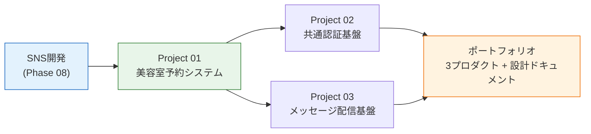

# 実務プロジェクト応用編

ここまでのカリキュラムは、手順を1つずつ解説するチュートリアル形式でした。応用編は違います。実務と同じように、**要件定義書・DB設計書・API設計書・GitHub Issuesだけを渡されて、自分とAIの力で作り切る**フェーズです。

架空のビューティーテック企業「株式会社Lumina(ルミナ)」に入社したエンジニア、という設定で3つのプロダクトを開発します。

## 前提

| 前提 | 対応する教材 |
| --- | --- |
| SNS開発をいずれかのスタックで完成させている | [SNS開発](/sns/) |
| AI駆動開発の基本(CLAUDE.md、skills、permission) | [AI開発](/ai/) |
| Git/GitHubでのPR運用 | [Git/GitHub基礎](/git/) |
| CI/CDの基本 | [GitHub Actions](/cicd/) |

## 3つのプロジェクト

| 順序 | プロジェクト | 仕様リポジトリ | 主なテーマ | 目安 |
| --- | --- | --- | --- | --- |
| 1 | [美容室予約システム](/advanced/salon_reservation/) | [curriculum-project-salon-reservation](https://github.com/dik-ab/curriculum-project-salon-reservation) | 空き枠計算、二重予約防止、ロール別権限 | 6〜8週 |
| 2 | [共通認証基盤](/advanced/auth_platform/) | [curriculum-project-auth-platform](https://github.com/dik-ab/curriculum-project-auth-platform) | Cognito、OIDC、SSO、ユーザー移行 | 3〜5週 |
| 3 | [メッセージ配信基盤](/advanced/notification_platform/) | [curriculum-project-notification-platform](https://github.com/dik-ab/curriculum-project-notification-platform) | SQS、非同期ワーカー、冪等性、大量配信 | 5〜7週 |

Project 01が土台です。Project 02と03は01の成果物と連携しますが、互いに独立しているので、興味に応じて順序を入れ替えてもかまいません(01が未完成でも進められる代替手順を各リポジトリに用意しています)。

## チュートリアルとの違い

| | これまでの教材 | 応用編 |
| --- | --- | --- |
| 手順 | 章ごとに解説とコードがある | 仕様とissueだけ。実装手順は自分で決める |
| 言語 | 章ごとに固定 | 自由(学んだ6スタックのどれでも) |
| 正解コード | 解答リポジトリあり | なし。受入条件を満たせばすべて正解 |
| 進捗管理 | ページを読み進める | GitHub Issuesとマイルストーン |
| AIの使い方 | 補助 | 主戦力。ただしレビューと判断は自分 |

## 進め方(全プロジェクト共通)

1. 仕様リポジトリの「Use this template」から自分のリポジトリを作る(Publicにするとポートフォリオとして見せられます)
2. `docs/` の要件定義書・DB設計書・API設計書・インフラ設計書を読む(各リポジトリの `project-onboarding` スキルが読み順を案内します)
3. `setup-github-project` スキル(または `scripts/setup_issues.sh`)で、自分のリポジトリにラベル・マイルストーン・issueを複製する
4. マイルストーンM1から順に、1 issue = 1ブランチ = 1 PRで進める
5. PR前に `spec-compliance` スキルで仕様との突合チェックを行う

AI駆動の具体的な型は[AI駆動開発の型(応用編)](/advanced/ai_driven_flow/)にまとめています。最初に読んでください。

## 完成したら

各プロジェクトは、それ自体がポートフォリオになる規模と難易度に設計しています。仕上げとして、自分のリポジトリのREADMEに以下を載せることを完成条件にしています。

- スクリーンショットまたはデモ動画
- 使用スタックと構成図
- 工夫した点(例: 二重予約防止のテスト、冪等性の担保方法)
- セットアップ手順

## 注意

- Project 02はAWSアカウントが必要です(Cognitoは50,000 MAUまで無料)。Project 01と03はローカルだけで完結できます(AWSデプロイは任意課題)
- AWSリソースを作る課題では、**学習後に必ず削除**してください。各リポジトリの `docs/infra.md` に削除手順があります
