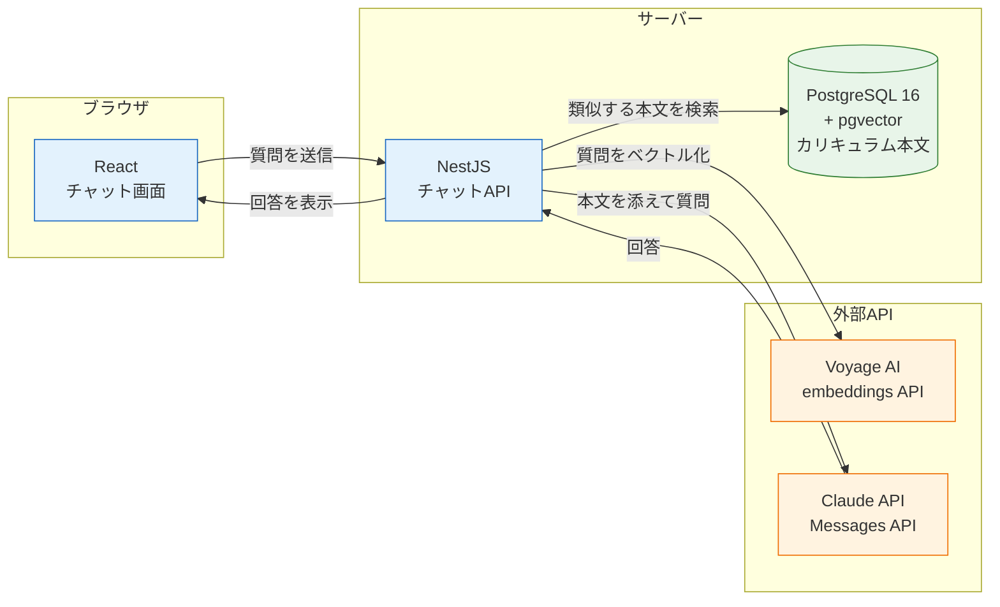
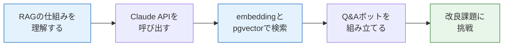

# AIチャット開発（RAG）

このセクションでは、これまで学んできた技術を総動員して、**「このカリキュラム自体に質問できるQ&Aボット」**を開発します。

[AI開発入門](/ai/)では、LLM（大規模言語モデル）の仕組みと、Claude Codeを使った開発の進め方を学びました。このセクションでは一歩進んで、**自分のアプリケーションにAIを組み込む**方法を学びます。

## 作るもの

ブラウザのチャット画面から「Prismaのマイグレーションって何でしたっけ？」のように質問すると、このカリキュラムの本文を検索して、その内容にもとづいた回答を返してくれるボットです。

```text
あなた: useEffectの依存配列って何のためにあるんですか？

ボット: 依存配列は「いつエフェクトを再実行するか」をReactに伝えるための
       仕組みです。カリキュラムの「React基礎 > hooks」のページでは、
       依存配列に指定した値が変わったときだけuseEffectの中の処理が
       再実行される、と説明されています。（出典: react/hooks.md）
```

ポイントは、ボットが**一般的な知識ではなく、このカリキュラムの本文を根拠に答える**ことです。これを実現する技術が、このセクションの主役である**RAG（ラグ、Retrieval-Augmented Generation：検索拡張生成）**です。

## 全体の構成

完成形のアーキテクチャを先に見ておきましょう。これまでのセクションで学んだ技術が、それぞれの持ち場で働きます。



- **React** — チャット画面のUI。[React基礎](/react/)で学んだ`useState`と`fetch`を使います
- **NestJS** — 質問を受け取り、検索とAI呼び出しを組み立てるAPIサーバー。[バックエンド基礎](/backend/)の知識をそのまま使います
- **PostgreSQL + pgvector** — カリキュラム本文を「ベクトル」として保存し、意味の近い文章を検索します。[データベースとPrisma](/database/)で学んだPostgreSQLに拡張機能を追加します
- **Voyage AI / Claude API** — 文章のベクトル化（embedding）と回答の生成を担当する外部AIサービスです

## このセクションで学ぶこと



| ページ | 内容 |
|---|---|
| [RAGとは何か](/ai-chat/what_is_rag/) | LLMの限界とRAGの考え方、embedding（意味の座標）、コサイン類似度 |
| [Claude APIの基礎](/ai-chat/claude_api/) | APIキーの取得と管理、Messages API、SDKでの最小実装、ストリーミング |
| [embeddingとpgvector](/ai-chat/embeddings_and_pgvector/) | Voyage AIでのembedding生成、pgvector拡張の導入、類似検索クエリ |
| [Q&Aボットを構築する](/ai-chat/build_rag_chat/) | ドキュメント取り込み、NestJSのチャットAPI、Reactのチャット画面 |
| [練習問題](/ai-chat/practice/) | 会話履歴、ストリーミング応答、検索精度の改善などの改良課題 |

## このセクションの前提知識

以下のセクションを修了していることを前提とします。

- [TypeScript基礎](/typescript/) — すべてのコードをTypeScriptで書きます
- [React基礎](/react/) — 特に[APIとの通信](/react/api_fetch/)
- [バックエンド基礎（NestJS）](/backend/) — Controller / Service / DTOを一通り使います
- [データベースとPrisma](/database/) — PostgreSQLの起動とPrismaの操作
- [Docker基礎](/docker/) — [Docker Compose](/docker/docker_compose/)でデータベースを起動します
- [AI開発入門](/ai/) — [LLMとは何か](/ai/what_is_llm/)、トークンの概念

## 費用について（重要）

このセクションでは、**Claude APIとVoyage AIという2つの有料APIを使用します**。どちらも従量課金制で、使った分だけ料金が発生します。

学習で扱う量であれば高額にはなりませんが、APIキーの扱いを間違えると（たとえばGitHubに公開してしまうと）第三者に不正利用され、思わぬ請求が発生する恐れがあります。各ページの注意書きを必ず読み、**APIキーは絶対にコミットしない**というルールを徹底してください。詳しくは[Claude APIの基礎](/ai-chat/claude_api/)で説明します。

## 学んだことはどこで使うのか

RAGは現在、業務システムへのAI組み込みで最もよく使われるパターンのひとつです。「社内マニュアルに答えるボット」「製品ドキュメントのサポートAI」など、構成はこのセクションで作るものとほぼ同じです。

また、ここで使うNestJS + PostgreSQL + Reactの組み合わせは、次の[SNS開発（最終プロジェクト）](/sns/)でも中心となる構成です。外部APIとの連携、APIキーの安全な管理、非同期処理の組み立てといった経験は、どんなWebサービス開発でも役立ちます。

まずは[RAGとは何か](/ai-chat/what_is_rag/)から始めましょう。
