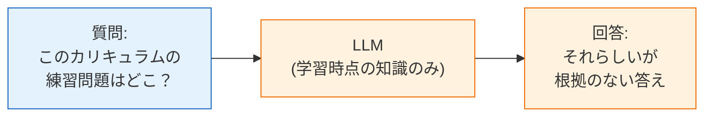
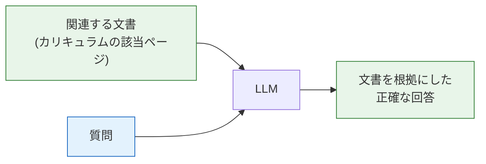
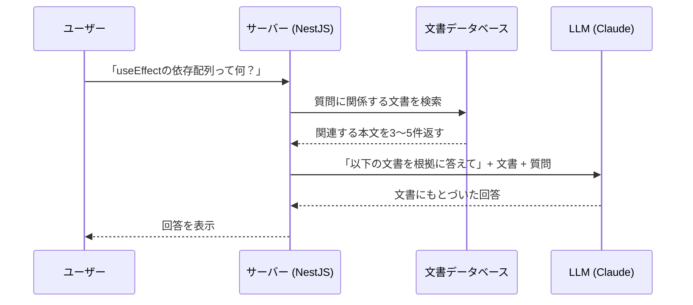
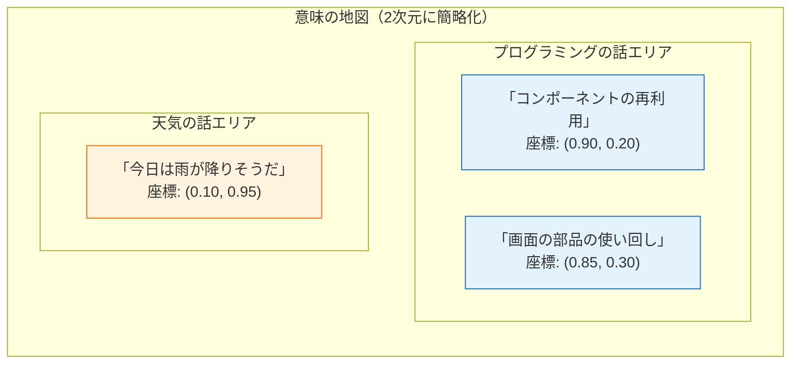
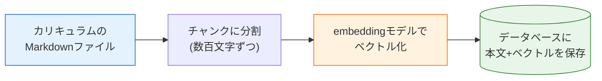
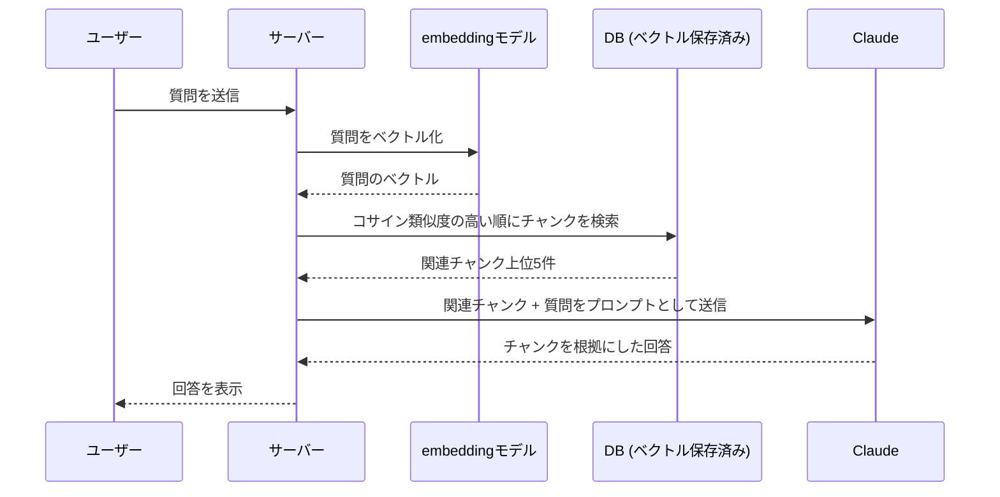

# RAGとは何か

このページでは、これから作るQ&Aボットの土台となる考え方、**RAG（ラグ、Retrieval-Augmented Generation：検索拡張生成）**を学びます。コードはまだ書きません。まず「なぜRAGが必要なのか」「どういう仕組みで動くのか」を、図を使ってしっかり理解しましょう。

[AI開発入門のLLMとは](/ai/what_is_llm/)で学んだ「LLMができること・苦手なこと」が前提知識になります。不安な人は先に復習しておいてください。

## 学習目標

- LLMが「学習時点の知識しか持たない」ことと、それが引き起こす問題を説明できる
- RAGの基本的な流れ（検索してから生成する）を図に描いて説明できる
- embedding（エンベディング）を「文章を意味の座標に変換する仕組み」として説明できる
- コサイン類似度が「2つの文章の意味の近さ」を表すことを理解する
- RAGとファインチューニングの違いを説明できる

## LLMの限界：学習時点の知識しか持たない

ClaudeのようなLLMは、インターネット上の膨大なテキストを学習して作られています。しかし、その学習にはある時点で区切りがあります。これを**ナレッジカットオフ（knowledge cutoff：知識の締め切り日）**と呼びます。

つまり、LLMは次のことを**知りません**。

1. **学習が終わった後に起きたこと** — 最新のニュース、新しいライブラリのバージョンなど
2. **そもそも学習データに含まれていないこと** — あなたの会社の社内マニュアル、非公開のドキュメント、そして**このカリキュラムの本文**

ここで厄介なのは、LLMは知らないことを聞かれても「知りません」と言わずに、**それらしい嘘を自信満々に答えてしまう**ことがある点です。これを**ハルシネーション（hallucination：幻覚）**と呼びます。



LLMはこのカリキュラムを読んだことがないので、カリキュラムについての質問には正しく答えられません。では、どうすればよいのでしょうか。

## 解決のアイデア：答えの材料を一緒に渡す

実は、LLMには大きな強みがあります。**「渡された文章を読んで、それにもとづいて答える」のは非常に得意**なのです。

人間にたとえてみましょう。歴史の専門家に「あなたの会社の経費精算のルール」を聞いても答えられません。しかし、**経費精算マニュアルを手渡してから**聞けば、的確に答えてくれるはずです。LLMも同じです。



つまり、質問と一緒に「答えの材料になる文書」をプロンプトに含めて渡せばよいのです。

しかし、ここで新しい問題が生まれます。このカリキュラムには何十ページもの文書があります。**全部を毎回渡すわけにはいきません**。LLMが一度に読めるテキスト量（コンテキストウィンドウ）には上限がありますし、入力した分だけ料金もかかります。

そこで必要になるのが、**「質問に関係する文書だけを探し出す」検索の仕組み**です。

## RAG = 検索（Retrieval）+ 生成（Generation）

この「検索してから生成する」という組み合わせが、RAG（Retrieval-Augmented Generation：検索拡張生成）です。名前は仰々しいですが、やっていることは次の3ステップだけです。

1. **Retrieval（検索）** — 質問に関係する文書を、手持ちのドキュメントから探し出す
2. **Augmentation（拡張）** — 見つけた文書をプロンプトに埋め込んで、質問と一緒にLLMへ渡す
3. **Generation（生成）** — LLMが文書を根拠に回答を生成する

処理の流れをシーケンス図で見てみましょう。



ポイントは、LLM自体には何の変更も加えていないことです。**LLMに渡す入力（プロンプト）を工夫しているだけ**なので、Claude APIをそのまま使って実現できます。

## 検索の課題：キーワード検索では足りない

「文書を検索する」と聞いて、SQLの`LIKE '%キーワード%'`のような検索を思い浮かべたかもしれません（→ [SQLの基礎](/database/what_is_database/)）。しかし、キーワード検索には弱点があります。

たとえばユーザーが「**画面の部品の使い回し方**を知りたい」と質問したとします。カリキュラムの該当ページには「**コンポーネントの再利用**」と書かれています。意味はほぼ同じなのに、共通する単語がないため、キーワード検索ではヒットしません。

| 質問の表現 | 文書の表現 | キーワード一致 | 意味 |
|---|---|---|---|
| 画面の部品の使い回し | コンポーネントの再利用 | しない | ほぼ同じ |
| DBの起動 | PostgreSQLをComposeで立ち上げる | しない | ほぼ同じ |
| Java入門 | JavaScript入門 | 「Java」が一致 | まったく別物 |

人間の質問は表現がバラバラです。必要なのは、**単語の一致ではなく「意味の近さ」で検索する仕組み**です。これを実現するのが、次に説明するembeddingです。

## embedding：文章を「意味の座標」に変換する

**embedding（エンベディング：埋め込み）**とは、文章を**数値の並び（ベクトル）に変換する**技術です。…と言われてもピンとこないので、地図のメタファで考えてみましょう。

地図上の場所は「緯度・経度」という2つの数値で表せます。そして、**座標が近い2つの地点は、実際に近い場所にあります**。

embeddingはこれの「意味」バージョンです。embeddingモデル（これもAIの一種です）に文章を渡すと、**「意味の地図」上の座標**が返ってきます。そして、**意味が近い文章ほど、近い座標に配置される**のです。

説明のために、座標が2次元（数値2個）だったとして図にしてみます。



「コンポーネントの再利用」と「画面の部品の使い回し」は、**単語はまったく違うのに座標が近い**ことに注目してください。embeddingモデルが学習を通じて「この2つは似た意味だ」と判断しているからです。一方、「今日は雨が降りそうだ」は遠く離れた場所にあります。

実際のembeddingは2次元ではなく、**1024次元**（数値1024個の並び）などの高次元です。人間には想像しにくいですが、「次元が多いほど、意味の違いを細かく表現できる」と考えてください。やることは2次元と同じで、「座標が近い＝意味が近い」です。

```text
「コンポーネントの再利用」
  ↓ embeddingモデルに渡す
[-0.013, 0.019, 0.072, -0.044, ... ]  ← 1024個の数値（ベクトル）
```

なお、embeddingの生成にはLLMとは別の専用モデルを使います。Anthropic社はembeddingモデルを提供していないため、このカリキュラムではAnthropicが公式ドキュメントで紹介している**Voyage AI**のembeddings APIを使います（→ 詳細は[embeddingとpgvector](/ai-chat/embeddings_and_pgvector/)）。

## コサイン類似度：座標の近さを数値にする

「座標が近い」を、プログラムで扱える数値にしましょう。よく使われるのが**コサイン類似度（cosine similarity）**です。

コサイン類似度は、原点から各座標へ引いた2本の矢印（ベクトル）が作る**角度**にもとづく値で、**-1から1の範囲**をとります。

- **1に近い** — 矢印がほぼ同じ方向を向いている = 意味がとても近い
- **0に近い** — 矢印が直角 = 意味の関係が薄い
- **-1に近い** — 矢印が逆方向 = 意味が反対方向

先ほどの2次元の例で実際に計算してみると、直感どおりの結果になります。

| 比較する組み合わせ | コサイン類似度 |
|---|---|
| 「コンポーネントの再利用」(0.90, 0.20) と 「画面の部品の使い回し」(0.85, 0.30) | **約0.99**（とても近い） |
| 「コンポーネントの再利用」(0.90, 0.20) と 「今日は雨が降りそうだ」(0.10, 0.95) | **約0.32**（遠い） |

計算式自体は次のとおりですが、暗記する必要はありません。後のページで学ぶpgvectorが計算してくれます。

```text
コサイン類似度 = (AとBの内積) ÷ (Aの長さ × Bの長さ)

例: A = (0.90, 0.20), B = (0.85, 0.30) の場合
    内積       = 0.90 × 0.85 + 0.20 × 0.30 = 0.825
    Aの長さ    = √(0.90² + 0.20²) ≈ 0.922
    Bの長さ    = √(0.85² + 0.30²) ≈ 0.901
    類似度     = 0.825 ÷ (0.922 × 0.901) ≈ 0.99
```

これで「意味で検索する」方法が揃いました。**質問のembeddingと、各文書のembeddingのコサイン類似度を計算し、類似度が高い順に並べれば、意味が近い文書から順に取り出せる**のです。これを**ベクトル検索（vector search）**または**類似検索**と呼びます。

## RAGの全体像（完成図）

ここまでの部品を組み合わせると、RAGの全体像はこうなります。RAGには「事前の仕込み」と「質問への応答」という2つのフェーズがあることに注意してください。

**フェーズ1：取り込み（事前に1回だけ実行）**



文書をそのまま1ファイル丸ごとベクトル化するのではなく、**チャンク（chunk：かたまり）**と呼ばれる数百文字程度の単位に分割してからベクトル化します。1ページの中にも複数の話題があるため、細かく分けたほうが「質問にピンポイントで関係する部分」を取り出せるからです。

**フェーズ2：質問への応答（質問のたびに実行）**



質問も**同じembeddingモデルで**ベクトル化する点が重要です。文書と質問が同じ「意味の地図」の座標になっていないと、距離の比較ができません。

## RAGとファインチューニングの違い

「LLMに独自の知識を持たせる」もうひとつの方法として、**ファインチューニング（fine-tuning：追加学習）**を聞いたことがあるかもしれません。モデル自体を自分のデータで追加学習させる手法です。RAGとの違いを整理しておきましょう。

| | RAG | ファインチューニング |
|---|---|---|
| やること | 検索した文書をプロンプトに足す | モデル自体を追加学習させる |
| 知識の更新 | DBの文書を入れ替えるだけ | 再学習が必要（時間とコスト大） |
| 回答の根拠 | どの文書を使ったか提示できる | 提示できない |
| 導入の手軽さ | APIを組み合わせるだけ | 学習データ整備と学習環境が必要 |
| 向いている用途 | 社内文書Q&A、ドキュメント検索 | 文体や出力形式の矯正など |

「最新の・固有の知識にもとづいて答えさせたい」という今回のような用途には、RAGのほうが圧倒的に手軽で、根拠も示せるため実務でも第一の選択肢になります。

## 理解度チェック

**Q1. LLMに「このカリキュラムの内容」について直接質問しても正しく答えられないのはなぜですか。**

<details markdown="1">
<summary>解答を見る</summary>

LLMは学習時点までの学習データに含まれる知識しか持っておらず、このカリキュラムの本文は学習データに含まれていないからです。さらに、知らないことを聞かれた場合でも「知らない」と答えずに、それらしい誤った回答（ハルシネーション）を生成してしまうことがあるため、根拠のない答えが返ってくる恐れがあります。

</details>

**Q2. RAGの3ステップ（Retrieval / Augmentation / Generation）をそれぞれ一言で説明してください。**

<details markdown="1">
<summary>解答を見る</summary>

- **Retrieval（検索）**: 質問に意味が近い文書（チャンク）を、保存済みのドキュメントから探し出す
- **Augmentation（拡張）**: 見つけた文書をプロンプトに埋め込み、質問と一緒にLLMへ渡す
- **Generation（生成）**: LLMが渡された文書を根拠として回答を生成する

LLM自体には手を加えず、入力（プロンプト）を工夫するだけで実現できるのがポイントです。

</details>

**Q3. キーワード検索（LIKE検索）ではなくベクトル検索を使う理由を、具体例を挙げて説明してください。**

<details markdown="1">
<summary>解答を見る</summary>

ユーザーの質問と文書では、同じ意味でも違う言葉が使われることが多いからです。たとえば「画面の部品の使い回し」という質問と「コンポーネントの再利用」という文書は意味がほぼ同じですが、共通する単語がないためキーワード検索ではヒットしません。ベクトル検索なら、embeddingによって両者が「意味の地図」上の近い座標に変換されるため、単語が一致しなくても意味の近さで検索できます。

</details>

**Q4. embeddingとは何をするものですか。「地図」のメタファを使って説明してください。**

<details markdown="1">
<summary>解答を見る</summary>

embeddingは、文章を「意味の地図」上の座標（数値の並び＝ベクトル）に変換する技術です。地図上で近い座標が実際に近い場所を表すように、embeddingでは意味が近い文章ほど近い座標に配置されます。実際の座標は2次元ではなく1024次元などの高次元ですが、「座標が近い＝意味が近い」という性質は同じです。

</details>

**Q5. コサイン類似度が「0.99」のペアと「0.32」のペアでは、どちらが意味的に近いと言えますか。また、コサイン類似度がとる値の範囲はいくつからいくつまでですか。**

<details markdown="1">
<summary>解答を見る</summary>

0.99のペアのほうが意味的に近いと言えます。コサイン類似度は2つのベクトルが作る角度にもとづく値で、-1から1の範囲をとります。1に近いほど同じ方向（意味が近い）、0に近いと直角（関係が薄い）、-1に近いと逆方向を表します。

</details>

**Q6. 文書を丸ごとではなく「チャンク」に分割してからベクトル化するのはなぜですか。**

<details markdown="1">
<summary>解答を見る</summary>

1つのページ（ファイル）の中には複数の話題が含まれているため、丸ごと1つのベクトルにすると意味がぼやけてしまい、質問とのピンポイントな照合が難しくなるからです。数百文字程度のチャンクに分割しておけば、「質問に直接関係する部分」だけを取り出してLLMに渡せます。LLMに渡すテキスト量（＝トークン数と料金）を抑えられるという利点もあります。

</details>

## セルフレビュー

- [ ] ナレッジカットオフとハルシネーションを自分の言葉で説明できる
- [ ] RAGの流れを、何も見ずにシーケンス図として描ける
- [ ] 「取り込みフェーズ」と「応答フェーズ」で何をするかを区別して説明できる
- [ ] embeddingを「意味の座標」のメタファで人に説明できる
- [ ] コサイン類似度の値（1に近い/0に近い）が何を意味するか説明できる
- [ ] キーワード検索とベクトル検索の違いを具体例つきで説明できる
- [ ] RAGとファインチューニングの使い分けを説明できる

## 次のステップ

RAGの全体像がつかめたら、いよいよ部品を1つずつ実装していきます。

次のページ: [Claude APIの基礎](/ai-chat/claude_api/) — まずは「Generation（生成）」を担当するClaude APIを、単体で呼び出せるようになりましょう。

このページで学んだ「取り込み→検索→生成」の流れは、[Q&Aボットを構築する](/ai-chat/build_rag_chat/)でそのままコードになります。図を頭に入れた状態で進むと、各ページの実装がどの部品にあたるのかが見えやすくなります。
