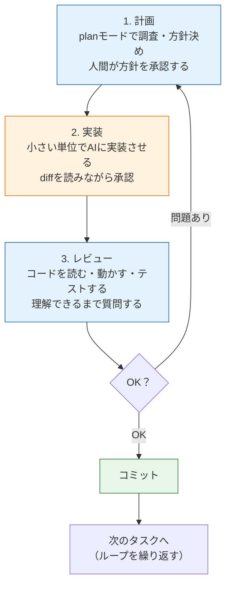

# AIペアプログラミング実践

このセクションの仕上げとして、AIと一緒に開発を進める**実践的なワークフロー**を学びます。道具の使い方はすでに揃いました。[LLMの仕組み](/ai/what_is_llm/)を理解し、[Claude Codeを導入し](/ai/claude_code_setup/)、[CLAUDE.md](/ai/claude_md/)と[skills](/ai/skills_and_commands/)でプロジェクトに適応させました。残る問いは「**で、実際の開発でどう使うのか？**」です。

このページのタイトルは「AIペアプログラミング」です。ペアプログラミングとは、2人の開発者が1つのコードを一緒に書く開発手法で、片方が書き、もう片方がレビューや助言をします。AIとの開発もこれに似ています——ただし、**主導権とコードへの責任は常に人間側にある**ペアです。AIは優秀ですが、確率的にもっともらしい出力を生成しているだけであり、皆さんのプロジェクトの最終的な品質を保証するのは皆さん自身です。

## 学習目標

- 計画→実装→レビューのループでAIとの開発を進められる
- 「丸投げ」がなぜ失敗しやすいかを、LLMの性質から説明できる
- 良い指示（具体的・小さく・文脈つき）を書ける
- 学習目的でAIを使うときの注意点（写経の価値を守る）を説明できる

## 基本ループ: 計画→実装→レビュー

AIとの開発で最も重要な型が、**計画（Plan）→実装（Implement)→レビュー（Review）** のループです。



それぞれの段階を詳しく見ていきます。

### 1. 計画: コードを書かせる前に方針を固める

いきなり「実装して」と頼まず、まず**planモード**（[導入ページ](/ai/claude_code_setup/)参照。Shift+Tabで切り替え）で調査と計画をさせます。

```text
投稿に「いいね」機能を追加したいです。まだ実装しないでください。
既存のコード構成を調査して、必要な変更（DBスキーマ、API、画面）を
洗い出し、実装方針を提案してください。
```

planモードならAIはファイルを読むだけで編集できないため、安心して調査を任せられます。提案された方針を読み、**自分が納得できるか**を確認します。納得できない部分、分からない部分があれば、この段階で質問してください。

```text
中間テーブルを作る案ですが、なぜ posts テーブルに likes_count カラムを
足すだけではだめなのですか？
```

計画段階での対話には、設計レビューと学習の両方の価値があります。「なぜその設計か」を説明させると、[データベースとPrisma](/database/relations/)で学んだ多対多リレーションのような知識が実際の文脈とつながります。

なぜ計画を先にするのか。理由は2つあります。第一に、LLMは指示が曖昧なほど「もっともらしいが意図と違う」出力をしやすいため、方針を先に固めることで手戻りが減ります。第二に、コードができあがった後では、人間は流暢な出力に引きずられて「それっぽいからOK」と判断しがちだからです。方針の妥当性は、コードがない段階の方が冷静に判断できます。

### 2. 実装: 小さく任せて、diffを読む

方針が固まったら、defaultモードに戻して実装させます。このとき、**一度に任せる範囲を小さく**します。

```text
さきほどの方針の手順1（Prismaスキーマに Like モデルを追加して
マイグレーションを作成）だけを実装してください。
```

「いいね機能を全部作って」と一括で任せると、巨大なdiffが一気に出てきて、レビューが事実上不可能になります。1ステップずつ進めれば、各diffは数十行に収まり、読んで理解してから承認できます。

実装中の承認プロンプトは「読む練習の機会」です。差分を流し読みせず、**自分ならどう書いたか**と比べながら読んでください。疑問があれば承認前に聞きます。

```text
この onDelete: Cascade はどういう意味ですか？付けない場合と何が変わりますか？
```

### 3. レビュー: 読む・動かす・テストする

実装が終わったら、必ず検証します。[LLMとは何か](/ai/what_is_llm/)で学んだとおり、AIの出力の正しさは出力の外側でしか確認できません。

- **読む**: 変更されたファイルを通して読み、全行を説明できる状態にする
- **動かす**: アプリを起動し、追加した機能を実際に操作する。正常系だけでなく異常系（連打したら？未ログインなら？）も試す
- **テストする**: `pnpm test` を実行する。新機能にテストがなければ、テストの追加もAIに依頼する（[バックエンドテスト](/testing/)で学んだ観点で、テスト自体もレビューします）

AIにレビューを手伝わせることもできます。

```text
いまの変更をレビューして、バグの可能性、エッジケースの考慮漏れ、
セキュリティ上の問題を指摘してください。
```

書いたAIと同じAIにレビューさせても一定の指摘は出ます。ただし、**AIのレビューは人間のレビューの代わりではなく補助**です。最後に「OK」を出すのは自分です。

問題がなければGitにコミットして、次のタスクのループへ進みます。コミットを細かく刻んでおけば、後のループで問題が見つかっても安全に戻れます。

## 丸投げしない: 失敗パターンとその理由

ループの対極にあるのが「丸投げ」です。典型的な失敗パターンを見てみましょう。

**悪い例:**

```text
SNSアプリを作ってください。投稿といいねとフォローとDMができるやつです。
```

この指示が失敗しやすい理由は、LLMの性質から説明できます。

1. **曖昧さは「もっともらしい補完」で埋められる**: 認証方式は？DBは？画面構成は？——指示にない部分を、AIは学習データ上ありがちな構成で勝手に埋めます。それが皆さんの意図と一致する保証はありません
2. **出力が大きいほど検証が不可能になる**: 数千行のコードが一気に生成されたら、全行レビューは現実的に不可能です。「検証していないコード」がプロジェクトの大部分を占めることになります
3. **問題の切り分けができなくなる**: 動かなかったとき、どこが悪いのか特定できません。小さく進めていれば「直前のステップ」だけ疑えばよいのに、丸投げでは全体が容疑者になります

同じ依頼を、良い指示に直すとこうなります。

**良い例（最初の1ステップ分）:**

```text
SNSアプリの投稿機能から作り始めます。このリポジトリはNestJS+Prismaです
（構成はCLAUDE.md参照）。まず Post モデル（id, content, authorId,
createdAt）をschema.prismaに追加し、マイグレーションを作成してください。
contentは280文字までという制約はDTOのバリデーションで実現する予定なので、
DB側の制約は不要です。
```

良い指示の共通点は3つです。

- **具体的**: 何を・どこに・どんな仕様で、が明確
- **小さい**: 1回の依頼が1ステップ。レビューできるサイズ
- **文脈つき**: 前提（技術スタック、これからの予定）を共有している。CLAUDE.mdが整備されていれば、この部分は大幅に省略できます

## 学習目的で使うときの注意: 写経の価値を守る

ここからは、**学習中の皆さんに特に重要な話**です。

このカリキュラムでは一貫して「写経せずに書けるか」をセルフレビューの基準にしてきました。手を動かしてコードを書く行為には、読むだけでは得られない学習効果があるからです。文法の細部、エラーとの格闘、「動いた」という体験——これらが技術を「使える知識」として定着させます。

AIはこの学習プロセスを、良くも悪くも短絡できてしまいます。「課題をAIに解かせて提出する」ことは可能ですが、それで失われるのは**皆さん自身の成長**です。AIがコードを書ける時代に価値が上がるのは、**AIの出力の良し悪しを判断できる人**です。そしてその判断力は、自分でコードを書いた経験からしか生まれません。

学習段階に応じた、AIとの付き合い方の指針を示します。

| 場面 | AIに任せてよいこと | 自分でやるべきこと |
|---|---|---|
| 新しい技術の学習中 | 概念の説明、エラーの解説、書いたコードのレビュー | コードを書くこと自体。課題・練習問題 |
| 学習済み技術での開発 | 定型コードの生成、リファクタリング案、テストの叩き台 | 設計判断、生成コードの全行理解、最終レビュー |
| どの場面でも | 「なぜ？」への回答、選択肢の列挙、ドキュメント検索の補助 | コミットする判断と、その結果への責任 |

具体的には、次のルールを推奨します。

1. **練習問題はまず自分で解く。** 詰まったら、答えではなく**ヒント**を求めます。「答えを教えず、どこを見直すべきかだけ教えてください」という指示はAIに対して有効です
2. **エラーは「解説者」として使う。** 「このエラーを直して」ではなく「このエラーの意味と原因の調べ方を教えて」と聞けば、エラー解決能力そのものが鍛えられます
3. **書いた後のレビュアーとして使う。** 自分で書いたコードをAIにレビューさせるのは、学習効果を損なわない優れた使い方です。「もっと良い書き方はありますか？それぞれの長所短所も教えてください」
4. **生成されたコードは説明できるまで質問する。** 1行でも説明できない行があるなら、それは「自分のコード」ではありません。説明できるまで質問してから取り込みます

逆説的ですが、**AIを使いこなすために、AIなしで書ける力が必要**なのです。このカリキュラムの残りの課題、特に[SNS開発（最終プロジェクト）](/sns/)では、この線引きを意識しながらAIを活用してください。設計と理解は自分で、定型作業の加速はAIで、という分担ができれば理想的です。

## ループを回し続けるための運用テクニック

計画→実装→レビューのループを実プロジェクトで回し続けるとき、これまでのページで学んだ道具がそれぞれの場面で効いてきます。

### コンテキストを管理する

長い開発セッションでは、コンテキストウィンドウ（[LLMとは何か](/ai/what_is_llm/)参照）が会話履歴で埋まっていきます。コンテキストが溢れそうになると古い内容が要約・圧縮されるため、初期に伝えた細かい指示が効かなくなることがあります。次の習慣で防ぎます。

- **タスクの区切りで `/clear` する**: 「いいね機能が完成してコミットした。次はフォロー機能」というタイミングで会話をリセットします。前のタスクの試行錯誤の履歴は、次のタスクにはノイズだからです
- **長引いたら `/compact` する**: 同じタスクの途中でコンテキストが膨らんだら、要約して続けます
- **会話で繰り返した指示はCLAUDE.mdへ**: `/clear` すると会話中の指示は消えます。消えて困る指示はCLAUDE.mdに書く、というのが[CLAUDE.mdのページ](/ai/claude_md/)で学んだ「言い直しのサイン」の実践です

### レビューでの学びを資産化する

レビュー段階でAIの間違いを見つけたら、直して終わりにせず、**再発防止を仕組みに変換**します。

| 見つけた問題 | 変換先 |
|---|---|
| プロジェクトの規約違反（命名、構成など） | CLAUDE.mdに規約を明記する |
| 危険な操作をしようとした | 許可ルールのdenyに追加する（[導入ページ](/ai/claude_code_setup/)参照） |
| 毎回同じ手順ミスをする | 正しい手順をskillにする（[skillsのページ](/ai/skills_and_commands/)参照） |
| テストがないせいで気づくのが遅れた | テストを追加する。以後AIにも「テストも書いて」と頼む |

人間のチームが「障害の振り返り」を仕組み改善につなげるのと同じ発想です。これを繰り返すほど、AIとの開発ループは速く、安全になっていきます。

### 開発ループ・チェックリスト

ループの各段階でやることを1枚にまとめます。慣れるまではこのチェックリストを見ながら進めてください。

```text
□ 作業前: git status がクリーンであることを確認（戻れる状態を作る）
□ 計画:   planモードで調査・方針提案をさせる
□ 計画:   方針に「なぜ？」を最低1つぶつけ、納得してから進む
□ 実装:   1回の依頼は1ステップ（レビューできるサイズ）に分割する
□ 実装:   diffを全行読む。説明できない行は承認前に質問する
□ レビュー: アプリを動かして正常系・異常系を確認する
□ レビュー: テストを実行する（なければ追加させる）
□ 完了:   自分の言葉でコミットメッセージを書いてコミットする
□ 振り返り: 言い直した指示はCLAUDE.mdへ、繰り返す手順はskillへ
```

## 演習: ループを一周する

これまでに作ったプロジェクト（メモAPIなど）で、計画→実装→レビューのループを一周してみましょう。題材は「メモにタグ付け機能を追加する」など、小さめの機能追加が適しています。

1. 作業前の状態をコミットする
2. planモードで調査と方針提案をさせ、**最低1つ「なぜ？」と質問**する
3. 方針を1〜3ステップに分割し、1ステップずつ実装させる。各diffを全行読む
4. 動作確認とテストを行う。AIにもレビューさせ、指摘の妥当性を自分で判断する
5. 何をしたか自分の言葉でコミットメッセージを書いてコミットする

一周したら、「どの場面でAIが役立ったか」「どの場面で自分の判断が必要だったか」を振り返ってください。

## 理解度チェック

**Q1. AIとの開発で「計画」を実装より先に行うべき理由を2つ挙げてください。**

<details markdown="1">
<summary>解答を見る</summary>

1. **手戻りの防止**: LLMは曖昧な指示の隙間を「もっともらしいが意図と違う」内容で埋めてしまうため、方針を先に固めて認識を合わせることで、意図と違う実装が量産されるのを防げます
2. **冷静な判断**: コードが生成された後では、流暢な出力に引きずられて「それっぽいからOK」と判断しがちです。コードがない計画段階の方が、方針の妥当性を冷静に検討できます

planモードを使えば、AIがファイルを編集できない状態で調査・提案だけをさせられます。

</details>

**Q2. 「SNSアプリを全部作って」という丸投げ指示が失敗しやすい理由を、LLMの性質と関連づけて説明してください。**

<details markdown="1">
<summary>解答を見る</summary>

主な理由は3つです。(1) 指示にない仕様（認証方式、DB設計など）を、AIが学習データ上ありがちな構成で勝手に補完してしまい、意図とずれる。(2) 一度に生成されるコードが大きすぎて全行レビューが不可能になり、「検証していないコード」だらけになる。これはハルシネーションを見逃すリスクに直結します。(3) 動かないときに問題の切り分けができない。小さく進めていれば直前のステップだけ疑えばよいのに、丸投げでは全体が容疑者になります。

</details>

**Q3. AIに実装を任せるとき、「一度に任せる範囲を小さくする」ことで何が良くなりますか。**

<details markdown="1">
<summary>解答を見る</summary>

各ステップのdiffが数十行程度に収まるため、**人間が読んで理解してから承認する**というレビューが現実的に可能になります。また、問題が起きたときに原因を直前のステップに絞り込めるため、デバッグも容易になります。さらに、ステップごとにコミットを刻めるので、失敗してもGitで安全に巻き戻せます。

</details>

**Q4. 学習中の練習問題でAIを使うとき、推奨される使い方と避けるべき使い方を1つずつ挙げてください。**

<details markdown="1">
<summary>解答を見る</summary>

**推奨される使い方の例**: まず自分で解き、詰まったら「答えを教えず、ヒントだけ教えてください」と頼む。あるいは、自分で解いた後にレビューや別解の提示を求める。エラーが出たら「直して」ではなく「このエラーの意味と原因の調べ方を教えて」と聞く。

**避けるべき使い方**: 最初から問題をAIに解かせて、出てきたコードをそのまま提出する。手を動かして得られる学習効果（文法の定着、エラー解決能力、「動いた」体験）が失われ、AIの出力の良し悪しを判断する力も育ちません。

</details>

**Q5. 「AIを使いこなすために、AIなしで書ける力が必要」と言われるのはなぜですか。**

<details markdown="1">
<summary>解答を見る</summary>

AIの出力には、ハルシネーションや意図とのずれが常に含まれうるため、**出力の良し悪しを判断するレビュー能力**が必須だからです。設計の妥当性を評価し、diffを読んで問題に気づき、説明できないコードを見抜く——こうした判断力は、自分でコードを書き、エラーと格闘した経験からしか生まれません。判断力のないままAIを使うと、検証されていないコードを量産するだけになってしまいます。

</details>

## セルフレビュー

- [ ] 計画→実装→レビューのループを自分の言葉で説明できる
- [ ] planモードを使って、実装前に方針の調査・提案をさせることができる
- [ ] 大きな機能を、1回でレビューできるサイズのステップに分割して依頼できる
- [ ] AIが生成したdiffを全行読み、説明できない行は質問してから承認している
- [ ] 「具体的・小さく・文脈つき」の指示と丸投げの指示を見分けられる
- [ ] 学習中の課題でAIに「答え」ではなく「ヒント」や「レビュー」を求める使い方ができる
- [ ] 実際にループを一周し、コミットまで自分の責任で行った

## 次のステップ

これでAI開発入門のセクションは完了です。LLMの仕組みから始まり、Claude Codeの導入、CLAUDE.md、skills、そして実践的な開発ループまでを学びました。

ここで身につけたAIとの開発ループは、[Todoアプリ実践](/fullstack-todo/)と[SNS開発](/sns/)を進める際の強力な武器になります。設計と理解は自分で、加速はAIで——この分担を忘れずに進んでください。

発展として[AIチャット開発（RAG）](/ai-chat/)へ進むと、AIを「使う側」から、**AIを組み込んだアプリケーションを「作る側」**になります。カリキュラム全体のような大量の知識を検索して必要な部分だけコンテキストに入れる **RAG（検索拡張生成）** を扱います。
