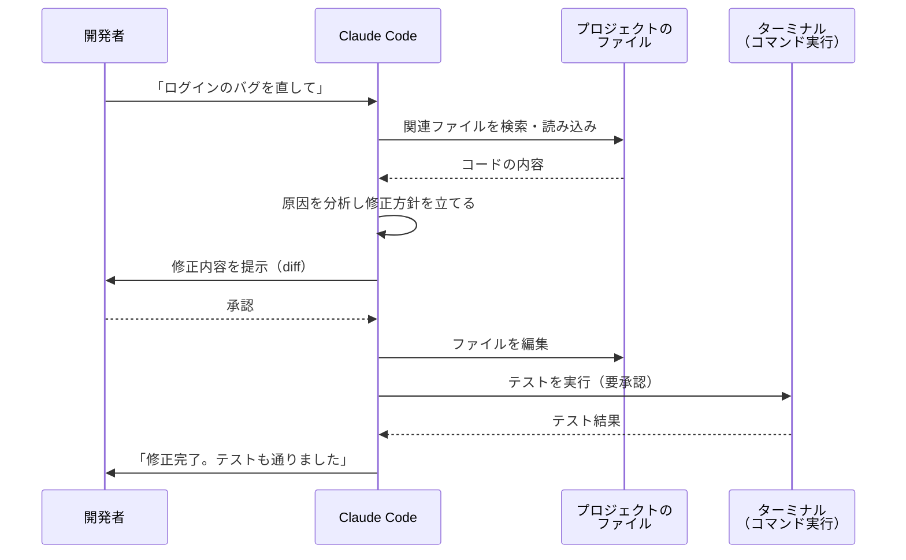

# Claude Codeの導入

前のページで、LLMの仕組みと「出力は必ず検証する」という姿勢を学びました。このページでは、いよいよAIコーディングツール **Claude Code（クロード コード）** を導入し、基本操作と、安全に使うための**許可モード**を学びます。

Claude Codeは、Anthropic社が提供するターミナルで動くAIコーディングエージェントです。チャット画面にコードを貼り付けて質問する使い方とは違い、Claude Codeは**皆さんのプロジェクトのディレクトリの中で動き、自分でファイルを読み、編集し、コマンドを実行**します。「エラーを直して」と頼めば、関係するファイルを自分で探して読み、修正案を提示し、承認すれば実際に書き換えるところまで行います。

> このページの内容は執筆時点の公式ドキュメント（[https://code.claude.com/docs/](https://code.claude.com/docs/)）に基づいています。AIツールは更新が非常に速いため、インストール方法やコマンドが変わっていたら公式ドキュメントを優先してください。

## 学習目標

- Claude Codeをインストールし、ログインして起動できる
- 対話セッションでの基本操作（質問、編集依頼、セッションコマンド）ができる
- Claude Codeがファイル変更やコマンド実行の前に承認を求める仕組みを説明できる
- 許可モード（default / acceptEdits / plan / bypassPermissions）の違いと使い分けを説明できる

## Claude Codeとは

Claude Codeは「エージェント型」のコーディングツールです。エージェント（agent、エージェント）とは、指示を受けて**自律的に複数のステップを計画・実行する**プログラムを指します。一問一答のチャットとの違いを図で見てみましょう。



ポイントは、**ファイルの変更やコマンドの実行の前に、Claude Codeが開発者に承認を求める**ことです。AIが勝手にプロジェクトを書き換えるのではなく、一つひとつの操作に人間がゴーサインを出す設計になっています。この承認の挙動をまとめて制御するのが、後半で学ぶ「許可モード」です。

## インストール

公式が推奨する「ネイティブインストール」を使います。

**macOS / Linux / WSL の場合（ターミナルで実行）:**

```bash
curl -fsSL https://claude.ai/install.sh | bash
```

**Windows（PowerShell）の場合:**

```powershell
irm https://claude.ai/install.ps1 | iex
```

**コード解説**

- `curl -fsSL <URL>` — インストールスクリプトをダウンロードします。`-f` は失敗時にエラー終了、`-sSL` は進捗を表示せずリダイレクトに追従するオプションです
- `| bash` — ダウンロードしたスクリプトをそのままbashで実行します
- PowerShell版の `irm`（Invoke-RestMethod）と `iex`（Invoke-Expression）も同じ「取得して実行」の組み合わせです

macOSでHomebrewを使っている場合は、次の方法でもインストールできます。

```bash
brew install --cask claude-code
```

ネイティブインストール版は自動でアップデートされますが、Homebrew版は自動更新されないため、`brew upgrade claude-code` を定期的に実行する必要があります。迷ったらネイティブインストールを選んでください。

インストールできたか確認します。

```bash
claude --version
```

```text
2.x.x (Claude Code)
```

バージョン番号が表示されれば成功です。

## ログイン

Claude Codeを使うにはアカウントが必要です。次のいずれかが使えます。

- **Claudeのサブスクリプション**（Pro / Max / Team / Enterprise）— 推奨
- **Claude Console**（API利用のアカウント。事前購入したクレジットで従量課金）

初回は、任意のプロジェクトのディレクトリで `claude` コマンドを実行すると、ログインを促されます。

```bash
cd ~/projects/my-app
claude
```

画面の案内に従うとブラウザが開くので、アカウントでログインして認証を完了させてください。一度ログインすれば認証情報が保存され、次回からは不要です。セッションの中で `/login` と入力すれば、後からアカウントを切り替えることもできます。

## 最初のセッション

プロジェクトのディレクトリで `claude` を実行すると、対話セッションが始まります。ここでは[Git/GitHub基礎](/git//)で作ったリポジトリなど、手元の好きなプロジェクトで試してみてください。

```bash
cd ~/projects/my-app
claude
```

プロンプトが表示されたら、自然言語でそのまま話しかけます。まずはコードを変更しない「質問」から始めるのが安全です。

```text
このプロジェクトは何をするものですか？
```

```text
ディレクトリ構成を説明してください
```

Claude Codeは必要に応じて自分でファイルを読みに行くので、コードを貼り付ける必要はありません。続いて、簡単な変更を頼んでみましょう。

```text
README.md にセットアップ手順のセクションを追加してください
```

すると Claude Code は、(1) 対象ファイルを特定し、(2) 変更内容をdiff（差分）で提示し、(3) 承認を求め、(4) 承認後に実際に編集する、という流れで動きます。**提示されたdiffは必ず読んでから承認してください。** 前のページで学んだ「AIの出力は必ず自分で検証する」の最初の実践がここです。

### シェルコマンド（ターミナルから起動するときの形）

| コマンド | 動作 |
|---|---|
| `claude` | 対話セッションを開始する |
| `claude "タスク"` | 最初の指示つきでセッションを開始する |
| `claude -p "質問"` | 1回だけ質問して結果を表示し、終了する |
| `claude -c` | このディレクトリでの直近の会話を再開する |
| `claude -r` | 過去の会話を選んで再開する |

### セッションコマンド（セッション中に入力する `/` コマンド）

セッションの中では、`/` から始まる**スラッシュコマンド**で Claude Code 自体を操作できます。代表的なものだけ先に覚えましょう（詳しくは[スラッシュコマンドとskills](/ai/skills_and_commands/)で扱います）。

| コマンド | 動作 |
|---|---|
| `/help` | 使えるコマンドの一覧を表示する |
| `/clear` | 会話履歴をクリアして新しい話題を始める |
| `/permissions` | 許可ルールの確認・編集画面を開く |
| `/exit`（または Ctrl+D） | セッションを終了する |

## 許可モード: AIにどこまで任せるか

Claude Codeの安全設計の中心が**許可モード（permission mode、パーミッションモード）** です。ツール（ファイル編集、Bashコマンド実行など）を使う前にどこまで承認を求めるかを、モードとして切り替えられます。

ツールの種類によって、そもそもの扱いが異なります。

| ツールの種類 | 例 | 承認 |
|---|---|---|
| 読み取り専用 | ファイルの読み込み、検索 | 不要（常に許可） |
| Bashコマンド | シェルでのコマンド実行 | 必要 |
| ファイル変更 | ファイルの編集・作成 | 必要 |

その上で、主な許可モードは次の4つです。

| モード | 動作 | 使いどころ |
|---|---|---|
| `default` | 各ツールの初回使用時に承認を求める標準動作 | 通常の作業。迷ったらこれ |
| `acceptEdits` | 作業ディレクトリ内のファイル編集と基本的なファイル操作コマンド（`mkdir` など）を自動承認 | 方針が固まっていて、編集を細かく確認しなくてよいとき |
| `plan` | **プランモード**。ファイルの読み取りと読み取り専用コマンドだけを許可し、編集は一切しない | まず調査・計画だけさせたいとき。学習中は特に有用 |
| `bypassPermissions` | 承認プロンプトをスキップする | **原則使わない**。コンテナ等の隔離環境専用 |

モードはセッション中に **Shift+Tab** で切り替えられます。各モードの位置づけを図にすると次のとおりです。


左に行くほど安全で、右に行くほどAIの自由度が上がります。学習中の皆さんへの推奨は次のとおりです。

- **調査・計画はプランモード（plan）で。** 「このバグの原因を調査して、修正方針を提案して」のような依頼は、まずplanモードで行うと、AIが勝手にコードを変えてしまう心配なく結果を吟味できます
- **実装はdefaultで、diffを読みながら。** 承認のたびに差分を読むこと自体が、コードリーディングの訓練になります
- **`bypassPermissions` は使わない。** このモードは承認を全部スキップするため、AIの誤操作（意図しないファイル削除など）を止める機会がなくなります。Dockerコンテナのような隔離された環境での自動実行向けのモードです

### 許可ルール: 特定の操作だけ自動許可する

モードとは別に、`/permissions` コマンドで**許可ルール**を細かく設定することもできます。たとえば「`pnpm test` の実行は毎回許可しなくてよい」といった設定です。ルールには3種類あります。

- **Allow（許可）**: 指定した操作を承認なしで実行できる（例: `Bash(pnpm test)`）
- **Ask（確認）**: 指定した操作のたびに必ず確認する
- **Deny（拒否）**: 指定した操作を禁止する（例: `Read(.env)` で秘密情報ファイルの読み取りを禁止）

ルールは deny → ask → allow の順に評価され、最初に一致したものが適用されます。承認プロンプトで「Yes, don't ask again（今後確認しない）」を選ぶと、対応するallowルールが自動で保存されます。よく使う安全なコマンドから少しずつ許可を広げていく、という運用が現実的です。

なお、`.env` のような秘密情報を含むファイルは、denyルールで読み取り自体を禁止しておくと安心です。設定は `.claude/settings.json` というファイルに保存され、Gitでチームと共有できます。

```json
{
  "permissions": {
    "allow": ["Bash(pnpm test)", "Bash(pnpm run lint)"],
    "deny": ["Read(.env)", "Read(.env.*)"]
  }
}
```

**コード解説**

- `"allow"` — `pnpm test` と `pnpm run lint` は承認なしで実行できるようにします。どちらも読み取り中心の安全なコマンドだからです
- `"deny"` — `.env` と `.env.local` などの環境変数ファイルの読み取りを禁止します。APIキーやDBパスワードをAIのコンテキストに載せないためです

## 動かして試す

ここまでの内容を、実際のプロジェクトで一通り試してみましょう。これまでのカリキュラムで作ったプロジェクト（たとえばReactの練習アプリ）を使います。

1. プロジェクトに移動して、未コミットの変更がない状態にする（`git status` で確認）
2. `claude` でセッションを開始する
3. **Shift+Tab** でplanモードに切り替え、「このプロジェクトの構成と、改善できそうな点を3つ挙げてください」と依頼する
4. 提案を読み、納得できるものを1つ選ぶ
5. defaultモードに戻し、「さきほどの提案のうち◯◯を実装してください」と依頼する
6. 提示されたdiffを**全部読み**、理解してから承認する
7. アプリを起動・テストして動作を確認し、問題なければ自分でコミットする

「AIに任せる前にコミット」「diffを読む」「動かして確認」という流れを、最初から習慣にしてください。

## よくあるつまずきと対処

- **`claude: command not found` と出る**: インストール直後はターミナルを開き直してください（PATHの再読み込みのため）。それでも見つからない場合は、インストールスクリプトの最後に表示される案内に従ってPATHを設定します
- **どのディレクトリで起動すればよいか分からない**: 作業したいプロジェクトのルート（`package.json` や `.git` があるディレクトリ）で起動します。Claude Codeは起動したディレクトリを作業範囲とみなすためです
- **AIが意図と違うファイルを変更しようとする**: 承認プロンプトで拒否（No）すれば変更は行われません。拒否したうえで「そうではなく◯◯を変更してください」と指示し直せます。承認前に必ずdiffを読む習慣が、ここで効いてきます
- **ターミナル以外で使いたい**: Claude CodeはVS CodeやJetBrains系IDEの拡張、デスクトップアプリとしても提供されています。このカリキュラムではターミナル版で統一しますが、操作の考え方（承認、許可モード）は共通です

## 理解度チェック

**Q1. Claude Codeと、ブラウザのチャット型AI（コードを貼り付けて質問する使い方）との最も大きな違いは何ですか。**

<details markdown="1">
<summary>解答を見る</summary>

Claude Codeはエージェント型で、プロジェクトのディレクトリの中で動き、**自分でファイルを読み・編集し・コマンドを実行**できる点です。チャット型では人間がコードを貼り付け、回答を人間が手で反映しますが、Claude Codeは関連ファイルの探索から修正、テスト実行までを自律的に進めます。その代わり、ファイル変更やコマンド実行の前に承認を求める許可の仕組みが組み込まれています。

</details>

**Q2. Claude Codeが操作の前に承認を求めるのは、どの種類のツールですか。承認が不要なものも挙げてください。**

<details markdown="1">
<summary>解答を見る</summary>

承認が必要なのは **Bashコマンドの実行**と**ファイルの変更（編集・作成）** です。一方、ファイルの読み込みや検索のような**読み取り専用の操作**は承認なしで実行されます。読み取りはプロジェクトを壊す心配がないためです。

</details>

**Q3. planモードはどういうモードですか。学習中に特に有用なのはなぜですか。**

<details markdown="1">
<summary>解答を見る</summary>

planモード（プランモード）は、ファイルの読み取りと読み取り専用コマンドだけを許可し、**ファイルの編集を一切行わない**モードです。調査や計画の立案だけをAIに任せられます。

学習中に有用なのは、「AIが勝手にコードを書き換えてしまう」ことを仕組みとして防ぎながら、原因分析や設計の提案だけを受け取れるからです。提案を自分で吟味し、自分の手で実装する、という学習に適した使い方ができます。

</details>

**Q4. `bypassPermissions` モードを通常の開発で使うべきでない理由を説明してください。**

<details markdown="1">
<summary>解答を見る</summary>

`bypassPermissions` は承認プロンプトをスキップするモードなので、AIの判断ミス（ハルシネーションによる誤った変更、意図しないファイル操作など）を人間が止める機会がなくなるからです。LLMは確率的に出力を生成するため、誤操作の可能性を常に持っています。公式ドキュメントでも、コンテナやVMのような隔離された環境でのみ使うよう注意されています。

</details>

**Q5. `.env` ファイルに対して設定しておくべき許可ルールは何ですか。理由も説明してください。**

<details markdown="1">
<summary>解答を見る</summary>

`Read(.env)` のような **denyルール（読み取り禁止）** を設定します。`.env` にはAPIキーやデータベースのパスワードなどの秘密情報が入っているため、AIのコンテキスト（≒外部サービスへ送信される入力）に含めるべきではないからです。denyルールはallowルールより優先して評価されるので、確実にブロックできます。

</details>

## セルフレビュー

- [ ] Claude Codeをインストールし、`claude --version` でバージョンを確認できた
- [ ] 自分のプロジェクトで対話セッションを開始し、質問と編集依頼を試した
- [ ] `claude -p` と `claude -c` の違いを説明できる
- [ ] Shift+Tabで許可モードを切り替えられることを確認した
- [ ] 4つの許可モードの違いと使い分けを自分の言葉で説明できる
- [ ] allow / ask / deny の3種類の許可ルールの違いを説明できる
- [ ] 「AIに任せる前にコミット」「diffを読んでから承認」を実践した

## 次のステップ

Claude Codeを動かせるようになりました。しかし、今のままではAIは皆さんのプロジェクトの「事情」を知りません。使っているバージョン、コーディング規約、テストの実行方法——毎回説明するのは非効率です。次のページ[CLAUDE.mdでプロジェクトの文脈を伝える](/ai/claude_md/)では、プロジェクトの文脈をAIに常時伝えるための仕組みであるCLAUDE.mdを学びます。

また、このページで軽く触れたスラッシュコマンドは、[スラッシュコマンドとskills](/ai/skills_and_commands/)で自作する方法まで掘り下げます。
