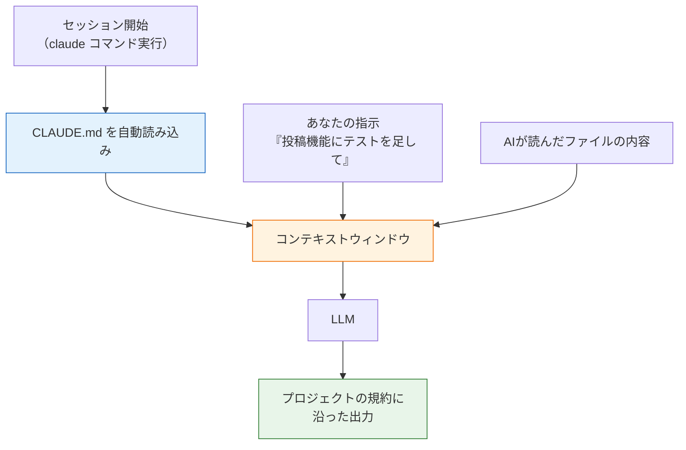

# CLAUDE.mdでプロジェクトの文脈を伝える

前のページでClaude Codeを使い始めましたが、しばらく使うと気づくことがあります。「このプロジェクトはpnpmを使って」「テストは `pnpm run test:e2e` で」「コミットメッセージは日本語で」——**同じ説明を毎回している**のです。

この問題を解決するのが **CLAUDE.md** です。CLAUDE.mdは、**プロジェクトの文脈（コンテキスト）をAIに常時伝えるためのファイル**です。一度書いておけば、Claude Codeはセッションを開始するたびに自動でこのファイルを読み込み、書かれた指示を前提として動きます。チーム開発でいえば「新メンバー向けのオンボーディング資料」を、AIというメンバーのために書くイメージです。

## 学習目標

- CLAUDE.mdが何のためのファイルかを説明できる
- 「毎セッションの開始時にコンテキストへ読み込まれる」という仕組みから、なぜ効くのか・なぜ簡潔に書くべきかを説明できる
- CLAUDE.mdを置ける場所（ユーザー/プロジェクト/ローカル）とスコープの違いを説明できる
- 良いCLAUDE.mdと悪いCLAUDE.mdを見分け、自分のプロジェクト用に書ける

## なぜCLAUDE.mdは「効く」のか

仕組みを理解するために、[LLMとは何か](/ai/what_is_llm/)で学んだことを思い出してください。LLMへの入力はトークン列で、一度に扱える量（コンテキストウィンドウ）には上限がありました。そして重要なのは、**LLMは毎回のセッションで記憶がゼロから始まる**ということです。昨日のセッションで「pnpmを使って」と伝えても、今日のセッションのLLMはそれを知りません。

Claude Codeはこの問題を、**セッション開始時にCLAUDE.mdの内容をコンテキストへ自動で読み込む**ことで解決しています。



図のとおり、CLAUDE.mdの内容は皆さんの指示やコードと同じコンテキストに「同居」します。だから、指示のたびに繰り返さなくても、AIは常にプロジェクトの規約を前提に動けるのです。

この仕組みから、2つの重要な帰結が導かれます。

1. **CLAUDE.mdは「設定ファイル」ではなく「指示文」である。** 内容はLLMへの入力として渡されるだけで、機械的に強制されるわけではありません。曖昧な指示は無視されることもあります。だからこそ書き方が重要です。
2. **長すぎるCLAUDE.mdは害になる。** 毎セッション、コンテキストウィンドウの一部をCLAUDE.mdが消費します。長くなるほど本来の作業に使える領域が減り、しかも指示が多すぎるとAIが守れなくなります。公式ドキュメントは**1ファイル200行以下**を目安にすることを推奨しています。

## CLAUDE.mdを置ける場所

CLAUDE.mdは複数の場所に置くことができ、場所によって適用範囲（スコープ）が変わります。

| スコープ | 場所 | 用途 | 共有範囲 |
|---|---|---|---|
| ユーザー | `~/.claude/CLAUDE.md` | 全プロジェクト共通の個人的な好み | 自分だけ（全プロジェクト） |
| プロジェクト | `./CLAUDE.md`（または `./.claude/CLAUDE.md`） | プロジェクトの規約・構成・コマンド | Gitを通じてチーム全員 |
| ローカル | `./CLAUDE.local.md` | このプロジェクトでの個人メモ（`.gitignore` に追加する） | 自分だけ（このプロジェクト） |

基本は**プロジェクト直下の `CLAUDE.md`** です。Gitにコミットすることで、チーム全員（とそのAI）が同じ前提を共有できます。複数のファイルがある場合はすべて読み込まれ、内容が連結されてコンテキストに入ります。

## /init で雛形を作る

ゼロから書く必要はありません。Claude Codeのセッション内で次のコマンドを実行します。

```text
/init
```

`/init` を実行すると、Claudeがプロジェクトのコードベースを分析し、ビルドコマンド・テスト手順・プロジェクトの規約などを発見してCLAUDE.mdの草案を生成してくれます。すでにCLAUDE.mdがある場合は、上書きせず改善提案をしてくれます。

ただし、生成された草案は出発点にすぎません。**AIがコードから読み取れない情報**——「なぜこの設計にしたのか」「やってはいけないこと」「チームの暗黙の了解」——を自分で書き足すことで、本当に役立つCLAUDE.mdになります。

## 良いCLAUDE.md・悪いCLAUDE.mdの書き方

書き方の原則は3つです。公式ドキュメントの推奨をもとに整理します。

1. **具体的に書く**: 検証できるレベルまで具体化する。「コードをきれいに書く」ではなく「インデントは2スペース」
2. **構造化する**: 見出しと箇条書きで整理する。密度の高い長文段落は読み飛ばされやすい
3. **簡潔に保つ**: 毎セッション読み込まれることを忘れない。長い手順書は（次のページで学ぶ）skillsへ切り出す

### 悪い例

まず、ありがちな悪い例を見てみましょう。

**`CLAUDE.md`（悪い例）**

```markdown
# このプロジェクトについて

このプロジェクトはとても重要なので、コードはきれいに書いてください。
バグを出さないように、しっかりテストしてください。
パフォーマンスにも気をつけてください。
あと、変な名前の変数は使わないでください。
セキュリティも大事です。

DBのパスワードは postgres / s3cret-passw0rd です。
詳しいことは聞いてください。
```

何が悪いのかを一つずつ確認します。

- **「きれいに」「しっかり」「変な」が曖昧** — 検証できない指示はAIの行動を変えられません。「きれいなコード」の基準は人によって違います
- **行動につながる情報がない** — テストの実行コマンドも、ディレクトリ構成も、使っている技術も書かれていません。AIが本当に知りたい情報がゼロです
- **秘密情報が書かれている** — CLAUDE.mdは毎セッションAIへの入力に含まれ、Gitにもコミットされます。パスワードやAPIキーを書いてはいけません
- **「詳しいことは聞いてください」** — AIはこのファイル以外の事前知識を持ちません。聞かなくても分かるように書くのがこのファイルの目的です

### 良い例

同じプロジェクトの、良いCLAUDE.mdを見てみましょう。これまでのカリキュラムで作ってきたようなNestJS + Reactのプロジェクトを想定しています。

**`CLAUDE.md`（良い例）**

```markdown
# プロジェクト概要

SNSアプリ。backend（NestJS 10 + Prisma 5 + PostgreSQL 16）と
frontend（React 18 + Vite 5 + TypeScript 5）のモノレポ構成。

## よく使うコマンド

- 開発環境の起動: `docker compose up -d`（DB）→ `pnpm run start:dev`（API）
- 単体テスト: `pnpm test`
- E2Eテスト: `pnpm run test:e2e`（テスト用DBが必要。compose で起動済みであること）
- リント+フォーマット: `pnpm run lint && pnpm run format`

## ディレクトリ構成

- `backend/src/` — NestJSのモジュール群。機能ごとに `posts/` `users/` のように分割
- `backend/prisma/schema.prisma` — DBスキーマの唯一の定義場所
- `frontend/src/components/` — Reactコンポーネント

## 規約

- パッケージマネージャはpnpm（npm/yarnは使わない）
- コミットメッセージは日本語で、変更理由まで書く
- DBスキーマの変更は必ず `pnpm exec prisma migrate dev` でマイグレーションを作る
- APIのレスポンス形式を変えるときは、対応するE2Eテストも同じPRで更新する

## してはいけないこと

- `.env` ファイルを読んだり編集したりしない
- `prisma db push` を使わない（マイグレーション履歴が壊れるため）
- テストをスキップ（`it.skip`）して通したことにしない
```

**コード解説**

- **プロジェクト概要** — 技術スタックとバージョンを冒頭で宣言します。AIが「Prisma 5の書き方」で答えるべきか「古い書き方」で答えるべきかを判断できます
- **よく使うコマンド** — AIはテストやビルドを自分で実行します。正しいコマンドを教えておくと、間違ったコマンドを試行錯誤する無駄がなくなります
- **ディレクトリ構成** — 「どこに何があるか」を教えると、ファイル探索が速く正確になります
- **規約** — 「マイグレーションを必ず作る」のような、コードからは読み取りにくい運用ルールこそCLAUDE.md向きの情報です
- **してはいけないこと** — 禁止事項は明示的に書きます。`prisma db push` のように「動くけれどこのプロジェクトでは禁止」という事項は、書かなければAIには分かりません

2つの例を見比べると、良いCLAUDE.mdの共通点が見えてきます。**「新しく入ったチームメイトに渡したら、初日から迷わず作業できる資料」になっている**ことです。

### 書く内容を育てていく

CLAUDE.mdは一度書いて終わりではありません。公式ドキュメントが挙げる「追記すべきタイミング」が参考になります。

- AIが同じ間違いを2回したとき
- セッションのたびに同じ説明・同じ訂正を入力していると気づいたとき
- コードレビューで「AIが知っているべきだったこと」が指摘されたとき

つまり、**AIへの「言い直し」が発生したら、それはCLAUDE.mdに書くべき内容のサイン**です。セッション中に「これをCLAUDE.mdに追記して」とAI自身に頼むこともできますし、`/memory` コマンドで現在読み込まれているCLAUDE.mdの一覧を確認し、エディタで開いて直接編集することもできます。

### 補足: 別ファイルの取り込み（@構文）

CLAUDE.mdの中では `@パス` という構文で別ファイルを取り込めます。

```markdown
プロジェクト概要は @README.md を参照。
利用可能なpnpmスクリプトは @package.json を参照。
```

取り込まれたファイルもセッション開始時にコンテキストへ展開されます。READMEなど既存の文書と内容を二重管理しなくて済む一方、**取り込んだ分だけコンテキストを消費する**ことは変わらない点に注意してください。

### 補足: 個人メモは CLAUDE.local.md へ

チームで共有すべきでない自分専用の情報は、プロジェクト直下の `CLAUDE.local.md` に書きます。`CLAUDE.md` と一緒に読み込まれますが、`.gitignore` に追加してコミットしない運用にします。

**`CLAUDE.local.md`（例）**

```markdown
# 個人メモ

- 動作確認用アカウント: テストユーザーは taro@example.com を使う
- ローカルのDBはポート5433で起動している（5432は別プロジェクトが使用中）
```

**コード解説**

- 共有リポジトリの規約には属さない「自分の環境の事情」だけを書きます
- ここにも秘密情報（本物のパスワード等）は書きません。Gitに入らなくても、AIへの入力には含まれるためです

## CLAUDE.mdが効いていないときの確認手順

CLAUDE.mdを書いたのにAIが従ってくれない、という場面では次の順で確認します。

1. **読み込まれているかを確認する**: セッション内で `/memory` を実行すると、現在読み込まれているCLAUDE.md類が一覧表示されます。一覧にないファイルは、置き場所が間違っています
2. **指示が具体的かを見直す**: 「きれいに書く」のような曖昧な指示は効きません。検証可能な表現に書き換えます
3. **指示同士が矛盾していないかを確認する**: ユーザー用とプロジェクト用のCLAUDE.mdで逆の指示をしていると、どちらが選ばれるか不定になります
4. **長すぎないかを確認する**: 指示が多すぎると遵守率が下がります。使用頻度の低い手順はskills（次のページ）へ移します

それでも従わせたい「絶対のルール」がある場合、CLAUDE.mdはあくまで指示文であって強制力はない、ということを思い出してください。確実に禁止したい操作は、[許可ルールのdeny](/ai/claude_code_setup/)のような仕組み側でブロックします。「指示で誘導、ルールで強制」という役割分担です。

## 演習: 自分のプロジェクトにCLAUDE.mdを書く

これまでのカリキュラムで作ったプロジェクト（NestJSのメモAPIなど）で実際に試しましょう。

1. プロジェクトでClaude Codeを起動し、`/init` を実行して草案を生成する
2. 生成された `CLAUDE.md` を開き、間違いがないか確認する（コマンドは実際に動くか？）
3. 「規約」と「してはいけないこと」のセクションを自分で書き足す
4. ファイルを保存して新しいセッションを開始し、「このプロジェクトのテストの実行方法は？」と聞いてみる——CLAUDE.mdの内容に基づいた答えが返れば成功です
5. `CLAUDE.md` をGitにコミットする

## 理解度チェック

**Q1. CLAUDE.mdとは何のためのファイルですか。一言で説明してください。**

<details markdown="1">
<summary>解答を見る</summary>

プロジェクトの文脈（技術スタック、コマンド、規約、禁止事項など）をAIに常時伝えるためのファイルです。セッション開始時に自動でコンテキストへ読み込まれるため、毎回同じ説明を繰り返さなくても、AIが常にプロジェクトの前提を踏まえて動けるようになります。

</details>

**Q2. CLAUDE.mdが「効く」仕組みを、コンテキストウィンドウという言葉を使って説明してください。**

<details markdown="1">
<summary>解答を見る</summary>

LLMはセッションごとに記憶がゼロから始まり、その回の入力（コンテキストウィンドウの中身）だけを根拠に出力を生成します。Claude Codeはセッション開始時にCLAUDE.mdの内容をコンテキストウィンドウへ自動で読み込むため、ファイルに書いた指示が毎セッション、ユーザーの指示やコードと一緒にLLMへの入力に含まれます。これが「一度書けばずっと効く」理由です。

</details>

**Q3. CLAUDE.mdを長く書きすぎるとどんな問題がありますか。2つ挙げてください。**

<details markdown="1">
<summary>解答を見る</summary>

1. **コンテキストの浪費**: CLAUDE.mdは毎セッション読み込まれるため、長いほどコンテキストウィンドウを消費し、本来の作業（コードや会話）に使える領域が減ります
2. **指示の遵守率の低下**: 指示が多すぎる・長すぎると、AIがすべてを守れなくなります。公式ドキュメントは1ファイル200行以下を目安にすることを推奨しています

対策として、長い手順書はskillsに切り出す、検証できる具体的な指示に絞る、といった方法があります。

</details>

**Q4. 次のCLAUDE.mdの記述の問題点を指摘し、改善案を書いてください。**

```markdown
コードはきれいに書いてください。テストもちゃんとしてください。
```

<details markdown="1">
<summary>解答を見る</summary>

問題点は「きれいに」「ちゃんと」が曖昧で、検証可能な行動につながらないことです。CLAUDE.mdは機械的に強制される設定ではなくLLMへの指示文なので、具体的でなければ効果がありません。

改善案の例:

```markdown
- インデントは2スペース、セミコロンあり（Prettierの設定に従う）
- コミット前に `pnpm run lint && pnpm test` を実行し、両方通ることを確認する
- 新しいService メソッドには必ず対応する単体テストを書く
```

</details>

**Q5. CLAUDE.mdに書いてはいけない情報は何ですか。理由も説明してください。**

<details markdown="1">
<summary>解答を見る</summary>

パスワード・APIキーなどの**秘密情報**です。理由は2つあります。(1) CLAUDE.mdは毎セッションAIへの入力に含まれるため、秘密情報が外部サービスへの送信内容に含まれてしまう、(2) プロジェクトのCLAUDE.mdはGitにコミットしてチームで共有するのが前提のため、リポジトリに秘密情報が残ってしまう。秘密情報は `.env` などで管理し、さらに `Read(.env)` のdenyルールでAIからの読み取りも禁止しておくのが安全です（[Claude Codeの導入](/ai/claude_code_setup/)参照）。

</details>

## セルフレビュー

- [ ] CLAUDE.mdの役割を「プロジェクトの文脈をAIに常時伝えるファイル」として説明できる
- [ ] 「毎セッション、コンテキストに読み込まれる」という仕組みを図なしで説明できる
- [ ] ユーザー用・プロジェクト用・ローカル用のCLAUDE.mdの置き場所と使い分けを説明できる
- [ ] `/init` で草案を生成し、自分で内容を確認・修正した
- [ ] 「曖昧な指示」を「検証できる具体的な指示」に書き換えられる
- [ ] 自分のプロジェクトにCLAUDE.mdを書き、コミットした
- [ ] 「AIへの言い直しが発生したらCLAUDE.mdに追記する」という運用を理解した

## 次のステップ

CLAUDE.mdで「常に伝えたい事実・規約」を渡せるようになりました。しかし、「リリース前チェックの手順」のような**長い手順書**をCLAUDE.mdに書くと、使わないセッションでもコンテキストを消費してしまいます。こうした「必要なときだけ読み込みたい指示」の受け皿が、次のページ[スラッシュコマンドとskills](/ai/skills_and_commands/)で学ぶ**skills**です。

また、コンテキストウィンドウという制約は[AIチャット開発（RAG）](/ai-chat/what_is_rag/)で再登場します。「カリキュラム全体のような大量の知識は、どうやってAIに渡すのか？」——その答えがRAGです。
