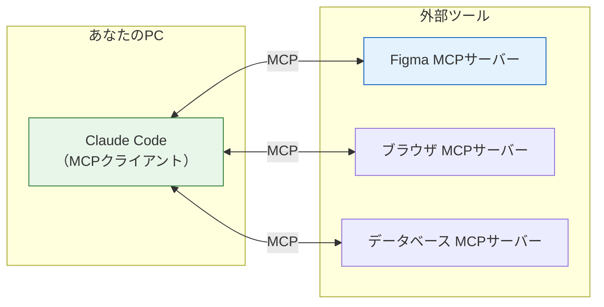

# MCPで外部ツールとつなぐ

ここまでで、Claude Codeを**導入し**（[導入](/ai/claude_code_setup/)）、**プロジェクトの文脈を伝え**（[CLAUDE.md](/ai/claude_md/)）、**定型作業を部品化する**（[skills](/ai/skills_and_commands/)）ところまで来ました。これらはすべて「Claude Codeに、あなたのコードベースの中でうまく振る舞ってもらう」ための調整でした。

このページでは視野を一段広げます。Claude Codeを、**コードベースの外にあるツールやデータ**——Figmaのデザイン、ブラウザ、外部サービス——につなぐ方法です。その標準的な仕組みが **MCP（Model Context Protocol、モデルコンテキストプロトコル）** です。

> このページの内容は執筆時点の公式ドキュメント（[Claude Code MCP](https://code.claude.com/docs/en/mcp) / [Figma Learn](https://help.figma.com/)）に基づいています。ツール側の仕様は更新が速いため、実際に接続するときは各公式ドキュメントで最新の手順を確認してください。

## 学習目標

- MCPが「AIと外部ツールをつなぐ共通規格」であることを説明できる
- `claude mcp add` でMCPサーバーを追加し、`/mcp` で接続を確認できる
- MCPサーバーのスコープ（local / project / user）を使い分けられる
- Figmaのデザインをコードに変換する連携を、手順として理解している
- 外部接続に伴うセキュリティ上の注意を説明できる

## MCPとは何か

MCPは、**AIアプリケーションと外部のツール・データソースをつなぐための共通規格**です。「AIにとってのUSB-C」と説明されることがあります。USB-Cが「どのメーカーの機器でも同じ差し込み口でつながる」規格であるように、MCPは「どんな外部ツールでも同じ作法でAIにつなげる」ための取り決めです。

登場人物は2つです。

| 用語 | 役割 | このカリキュラムでの例 |
|---|---|---|
| MCPサーバー | 外部ツールの機能を「AIが使える道具」として公開する側 | Figma、ブラウザ操作、データベース、Google Drive など |
| MCPクライアント | サーバーが公開した道具を呼び出すAIアプリ側 | Claude Code |

つまり、**MCPサーバーを1つ追加するたびに、Claude Codeが使える「道具」が増える**というイメージです。skillsが「指示の部品化」だったのに対し、MCPは「能力そのものの拡張」だと考えると整理しやすくなります。



### なぜ嬉しいのか

MCPがないと、Claude Codeが知っているのは「あなたが見せたファイルと、実行したコマンドの結果」だけです。MCPでつなぐと、次のようなことが自然言語の指示だけでできるようになります。

- **Figma**: デザインを見せて「この画面をReactコンポーネントにして」
- **ブラウザ（Playwright）**: 「ログイン画面を開いて、実際に操作して表示を確認して」
- **Google Drive / Asana など**: 仕様書やタスクを読ませて、そこから実装を始める

このカリキュラムのSNS開発でも、[Playwright](/sns/) MCPを使って「AliceとBobの2セッションで画面を検証する」という使い方をしています。MCPは特別な上級者向け機能ではなく、実務のAI活用で日常的に使う道具です。

## MCPサーバーを追加する

Claude Codeでは、`claude mcp add` コマンドでMCPサーバーを追加します。サーバーには大きく2つの接続方式があります。

| 方式 | どういうとき | 追加コマンドの形 |
|---|---|---|
| stdio | ローカルでプログラム（npxなど）として動くサーバー | `claude mcp add <名前> -- <コマンド>` |
| HTTP | URLで接続するサーバー（ローカル/リモート） | `claude mcp add --transport http <名前> <URL>` |

### まず無料で試す: Playwright MCP

有料アカウントが不要で、すぐ試せるのがブラウザ操作の **Playwright MCP** です。ターミナルで次を実行します。

```bash
claude mcp add playwright -- npx @playwright/mcp@latest
```

- `playwright` が、あなたがこのサーバーに付ける名前です
- `--` より後ろが、サーバーを起動する実際のコマンドです（`npx` でPlaywright MCPを起動する形）

追加できたら、接続状態を確認します。ターミナルからは次のコマンドです。

```bash
claude mcp list
```

Claude Codeのセッション中であれば、`/mcp` と入力すると、接続中のサーバーと、そのサーバーが提供する道具の一覧を確認できます。接続できていれば、「今開いているページのタイトルを教えて」のように、ブラウザ操作を自然言語で頼めるようになります。

### スコープ: どこに設定を保存するか

MCPサーバーの設定を**どの範囲で有効にするか**を、`--scope` で選べます。

| スコープ | 保存先 | 有効範囲 | 使いどころ |
|---|---|---|---|
| `local`（既定） | ユーザーの個人設定 | そのプロジェクトの自分だけ | 個人的に試すサーバー |
| `project` | プロジェクト直下の `.mcp.json` | チーム全員（Gitで共有） | チームで共通して使うサーバー |
| `user` | ホームの設定ファイル | 自分の全プロジェクト | どこでも使う汎用サーバー |

たとえばチーム全員に使ってほしいサーバーは、次のように `project` スコープで追加すると `.mcp.json` に書き出され、Gitで共有できます。

```bash
claude mcp add --scope project playwright -- npx @playwright/mcp@latest
```

これはCLAUDE.mdやskillsをGitで共有するのと同じ発想です。「チームのAI環境を、リポジトリに含めて揃える」ことができます。

## Figmaのデザインをコードにつなぐ

いよいよ本題のFigma連携です。デザインカンプを見ながらHTML/CSSを手で起こす作業を、Claude Codeに任せられるようになります。Figmaは公式の **Dev Mode MCPサーバー** を提供しており、Figmaデスクトップアプリを「MCPサーバー」として動かして、そこにClaude Codeを接続します。

> **注意**: Dev Mode MCPサーバーの利用には、Figmaの有料プランのDev Mode（開発モード）へのアクセス権が必要です。所属や契約によって使えない場合があります。使えない場合は、上のPlaywright MCPでMCPの流れを体験しておけば十分です。

### 手順1: Figmaデスクトップアプリでサーバーを有効にする

1. **Figmaデスクトップアプリ**（ブラウザ版ではありません）でデザインファイルを開きます
2. Dev Mode（開発モード）に切り替えます
3. サイドバーからMCPサーバーを有効にします
4. 画面に「サーバーが起動しました」という表示と、接続用のアドレスが出ます

このとき、サーバーは通常 `http://127.0.0.1:3845/mcp` のようなローカルアドレスで動きます（`127.0.0.1` は「自分のPC自身」を指すアドレスです）。表示されたアドレスは次のステップで使うので控えておきます。

### 手順2: Claude Codeから接続する

ターミナルで、HTTP方式でサーバーを追加します。

```bash
claude mcp add --transport http figma-dev-mode http://127.0.0.1:3845/mcp
```

- `figma-dev-mode` が、あなたが付ける名前です
- `--transport http` は、URLで接続するHTTP方式であることを示します
- 最後の `http://127.0.0.1:3845/mcp` は、手順1で控えたアドレスです（実際の値に合わせてください）

### 手順3: つながったか確認して、使ってみる

Claude Codeのセッションで `/mcp` を実行し、`figma-dev-mode` が接続済み（connected）になっていることを確認します。あとは、Figmaで対象のフレームを選択した状態で、次のように頼みます。

```text
> 選択中のFigmaデザインを、React + TypeScriptのコンポーネントとして
  src/components/ に作って。色やスペーシングはデザインに合わせて。
```

Claude CodeがMCP経由でデザイン情報（レイアウト、色、余白など）を読み取り、コンポーネントの実装を提案してくれます。

> ここでも[AIペアプログラミング](/ai/ai_pair_programming/)の原則は変わりません。AIが出したコンポーネントは、**必ず自分で確認**します。デザインと見比べ、不要なスタイルが無いか、既存のコンポーネントと命名が揃っているかをレビューしてから採用してください。

## MCPを使うときのセキュリティ

MCPは強力な反面、**外部のデータやシステムにアクセスする**ため、注意が必要です。

- **信頼できるサーバーだけを追加する**。MCPサーバーは、あなたのファイルや外部サービスを操作できます。提供元が信頼できるか（公式か、広く使われているか）を確認してから追加してください
- **認証情報（APIキーなど）の扱いに注意する**。サーバーによってはAPIキーが必要です。キーを直接コマンドに書かず、環境変数から渡す方法（`--env` や `--header`）を使い、`.mcp.json` に生のキーを書いてGitにコミットしないようにします
- **`project` スコープで共有するものは中身を理解してから**。`.mcp.json` はチーム全員のClaude Codeに影響します

これは、[Claude Codeの導入](/ai/claude_code_setup/)で学んだ許可モードと同じ「AIにどこまで任せるか」の話の延長です。便利さと、自分がコントロールできる範囲のバランスを意識してください。

## MCP・skills・CLAUDE.mdの位置づけ

3つの仕組みが出そろったので、役割を整理します。

| 仕組み | 何を拡張するか | たとえるなら |
|---|---|---|
| CLAUDE.md | AIが**常に知っておくべき文脈** | プロジェクトのしおり |
| skills | AIが**必要なときに読む手順** | 手順書の引き出し |
| MCP | AIが**使える道具そのもの** | 新しい工具の追加 |

CLAUDE.mdとskillsが「指示・知識」を足すものだったのに対し、MCPは「できること」を足すものだ、と捉えると使い分けが明確になります。

## 理解度チェック

**問1**: skillsとMCPは、どちらもClaude Codeを拡張する仕組みです。両者の違いを一言で説明してください。

<details markdown="1">
<summary>解答を見る</summary>

skillsは「指示・手順の部品化」で、AIに**やり方**を教えるものです。MCPは「外部ツールとの接続」で、AIが使える**道具（できること）そのもの**を増やすものです。skillsを足しても呼べる道具は増えませんが、MCPを足すとFigmaを読む・ブラウザを操作するといった新しい能力が増えます。

</details>

**問2**: チーム全員のClaude Codeで同じMCPサーバーを使えるようにしたいとき、どのスコープで追加し、何がGitで共有されますか。

<details markdown="1">
<summary>解答を見る</summary>

`--scope project` で追加します。プロジェクト直下に `.mcp.json` が作られ、これをGitにコミットすることでチーム全員に共有されます。CLAUDE.mdやskillsをリポジトリに含めるのと同じ発想です。

</details>

**問3**: `claude mcp add --transport http figma-dev-mode http://127.0.0.1:3845/mcp` の `http://127.0.0.1:3845/mcp` は何を指していますか。

<details markdown="1">
<summary>解答を見る</summary>

自分のPC上（`127.0.0.1` は自分自身を指すアドレス）で動いている、FigmaデスクトップアプリのDev Mode MCPサーバーの接続先アドレスです。Figma側でMCPサーバーを有効にすると、このようなローカルアドレスで待ち受け状態になり、Claude CodeがそこにHTTPで接続します。

</details>

## セルフレビュー

- [ ] MCPが「AIと外部ツールをつなぐ共通規格」であることを自分の言葉で説明できる
- [ ] MCPサーバー（道具を公開する側）とMCPクライアント（Claude Code）の関係を説明できる
- [ ] `claude mcp add` でPlaywright MCPを追加し、`/mcp` で接続を確認した
- [ ] local / project / user スコープの違いと使い分けを説明できる
- [ ] Figma Dev Mode MCPサーバーの接続手順（Figma側で有効化→`claude mcp add --transport http`→`/mcp`で確認）を説明できる
- [ ] MCPサーバーを追加するときのセキュリティ上の注意（信頼できる提供元か、認証情報の扱い）を挙げられる
- [ ] CLAUDE.md・skills・MCPの役割の違いを整理できる

## 次のステップ

これで、Claude Codeを「文脈で調整し（CLAUDE.md）、手順を部品化し（skills）、外部ツールにつなぐ（MCP）」という拡張の3点セットが揃いました。最後のページ[AIペアプログラミング実践](/ai/ai_pair_programming/)では、これらの道具を使って実際の開発を進める**ワークフロー**——計画→実装→レビューのループと、AIに「奪われてはいけないもの」——を学びます。

ここで学んだMCPは、実務プロジェクトの応用編でも活躍します。デザインからの実装、ブラウザでの動作確認、外部サービス連携など、「コードベースの外」とつなぐ場面で繰り返し使うことになります。
