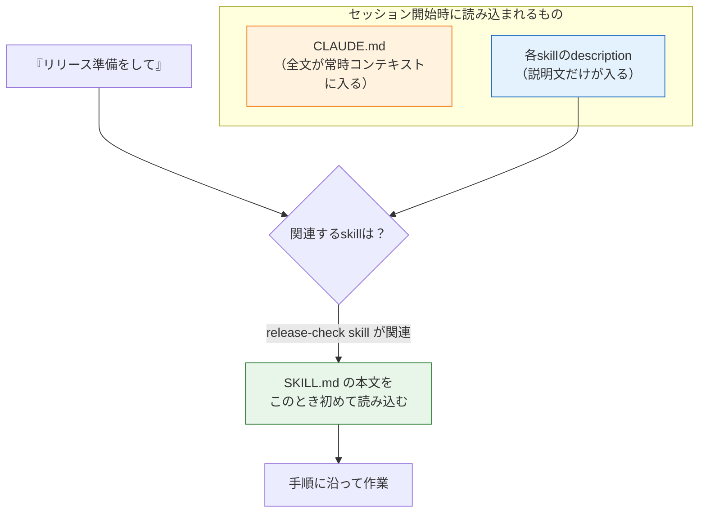

# スラッシュコマンドとskills

前のページでは、CLAUDE.mdで「常に伝えたい文脈」をAIに渡しました。このページでは、その次の段階として**よく使う指示や手順を再利用可能な部品にする**方法を学びます。

部品化の入り口が**スラッシュコマンド**です。`/help` のようにビルトインのものを使うだけでなく、自分で作ることができます。そして、その発展形が **skills（スキル）** です。「毎回チャットに貼り付けている長い指示」をファイルとして保存しておき、必要なときだけ呼び出す——プログラミングで「繰り返すコードを関数にまとめる」のと同じ発想を、AIへの指示に適用する仕組みです。

> このページの内容は執筆時点の公式ドキュメント（[https://code.claude.com/docs/](https://code.claude.com/docs/)）に基づいています。仕様が更新されている可能性があるため、細部は公式ドキュメントで確認してください。

## 学習目標

- 主要なビルトインスラッシュコマンドを使える
- `.claude/commands/` にカスタムコマンドを作成し、`$ARGUMENTS` で引数を渡せる
- skillsの概念（必要なときだけ読み込まれる指示のパッケージ）を説明できる
- SKILL.mdを書いて自分のskillを作成できる
- CLAUDE.md・カスタムコマンド・skillsの使い分けを説明できる

## スラッシュコマンドとは

スラッシュコマンドは、Claude Codeのセッション中に `/` から始めて入力する命令です。メッセージの先頭に書いたときだけコマンドとして認識され、コマンド名に続けて書いたテキストは引数として渡されます。`/` だけ入力すると、使えるコマンドの一覧が表示されます。

### 主要なビルトインコマンド

| コマンド | 動作 |
|---|---|
| `/help` | 使い方とコマンドの一覧を表示する |
| `/clear` | 会話履歴をクリアする。話題を切り替えるときに使う |
| `/compact` | 長くなった会話を要約してコンテキストを節約する |
| `/context` | コンテキストウィンドウの使用状況を表示する |
| `/init` | コードベースを分析してCLAUDE.mdを生成する（[前ページ](/ai/claude_md/)参照） |
| `/memory` | 読み込まれているCLAUDE.md類の一覧を表示・編集する |
| `/permissions` | 許可ルールを確認・編集する（[導入ページ](/ai/claude_code_setup/)参照） |
| `/model` | 使用するAIモデルを切り替える |
| `/plan` | プランモードに切り替えて計画から始める |
| `/resume` | 過去のセッションを選んで再開する |
| `/exit` | セッションを終了する |

`/clear` と `/compact` は、[LLMとは何か](/ai/what_is_llm/)で学んだコンテキストウィンドウの管理コマンドです。会話が長くなるほどコンテキストは消費されていくので、別の話題に移るときは `/clear`、同じ作業を続けながら整理したいときは `/compact` を使います。

## カスタムコマンド: 定型の指示をコマンド化する

ビルトインコマンドに加えて、**自分のコマンドを定義**できます。作り方は驚くほど単純で、**プロジェクトの `.claude/commands/` ディレクトリにMarkdownファイルを置くだけ**です。ファイル名（拡張子を除いた部分）がそのままコマンド名になります。

実際に作ってみましょう。「テストを実行して、失敗していたら直す」という定型作業をコマンド化します。

**`.claude/commands/test-fix.md`**

```markdown
テストスイートを実行し、失敗があれば修正してください。

1. `pnpm test` を実行する
2. 失敗したテストがあれば、エラーメッセージから原因を特定する
3. テストではなく実装側に問題がある前提でまず調査する
4. 修正したら再度 `pnpm test` を実行し、全件成功するまで繰り返す
5. 最後に、何をどう直したかを箇条書きで報告する
```

このファイルを保存すると、セッション内で `/test-fix` と入力するだけで、上記の指示全体がAIに送られます。

**コード解説**

- ファイルの中身は「AIへ送られるプロンプトそのもの」です。特別な文法は不要で、普通の指示文を書きます
- `test-fix.md` というファイル名が `/test-fix` というコマンド名になります
- 手順を番号つきリストで書いているのは、AIに作業の順序を明確に伝えるためです（曖昧な指示より具体的な手順、という原則はCLAUDE.mdと同じです）

### 引数を受け取る: $ARGUMENTS

コマンド名の後ろに入力したテキストは、ファイル内の `$ARGUMENTS` という場所に展開されます。GitHubのIssue番号を指定して修正させるコマンドを作ってみましょう。

**`.claude/commands/fix-issue.md`**

```markdown
GitHub Issue #$ARGUMENTS を修正してください。

1. `gh issue view $ARGUMENTS` でIssueの内容を確認する
2. 関連するコードを調査し、修正方針を提示する
3. 私の承認を得てから実装する
4. 修正に対応するテストを追加する
```

`/fix-issue 123` と実行すると、ファイル中の `$ARGUMENTS` がすべて `123` に置き換わった指示がAIに送られます。`$0`、`$1` のように位置を指定して個別の引数を受け取ることもできます（`/deploy staging v2` なら `$0` が `staging`、`$1` が `v2`）。

### コマンドの置き場所

| 置き場所 | スコープ |
|---|---|
| `.claude/commands/` | このプロジェクトだけ。Gitでチームと共有できる |
| `~/.claude/commands/` | 自分の全プロジェクト（個人用） |
| `~/.claude/skills/`（後述のskills形式） | 自分の全プロジェクト（個人用） |

プロジェクト固有の作業（このリポジトリのテストの直し方など）はプロジェクトに、自分の流儀（コミットメッセージの書き方など）は個人用に置く、と覚えてください。

## skills: 必要なときだけ読み込まれる「技」

カスタムコマンドの発展形が **skills（スキル）** です。skillは「AIに教える技」のパッケージで、`SKILL.md` というファイルに指示を書きます。

カスタムコマンドとの最大の違いは2つあります。

1. **Claudeが自動で使える。** カスタムコマンドは人間が `/名前` で呼び出すものですが、skillは説明文（description）が常にAIへ共有されており、**会話の内容に関連するとAI自身が判断したら自動で読み込んで使います**
2. **複数ファイルを同梱できる。** skillはディレクトリ単位なので、テンプレート、参考例、実行スクリプトなどの補助ファイルを一緒に置けます

実は現在のClaude Codeでは、**カスタムコマンドはskillsに統合されています**。`.claude/commands/deploy.md` と `.claude/skills/deploy/SKILL.md` はどちらも `/deploy` コマンドを作り、同じように動きます。`.claude/commands/` は今までどおり使えますが、skillsの方が機能が多いため、これから作るならskills形式が推奨されています。

### skillsはなぜコンテキストを節約できるのか

[前のページ](/ai/claude_md/)で「長い手順書をCLAUDE.mdに書くとコンテキストの無駄になる」と学びました。skillsはこの問題への答えです。



skillは**説明文（description）だけが常時コンテキストに入り、本文は呼び出されたときだけ読み込まれます**。つまり、どれだけ長い手順書でも、使わないセッションではほぼコストがかかりません。「常に必要な事実はCLAUDE.md、ときどき必要な手順はskills」という使い分けがここから導かれます。

### skillを作る

skillは次の構成のディレクトリです。

```text
.claude/skills/release-check/
├── SKILL.md          # 指示本文（必須）
├── checklist.md      # 補助ファイル（任意）
└── scripts/          # AIに実行させるスクリプト（任意）
```

実際に「リリース前チェック」のskillを作ってみましょう。

**`.claude/skills/release-check/SKILL.md`**

```markdown
---
name: release-check
description: リリース前の品質チェックを実行する。リリース準備、デプロイ前確認、公開前チェックを頼まれたときに使う。
disable-model-invocation: true
---

リリース前チェックを以下の順で実行してください。

1. `pnpm run lint` — リントエラーが0件であること
2. `pnpm test` — 単体テストが全件成功すること
3. `pnpm run test:e2e` — E2Eテストが全件成功すること
4. `pnpm run build` — ビルドが成功すること
5. `git status` — コミット漏れのファイルがないこと

すべて通ったら「リリース可能」と報告してください。
1つでも失敗したら、そこで停止して失敗内容を報告してください。
勝手に修正を始めないでください。
```

**コード解説**

- `---` で囲まれた先頭部分は **frontmatter（フロントマター）** で、skillの設定を書きます（このカリキュラムの教材ページと同じ形式です）
- `name` — 一覧に表示される名前です。省略するとディレクトリ名が使われます
- `description` — **最重要項目**です。AIはこの説明文を見て「今の会話にこのskillが関連するか」を判断します。何をするskillか＋どんなときに使うかを書きます
- `disable-model-invocation: true` — AIによる自動呼び出しを禁止し、人間が `/release-check` と打ったときだけ動くようにします。リリースチェックのような「実行のタイミングを人間が決めたい作業」に付けます
- 本文には手順を具体的に書きます。「勝手に修正を始めない」のような禁止事項も明記できます

ディレクトリ名がコマンド名になるため、これで `/release-check` が使えるようになります。

frontmatterでは他に、`allowed-tools`（このskillの実行中は指定ツールを承認なしで使える。例: `allowed-tools: Bash(pnpm test)`）や `argument-hint`（補完時に表示される引数のヒント）なども設定できます。すべて省略可能で、最低限 `description` があれば機能します。

### skillの置き場所

| 置き場所 | スコープ |
|---|---|
| `.claude/skills/<skill名>/SKILL.md` | このプロジェクトだけ（Gitで共有） |
| `~/.claude/skills/<skill名>/SKILL.md` | 自分の全プロジェクト |

## 3つの仕組みの使い分け

ここまでに学んだ仕組みを整理します。どれも「AIへの指示の再利用」ですが、読み込まれ方が違います。

| 仕組み | 読み込まれるタイミング | 向いている内容 |
|---|---|---|
| CLAUDE.md | 毎セッションの開始時（常時） | 常に守ってほしい事実・規約（コマンド、構成、禁止事項） |
| skills（自動呼び出し） | 関連する話題になったとき | ときどき必要になる知識・手順 |
| skills / カスタムコマンド（`/名前`） | 人間が呼び出したとき | タイミングを人間が決めたい定型作業 |

判断に迷ったら「**この指示は毎セッション必要か？**」と自問してください。Yesなら CLAUDE.md、Noならskillsです。CLAUDE.mdのあるセクションが「事実の列挙」ではなく「手順書」に育ってきたら、それはskillに切り出すサインです。

## 発展: コマンド出力を指示に埋め込む

skillやカスタムコマンドの本文には、`` !`コマンド` `` という構文でシェルコマンドを埋め込めます。skillが呼び出されると、**AIが本文を読む前に**コマンドが実行され、その出力で置き換えられます。「常に最新の実データを前提に作業させたい」ときに便利です。

**`.claude/skills/summarize-changes/SKILL.md`**

```markdown
---
description: 未コミットの変更を要約し、リスクがあれば指摘する。変更内容の確認やコミットメッセージの相談をされたときに使う。
---

## 現在の変更

!`git diff HEAD`

## 指示

上記の変更を2〜3個の箇条書きで要約し、エラー処理の欠落・ハードコードされた値・
更新が必要なテストなど、気づいたリスクを列挙してください。
差分が空の場合は「未コミットの変更はありません」と答えてください。
```

**コード解説**

- `` !`git diff HEAD` `` — skillの呼び出し時にこのコマンドが実行され、行全体が実際のdiffの内容に置き換わります。AIは「diffを取得する手順」ではなく「diffそのもの」を受け取るので、確実に実データに基づいて答えます
- descriptionに「どんなときに使うか」まで書いてあるので、`/summarize-changes` と打たなくても、「何を変えたっけ？」という質問からAIが自動でこのskillを使えます

## skillが思いどおりに動かないとき

- **自動で呼び出されない**: descriptionに、ユーザーが自然に使う言葉（「リリース」「コミットメッセージ」など）が含まれているか確認します。AIはdescriptionの文字列を手がかりに関連性を判断するためです。`/skill名` で直接呼び出せるかも確認しましょう
- **呼び出してほしくない場面で動く**: descriptionをより限定的に書き直すか、`disable-model-invocation: true` で手動専用にします
- **そもそも一覧に出ない**: ファイルの置き場所（`.claude/skills/<名前>/SKILL.md` という階層になっているか）と、frontmatterの `---` の対応を確認します

## 演習

自分のプロジェクトで次の2つを作ってみましょう。

1. **カスタムコマンド**: `.claude/commands/explain.md` を作り、内容を「`$ARGUMENTS` というファイル（または関数）が何をしているか、初学者向けに日本語で解説してください。1行ずつではなく、意味のまとまりごとに説明してください」とする。`/explain src/main.ts` のように使えることを確認する
2. **skill**: 自分のプロジェクトの「コミット前チェック」skillを `.claude/skills/pre-commit-check/SKILL.md` として作る。lint・テスト・ビルドなど、自分のプロジェクトに合わせた手順を書き、`/pre-commit-check` で動くことを確認する

作ったらどちらもGitにコミットしてください。チームメイト（と未来の自分）の資産になります。

## 理解度チェック

**Q1. カスタムコマンドを作るには、何をどこに置けばよいですか。**

<details markdown="1">
<summary>解答を見る</summary>

プロジェクトの `.claude/commands/` ディレクトリに、指示文を書いたMarkdownファイルを置きます。ファイル名（拡張子を除く）がコマンド名になり、たとえば `.claude/commands/test-fix.md` を置くと `/test-fix` が使えるようになります。ファイルの中身は、コマンド実行時にAIへ送られるプロンプトそのものです。

</details>

**Q2. `$ARGUMENTS` は何のための仕組みですか。具体例を挙げて説明してください。**

<details markdown="1">
<summary>解答を見る</summary>

コマンド呼び出し時に渡した引数を、コマンドファイル内に展開するための置き換え変数です。たとえばファイル内に「GitHub Issue #$ARGUMENTS を修正してください」と書いておき `/fix-issue 123` と実行すると、`$ARGUMENTS` が `123` に置き換わった指示がAIに送られます。これにより、同じ手順を対象だけ変えて再利用できます。

</details>

**Q3. skillとカスタムコマンドの違いを2つ挙げてください。**

<details markdown="1">
<summary>解答を見る</summary>

1. **AIが自動で使えるかどうか**: カスタムコマンドは人間が `/名前` で呼び出すのが基本ですが、skillはdescription（説明文）が常にAIに共有されていて、会話に関連するとAIが判断したら自動で読み込まれて使われます
2. **構成**: カスタムコマンドは単一のMarkdownファイルですが、skillはディレクトリ単位で、SKILL.mdに加えてテンプレートやスクリプトなどの補助ファイルを同梱できます

なお現在は両者は統合されており、`.claude/commands/deploy.md` も `.claude/skills/deploy/SKILL.md` も同じ `/deploy` コマンドを作ります。新規に作るなら機能の多いskills形式が推奨です。

</details>

**Q4. 長い手順書をCLAUDE.mdではなくskillsに書くべき理由を、コンテキストの観点から説明してください。**

<details markdown="1">
<summary>解答を見る</summary>

CLAUDE.mdは毎セッション全文がコンテキストウィンドウに読み込まれるため、長い手順書を書くと、その手順を使わないセッションでもコンテキストを消費し続けます。一方skillsは、常時コンテキストに入るのはdescription（説明文）だけで、本文は呼び出されたときに初めて読み込まれます。そのため、長い手順書でも使わないときのコストがほぼゼロになります。「常に必要な事実はCLAUDE.md、ときどき必要な手順はskills」という使い分けの根拠です。

</details>

**Q5. SKILL.mdのfrontmatterで `disable-model-invocation: true` を設定すると、どうなりますか。どんなskillに設定すべきですか。**

<details markdown="1">
<summary>解答を見る</summary>

AIによる自動呼び出しが禁止され、人間が `/skill名` と入力したときだけskillが実行されるようになります。

デプロイ、リリースチェック、コミットのような「副作用があり、実行のタイミングを人間がコントロールしたい作業」に設定すべきです。たとえばデプロイskillにこれを付けないと、「コードが完成したようなのでデプロイしよう」とAIが自分で判断して実行してしまう可能性があります。

</details>

## セルフレビュー

- [ ] `/clear` と `/compact` の違いと使いどころを説明できる
- [ ] カスタムコマンドを1つ作り、実際に動かした
- [ ] `$ARGUMENTS` を使ったコマンドを写経せずに書ける
- [ ] skillのdescriptionがなぜ重要か（AIの自動呼び出しの判断材料になる）を説明できる
- [ ] SKILL.mdのfrontmatter（name / description / disable-model-invocation）の意味を説明できる
- [ ] CLAUDE.md・skills（自動）・コマンド（手動）の使い分け基準を自分の言葉で説明できる
- [ ] 自分のプロジェクト用のskillを1つ作り、Gitにコミットした

## 次のステップ

これで、Claude Codeを「導入し（[導入](/ai/claude_code_setup/)）、プロジェクトに適応させ（[CLAUDE.md](/ai/claude_md/)）、定型作業を部品化する（このページ）」ところまで揃いました。次のページ[AIペアプログラミング実践](/ai/ai_pair_programming/)では、これらの道具を使って実際の開発をどう進めるか——計画→実装→レビューのループと、学習中の皆さんがAIに「奪われてはいけないもの」について学びます。

ここで作ったカスタムコマンドやskillsは、[SNS開発（最終プロジェクト）](/sns//)でも活躍します。テスト実行やマイグレーションのような繰り返し作業をskill化しておくと、開発の後半が楽になります。
