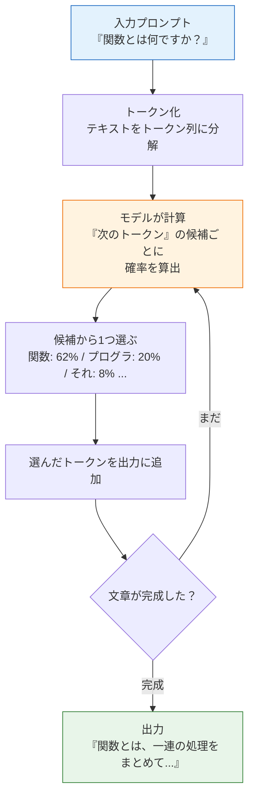
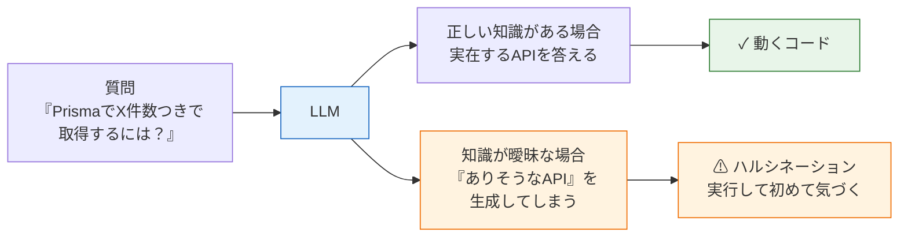

# LLMとは何か

このページでは、ChatGPTやClaudeのようなAIの中身である **LLM（Large Language Model、大規模言語モデル）** の仕組みを学びます。数式は使いません。代わりに「LLMは何をしている機械なのか」を直感的に理解することを目指します。

なぜ開発ツールの使い方より先に仕組みを学ぶのでしょうか。それは、仕組みを知らないとAIとの正しい距離感が取れないからです。LLMがどうやって文章を作っているかを知れば、「なぜAIは堂々と嘘をつくことがあるのか」「なぜ同じ質問に毎回違う答えが返るのか」「どんな仕事を任せてよくて、どんな仕事は任せてはいけないのか」が自然に判断できるようになります。

## 学習目標

- LLMが「次のトークンを予測する機械」であることを説明できる
- トークンとは何かを具体例つきで説明できる
- LLMが得意なこと・苦手なことを挙げられる
- ハルシネーションとは何か、なぜ起きるのかを説明できる
- 「AIの出力は必ず自分で検証する」という姿勢の理由を説明できる

## LLMは「次の言葉を予測する機械」

LLM（Large Language Model、ラージ・ランゲージ・モデル）は、日本語では**大規模言語モデル**と呼ばれます。難しそうな名前ですが、やっていることの本質は一つだけです。

**「ここまでの文章に続く、次の言葉は何か？」を予測する。**

たとえば、次の文章の続きを考えてみてください。

> 吾輩は猫で

ほとんどの人が「ある」と続けるはずです。日本語の文章を大量に読んできた経験から、「吾輩は猫で」の次には「ある」が来る可能性が極めて高い、と知っているからです。

LLMはこれを機械的に、超大規模にやっています。インターネット上のWebページ、書籍、ソースコードなど膨大なテキストを学習し、「この並びの次にはこの言葉が来やすい」というパターンを統計的に獲得しています。学習したテキストの量が人間とは比べものにならないほど大きいため、文法的に正しいだけでなく、文脈に沿った自然な続きを高い精度で予測できます。

そして重要なのは、**「質問に答える」「コードを書く」「翻訳する」といった一見別々の能力が、すべて「次の言葉の予測」の応用にすぎない**ということです。「質問文のあとに続く自然なテキスト」が答えであり、「『この機能を実装して』のあとに続く自然なテキスト」がコードなのです。

## トークン: LLMが扱う「言葉の単位」

先ほどから「次の言葉」と書いてきましたが、LLMが実際に扱う単位は単語でも文字でもなく、**トークン（token、トークン）** と呼ばれる独自の単位です。

トークンは「テキストを機械が扱いやすい大きさに刻んだ断片」です。おおまかな目安として、英語では1トークンが単語1個か単語の一部、日本語では1トークンがおおよそ1〜2文字程度に対応します（モデルによって刻み方は異なります）。

```text
英語:   "I love programming"
        → [I] [ love] [ programming]   （3トークン程度）

日本語: "私はプログラミングが好きです"
        → [私] [は] [プログ] [ラミング] [が] [好き] [です]   （7トークン程度）
```

LLMへの入力（プロンプト）も、LLMからの出力も、すべてこのトークンの列として処理されます。トークンを理解しておくと、次の2つの実務的な事実が腑に落ちます。

1. **LLMには一度に扱えるトークン数の上限がある。** この上限を**コンテキストウィンドウ（context window）** と呼びます。会話が長くなりすぎると古い内容が入りきらなくなる、という制約はここから来ています。次のページ以降で学ぶCLAUDE.mdの設計にも直結します。
2. **AIサービスの利用料金は多くの場合トークン数で決まる。** [AIチャット開発（RAG）](/ai-chat/claude_api/)でAPIを使うときに、入力トークン・出力トークンの数が課金の単位になります。

## 確率的生成: LLMが文章を作る流れ

LLMは、トークンを1個ずつ、確率に基づいて生成します。流れを図で見てみましょう。



ポイントは2つあります。

**1トークンずつの繰り返しである。** LLMは答え全体を一気に思いつくのではなく、「次の1トークン」を選んでは出力に追加し、それを含めた全体からまた次の1トークンを選ぶ……という繰り返しで文章を組み立てます。ChatGPTやClaudeの画面で答えが少しずつ流れるように表示されるのは、演出ではなく、この生成の仕組みをそのまま見せているからです。

**選択は確率的である。** 各ステップでLLMは「候補トークンごとの確率」を計算し、その確率に従って選びます。常に最有力候補だけを選ぶわけではないため、**同じ質問をしても毎回少しずつ違う答えが返ってきます**。これは故障ではなく仕様です。逆に言えば、LLMの答えは「計算結果」ではなく「もっともらしい文章の生成結果」だ、ということを意味します。

## 学習と推論: LLMはいつ賢くなるのか

LLMの一生は、大きく2つの段階に分かれます。

1. **学習（training、トレーニング）**: 膨大なテキストを読み込んで「次のトークンの予測パターン」を獲得する段階。膨大な計算資源を使って、モデルの開発元（Anthropic、OpenAIなど）が行います
2. **推論（inference、インファレンス）**: 学習済みのモデルを使って、実際に入力への続きを生成する段階。皆さんがChatGPTやClaudeに話しかけているのはこちらです

ここから、初学者が誤解しやすい2つの重要な事実が導かれます。

**事実1: 会話してもモデルは賢くならない。** 皆さんがチャットで何かを教えても、モデル本体（学習済みのパターン）は1ビットも変化しません。会話の内容は、その会話の入力として使われるだけです。だからこそ、次のページ以降で学ぶ「毎回の入力に文脈を含める仕組み（CLAUDE.md）」が必要になります。

**事実2: モデルには「知識の鮮度」の限界がある。** 学習に使われたテキストはある時点までのものなので、それ以降の出来事・新しいライブラリのバージョン・最近のAPI変更をモデルは知りません。この時点を**knowledge cutoff（ナレッジカットオフ、知識の締め切り日）** と呼びます。新しめの技術について聞くときは、答えが古い可能性を常に考慮してください。

### 入力がすべて: プロンプトの質が出力の質を決める

推論の段階でモデルに与える入力を**プロンプト（prompt、プロンプト）** と呼びます。LLMの出力は「プロンプトの続きとしてもっともらしいもの」なので、**プロンプトに含まれる情報がすべて**です。

```text
悪いプロンプト: 「エラーを直して」
  → どのエラー？どのファイル？ モデルは推測で埋めるしかない

良いプロンプト: 「次のTypeScriptコードで 'Object is possibly undefined'
  というコンパイルエラーが出ます。コードは ... です。
  原因の説明と、optional chainingを使わない修正案をください」
  → 状況・制約・期待する形式が揃っていて、続きが一意に定まりやすい
```

人間相手なら「察してもらえる」省略も、LLM相手では「もっともらしい勝手な補完」につながります。**文脈を与えるほど出力は正確になる**——この原則は、このセクション全体を貫くテーマです。

## LLMが得意なこと・苦手なこと

「もっともらしい続きを確率的に生成する機械」という本質から、得意・不得意がはっきり分かれます。

| 得意なこと | 苦手なこと |
|---|---|
| 文章の要約・翻訳・言い換え | 正確な計算（桁数の多い四則演算など） |
| 定型的なコードの生成（CRUD、テスト、設定ファイル） | 最新情報（学習データに含まれない出来事） |
| エラーメッセージの解読と原因の説明 | 厳密な事実確認（出典の正確な引用） |
| コードの解説・レビュー・リファクタリング案 | 「知らない」と言うこと（後述のハルシネーション） |
| 大量のパターンからの典型例の提示 | 学習データに少ないニッチなライブラリの細かい仕様 |
| アイデアの壁打ち・選択肢の列挙 | プロジェクト固有の事情の考慮（伝えない限り知らない） |

得意なことの共通点は「**世の中に大量の類似例が存在するタスク**」です。学習データの中に似たパターンが豊富にあれば、高品質な「続き」を生成できます。皆さんがこれまで書いてきたReactコンポーネントやNestJSのControllerは、世界中で無数に書かれてきた定型パターンなので、LLMは非常に得意です。

苦手なことの共通点は「**もっともらしさと正しさが一致しないタスク**」です。たとえば計算問題では、「123 × 456 = 」の続きとしてもっともらしい数字の並びを生成することはできても、計算そのものをしているわけではないので間違えます。

## ハルシネーション: AIがつく「もっともらしい嘘」

LLMの最も重要な弱点が**ハルシネーション（hallucination、ハルシネーション）** です。日本語では「幻覚」と訳され、**事実ではない内容を、事実であるかのように自信満々に生成してしまう現象**を指します。

開発の文脈では、たとえば次のようなことが起こります。

- **存在しないAPIやオプションを生成する**: 「`prisma.user.findManyAndCount()` を使ってください」のように、実在しそうで実在しないメソッド名を提示する
- **存在しないパッケージを提案する**: ありそうな名前のnpmパッケージを `pnpm add` するよう案内するが、実際には存在しない
- **古い情報と新しい情報を混ぜる**: ライブラリの旧バージョンの書き方と新バージョンの書き方を混在させたコードを生成する
- **架空の出典を示す**: 「公式ドキュメントにこう書いてあります」と言いながら、そんな記述はどこにもない

なぜこんなことが起きるのでしょうか。ここまでの仕組みを思い出してください。LLMは「正しい答えを検索して返す機械」ではなく、「もっともらしい続きを生成する機械」です。`findMany()` と `count()` というメソッドを大量に見てきたモデルにとって、`findManyAndCount()` は「いかにもありそうな続き」なのです。**LLMには『自分が知らないことを知らない』という自覚がない**ため、知識の穴をもっともらしい生成で埋めてしまいます。



図のとおり、LLM自身の出力からは「正しい答え」と「ハルシネーション」を見分けられません。どちらも同じように自信満々で、同じように流暢だからです。見分ける手段は、出力の外側にあります。つまり、**実行する・公式ドキュメントで確認する・テストを書く**ことです。

## AIの出力は必ず自分で検証する

ここまでの内容から導かれる、このセクション全体で最も大切な姿勢を述べます。

**AIの出力は、必ず自分で検証する。**

これはAIを信用しないという意味ではありません。AIの性質に合った正しい使い方をする、という意味です。具体的には次の習慣を持ってください。

1. **生成されたコードは、必ず読んで理解してから取り込む。** 読んで理解できないコードを自分のプロジェクトに入れてはいけません。これは人間のチームメイトが書いたコードをレビューするのと同じです。
2. **必ず実行して動作を確かめる。** コンパイルが通るか、テストが通るか、期待どおりに動くか。[バックエンドテスト](/testing//)で学んだ自動テストは、AI時代にこそ価値が上がります。AIに大胆な変更を任せられるのは、テストという検証の網があるからです。
3. **APIやライブラリの仕様は公式ドキュメントで裏を取る。** 特に「初めて見るメソッド」「初めて聞くオプション」が出てきたら、ハルシネーションを疑って確認します。
4. **Gitでいつでも戻れる状態を保つ。** AIに変更を任せる前にコミットしておけば、間違った変更も `git restore` や `git reset` で安全に巻き戻せます（[基本コマンド](/git/basic_commands/)参照）。

責任の所在も明確にしておきましょう。AIが書いたコードでも、**コミットして世に出した瞬間に、その品質の責任を持つのは皆さん自身**です。「AIがそう書いたので」は、バグの言い訳にはなりません。だからこそ、検証の習慣が必要なのです。

一方で、過度に恐れる必要もありません。ハルシネーションの存在を知り、検証の習慣さえ持っていれば、LLMは要約・解説・定型コード生成・レビューといった得意分野で、皆さんの開発速度と学習速度を大きく引き上げてくれます。

## 手を動かして確かめる

ここまでの内容は、実際にLLMに触れて確かめられます。ChatGPTやClaudeなど、使えるチャットAIで次の3つの実験をしてみてください（次のページでClaude Codeを導入すれば、そちらでも試せます）。

**実験1: 確率的生成を体感する。** 新しい会話を2回開始し、まったく同じ質問（例:「配列とは何か、たとえ話で説明して」）をしてみます。2回の答えを見比べると、内容の方向性は同じでも、言い回しや例が毎回変わることが確認できます。これが確率的生成です。

**実験2: 計算の苦手さを確認する。** 「48,271 × 39,847 を計算して」と、途中の過程を書かせずに即答させてみてください。それらしい桁数の答えが返ってきますが、電卓で検算すると間違っていることが多いはずです。「もっともらしい数字の並び」と「正しい計算結果」が別物であることが体感できます。

**実験3: 知らないことへの態度を観察する。** 実在しないものについて、実在する前提で質問してみます（例:「JavaScriptの `Array.prototype.shuffleSort()` メソッドの使い方を教えて」）。「そのようなメソッドは存在しません」と答えられれば優秀ですが、モデルや聞き方によっては、もっともらしい架空の解説が返ってきます。これがハルシネーションです。

3つの実験に共通する教訓は同じです。**出力の流暢さ・自信ありげな口調は、正しさの証拠にならない**。検算（実験2）や公式ドキュメントの確認（実験3）のような、出力の外側での検証が必要です。

## このページの用語まとめ

このセクションと次セクション（[AIチャット開発（RAG）](/ai-chat//)）で繰り返し登場する用語を整理しておきます。

| 用語 | 意味 |
|---|---|
| LLM（大規模言語モデル） | 次のトークンを予測することで文章を生成するAIモデル |
| トークン | LLMがテキストを処理する最小単位。入出力も料金もこの単位で数える |
| コンテキストウィンドウ | 一度に扱えるトークン数の上限。会話・指示・コードはすべてここに載る |
| プロンプト | モデルに与える入力。出力の質はプロンプトに含めた文脈で決まる |
| 推論 | 学習済みモデルで出力を生成すること。会話してもモデル自体は学習しない |
| knowledge cutoff | 学習データの締め切り時点。それ以降の情報をモデルは知らない |
| ハルシネーション | 事実でない内容を、事実のように自信満々に生成してしまう現象 |

## 理解度チェック

**Q1. LLMが行っている処理の本質を一言で説明してください。**

<details markdown="1">
<summary>解答を見る</summary>

「ここまでのテキスト（トークン列）に続く、次のトークンを確率的に予測する」処理です。質問応答もコード生成も翻訳も、すべてこの「次のトークン予測」の繰り返しとして実現されています。答え全体を一気に考えているのではなく、1トークンずつ生成しては、それを含めた全体から次の1トークンを予測しています。

</details>

**Q2. トークンとは何ですか。また、トークンを意識する必要がある実務上の理由を1つ挙げてください。**

<details markdown="1">
<summary>解答を見る</summary>

トークンは、LLMがテキストを処理するときの最小単位で、テキストを機械が扱いやすい大きさに刻んだ断片です（日本語ではおおよそ1〜2文字程度が1トークンになることが多い）。

実務上の理由としては、(1) LLMには一度に扱えるトークン数の上限（コンテキストウィンドウ）があるため、渡せる情報量に限りがあること、(2) API利用時の料金が入出力のトークン数で決まること、のどちらかが挙げられれば正解です。

</details>

**Q3. 同じ質問をLLMに2回すると、違う答えが返ってくることがあります。なぜですか。**

<details markdown="1">
<summary>解答を見る</summary>

LLMは各ステップで「次のトークン候補ごとの確率」を計算し、その確率に基づいてトークンを選ぶ**確率的な生成**を行っているからです。常に確率最大の候補だけを選ぶわけではないため、生成のたびに選ばれるトークンが変わり、結果として答え全体も変わります。これは故障ではなく、LLMの仕組みそのものに由来する性質です。

</details>

**Q4. ハルシネーションとは何ですか。また、なぜ起きるのかを仕組みから説明してください。**

<details markdown="1">
<summary>解答を見る</summary>

ハルシネーションとは、LLMが事実ではない内容（存在しないAPI、架空の出典など）を、事実であるかのように自信満々に生成してしまう現象です。

LLMは「正しさ」を検証する機械ではなく「もっともらしい続き」を生成する機械であり、自分が知らないことを知らないという自覚を持ちません。そのため、知識が曖昧な領域では、学習したパターンから「いかにもありそうな内容」を生成して穴を埋めてしまいます。出力の流暢さや自信は正しさの保証にならないため、実行・公式ドキュメント・テストなど出力の外側での検証が必要です。

</details>

**Q5. 「LLMとの会話で何かを教えれば、モデルはそれを覚えて賢くなる」という理解は正しいですか。**

<details markdown="1">
<summary>解答を見る</summary>

正しくありません。LLMの「賢さ」は学習（トレーニング）段階で固定されており、皆さんとの会話（推論段階）ではモデル本体は一切変化しません。会話の内容は、その会話の入力（コンテキスト）として参照されるだけで、セッションが終われば失われます。

この性質があるからこそ、「毎回の入力にプロジェクトの文脈を自動で含める」CLAUDE.mdのような仕組みが必要になります（詳細は[CLAUDE.mdでプロジェクトの文脈を伝える](/ai/claude_md/)で学びます）。

</details>

**Q6. AIが生成したコードをプロジェクトに取り込む前に行うべきことを3つ挙げてください。**

<details markdown="1">
<summary>解答を見る</summary>

次のうち3つ挙げられれば正解です。

1. コードを読んで、何をしているか自分で理解する
2. 実際に実行して動作を確認する（コンパイル、テスト、手動確認）
3. 見慣れないAPI・オプションは公式ドキュメントで実在と仕様を確認する
4. 取り込む前の状態をGitでコミットしておき、いつでも戻せるようにする

共通する考え方は「AIの出力は必ず自分で検証する」「コミットしたコードの責任は自分が持つ」です。

</details>

## セルフレビュー

- [ ] LLMが「次のトークンを予測する機械」であることを自分の言葉で説明できる
- [ ] トークンとコンテキストウィンドウの関係を説明できる
- [ ] ChatGPTやClaudeの答えが毎回少し違う理由を、確率的生成の観点から説明できる
- [ ] LLMが得意なタスクと苦手なタスクを、それぞれ3つ以上挙げられる
- [ ] ハルシネーションの具体例（開発の文脈で）を挙げられる
- [ ] ハルシネーションが起きる理由を「もっともらしさと正しさは別物」という観点で説明できる
- [ ] AIの出力を検証する具体的な手段（実行・ドキュメント・テスト・Git）を説明できる

## 次のステップ

LLMの仕組みと限界が分かったところで、次のページ[Claude Codeの導入](/ai/claude_code_setup/)では、実際にAIコーディングツールをインストールして使い始めます。このページで学んだ「確率的に生成している」「検証が必要」という理解は、Claude Codeの**許可モード**（AIの行動をどこまで自動承認するか）を使い分ける判断基準になります。

また、トークンとコンテキストウィンドウの話は、[CLAUDE.mdでプロジェクトの文脈を伝える](/ai/claude_md/)で「なぜCLAUDE.mdは簡潔に書くべきか」を理解する鍵になり、さらに[AIチャット開発（RAG）](/ai-chat//)では「コンテキストウィンドウに入りきらない知識をどう扱うか」という問題意識として再登場します。
