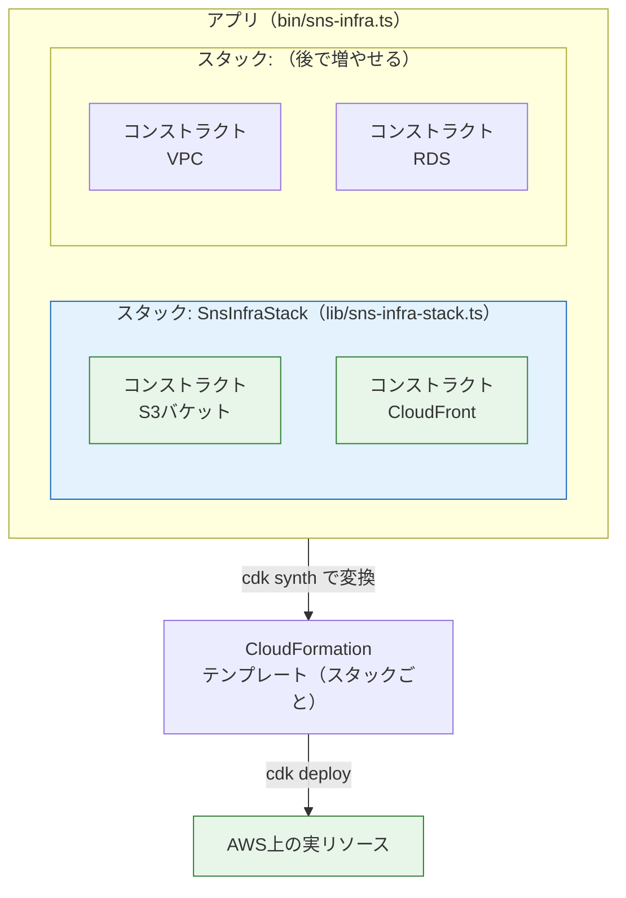

# CDK入門

このページから手を動かしてインフラを構築していきます。まずはAWS CDKをセットアップし、CDKの世界の基本概念である**アプリ・スタック・コンストラクト**を理解したうえで、最初のスタック（S3バケット1個）を**書く → 差分を見る → デプロイする → 削除する**という一連のサイクルを体験します。

このサイクルは以降のすべての構築ページで繰り返す基本動作です。ここで丁寧に身につけてください。

## 学習目標

- CDKプロジェクトを作成し、ディレクトリ構成を説明できる
- アプリ・スタック・コンストラクトの関係を図で説明できる
- `cdk bootstrap` が何をするものか説明できる
- `cdk synth` / `cdk diff` / `cdk deploy` / `cdk destroy` の役割を説明し、使い分けられる
- S3バケット1個のスタックを自分で書いてデプロイ・削除できる

## 前提の確認

次の2つが済んでいることを確認してください。

- Node.js 20がインストールされている（→ [Node.jsのインストール](/environment/node/)）
- AWS CLIの認証設定が済んでいて、`aws sts get-caller-identity` が成功する（→ [AWSとは何か](/aws/what_is_aws/)）

## CDKプロジェクトを作成する

CDKのコマンドラインツール（`aws-cdk` パッケージ）は、これまで使ってきたライブラリと同じくnpmレジストリで配布されています。プロジェクトの開発依存としてインストール（`pnpm add -D aws-cdk` 相当。後述の雛形に最初から含まれています）し、`pnpm exec cdk ...` で実行する方式にします。グローバルインストール（`pnpm add -g aws-cdk`）という方法も紹介されることがありますが、corepack経由で導入したpnpm（→ [Node.jsのインストール](/environment/node/)）では `pnpm add -g` が失敗するうえ、バージョンをプロジェクトに固定できるローカルインストールの方が確実です。

まずプロジェクト用のディレクトリを作ります。このディレクトリは以降のページでも使い続けるので、SNSアプリとは別の場所に作ってください。

```bash
mkdir sns-infra
cd sns-infra
pnpm dlx aws-cdk init app --language typescript
```

```
Applying project template app for typescript
# 中略
✅ All done!
```

**コード解説**

- `pnpm dlx aws-cdk init` … CDKプロジェクトの雛形を生成します。`pnpm dlx` は「未インストールのパッケージを一時的に取得して実行する」コマンドでした（npmの `npx` に相当。→ [Reactのセットアップ](/react/setup/)）
- `app` … 雛形の種類。アプリケーション型（標準）を指定します
- `--language typescript` … 生成するコードの言語。もちろんTypeScriptです

`cdk init` が生成する雛形は**npm前提**で、依存パッケージのインストールにnpmが使われ、`package-lock.json` が作られます。本カリキュラムではパッケージマネージャをpnpmに統一しているので、生成直後に一度だけ `pnpm install` を実行して、依存関係をpnpmで入れ直しておきます（`pnpm-lock.yaml` が作られます。npmの `package-lock.json` は削除して構いません）。

```bash
pnpm install
```

生成されたディレクトリ構成を見てみましょう。

```
sns-infra/
├── bin/
│   └── sns-infra.ts        # エントリーポイント（アプリ全体の定義）
├── lib/
│   └── sns-infra-stack.ts  # スタックの定義（主にここを編集する）
├── test/
│   └── sns-infra.test.ts   # スタックのテスト
├── cdk.json                # CDKの設定ファイル
├── package.json            # 依存パッケージ（aws-cdk-lib など）
└── tsconfig.json           # TypeScriptの設定
```

`package.json` を開くと、`aws-cdk-lib`（CDKの本体ライブラリ、v2系）と `constructs`、開発依存として `aws-cdk`（CLIツール）が入っています。**CDK v2では、全AWSサービスの部品が `aws-cdk-lib` 1パッケージに同梱されている**ため、サービスごとにパッケージを追加する必要はありません。

## アプリ・スタック・コンストラクト

コードを書く前に、CDKの3つの基本概念を整理します。

- **コンストラクト（construct、構成部品）** … CDKにおけるインフラ部品の最小単位。「S3バケット」「VPC」など、1つのリソース（またはリソースのまとまり）を表すクラスです
- **スタック（stack）** … コンストラクトをまとめた**デプロイの単位**。CloudFormationの1つのスタックに対応し、`cdk deploy` / `cdk destroy` はスタック単位で行われます
- **アプリ（app）** … スタックをまとめた最上位の入れ物。1つのCDKプロジェクトが1つのアプリです



入れ子構造（アプリ ⊃ スタック ⊃ コンストラクト）と、「スタックがデプロイの単位」という点を押さえてください。Reactで「コンポーネントを組み合わせて画面を作った」のと同じように、CDKでは「コンストラクトを組み合わせてインフラを作る」のだと考えると馴染みやすいはずです。

### コンストラクトには「レベル」がある

コンストラクトには抽象度のレベルがあり、L1〜L3と呼ばれます。

- **L1（低レベル）** … CloudFormationの定義を1対1で写したもの。クラス名が `Cfn` で始まる（例: `CfnBucket`）。全項目を自分で指定する必要があり、基本的に使いません
- **L2（標準）** … 適切なデフォルト値と便利メソッドを備えた標準部品（例: `s3.Bucket`）。**このカリキュラムの主役**です
- **L3（パターン）** … 複数リソースの定石構成を1つにまとめた高レベル部品（例: 「ALB + Fargateサービス一式」の `ApplicationLoadBalancedFargateService`）。[ECR + ECS Fargate](/aws/ecr_ecs/)で使います

## bootstrap: 最初の一度だけの準備

CDKを使い始める前に、アカウント×リージョンごとに一度だけ**ブートストラップ（bootstrap）**という準備作業が必要です。

```bash
pnpm exec cdk bootstrap
```

```
 ⏳  Bootstrapping environment aws://123456789012/ap-northeast-1...
 ✅  Environment aws://123456789012/ap-northeast-1 bootstrapped.
```

これは何をしているのでしょうか。`cdk deploy` の際、CDKは合成したテンプレートやアセット（ファイル類）を**いったんAWS上の作業領域に置いてから**構築を行います。bootstrapはその作業領域（S3バケットと、デプロイ用のIAMロールなど）をあらかじめ作るコマンドです。「CDKがそのアカウントで働くための机を用意する」と理解してください。

> **料金に関する注意**
>
> bootstrapが作るのはS3バケット等の作業領域で、置かれるのは小さなファイルだけなので、料金は実質0円〜数円規模です。また、このページで作るS3バケット1個も、空のバケットであれば**料金はかかりません**（S3は保存量と通信量への課金のため）。このページは安心して試せますが、ページ末尾の `cdk destroy` までを必ずワンセットで行ってください。

## 最初のスタック: S3バケットを1個作る

それでは `lib/sns-infra-stack.ts` を開いてください。雛形にはコメントアウトされた例が書かれていますが、すべて消して次の内容にします。

**`lib/sns-infra-stack.ts`**

```typescript
import * as cdk from 'aws-cdk-lib';
import { Construct } from 'constructs';
import * as s3 from 'aws-cdk-lib/aws-s3';

export class SnsInfraStack extends cdk.Stack {
  constructor(scope: Construct, id: string, props?: cdk.StackProps) {
    super(scope, id, props);

    new s3.Bucket(this, 'PracticeBucket', {
      versioned: true,
      blockPublicAccess: s3.BlockPublicAccess.BLOCK_ALL,
      removalPolicy: cdk.RemovalPolicy.DESTROY,
      autoDeleteObjects: true,
    });
  }
}
```

**コード解説**

- `import * as cdk from 'aws-cdk-lib';` … CDK本体（v2）を読み込みます。スタックの基底クラスや共通の型がここに入っています
- `import { Construct } from 'constructs';` … コンストラクトの基底となる型です。コンストラクタの引数の型に使います
- `import * as s3 from 'aws-cdk-lib/aws-s3';` … S3関連の部品だけを読み込みます。`aws-cdk-lib/aws-ecs` のように、サービスごとのサブパスから読み込むのがCDK v2の流儀です
- `export class SnsInfraStack extends cdk.Stack` … スタックは `cdk.Stack` を**継承したクラス**として定義します。クラス構文は[TypeScript基礎](/typescript/)で学んだものと同じです
- `constructor(scope: Construct, id: string, props?: cdk.StackProps)` … CDKのコンストラクトに共通のコンストラクタ形式です。`scope` は親（このスタックを入れるアプリ）、`id` はスタックの識別名、`props` は設定値です
- `super(scope, id, props);` … 親クラス `cdk.Stack` の初期化。お決まりの1行です
- `new s3.Bucket(this, 'PracticeBucket', {...})` … **ここが本体**。S3バケットのコンストラクト（L2）を生成します。第1引数 `this` は「このスタックの中に置く」という意味、第2引数 `'PracticeBucket'` はスタック内での識別ID（実際のバケット名はCDKがこのIDから一意な名前を自動生成します）
- `versioned: true` … バージョニング（ファイル更新時に旧版を残す機能）を有効化します
- `blockPublicAccess: s3.BlockPublicAccess.BLOCK_ALL` … バケットへの公開アクセスを全面的に遮断します。意図しない公開事故を防ぐ、安全側の設定です
- `removalPolicy: cdk.RemovalPolicy.DESTROY` … スタック削除時に**バケットも一緒に削除する**指定です。デフォルトはRETAIN（データ保護のため残す）なので、学習用には明示的にDESTROYを指定します
- `autoDeleteObjects: true` … バケットの中にファイルが残っていても削除できるようにします（S3は「空でないバケットは消せない」仕様のため、CDKが削除前に中身を空にする仕組みを足してくれます）

`bin/sns-infra.ts` はアプリを定義するエントリーポイントです。雛形のままで動きますが、中身を確認しておきましょう。

**`bin/sns-infra.ts`**

```typescript
#!/usr/bin/env node
import * as cdk from 'aws-cdk-lib';
import { SnsInfraStack } from '../lib/sns-infra-stack';

const app = new cdk.App();
new SnsInfraStack(app, 'SnsInfraStack');
```

**コード解説**

- `const app = new cdk.App();` … アプリ（最上位の入れ物）を作ります
- `new SnsInfraStack(app, 'SnsInfraStack');` … 先ほど定義したスタックをアプリの中に1つ生成します。第1引数が `app` であることに注目してください。「スタックの親はアプリ」という入れ子関係がコードにそのまま現れています

## synth → diff → deploy のサイクル

### cdk synth: テンプレートへの変換を確認する

```bash
pnpm exec cdk synth
```

実行すると、TypeScriptコードから合成されたCloudFormationテンプレート（YAML）が表示されます。一部を抜粋します。

```yaml
Resources:
  PracticeBucket12345678:
    Type: AWS::S3::Bucket
    Properties:
      PublicAccessBlockConfiguration:
        BlockPublicAcls: true
        BlockPublicPolicy: true
        IgnorePublicAcls: true
        RestrictPublicBuckets: true
      VersioningConfiguration:
        Status: Enabled
    DeletionPolicy: Delete
```

TypeScriptの数行が、宣言的なテンプレートに展開されていることが分かります。[前のページ](/aws/what_is_iac/)で見た「CDK → CloudFormation」の変換が、まさにこれです。synthはAWSに何も送りません。**手元で変換結果を確認するだけの安全なコマンド**です。

### cdk diff: 差分を確認する

```bash
pnpm exec cdk diff
```

```
Stack SnsInfraStack
Resources
[+] AWS::S3::Bucket PracticeBucket PracticeBucket12345678
```

`[+]` は「新規作成される」という意味です。現在AWSにはこのスタックが存在しないので、バケット1個が追加される、と表示されています。**deployの前に必ずdiffを見る**癖をつけてください。意図しない削除（`[-]`）や置き換えに事前に気づけます。

### cdk deploy: 実際に構築する

```bash
pnpm exec cdk deploy
```

```
SnsInfraStack: deploying...
SnsInfraStack: creating CloudFormation changeset...
 ✅  SnsInfraStack

✨  Deployment time: 25.3s
```

IAMポリシー等に影響する変更がある場合は `Do you wish to deploy these changes (y/n)?` と確認を求められるので、内容を読んで `y` を入力します。

デプロイが終わったら、マネジメントコンソールで確認してみましょう。

1. S3のコンソールを開くと、`snsinfrastack-practicebucket...` のような名前のバケットができています
2. 検索バーから「CloudFormation」を開くと、`SnsInfraStack` というスタックがあり、「リソース」タブにバケットが記録されています

**コンソールは「見る」ために使い、「作る・変える」はコードで行う**——この役割分担がIaCの実践です。

### 変更を加えてもう一度diff

宣言的な差分適用を体感するため、コードを1か所変えてみます。バケットにタグを付けてみましょう。`lib/sns-infra-stack.ts` の `autoDeleteObjects: true,` の下の行は変えず、`new s3.Bucket(...)` の呼び出しの直後に次を追記します。

```typescript
    const bucket = new s3.Bucket(this, 'PracticeBucket', {
      versioned: true,
      blockPublicAccess: s3.BlockPublicAccess.BLOCK_ALL,
      removalPolicy: cdk.RemovalPolicy.DESTROY,
      autoDeleteObjects: true,
    });
    cdk.Tags.of(bucket).add('project', 'sns-curriculum');
```

**コード解説**

- `const bucket = ...` … 後でバケットを参照するため、戻り値を変数に受けるよう変更しました
- `cdk.Tags.of(bucket).add('project', 'sns-curriculum');` … バケットに「project = sns-curriculum」というタグ（ラベル）を付けます。タグはコスト集計やリソース整理に使われます

diffを見ます。

```bash
pnpm exec cdk diff
```

```
Resources
[~] AWS::S3::Bucket PracticeBucket PracticeBucket12345678
 └─ [+] Tags
     └─ [{"Key":"project","Value":"sns-curriculum"}]
```

`[~]` は「既存リソースの変更」です。バケットを作り直すのではなく、**タグの追加だけ**が適用されることが事前に分かります。`pnpm exec cdk deploy` で適用してください。

## cdk destroy: 片付ける

体験は完了です。スタックごと削除します。

```bash
pnpm exec cdk destroy
```

```
Are you sure you want to delete: SnsInfraStack (y/n)? y
SnsInfraStack: destroying...
 ✅  SnsInfraStack: destroyed
```

CloudFormationのコンソールからスタックが消え、S3のバケットも削除されていることを確認してください。`removalPolicy: DESTROY` と `autoDeleteObjects: true` を指定していたので、バケットも中身ごと片付きます。

コード（`sns-infra` ディレクトリ）は手元に残っています。明日また `pnpm exec cdk deploy` すれば、同じバケットが数十秒で再現されます。**消しても失われない**——これがIaCと「使い終わったら削除」の組み合わせの安心感です。

> なお、bootstrapで作られた作業領域（`CDKToolkit` スタック）は削除せずに残しておいてください。次ページ以降のデプロイでも使いますし、残していてもほぼ課金されません。

## CDKコマンドまとめ

| コマンド | 役割 | AWSへの影響 |
|---|---|---|
| `pnpm exec cdk synth` | テンプレートへの変換結果を表示 | なし（手元だけ） |
| `pnpm exec cdk diff` | 現在のAWSとコードの差分を表示 | なし（読み取りのみ） |
| `pnpm exec cdk deploy` | 差分を適用して構築・更新 | **あり** |
| `pnpm exec cdk destroy` | スタックのリソースを削除 | **あり（削除）** |
| `pnpm exec cdk bootstrap` | アカウント×リージョンの初期準備（最初の一度だけ） | あり（作業領域の作成） |

## 理解度チェック

**Q1. アプリ・スタック・コンストラクトの関係を説明してください。デプロイの単位はどれですか。**

<details markdown="1">
<summary>解答を見る</summary>

アプリ ⊃ スタック ⊃ コンストラクトという入れ子構造です。コンストラクトが個々のインフラ部品（S3バケットなど）、スタックがそれらをまとめた**デプロイの単位**（CloudFormationスタックに対応）、アプリがスタックをまとめる最上位の入れ物です。`cdk deploy` / `cdk destroy` はスタック単位で実行されます。

</details>

**Q2. `cdk bootstrap` は何のためのコマンドですか。毎回実行する必要がありますか。**

<details markdown="1">
<summary>解答を見る</summary>

CDKがデプロイ作業に使う作業領域（テンプレートやアセットを置くS3バケット、デプロイ用IAMロールなど）をアカウント×リージョンに準備するコマンドです。**同じアカウント×リージョンでは最初の一度だけ**実行すればよく、以後のデプロイで繰り返す必要はありません。

</details>

**Q3. `new s3.Bucket(this, 'PracticeBucket', {...})` の第1引数 `this` と第2引数 `'PracticeBucket'` はそれぞれ何を意味しますか。**

<details markdown="1">
<summary>解答を見る</summary>

第1引数 `this` は**親となるスコープ**で、「このコンストラクトをこのスタックの中に置く」ことを表します。第2引数はスコープ内での**識別ID**で、CDKはこのIDをもとに実際のリソース名（一意なバケット名など）を自動生成します。実物のバケット名そのものではない点に注意してください。

</details>

**Q4. デプロイの前に `cdk diff` を実行すべきなのはなぜですか。**

<details markdown="1">
<summary>解答を見る</summary>

コードと現在のAWSの**差分を、適用前に確認できる**からです。`[+]`（追加）だけのつもりが `[-]`（削除）や置き換えが含まれていた、というような意図しない変更に事前に気づけます。宣言的なIaCでは「差分を見てから適用する」が安全運転の基本です。

</details>

**Q5. 学習用のバケットに `removalPolicy: cdk.RemovalPolicy.DESTROY` と `autoDeleteObjects: true` を指定したのはなぜですか。**

<details markdown="1">
<summary>解答を見る</summary>

S3バケットのremovalPolicyのデフォルトは（データ保護のため）スタックを消してもバケットを**残す**設定であり、さらにS3には「空でないバケットは削除できない」仕様があるからです。学習用では `cdk destroy` 一発で確実に片付くことが重要なので、削除を許可するDESTROYと、中身を空にしてから消すautoDeleteObjectsを明示しています。本番の重要データを持つバケットでは逆に指定すべきでない設定です。

</details>

## セルフレビュー

- [ ] `cdk init` でプロジェクトを作成し、bin/とlib/の役割を説明できる
- [ ] アプリ・スタック・コンストラクトの入れ子関係を図に描ける
- [ ] コンストラクトのL1/L2/L3の違いを説明できる
- [ ] bootstrapの役割を「CDKの作業領域の準備」として説明できる
- [ ] S3バケット1個のスタックを、雛形を見ずに自分で書ける
- [ ] synth / diff / deploy / destroy をこの順で実行し、それぞれの出力を読める
- [ ] `cdk destroy` まで実行して、コンソールでリソースが消えたことを確認した

## 次のステップ

CDKの基本サイクルが身につきました。次のページ[S3 + CloudFront](/aws/s3_cloudfront/)では、いよいよ本物のフロントエンド（Reactのビルド成果物）をAWSにデプロイします。このページで作ったS3バケットの知識をそのまま使い、CloudFrontと組み合わせて「世界に公開されたWebサイト」を作ります。

このページの `sns-infra` プロジェクトは以降のページでも拡張していくので、削除せずに残しておいてください（AWS上のリソースはdestroy済みでOKです）。
