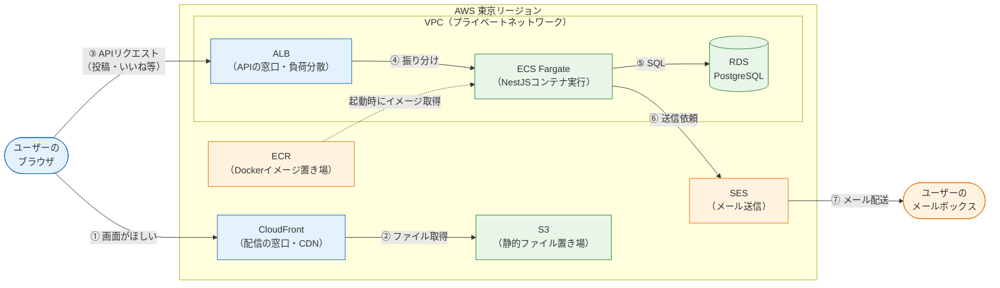

# 主要サービスの全体像

AWSには200を超えるサービスがありますが、このカリキュラムで使うのは10個だけです。このページでは、その10個が**SNSアプリのどの部分を担当するのか**を最初に1枚の図で押さえ、そのうえで1つずつ「何をするサービスか」「なぜ必要か」を解説します。

個々の構築手順は後のページで行うので、ここでは「役割の地図」を頭に入れることに集中してください。

## 学習目標

- SNSアプリの各部分（画面・API・DB・メール）をどのAWSサービスが担当するかを図で説明できる
- VPC / S3 / CloudFront / ECR / ECS(Fargate) / ALB / RDS / SES / IAM / Route 53 の役割を一言で説明できる
- 「静的ファイルの配信」と「APIサーバーの実行」で構成が分かれる理由を説明できる
- 各サービスのうち、起動時間に応じて課金されるものを挙げられる

## 全体マッピング: どのサービスが何を担うか

これまで開発してきたアプリは、大きく3つの部品でできていました。

- **フロントエンド** … Reactで作った画面。`vite build` するとHTML/CSS/JSの**静的ファイル**になる（→ [ビルドとデプロイの全体像](/cicd/build_and_deploy_flow/)）
- **バックエンド** … NestJSのAPIサーバー。Dockerコンテナとして動かせる（→ [Dockerfileの書き方](/docker/dockerfile/)）
- **データベース** … PostgreSQL（→ [データベースとPrisma](/database/)）

これらをAWSのサービスに割り当てたのが次の図です。

図の読み方を整理します。ユーザーから見ると入口は2つあります。

- **画面の入口（① ②）** … ブラウザはまずCloudFrontにアクセスし、S3に置かれたReactのビルド成果物（HTML/CSS/JS）を受け取ります
- **APIの入口（③ ④ ⑤）** … 画面のJavaScriptが投稿やいいねのAPIを呼ぶと、リクエストはALBを経由してECS上のNestJSコンテナに届き、必要に応じてRDSに読み書きします

そして、ECSのコンテナは登録確認メールなどを**SESに依頼して外へ送り**（⑥ ⑦）、コンテナ自体の元になるDockerイメージは**ECRから取得**されます。図にないIAM・Route 53は、それぞれ「権限の管理」「ドメイン名の管理」という横断的な役割を担います。

なぜフロントエンドとAPIで構成を分けるのでしょうか。フロントエンドはビルド後ただのファイルなので、**プログラムを実行するサーバーは不要**で、ファイル置き場と配信網だけで済みます（安くて速い）。一方APIは**常時動くプログラム**なので、コンテナの実行環境が必要です。性質の違う2つを適材適所のサービスに割り当てる——これがクラウド設計の基本姿勢です。

それでは1つずつ見ていきます。

## VPC — 自分専用のネットワーク

**VPC（Virtual Private Cloud、仮想プライベートクラウド）** は、AWSの中に作る**自分専用の仮想ネットワーク**です。家を建てる前の「土地と区画」にあたり、ECSやRDSなどネットワークにつながるリソースは、原則としてVPCの中に配置します。

VPCの中は**サブネット（subnet、部分ネットワーク）**という区画に分かれます。重要なのは次の2種類です。

- **パブリックサブネット** … インターネットと直接通信できる区画。外から来るリクエストを受けるALBなどを置く
- **プライベートサブネット** … インターネットから直接アクセス**できない**区画。データベースなど、外に晒したくないものを置く

**SNSアプリでの役割:** ALB・ECS・RDSを収容します。特にRDSはプライベートサブネットに置き、「APIコンテナからしか接続できない」構成にします（→ [RDS](/aws/rds/)）。データベースをインターネットに直接公開しないことは、セキュリティの大原則です。

## S3 — なんでも入るファイル置き場

**S3（Simple Storage Service、エススリー）** は、ファイルを保存する**オブジェクトストレージ**です。容量は事実上無制限で、保存したファイルは高い耐久性（99.999999999%、イレブンナイン）で保管されます。

S3では、ファイルを**バケット（bucket、入れ物）**という単位で管理します。バケット名は**世界中で一意**である必要があります（URLの一部になるためです）。

**SNSアプリでの役割:** 2つあります。

1. `vite build` で生成したフロントエンドの静的ファイル（HTML/CSS/JS）の置き場（→ [S3 + CloudFront](/aws/s3_cloudfront/)）
2. ユーザーがアップロードするプロフィール画像などの保存先（→ SNS開発の[プロフィールと画像アップロード](/sns/profile_and_images/)）

## CloudFront — 世界中に配る配信網（CDN）

**CloudFront（クラウドフロント）** は、**CDN（Content Delivery Network、コンテンツ配信網）**のサービスです。世界中に配置された**エッジロケーション**（配信拠点）にファイルのコピー（キャッシュ）を置き、ユーザーに最も近い拠点から応答します。

S3だけでも配信はできますが、CloudFrontを前に置く理由は3つあります。

- **速い** … ユーザーに近い拠点のキャッシュから返すため、S3に毎回取りに行くより高速
- **安全** … HTTPSが標準で使え、S3バケット自体は非公開のまま「CloudFront経由でのみアクセス可」にできる
- **安い** … S3から直接配信するより、CloudFrontのキャッシュから配信するほうが転送料金が有利になる場面が多い

**SNSアプリでの役割:** ユーザーが最初にアクセスする「玄関」です。`https://...cloudfront.net/` のURLでReactアプリを配信します。キャッシュの落とし穴（デプロイしたのに画面が変わらない問題）と対策は[S3 + CloudFront](/aws/s3_cloudfront/)で扱います。

## ECR — Dockerイメージ置き場

**ECR（Elastic Container Registry、イーシーアール）** は、**Dockerイメージのレジストリ**です。[Docker基礎](/docker/)で使ったDocker Hubの「自分のAWSアカウント専用版」と考えてください。

ローカルで `docker build` したNestJSのイメージを `docker push` でECRに登録すると、AWSの実行環境（ECS）がそこからイメージを取得（pull）してコンテナを起動します。

**SNSアプリでの役割:** NestJS APIのDockerイメージの保管庫です。CI/CDからは「テストが通ったらイメージをビルドしてECRにpushする」という使い方をします（→ [CI/CDから自動デプロイ](/aws/deploy_from_cicd/)）。

## ECS（Fargate） — コンテナの実行環境

**ECS（Elastic Container Service、イーシーエス）** は、**コンテナを本番で動かし続けるための管理サービス**（コンテナオーケストレーター）です。ローカルの `docker run` との違いは、ECSが次の面倒を見てくれることです。

- コンテナが落ちたら**自動で再起動**する
- 新しいイメージへの**入れ替え（ローリング更新）**を、サービスを止めずに行う
- アクセス増に応じてコンテナの**数を増減**できる

ECSでは、コンテナを動かす「土台のサーバー」の選択肢が2つあります。EC2（仮想サーバーを自分で管理）と **Fargate（ファーゲート）** です。Fargateは**サーバーレス型**で、土台のサーバー管理（OS更新・台数調整）をAWSに丸ごと任せ、「CPUとメモリをこれだけ使うコンテナを動かして」と宣言するだけで済みます。このカリキュラムではFargateを使います。

ECSの用語は[ECR + ECS Fargate](/aws/ecr_ecs/)で図とともに詳しく扱いますが、3点だけ先に挙げます。

- **タスク定義** … 「どのイメージを、CPU/メモリいくつで動かすか」の設計書
- **タスク** … 設計書から起動された実体（≒動いているコンテナ）
- **サービス** … 「タスクを常に○個動かし続ける」ことを保証する監督役

**SNSアプリでの役割:** NestJS APIの実行環境です。

## ALB — APIの窓口と負荷分散

**ALB（Application Load Balancer、アプリケーションロードバランサー）** は、外から来たHTTP/HTTPSリクエストを受け取り、**後ろにいる複数のコンテナへ振り分ける**装置です。

コンテナが1個でもALBを置く理由があります。

- **固定の窓口になる** … ECSのタスクは再起動のたびにIPアドレスが変わります。ALBが常に同じDNS名で受けて、生きているタスクに転送してくれます
- **ヘルスチェック** … 各タスクに定期的にリクエストを送り、応答しないタスクを切り離します
- **スケールへの備え** … 将来タスクを2個3個に増やしても、窓口はALBのまま変わりません

**SNSアプリでの役割:** フロントエンドのJavaScriptがAPIを呼ぶときの宛先（`http://...elb.amazonaws.com/`）です。ALBがリクエストをECSのNestJSコンテナへ届けます。

## RDS — 管理されたデータベース

**RDS（Relational Database Service、アールディーエス）** は、PostgreSQLやMySQLなどの**リレーショナルデータベースをAWSが運用代行してくれる**サービスです。[Docker基礎](/docker/dev_environment/)ではPostgreSQLをコンテナで動かしましたが、本番のデータベースには「絶対に消えてはいけない」「止まってはいけない」という重い要求があります。RDSは次を肩代わりします。

- **自動バックアップ**と特定時点への復元
- OS・データベースエンジンの**パッチ適用**
- **マルチAZ配置**（待機系を別AZに置き、障害時に自動切り替え）

**SNSアプリでの役割:** 本番のPostgreSQL 16です。Prismaの接続先が「ローカルのコンテナ」から「RDSのエンドポイント」に変わるだけで、アプリのコードはほぼそのまま動きます（→ [RDS](/aws/rds/)）。接続パスワードはコードに書かず、**Secrets Manager**（秘密情報の金庫サービス）に保管します。

## SES — メール送信

**SES（Simple Email Service、エスイーエス）** は、アプリケーションから**メールを送信する**ためのサービスです。「自分でメールサーバーを建てればいいのでは」と思うかもしれませんが、迷惑メール対策が高度化した現代では、個人のサーバーから送ったメールはほぼ受信箱に届きません。SESのような専用サービスを使うのが標準です。

SESには**サンドボックス**という初期制限（検証済みアドレスにしか送れない）があります。詳細は[SESでメール送信](/aws/ses/)で扱います。

**SNSアプリでの役割:** 会員登録時の**確認メール**の送信です（→ SNS開発の[メールアドレス確認](/sns/email_verification/)）。

## IAM — 権限の管理（横断的）

**IAM** は[前のページ](/aws/what_is_aws/)で登場した「誰が・何を・できるか」の管理サービスです。ここで強調したいのは、IAMが**人間のログインだけでなく、サービス同士の権限も**司ることです。

- ECSのコンテナが「ECRからイメージを取得する」権限
- NestJSアプリが「SESでメールを送る」権限
- GitHub Actionsが「S3にファイルを置く」権限

これらはすべて**IAMロール**として定義します。クラウドでは「権限がなくて動かない」「権限を広げすぎて危険」の間を設計するのが日常で、IAMは全ページに顔を出します。

## Route 53 — ドメイン名の管理（横断的）

**Route 53（ルートフィフティスリー）** は、**DNS（Domain Name System、ドメイン名とIPアドレスの対応表）**のサービスです。`https://my-sns.example.com` のような独自ドメインでアプリを公開したいとき、「このドメイン名へのアクセスはCloudFrontへ」「APIのサブドメインはALBへ」という対応付けをRoute 53に登録します。

このカリキュラムの本編では、費用を抑えるためAWSが自動発行するURL（`xxx.cloudfront.net` など）をそのまま使い、独自ドメインは扱いません。SESのドメイン検証（→ [SESでメール送信](/aws/ses/)）など、独自ドメインがあるとできることが広がる場面で、選択肢として言及します。

> ドメインの取得には年額の費用（`.com` で年2,000円前後）がかかります。興味があれば、カリキュラム修了後の発展課題として取り組んでみてください。

## ローカル開発環境との対応で整理する

ここまでのサービスは、実は[Docker Compose](/docker/docker_compose/)で組んだ開発環境の「本番版」として対応付けられます。見慣れた構成と結びつけておくと、各サービスの役割が記憶に定着しやすくなります。

| ローカル開発（compose / 手元のツール） | 本番（AWS） | 役割 |
|---|---|---|
| `pnpm run dev`（Vite開発サーバー） | S3 + CloudFront | フロントエンドの配信 |
| `api` サービス（NestJSコンテナ） | ECS Fargate | APIの実行 |
| `localhost:3000` に直接アクセス | ALB | APIの窓口 |
| `db` サービス（PostgreSQLコンテナ） | RDS | データベース |
| ローカルのイメージキャッシュ | ECR | イメージの置き場 |
| `.env` ファイル | Secrets Manager（→ [RDS](/aws/rds/)） | 秘密情報の管理 |
| （メールは送れない） | SES | メール送信 |
| Dockerのネットワーク | VPC | コンテナ同士をつなぐ網 |

もちろん完全に同じではありません。本番には「止まらないこと（複数AZ、ヘルスチェック）」「漏れないこと（プライベートサブネット、IAM）」「消えないこと（バックアップ）」という、開発環境にはなかった要求が加わります。各サービスのページでは、この**本番ならではの考慮**がどう設定に現れるかに注目しながら読み進めてください。

## 課金の観点でサービスを分類する

> **料金に関する注意**
>
> 10個のサービスを「課金のされ方」で分類しておきます。**消し忘れが怖いのは「時間課金」のグループ**です。
>
> | 課金タイプ | サービス | 目安 |
> |---|---|---|
> | **起動している時間で課金** | RDS、ALB、ECS Fargate、（VPCのNAT Gateway） | 消し忘れると1か月で数千円規模。**使い終わったら必ず削除** |
> | 保存量・転送量で課金 | S3、ECR、CloudFront | 学習規模なら月数円〜数十円程度 |
> | ほぼ無料〜微少 | VPC本体、IAM、SES（送信数課金）、Route 53（ゾーンあたり月0.5 USD） | IAMは完全無料 |
>
> 金額はあくまで目安です。最新の単価は各サービスの公式料金ページで確認してください。各構築ページでも、そのページで作るリソースの料金注意を個別に記載します。

## 理解度チェック

**Q1. ユーザーがブラウザでSNSアプリを開いてから投稿一覧が表示されるまで、リクエストはどのサービスをどの順にたどりますか。**

解答を見る

2段階に分かれます。

1. **画面の取得:** ブラウザ → CloudFront →（キャッシュになければ）S3。ReactのビルドされたHTML/CSS/JSが返ります
2. **データの取得:** ブラウザ上のJavaScriptがAPIを呼ぶ → ALB → ECS Fargate上のNestJSコンテナ → RDS（SQLで投稿を取得）→ 逆順でJSONが返る

「静的ファイルの配信」と「APIの実行」で経路が分かれていることがポイントです。

**Q2. フロントエンドをECS（コンテナ）ではなくS3 + CloudFrontで配信するのはなぜですか。**

解答を見る

Reactアプリは `vite build` するとただの静的ファイル（HTML/CSS/JS）になり、**サーバー側でプログラムを実行する必要がない**からです。ファイル置き場（S3）と配信網（CloudFront）だけで配信でき、コンテナを常時動かすより安く、速く、運用も簡単です。一方NestJSは常時動くプログラムなので、コンテナ実行環境（ECS）が必要です。

**Q3. ECSのコンテナが1個しかなくても、ALBを置く理由を1つ挙げてください。**

解答を見る

次のいずれかが挙げられれば正解です。

- ECSタスクは再起動のたびにIPが変わるため、**固定の窓口（DNS名）**が必要
- **ヘルスチェック**で異常なタスクを自動的に切り離せる
- 将来タスク数を増やしても窓口を変えずに**負荷分散**できる

**Q4. RDSをパブリックサブネットではなくプライベートサブネットに置くのはなぜですか。**

解答を見る

データベースには全ユーザーの情報が入っており、インターネットから直接アクセスできる場所に置くと攻撃の標的になるからです。プライベートサブネットに置けば外部から直接到達できず、**同じVPC内のAPIコンテナ（ECS）からの接続だけを許可する**構成にできます。

**Q5. 「消し忘れたときに課金が膨らみやすい」サービスを3つ挙げてください。**

解答を見る

**RDS、ALB、ECS Fargate**（およびNAT Gateway）です。これらは起動している時間に比例して課金されるため、使っていなくても消し忘れれば課金が続きます。S3・ECR・CloudFrontは保存量・転送量ベースなので、学習規模の消し忘れによる被害は比較的小さくなります。

## セルフレビュー

- [ ] 冒頭のマッピング図を、何も見ずに自分で描き直せる
- [ ] 10個のサービスそれぞれの役割を一言で説明できる
- [ ] 「画面の配信」と「APIの実行」で構成が分かれる理由を説明できる
- [ ] パブリックサブネットとプライベートサブネットの違いと使い分けを説明できる
- [ ] FargateがEC2と比べて何を任せられる方式なのかを説明できる
- [ ] 時間課金されるサービスを挙げ、消し忘れのリスクを説明できる

## 次のステップ

各サービスの役割という「地図」が手に入りました。次は構築の方法論です。[IaCとは何か](/aws/what_is_iac/)で、これらのサービスを**手作業ではなくコードで**構築すべき理由と、そのためのツール（CDKとTerraform）を学びます。

このページの図は、以降の構築ページ（[S3 + CloudFront](/aws/s3_cloudfront/)、[ECR + ECS Fargate](/aws/ecr_ecs/)、[RDS](/aws/rds/)、[SESでメール送信](/aws/ses/)）で部分ごとに拡大して再登場します。迷子になったらこのページに戻ってきてください。
