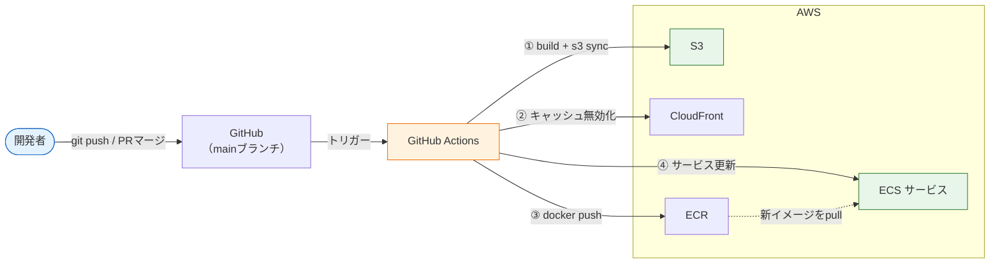
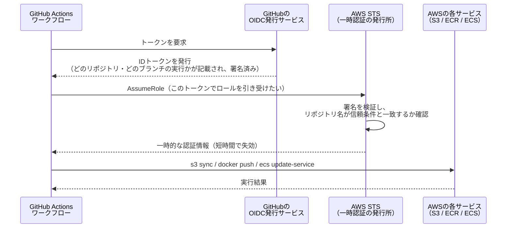
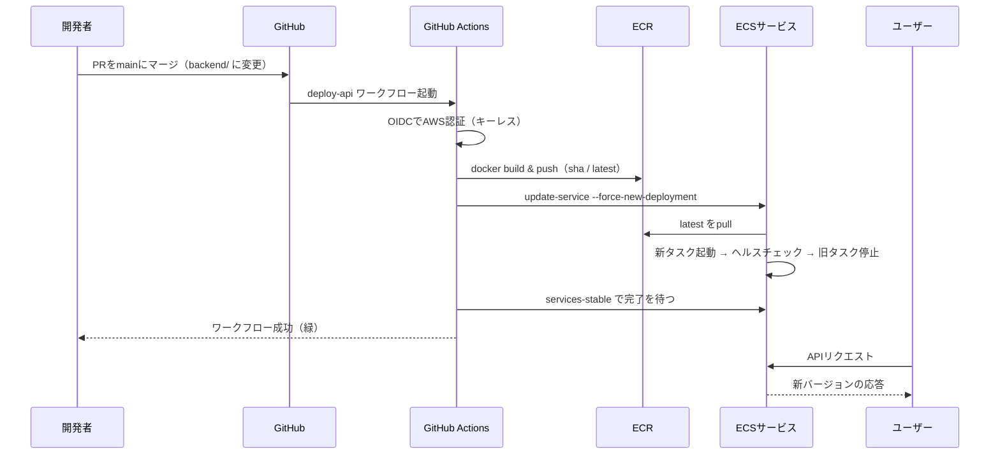

# CI/CDから自動デプロイ

このセクションの仕上げです。ここまでのデプロイは、ビルド・`aws s3 sync`・`docker push`・サービス更新と、すべて手作業でした。手作業のデプロイは面倒なだけでなく、手順の抜けや打ち間違いという事故の温床です。[CI/CD](/cicd/)のセクションで学んだGitHub Actionsを使い、**mainブランチへのpushをきっかけに、フロントエンドとAPIが自動で本番に反映される**仕組みを作ります。

鍵になるのが、GitHub ActionsにAWSの操作を許す**認証**です。アクセスキーを使わない現代の標準方式 **OIDC（キーレス認証）** を学びます。

## 学習目標

- CI/CDからAWSへの認証に、アクセスキーではなくOIDCを使う理由を説明できる
- OIDCによる一時認証情報の発行の流れをシーケンス図で説明できる
- CDKでGitHub Actions用のIAMロールを定義できる
- フロントエンド（S3 sync + CloudFront無効化）の自動デプロイを構築できる
- API（ECR push + ECSサービス更新）の自動デプロイを構築できる

## 完成形: pushから反映までの全体像

最初に、これから作る流れの全体像を見ておきます。



フロントエンドの変更なら①②、APIの変更なら③④が走ります。やることは[これまで手で打ってきたコマンド](/aws/s3_cloudfront/)そのものです。**CI/CDとは、手作業の手順をコード（ワークフロー）に書き写すこと**——[CI/CDとは何か](/cicd/what_is_cicd/)で学んだこの考え方を、いよいよデプロイに適用します。

> **料金に関する注意**
>
> このページで増える費用はわずかです。GitHub Actionsはパブリックリポジトリなら無料（プライベートでも月2,000分の無料枠）、AWS側はCloudFrontの無効化（月1,000パスまで無料）とECRの保存量（[ライフサイクルルール](/aws/ecr_ecs/)で最新5個に制限済み）程度です。
>
> ただし、自動デプロイの前提として**ApiStack等が起動している必要がある**ため、ALB・Fargate・RDSの時間課金（→ 各ページの注意）は引き続き発生します。動作確認を終えたら `cdk destroy` を忘れずに。OIDCプロバイダとIAMロール自体は**無料**なので、残しておいて構いません。
>
> なお、このページで作るCicdStackはFrontendStackやEcrStackのリソースを参照（クロススタック参照）します。スタックを削除する場合は、**参照している CicdStack を先に destroy してから FrontendStack / EcrStack を削除**してください。逆の順序では「Export ... is in use」というエラーで削除に失敗します。

## なぜアクセスキーを使わないのか — OIDCの仕組み

素朴に考えると、「IAMユーザーのアクセスキーを発行してGitHubのSecretsに保存し、Actionsから使う」方法が思い浮かびます。実際、昔はそれが普通でした。しかしこの方式には構造的な弱点があります。

- アクセスキーは**無期限に有効**な「合鍵」であり、漏れたら無効化するまで使われ放題
- GitHubのSecretsに長期間置かれ続け、漏えいの機会（ログへの混入、設定ミス）が増える
- 定期的な手動ローテーション（鍵の取り替え）が必要だが、忘れられがち

**OIDC（OpenID Connect、オープンアイディーコネクト）** はこれを解決します。発想の転換はこうです——「合鍵を渡す」のではなく、「**GitHubが発行する身分証明書を、AWSがその場で検査して、数分〜1時間だけ有効な入館証を渡す**」。

具体的な流れをシーケンス図で見ます。



ポイントは2つです。

1. **長期の秘密がどこにも保存されない。** IDトークンはワークフロー実行のたびにその場で発行され、得られる認証情報も短時間で失効します。漏えいしても被害が時間で区切られます
2. **「誰に貸すか」をAWS側で厳密に縛れる。** IAMロールの信頼条件に「`repo:自分のアカウント/リポジトリ名` のトークンに限る」と書くため、他人のリポジトリからは同じ仕組みでも引き受けられません

GitHub Actions側でこの一連の処理をやってくれるのが、公式アクション **`aws-actions/configure-aws-credentials`** です。

## ステップ1: CDKでOIDCプロバイダとロールを作る

AWS側の受け入れ準備をCDKで書きます。必要なのは、(1) 「GitHubのトークン発行者を信頼する」という**OIDCプロバイダ**の登録、(2) ワークフローが引き受ける**IAMロール**と権限、の2つです。

まず、CicdStackから参照できるよう、FrontendStackのバケットとディストリビューションを公開プロパティにしておきます。

**`lib/frontend-stack.ts`**（変更箇所のみ）

```typescript
export class FrontendStack extends cdk.Stack {
  public readonly bucket: s3.Bucket;
  public readonly distribution: cloudfront.Distribution;

  constructor(scope: Construct, id: string, props?: cdk.StackProps) {
    super(scope, id, props);

    this.bucket = new s3.Bucket(this, 'FrontendBucket', {
      // （中身は変更なし）
```

（`const bucket = ...` を `this.bucket = ...` に、`const distribution = ...` を `this.distribution = ...` に変え、ファイル内の参照も合わせて直してください。）

続いて本体です。

**`lib/cicd-stack.ts`**

```typescript
import * as cdk from 'aws-cdk-lib';
import { Construct } from 'constructs';
import * as iam from 'aws-cdk-lib/aws-iam';
import * as s3 from 'aws-cdk-lib/aws-s3';
import * as cloudfront from 'aws-cdk-lib/aws-cloudfront';
import * as ecr from 'aws-cdk-lib/aws-ecr';

interface CicdStackProps extends cdk.StackProps {
  githubRepo: string; // 例: 'your-name/sns-app'
  bucket: s3.Bucket;
  distribution: cloudfront.Distribution;
  repository: ecr.Repository;
}

export class CicdStack extends cdk.Stack {
  constructor(scope: Construct, id: string, props: CicdStackProps) {
    super(scope, id, props);

    // ① GitHubのOIDC発行者を信頼登録する
    const provider = new iam.OpenIdConnectProvider(this, 'GitHubOidcProvider', {
      url: 'https://token.actions.githubusercontent.com',
      clientIds: ['sts.amazonaws.com'],
    });

    // ② GitHub Actionsが引き受けるロール
    const deployRole = new iam.Role(this, 'GitHubActionsRole', {
      roleName: 'github-actions-deploy',
      assumedBy: new iam.WebIdentityPrincipal(
        provider.openIdConnectProviderArn,
        {
          StringEquals: {
            'token.actions.githubusercontent.com:aud': 'sts.amazonaws.com',
          },
          StringLike: {
            'token.actions.githubusercontent.com:sub': `repo:${props.githubRepo}:*`,
          },
        },
      ),
    });

    // ③ フロントエンドのデプロイ権限
    props.bucket.grantReadWrite(deployRole);
    deployRole.addToPolicy(
      new iam.PolicyStatement({
        actions: ['cloudfront:CreateInvalidation'],
        resources: [
          `arn:aws:cloudfront::${this.account}:distribution/${props.distribution.distributionId}`,
        ],
      }),
    );

    // ④ APIのデプロイ権限
    props.repository.grantPullPush(deployRole);
    deployRole.addToPolicy(
      new iam.PolicyStatement({
        actions: ['ecs:UpdateService', 'ecs:DescribeServices'],
        resources: ['*'],
      }),
    );

    new cdk.CfnOutput(this, 'DeployRoleArn', { value: deployRole.roleArn });
  }
}
```

**コード解説**

- ① `OpenIdConnectProvider` … 「`token.actions.githubusercontent.com`（GitHubのトークン発行サービス）が発行したトークンを、このアカウントで検証対象として受け付ける」という登録です。アカウントに1つあればよく、`clientIds: ['sts.amazonaws.com']` はトークンの宛先（audience）の標準値です
- ② `assumedBy: new iam.WebIdentityPrincipal(...)` … このロールを「Webアイデンティティ（外部の身分証明）で引き受けられる」ようにし、**信頼条件**を付けます
- ② `StringLike: { ...:sub: 'repo:your-name/sns-app:*' }` … トークンの `sub`（subject、主体）には `repo:リポジトリ名:ref:ブランチ...` という形式で「どこからの実行か」が入っています。**自分のリポジトリからのトークンに限定**する、OIDCの安全性の核心部分です。`*` の部分を `ref:refs/heads/main` まで絞れば「mainブランチからのみ」にもできます
- ③ `props.bucket.grantReadWrite(deployRole)` … CDKの**grantメソッド**。`s3:PutObject` や `s3:DeleteObject` などsyncに必要な権限一式を、対象バケット限定でロールに付与します。1行でIAMポリシーが書ける、CDKらしい便利機能です
- ③ `cloudfront:CreateInvalidation` … キャッシュ無効化の権限を、対象ディストリビューション限定で許可します
- ④ `repository.grantPullPush(deployRole)` … ECRへのpush/pullに必要な権限一式を、`sns-api` リポジトリ限定で付与します
- ④ `ecs:UpdateService` … サービスに「新しいデプロイを開始せよ」と指示する権限です（リソース名が自動生成のため `'*'` にしていますが、慣れたらサービスのARNに絞るのが理想です）
- 全体として、**このロールにできることは「デプロイに必要な操作」だけ**です。[AWSとは何か](/aws/what_is_aws/)で触れた最小権限の原則を、機械用のロールで実践しています

`bin/sns-infra.ts` に登録してデプロイします。

```typescript
import { CicdStack } from '../lib/cicd-stack';

new CicdStack(app, 'CicdStack', {
  githubRepo: 'your-name/sns-app', // 自分のリポジトリに変更
  bucket: frontendStack.bucket,
  distribution: frontendStack.distribution,
  repository: ecrStack.repository,
});
```

（`new FrontendStack(...)` の戻り値を `const frontendStack = ...` で受けるように変更してください。）

```bash
pnpm exec cdk deploy CicdStack
```

```
Outputs:
CicdStack.DeployRoleArn = arn:aws:iam::123456789012:role/github-actions-deploy
```

このロールARNを控えます。ワークフローから指定する宛先です。

## ステップ2: フロントエンドの自動デプロイ

リポジトリの値をワークフローに直書きしないよう、GitHubの**Variables**（リポジトリの Settings → Secrets and variables → Actions → Variables）に次の4つを登録しておきます。値は各スタックの `CfnOutput` で表示されたものです。

| 変数名 | 値の例 |
|---|---|
| `AWS_DEPLOY_ROLE` | `arn:aws:iam::123456789012:role/github-actions-deploy` |
| `FRONTEND_BUCKET` | `frontendstack-frontendbucket1234-abcdefgh` |
| `DISTRIBUTION_ID` | `E1ABCDEFGHIJK` |
| `ECR_REPOSITORY` | `sns-api` |

この4つの変数は、このページの2本のワークフローだけでなく、[SNS開発の全体デプロイ](/sns/nestjs/deploy/)でも同じ名前のまま使い回します。

ワークフローを書きます。YAMLの基本文法は[GitHub Actions基礎](/cicd/github_actions_basics/)の復習です。

**`.github/workflows/deploy-frontend.yml`**


```yaml
name: deploy-frontend

on:
  push:
    branches: [main]
    paths:
      - "frontend/**"
      - ".github/workflows/deploy-frontend.yml"

permissions:
  id-token: write
  contents: read

jobs:
  deploy:
    runs-on: ubuntu-latest
    steps:
      - uses: actions/checkout@v4

      - uses: pnpm/action-setup@v4
        with:
          version: 9

      - uses: actions/setup-node@v4
        with:
          node-version: '20'
          cache: 'pnpm'
          cache-dependency-path: frontend/pnpm-lock.yaml

      - name: ビルド
        working-directory: frontend
        run: |
          pnpm install --frozen-lockfile
          pnpm run build

      - name: AWS認証（OIDC）
        uses: aws-actions/configure-aws-credentials@v4
        with:
          role-to-assume: ${{ vars.AWS_DEPLOY_ROLE }}
          aws-region: ap-northeast-1

      - name: S3へ同期
        run: aws s3 sync frontend/dist "s3://${{ vars.FRONTEND_BUCKET }}" --delete

      - name: CloudFrontのキャッシュ無効化
        run: |
          aws cloudfront create-invalidation \
            --distribution-id "${{ vars.DISTRIBUTION_ID }}" \
            --paths "/*"
```


**コード解説**

- `on.push.branches: [main]` + `paths: "frontend/**"` … mainブランチに**フロントエンドのファイルが変更されたとき**だけ起動します。リポジトリは `frontend/` と `backend/` を持つモノレポ構成（→ SNS開発の[プロジェクトセットアップ](/sns/nestjs/project_setup/)）を想定しています。ワークフローファイル自身も `paths` に含めているのは、ワークフローを修正したときにも動作確認できるようにするためです（→ [CIパイプライン](/cicd/ci_pipeline/)で学んだ定石です）
- `permissions: id-token: write` … **OIDCの必須設定**です。ワークフローに「IDトークンを発行してもらう」許可を与えます。これがないと認証ステップが失敗します。`contents: read` はcheckout用です
- `pnpm/action-setup@v4` … ランナーにpnpm（バージョン9）をインストールします。`actions/setup-node` より**先に**置くのがポイントで、こうすると次のステップのキャッシュ設定がpnpmを認識できます
- `actions/setup-node@v4` … Node.js 20を用意し、`cache: 'pnpm'` でpnpmのキャッシュを効かせます（→ [CIパイプライン](/cicd/ci_pipeline/)と同じ書き方です）
- `pnpm install --frozen-lockfile && pnpm run build` … ロックファイルどおりにクリーンインストールしてビルド。成果物が `frontend/dist` にできます
- `aws-actions/configure-aws-credentials@v4` … 先ほどのシーケンス図の処理（トークン取得 → AssumeRole → 一時認証情報の設定）をすべて行う公式アクションです。`role-to-assume` に引き受けるロールのARNを渡します。**アクセスキーはどこにも書いていません**
- 最後の2ステップ … [S3 + CloudFront](/aws/s3_cloudfront/)で手で打っていた「sync + invalidation」そのものです。認証済みの状態なので、ローカルと同じコマンドがそのまま動きます

`frontend/` 配下に変更を加えてmainにpush（またはPRをマージ）してみてください。Actionsタブで進行を確認し、完了後にCloudFrontのURLを開くと変更が反映されているはずです。

## ステップ3: APIの自動デプロイ

API側は「イメージをビルドしてECRにpush → ECSサービスに新しいデプロイを指示」です。

その前に1つ準備があります。これまでタスク定義はタグ `v1` を固定参照していましたが、自動デプロイでは**タグ `latest` を参照し、pushのたびに `latest` を上書きする**方式に切り替えます。`lib/api-stack.ts` を変更し、あわせてワークフローから名前で参照できるようクラスター名・サービス名を固定します。

```typescript
    const cluster = new ecs.Cluster(this, 'ApiCluster', {
      vpc: props.vpc,
      clusterName: 'sns-api-cluster',
    });

    this.service = new ecsPatterns.ApplicationLoadBalancedFargateService(
      this,
      'ApiService',
      {
        cluster,
        serviceName: 'sns-api-service',
        // （中略）
        taskImageOptions: {
          image: ecs.ContainerImage.fromEcrRepository(props.repository, 'latest'),
          // （以下変更なし）
```

`latest` タグのイメージを一度pushしてから（[ECRのページ](/aws/ecr_ecs/)の手順でタグを `latest` に）、`pnpm exec cdk deploy ApiStack` で反映しておきます。

**`.github/workflows/deploy-api.yml`**


```yaml
name: deploy-api

on:
  push:
    branches: [main]
    paths:
      - "backend/**"
      - ".github/workflows/deploy-api.yml"

permissions:
  id-token: write
  contents: read

jobs:
  deploy:
    runs-on: ubuntu-latest
    steps:
      - uses: actions/checkout@v4

      - name: AWS認証（OIDC）
        uses: aws-actions/configure-aws-credentials@v4
        with:
          role-to-assume: ${{ vars.AWS_DEPLOY_ROLE }}
          aws-region: ap-northeast-1

      - name: ECRへログイン
        id: ecr-login
        uses: aws-actions/amazon-ecr-login@v2

      - name: イメージをビルドしてpush
        env:
          REGISTRY: ${{ steps.ecr-login.outputs.registry }}
          REPOSITORY: ${{ vars.ECR_REPOSITORY }}
        run: |
          docker build \
            -t "$REGISTRY/$REPOSITORY:${{ github.sha }}" \
            -t "$REGISTRY/$REPOSITORY:latest" \
            backend
          docker push --all-tags "$REGISTRY/$REPOSITORY"

      - name: ECSサービスを更新
        run: |
          aws ecs update-service \
            --cluster sns-api-cluster \
            --service sns-api-service \
            --force-new-deployment

      - name: デプロイ完了を待つ
        run: |
          aws ecs wait services-stable \
            --cluster sns-api-cluster \
            --services sns-api-service
```


**コード解説**

- `aws-actions/amazon-ecr-login@v2` … [手作業](/aws/ecr_ecs/)で打っていた `aws ecr get-login-password | docker login ...` を行う公式アクションです。`id: ecr-login` を付けて、出力（レジストリのURL）を後続ステップで使います
- `docker build -t ...:${{ github.sha }} -t ...:latest` … 1つのイメージに**2つのタグ**を付けます。`github.sha` はトリガーとなったコミットのハッシュで、「どのコミットのイメージか」を後から特定できるようにする実務の定石です。`latest` はECSが参照するタグです
- `--platform` 指定が不要な点に注目 … GitHubのランナー（`ubuntu-latest`）はamd64なので、Apple Siliconで必要だった指定が要りません。**ビルド環境が常に同じ**であることもCI/CDの利点です
- `aws ecs update-service --force-new-deployment` … 「同じタスク定義のまま、新しいタスクを起動し直せ」という指示です。タスク定義の `latest` が指す実体が新しくなっているため、新イメージでタスクが起動し、ヘルスチェック通過後に旧タスクが停止する**ローリング更新**が行われます
- `aws ecs wait services-stable` … ローリング更新の完了（新タスクがhealthyで安定）まで待ちます。これがないと「ワークフローは緑だが、デプロイはまだ途中（あるいは失敗）」が起きえます。失敗時はワークフローも失敗になり、気づけます

> **`latest` 方式の割り切りについて:** この方式は構成がシンプルな反面、「どのバージョンが動いているか」がタグから読み取りにくく、ロールバックは古いイメージを `latest` にpushし直す操作になります。実務では、コミットSHAタグで**新しいタスク定義のリビジョンを毎回登録する**方式（`aws-actions/amazon-ecs-deploy-task-definition` アクション）が主流です。仕組みを理解した今なら、公式ドキュメントを読んで移行できるはずです。

## 全体の流れをもう一度

2本のワークフローが揃いました。APIの変更がユーザーに届くまでを、シーケンス図で通して確認します。



[CI/CDとは何か](/cicd/what_is_cicd/)で見た「マージしたら自動で本番へ」という絵が、これで現実になりました。テスト（CI）→ デプロイ（CD）を直列につなげば、「テストが通ったときだけデプロイする」パイプラインになります。[CIパイプライン](/cicd/ci_pipeline/)で作ったジョブを `needs:` で前段に置くのが定石です。

### 発展: cdk deploy自体の自動化

アプリだけでなく**インフラの変更**も自動化できます。考え方は同じで、「PRで `cdk diff` の結果をコメントし、mainマージで `cdk deploy --require-approval never` を実行する」ワークフローを組みます。ただし、デプロイロールにCloudFormationやIAMを操作する強い権限が必要になるため、権限設計がぐっと難しくなります。まずはアプリのCD（このページの範囲）を確実に運用し、インフラのCDは次の段階の課題としてください。

## 理解度チェック

**Q1. アクセスキーをGitHub Secretsに保存する方式と比べて、OIDC方式が安全なのはなぜですか。理由を2つ挙げてください。**

<details markdown="1">
<summary>解答を見る</summary>

- **長期の秘密がどこにも保存されない。** IDトークンは実行のたびに発行され、得られる認証情報も短時間で失効するため、漏えいしても被害が時間で区切られる（アクセスキーは無効化するまで永続的に有効）
- **使える主体をAWS側の信頼条件で縛れる。** ロールの条件で `sub` を `repo:自分のリポジトリ:*` に限定するため、他のリポジトリからは引き受けられない
- 手動の鍵ローテーションが不要になる、という運用面の利点もあります

</details>

**Q2. ワークフローの `permissions: id-token: write` は何のための設定ですか。**

<details markdown="1">
<summary>解答を見る</summary>

ワークフローがGitHubのOIDC発行サービスから**IDトークンを発行してもらうための許可**です。`aws-actions/configure-aws-credentials` はこのトークンを使ってAWSのロールを引き受けるため、この設定がないと認証ステップが失敗します。OIDC方式のワークフローでは必須のお約束です。

</details>

**Q3. IAMロールの信頼条件の `'token.actions.githubusercontent.com:sub': 'repo:your-name/sns-app:*'` を書き忘れる（または `*` だけにする）と、何が起きえますか。**

<details markdown="1">
<summary>解答を見る</summary>

**世界中の誰のGitHubリポジトリからでも**このロールを引き受けられる状態になりえます。GitHubのOIDCプロバイダを信頼すること自体は「GitHub Actions全体」を信頼することなので、`sub` 条件でリポジトリを限定して初めて「自分のリポジトリだけ」に絞られます。OIDC設定で最も重要な1行です。

</details>

**Q4. `aws ecs update-service --force-new-deployment` を実行すると何が起きますか。なぜ新しいイメージで動き出すのですか。**

<details markdown="1">
<summary>解答を見る</summary>

サービスが同じタスク定義のまま**新しいタスクを起動し直し**、ヘルスチェック通過後に旧タスクを止めるローリング更新が始まります。タスク定義はタグ `latest` を参照しており、直前のpushで `latest` が指す実体（イメージ）が新しくなっているため、新タスクは新イメージをpullして起動します。

</details>

**Q5. 「デプロイ完了を待つ」ステップ（`aws ecs wait services-stable`）を省略すると、どんな問題がありますか。**

<details markdown="1">
<summary>解答を見る</summary>

`update-service` は「更新の開始」を指示するだけで即座に戻るため、待たないと**ローリング更新がまだ進行中（あるいは新タスクが起動に失敗して切り戻されている）でもワークフローは成功（緑）**になります。`services-stable` を待つことで、デプロイの実際の成否がワークフローの成否に反映され、失敗に気づけるようになります。

</details>

## セルフレビュー

- [ ] OIDCの認証の流れ（トークン発行→AssumeRole→一時認証情報）をシーケンス図で説明できる
- [ ] アクセスキー方式の弱点を2つ以上挙げられる
- [ ] CicdStackの信頼条件（aud / sub）の意味をそれぞれ説明できる
- [ ] grantメソッド（grantReadWrite / grantPullPush）が何をしているか説明できる
- [ ] フロントエンドのデプロイ（sync + invalidation）をワークフローとして書ける
- [ ] APIのデプロイ（ECR push + update-service + wait）をワークフローとして書ける
- [ ] `paths:` によるモノレポでのワークフローの出し分けを説明できる
- [ ] 動作確認後、時間課金のスタックを `cdk destroy` した

## 次のステップ

おめでとうございます。これでAWSデプロイのセクションは完了です。「クラウドの概念 → 各サービスの役割 → IaC → CDKでの構築 → 自動デプロイ」と積み上げ、**コードをpushすれば本番に反映される**一連の仕組みを自分の手で作れるようになりました。

[SNS開発](/sns/)で作ったアプリを本番構成へ広げるときは、このセクションの構成一式（S3/CloudFront + ECS + RDS + SES + CI/CD）を[全体デプロイ](/sns/nestjs/deploy/)で適用します。`sns-infra` プロジェクトと2本のワークフローは、そのときの土台になります。大切に取っておいてください。
