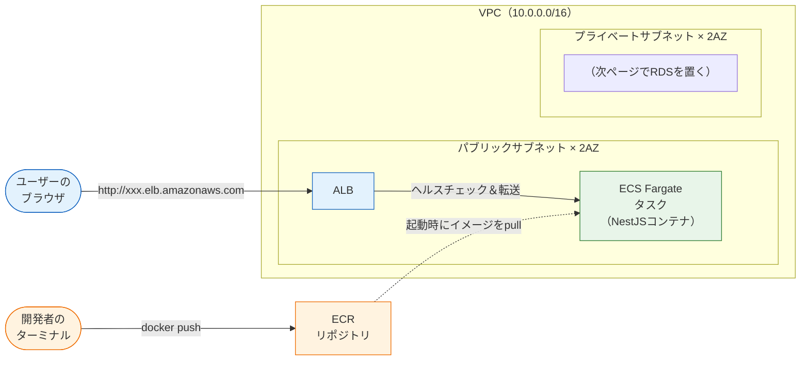
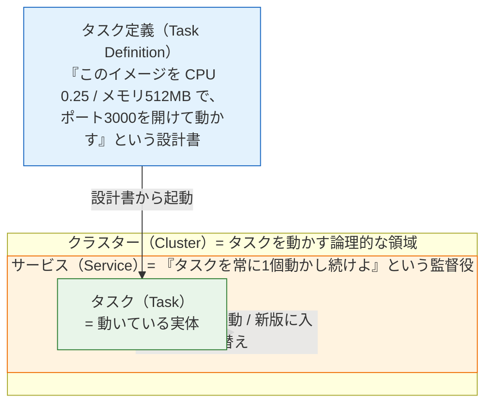

# ECR + ECS Fargate — APIのデプロイ

フロントエンドに続き、このページではバックエンド——NestJSのAPIサーバーを本番で動かします。[Docker基礎](/docker/dockerfile/)で書いたDockerfileからイメージをビルドし、**ECRに登録（push）し、ECS Fargateで実行し、ALBで公開する**という、コンテナデプロイの王道構成をCDKで作ります。

このセクションで最も部品の多いページです。最初に概念と全体像をしっかり固めてから、コードに進みます。

## 学習目標

- ECSの基本概念（クラスター・タスク定義・タスク・サービス）の関係を図で説明できる
- DockerイメージをECRにpushする手順を実行できる
- CDKでVPC・ALB・Fargateサービスを構築し、APIを公開できる
- L3コンストラクト（パターン）が何を自動構築しているかを説明できる
- 同じ構成のTerraformコードを読んで、対応関係を説明できる

## 構成の全体像

今回作る構成です。[主要サービスの全体像](/aws/core_services/)の図の右半分（RDSを除く）にあたります。



流れは2系統です。**配置の系統**（開発者がイメージをECRへpush → タスク起動時にFargateがpull）と、**リクエストの系統**（ユーザー → ALB → タスク）。VPCの中にALBとタスクを置き、次ページのRDS用にプライベートサブネットも先に確保しておきます。

## ECSの基本概念

[主要サービスの全体像](/aws/core_services/)で予告した用語を、関係図で整理します。



- **タスク定義** … 「どのイメージを、どんなリソース（CPU/メモリ）と設定で動かすか」の**設計書**。Docker Composeの `compose.yaml` のサービス定義に近い役割です（→ [Docker Compose](/docker/docker_compose/)）
- **タスク** … 設計書から起動された**実行中の実体**（1つのタスクに1つ以上のコンテナ）。`docker run` で生まれるコンテナに相当します
- **サービス** … 「タスクを指定数、動かし**続ける**」ことを保証する監督役。タスクが異常終了すれば新しいタスクを起動し、新しいタスク定義への**ローリング更新**（無停止入れ替え）も行います
- **クラスター** … タスクやサービスを収容する論理的な領域です

Fargateを使うので、「タスクをどの物理サーバーで動かすか」は考えなくて構いません。CPUとメモリの量を宣言すれば、AWSが実行場所を用意します。

> **料金に関する注意**
>
> このページで作るリソースには**時間課金**が含まれます（東京リージョンの概算）。
>
> - **ALB** … 1時間あたり約3〜4円（+ 処理量に応じた加算）
> - **Fargateタスク**（0.25vCPU / 0.5GB） … 1時間あたり約2〜3円
> - 合計で**1日つけっぱなしで150円前後、1か月放置で4,000〜5,000円規模**になりえます
>
> ECR・VPC本体はこの構成ではほぼ無料です（NAT Gatewayを作らない理由は後述します）。金額は変動するため正確には公式料金ページを確認してください。**作業を終えたら必ずページ末尾の手順で削除**してください。[予算アラート](/aws/what_is_aws/)の設定が前提です。

## ステップ1: ECRリポジトリを作り、イメージをpushする

ECSがpullする先のECRリポジトリを先に作ります。ECRでは、1つのアプリのイメージ群（タグ違い）を**リポジトリ**という単位で管理します。

**`lib/ecr-stack.ts`**

```typescript
import * as cdk from 'aws-cdk-lib';
import { Construct } from 'constructs';
import * as ecr from 'aws-cdk-lib/aws-ecr';

export class EcrStack extends cdk.Stack {
  public readonly repository: ecr.Repository;

  constructor(scope: Construct, id: string, props?: cdk.StackProps) {
    super(scope, id, props);

    this.repository = new ecr.Repository(this, 'ApiRepository', {
      repositoryName: 'sns-api',
      removalPolicy: cdk.RemovalPolicy.DESTROY,
      emptyOnDelete: true,
      lifecycleRules: [{ maxImageCount: 5 }],
    });

    new cdk.CfnOutput(this, 'RepositoryUri', {
      value: this.repository.repositoryUri,
    });
  }
}
```

**コード解説**

- `public readonly repository: ecr.Repository;` … 作ったリポジトリを**クラスのプロパティとして公開**しています。後でAPIスタックがこのリポジトリを参照するためです（スタック間の値の受け渡しは、TypeScriptの普通のプロパティ参照で書けます。これもCDKの利点です）
- `repositoryName: 'sns-api'` … リポジトリ名を明示します。push時のコマンドで使うため、自動生成名より扱いやすくしています
- `removalPolicy` / `emptyOnDelete: true` … destroy時に、中のイメージごとリポジトリを削除する学習用設定です（S3バケットの `autoDeleteObjects` に相当）
- `lifecycleRules: [{ maxImageCount: 5 }]` … 古いイメージを自動削除し、**最新5個だけ残す**ルールです。pushを繰り返してもストレージ課金が増え続けないようにします
- `CfnOutput` … pushコマンドで使うリポジトリURI（`123456789012.dkr.ecr.ap-northeast-1.amazonaws.com/sns-api`）を出力します

`bin/sns-infra.ts` に登録してデプロイします（書き方は後ほどまとめて示します）。

```bash
pnpm exec cdk deploy EcrStack
```

### イメージをビルドしてpushする

NestJSプロジェクト（[Dockerfileの書き方](/docker/dockerfile/)で作成したDockerfileがある前提）に移動し、次の4コマンドを実行します。`123456789012` は自分のアカウントIDに置き換えてください。

```bash
cd ../my-nest-app

# ① ECRにログインする
aws ecr get-login-password --region ap-northeast-1 \
  | docker login --username AWS --password-stdin 123456789012.dkr.ecr.ap-northeast-1.amazonaws.com

# ② イメージをビルドする（タグ: v1）
docker build --platform linux/amd64 -t sns-api:v1 .

# ③ ECR用の名前を付ける
docker tag sns-api:v1 123456789012.dkr.ecr.ap-northeast-1.amazonaws.com/sns-api:v1

# ④ pushする
docker push 123456789012.dkr.ecr.ap-northeast-1.amazonaws.com/sns-api:v1
```

```
v1: digest: sha256:8f3a... size: 1572
```

**コード解説**

- ① `aws ecr get-login-password | docker login ...` … ECRは認証付きのレジストリです。AWS CLIで一時パスワードを発行し、パイプで `docker login` に渡しています。ユーザー名は固定で `AWS` です
- ② `--platform linux/amd64` … **Apple Silicon（M1/M2/M3）のMacで必須の指定**です。Macで普通にビルドするとARM用イメージになり、amd64で動かすFargate上で起動に失敗します（アーキテクチャの不一致は本番デプロイの定番ハマりどころです）
- ③ `docker tag` … ローカルのイメージに「どのレジストリの・どのリポジトリの・何バージョンか」を表す完全名を付けます。`リポジトリURI:タグ` という形式です
- ④ `docker push` … ECRへアップロードします。Docker Hubへのpushと同じ操作です

ECRのコンソールで `sns-api` リポジトリを開き、`v1` タグのイメージが登録されていることを確認してください。

## ステップ2: VPCを作る

ALB・タスク（・次ページのRDS）を収容するネットワークです。

**`lib/network-stack.ts`**

```typescript
import * as cdk from 'aws-cdk-lib';
import { Construct } from 'constructs';
import * as ec2 from 'aws-cdk-lib/aws-ec2';

export class NetworkStack extends cdk.Stack {
  public readonly vpc: ec2.Vpc;

  constructor(scope: Construct, id: string, props?: cdk.StackProps) {
    super(scope, id, props);

    this.vpc = new ec2.Vpc(this, 'SnsVpc', {
      maxAzs: 2,
      natGateways: 0,
      subnetConfiguration: [
        {
          name: 'public',
          subnetType: ec2.SubnetType.PUBLIC,
          cidrMask: 24,
        },
        {
          name: 'isolated',
          subnetType: ec2.SubnetType.PRIVATE_ISOLATED,
          cidrMask: 24,
        },
      ],
    });
  }
}
```

**コード解説**

- `maxAzs: 2` … 2つのAZ（可用性ゾーン）にまたがるVPCにします。ALBは最低2AZを要求するためです（→ [AWSとは何か](/aws/what_is_aws/)のAZの説明）
- `natGateways: 0` … **コスト上の重要判断**です。NAT Gatewayは「プライベートサブネットからインターネットへ出る」ための装置ですが、1台で**月約6,000円**かかります。本構成ではタスクをパブリックサブネットに置いてNATを不要にします（実務の本番では、タスクをプライベートに置きNATを使う構成が一般的です。学習用のコストとのトレードオフです）
- `subnetConfiguration` … サブネットの設計図です。`PUBLIC`（インターネットと直接通信可）と `PRIVATE_ISOLATED`（インターネットと一切通信しない隔離区画。次ページでRDSを置く）を、各AZに1つずつ作ります
- `cidrMask: 24` … 各サブネットのIPアドレス範囲の広さ（/24 = 256個分）です

この十数行で、CDKはVPC本体・サブネット4つ・インターネットゲートウェイ・ルートテーブル一式（合計20個近いリソース）を適切な定番設定で生成します。

## ステップ3: ALB + Fargateサービスを作る

いよいよ本体です。ここでは**L3コンストラクト（パターン）**である `ApplicationLoadBalancedFargateService` を使います。名前のとおり「ALB付きFargateサービス」の定石一式を1つの部品にしたものです。

**`lib/api-stack.ts`**

```typescript
import * as cdk from 'aws-cdk-lib';
import { Construct } from 'constructs';
import * as ec2 from 'aws-cdk-lib/aws-ec2';
import * as ecs from 'aws-cdk-lib/aws-ecs';
import * as ecr from 'aws-cdk-lib/aws-ecr';
import * as ecsPatterns from 'aws-cdk-lib/aws-ecs-patterns';

interface ApiStackProps extends cdk.StackProps {
  vpc: ec2.Vpc;
  repository: ecr.Repository;
}

export class ApiStack extends cdk.Stack {
  public readonly service: ecsPatterns.ApplicationLoadBalancedFargateService;

  constructor(scope: Construct, id: string, props: ApiStackProps) {
    super(scope, id, props);

    const cluster = new ecs.Cluster(this, 'ApiCluster', {
      vpc: props.vpc,
    });

    this.service = new ecsPatterns.ApplicationLoadBalancedFargateService(
      this,
      'ApiService',
      {
        cluster,
        cpu: 256,
        memoryLimitMiB: 512,
        desiredCount: 1,
        taskImageOptions: {
          image: ecs.ContainerImage.fromEcrRepository(props.repository, 'v1'),
          containerPort: 3000,
          environment: {
            NODE_ENV: 'production',
          },
        },
        publicLoadBalancer: true,
        assignPublicIp: true,
        taskSubnets: { subnetType: ec2.SubnetType.PUBLIC },
      },
    );

    this.service.targetGroup.configureHealthCheck({
      path: '/',
      healthyHttpCodes: '200',
    });

    new cdk.CfnOutput(this, 'ApiUrl', {
      value: `http://${this.service.loadBalancer.loadBalancerDnsName}`,
    });
  }
}
```

**コード解説**

- `interface ApiStackProps extends cdk.StackProps { vpc; repository; }` … このスタックが外から受け取る値を**TypeScriptのインターフェースで型定義**しています。VPCとECRリポジトリは他のスタックで作ったものを受け取ります。[TypeScript基礎](/typescript//)のオブジェクト型の知識がそのまま活きる場面です
- `new ecs.Cluster(this, 'ApiCluster', { vpc })` … タスクを収容するクラスターを、受け取ったVPCの中に作ります
- `new ecsPatterns.ApplicationLoadBalancedFargateService(...)` … **L3パターンの本体**。この1つで、タスク定義・Fargateサービス・ALB・ターゲットグループ・リスナー・セキュリティグループ・IAMロール（ECRからpullする権限を含む）がまとめて構築されます
- `cpu: 256, memoryLimitMiB: 512` … タスクのリソース。0.25vCPU / 512MBという最小クラスの構成です（cpuは1024 = 1vCPUの単位）
- `desiredCount: 1` … サービスが維持するタスク数。学習用に1個です（本番では2以上にしてAZ障害に備えます）
- `image: ecs.ContainerImage.fromEcrRepository(props.repository, 'v1')` … ステップ1でpushした `sns-api:v1` をタスクのイメージに指定します
- `containerPort: 3000` … NestJSが listen するポート（→ [NestJSのセットアップ](/backend/setup/)）。ALBはここへリクエストを転送します
- `environment` … コンテナに渡す環境変数です。データベース接続情報は[次ページ](/aws/rds/)でここに追加します
- `publicLoadBalancer: true` … ALBをパブリックサブネットに置き、インターネットからアクセス可能にします
- `assignPublicIp: true` と `taskSubnets: PUBLIC` … タスクをパブリックサブネットに置き、パブリックIPを付与します。これにより**NAT Gatewayなしで**ECRからのイメージpullやSESへの通信ができます（前述のコスト判断とセットの設定です）
- `configureHealthCheck({ path: '/' })` … ALBがタスクの生死判定に使う**ヘルスチェック**のパスです。NestJSの雛形は `GET /` に200で応答するのでこれで動きます。実務では `/health` のような専用エンドポイントを作るのが定石です
- `CfnOutput` … 公開URL（ALBのDNS名）を出力します

> このL3を「便利な魔法」で終わらせないことが大切です。deploy後にコンソールで、EC2のページ（ロードバランサー・ターゲットグループ）とECSのページ（クラスター・サービス・タスク定義）を見て回り、**何が作られたのか**を自分の目で確認してください。後半のTerraform対訳例では、これらを全部自分の手で書きます。

### スタックをつなげてデプロイする

**`bin/sns-infra.ts`**

```typescript
#!/usr/bin/env node
import * as cdk from 'aws-cdk-lib';
import { FrontendStack } from '../lib/frontend-stack';
import { EcrStack } from '../lib/ecr-stack';
import { NetworkStack } from '../lib/network-stack';
import { ApiStack } from '../lib/api-stack';

const app = new cdk.App();

new FrontendStack(app, 'FrontendStack');

const ecrStack = new EcrStack(app, 'EcrStack');
const networkStack = new NetworkStack(app, 'NetworkStack');

new ApiStack(app, 'ApiStack', {
  vpc: networkStack.vpc,
  repository: ecrStack.repository,
});
```

**コード解説**

- スタックの戻り値を変数に受け、そのプロパティ（`networkStack.vpc` など）を次のスタックのpropsに渡しています。**スタック間の依存関係が、ただの変数の受け渡しとして表現できる**——これがCDK（汎用言語）の読みやすさです
- 依存の順序（Ecr/Network → Api）はCDKが自動で解決します

デプロイします。

```bash
pnpm exec cdk diff ApiStack
pnpm exec cdk deploy NetworkStack ApiStack
```

```
 ✅  NetworkStack
 ✅  ApiStack

Outputs:
ApiStack.ApiUrl = http://ApiSt-ApiSe-xxxx-1234567890.ap-northeast-1.elb.amazonaws.com
```

5分ほどでALBとタスクが立ち上がります。動作確認します。

```bash
curl http://ApiSt-ApiSe-xxxx-1234567890.ap-northeast-1.elb.amazonaws.com
```

```
Hello World!
```

NestJSがAWS上で応答しました。ECSコンソールでクラスター → サービス → タスクと辿り、タスクのステータスが `Running`、ターゲットグループのヘルスチェックが `healthy` になっていることも見ておきましょう。

### 新しいバージョンをデプロイするには

コードを変更したら、**新しいタグでpushし、タスク定義のタグを更新して再デプロイ**します。

1. `docker build` → `docker tag ...:v2` → `docker push ...:v2`
2. `api-stack.ts` の `fromEcrRepository(props.repository, 'v2')` に変更
3. `pnpm exec cdk deploy ApiStack`

サービスが新しいタスクを起動し、ヘルスチェック通過後に古いタスクを止める**ローリング更新**が行われます。この手作業の繰り返しは面倒なので、[CI/CDから自動デプロイ](/aws/deploy_from_cicd/)で自動化します。

## Terraformで書く場合

同じ構成のTerraform対訳例です（読解用。applyはしません）。CDKのL3が自動生成していた部品を**全部自分で書く**ことになるため、主要部分だけでもかなりの分量になります。VPCについては、Terraformの定番である**コミュニティモジュール**（再利用可能な部品集。CDKのコンストラクトに相当する仕組み）を使った形で示します。

**`main.tf`（対訳例・参考）**

```hcl
# ① ECRリポジトリ
resource "aws_ecr_repository" "api" {
  name         = "sns-api"
  force_delete = true
}

# ② VPC（コミュニティモジュールを利用）
module "vpc" {
  source  = "terraform-aws-modules/vpc/aws"
  version = "~> 5.0"

  name            = "sns-vpc"
  cidr            = "10.0.0.0/16"
  azs             = ["ap-northeast-1a", "ap-northeast-1c"]
  public_subnets  = ["10.0.0.0/24", "10.0.1.0/24"]
  intra_subnets   = ["10.0.2.0/24", "10.0.3.0/24"]
  enable_nat_gateway = false
}

# ③ セキュリティグループ（ALB用・タスク用）
resource "aws_security_group" "alb" {
  name   = "sns-alb-sg"
  vpc_id = module.vpc.vpc_id

  ingress {
    from_port   = 80
    to_port     = 80
    protocol    = "tcp"
    cidr_blocks = ["0.0.0.0/0"]
  }
  egress {
    from_port   = 0
    to_port     = 0
    protocol    = "-1"
    cidr_blocks = ["0.0.0.0/0"]
  }
}

resource "aws_security_group" "task" {
  name   = "sns-task-sg"
  vpc_id = module.vpc.vpc_id

  ingress {
    from_port       = 3000
    to_port         = 3000
    protocol        = "tcp"
    security_groups = [aws_security_group.alb.id]
  }
  egress {
    from_port   = 0
    to_port     = 0
    protocol    = "-1"
    cidr_blocks = ["0.0.0.0/0"]
  }
}

# ④ ALB・ターゲットグループ・リスナー
resource "aws_lb" "api" {
  name               = "sns-api-alb"
  load_balancer_type = "application"
  subnets            = module.vpc.public_subnets
  security_groups    = [aws_security_group.alb.id]
}

resource "aws_lb_target_group" "api" {
  name        = "sns-api-tg"
  port        = 3000
  protocol    = "HTTP"
  vpc_id      = module.vpc.vpc_id
  target_type = "ip"

  health_check {
    path    = "/"
    matcher = "200"
  }
}

resource "aws_lb_listener" "api" {
  load_balancer_arn = aws_lb.api.arn
  port              = 80
  protocol          = "HTTP"

  default_action {
    type             = "forward"
    target_group_arn = aws_lb_target_group.api.arn
  }
}

# ⑤ ECSクラスター・タスク実行ロール・タスク定義
resource "aws_ecs_cluster" "api" {
  name = "sns-api-cluster"
}

resource "aws_iam_role" "task_execution" {
  name = "sns-task-execution-role"
  assume_role_policy = jsonencode({
    Version = "2012-10-17"
    Statement = [{
      Action    = "sts:AssumeRole"
      Effect    = "Allow"
      Principal = { Service = "ecs-tasks.amazonaws.com" }
    }]
  })
}

resource "aws_iam_role_policy_attachment" "task_execution" {
  role       = aws_iam_role.task_execution.name
  policy_arn = "arn:aws:iam::aws:policy/service-role/AmazonECSTaskExecutionRolePolicy"
}

resource "aws_ecs_task_definition" "api" {
  family                   = "sns-api"
  requires_compatibilities = ["FARGATE"]
  network_mode             = "awsvpc"
  cpu                      = 256
  memory                   = 512
  execution_role_arn       = aws_iam_role.task_execution.arn

  container_definitions = jsonencode([{
    name      = "api"
    image     = "${aws_ecr_repository.api.repository_url}:v1"
    essential = true
    portMappings = [{ containerPort = 3000 }]
    environment  = [{ name = "NODE_ENV", value = "production" }]
  }])
}

# ⑥ ECSサービス
resource "aws_ecs_service" "api" {
  name            = "sns-api-service"
  cluster         = aws_ecs_cluster.api.id
  task_definition = aws_ecs_task_definition.api.arn
  desired_count   = 1
  launch_type     = "FARGATE"

  network_configuration {
    subnets          = module.vpc.public_subnets
    security_groups  = [aws_security_group.task.id]
    assign_public_ip = true
  }

  load_balancer {
    target_group_arn = aws_lb_target_group.api.arn
    container_name   = "api"
    container_port   = 3000
  }
}
```

**コード解説（HCL）**

- ① `aws_ecr_repository` … CDKの `ecr.Repository` に対応。`force_delete = true` が `emptyOnDelete` 相当です
- ② `module "vpc" { source = "terraform-aws-modules/vpc/aws" }` … **モジュール**はTerraformにおける再利用部品で、CDKのコンストラクトに相当します。VPC・サブネット・ルートテーブル一式を定番設定で作ってくれます。`intra_subnets` がCDKの `PRIVATE_ISOLATED` 相当、`enable_nat_gateway = false` が `natGateways: 0` 相当です
- ③ `aws_security_group` … **セキュリティグループ**は「誰からの通信を許可するか」のファイアウォールです。ALBは全世界からの80番（`cidr_blocks = ["0.0.0.0/0"]`）、タスクは**ALBからの3000番のみ**（`security_groups = [aws_security_group.alb.id]` — IPではなく「ALBのSGを持つ相手」という指定）を許可しています。CDKではL3がこの2つを自動生成・自動接続していました
- ④ `aws_lb` / `aws_lb_target_group` / `aws_lb_listener` … ALB本体、転送先グループ（`target_type = "ip"` はFargate用の指定）、「80番で受けたらターゲットグループへ転送」というリスナーの3点セット。CDKでは `publicLoadBalancer: true` などの数プロパティに畳み込まれていた部分です
- ⑤ `aws_iam_role`（タスク実行ロール） … FargateがECRからイメージをpullしたりログを書いたりするための権限です。`assume_role_policy` は「ECSタスクサービスがこのロールを引き受けてよい」という信頼の定義で、AWS管理ポリシー `AmazonECSTaskExecutionRolePolicy` を付けています。**CDKでは1行も書かなかった**のに動いていたのは、L3がこれを自動生成していたからです
- ⑤ `aws_ecs_task_definition` … タスク定義。`container_definitions` にコンテナの設定をJSONで埋め込みます。`jsonencode()` はHCLの値をJSON文字列に変換する関数です
- ⑥ `aws_ecs_service` … サービス。ネットワーク設定（どのサブネット・どのSG・パブリックIP付与）とALBへの接続をここで結線します

CDK版は実質50行、Terraform版はモジュールを使っても150行超。**L3パターン1個 ＝ リソース十数個**だったことが、対訳を通じて実感できるはずです。同時に、セキュリティグループやIAMロールのような「CDKが隠していた重要部品」の存在もここで見えてきます。

## 片付け

> **料金に関する注意（削除手順）**
>
> このページの構成は**置いておくだけで時間課金**されます。作業を終えたら必ず削除してください。
>
> ```bash
> pnpm exec cdk destroy ApiStack NetworkStack EcrStack
> ```
>
> ApiStack（ALB・Fargate）→ NetworkStack（VPC）→ EcrStack（リポジトリ）の順で消えます。完了後、ECS・EC2（ロードバランサー）・ECRの各コンソールで消えていることを確認してください。次ページ（RDS）の学習を続けてすぐ行う場合は、destroyせずそのまま進んでも構いませんが、**その日の作業終了時には必ずdestroy**しましょう。

## 理解度チェック

**Q1. タスク定義・タスク・サービスの関係を、Dockerの用語に対応させながら説明してください。**

<details markdown="1">
<summary>解答を見る</summary>

- **タスク定義** = 「どのイメージをどんな設定で動かすか」の設計書。`compose.yaml` のサービス定義に近い
- **タスク** = 設計書から起動された実行中の実体。`docker run` で生まれるコンテナに相当
- **サービス** = タスクを指定数「動かし続ける」監督役。落ちたら再起動し、新版へのローリング更新も担う。素のDockerには対応物がない、本番運用のための概念です

</details>

**Q2. Apple SiliconのMacでビルドしたイメージがFargateで起動しません。よくある原因は何ですか。**

<details markdown="1">
<summary>解答を見る</summary>

**CPUアーキテクチャの不一致**です。Apple Siliconで普通に `docker build` するとARM64用イメージになりますが、今回のFargateタスクはamd64（x86_64）で動くため起動できません。`docker build --platform linux/amd64` を指定してビルドします。

</details>

**Q3. この構成でNAT Gatewayを作らなかったのはなぜですか。その代わりに何をしましたか。**

<details markdown="1">
<summary>解答を見る</summary>

NAT Gatewayは月約6,000円かかり、学習用にはコストが重いからです。代わりに**タスクをパブリックサブネットに置き、パブリックIPを付与**（`assignPublicIp: true`）することで、ECRからのイメージpullなどの外向き通信をNATなしで可能にしました。実務の本番ではタスクをプライベートサブネットに置きNATを使う構成が一般的で、これはコストとのトレードオフです。

</details>

**Q4. `ApplicationLoadBalancedFargateService`（L3）が自動で作ってくれていたものを3つ挙げてください。**

<details markdown="1">
<summary>解答を見る</summary>

次から3つ挙げられれば正解です。

- ALB本体・ターゲットグループ・リスナー
- タスク定義とECSサービス
- セキュリティグループ2つ（ALB用＝80番を全開放、タスク用＝ALBからの3000番のみ許可）と、その間の結線
- タスク実行用のIAMロール（ECRからのpull権限など）

Terraform対訳例では、これらをすべて個別リソースとして書きました。

</details>

**Q5. ALBのヘルスチェックとは何ですか。ヘルスチェックが失敗し続けるとどうなりますか。**

<details markdown="1">
<summary>解答を見る</summary>

ALBが各タスクの指定パス（今回は `GET /`）へ定期的にリクエストを送り、**期待するステータス（200）が返るかでタスクの生死を判定する**仕組みです。失敗が続いたタスクは `unhealthy` と判定されてALBの転送先から外され、ECSサービスがそのタスクを停止して新しいタスクを起動します。デプロイ直後に「unhealthyで再起動を繰り返す」場合は、ポート番号・ヘルスチェックパス・アプリの起動失敗（ログ確認）を疑います。

</details>

## セルフレビュー

- [ ] クラスター・タスク定義・タスク・サービスの関係図を何も見ずに描ける
- [ ] ECRへのログイン〜push の4コマンドを、それぞれの意味を説明しながら実行できる
- [ ] VPC・サブネット構成（パブリック/隔離 × 2AZ）と、NATを置かない理由を説明できる
- [ ] ApiStackのCDKコードを1行ずつ説明できる
- [ ] スタック間でVPCやリポジトリを受け渡す方法（props）を説明できる
- [ ] ALBのDNS名にcurlしてAPIの応答を確認した
- [ ] Terraform対訳例を読み、CDKのL3が隠していた部品（SG・IAMロール等）を指摘できる
- [ ] `cdk destroy` で時間課金リソースを削除した

## 次のステップ

APIが本番で動きました。しかし今のAPIにはデータベースがありません。次のページ[RDS](/aws/rds/)では、NetworkStackに用意しておいたプライベートサブネットにPostgreSQLを構築し、Secrets Managerで接続情報を安全に渡してAPIと接続します。

また、「新しいタグをpushしてタスクを入れ替える」という今回の手作業デプロイは、[CI/CDから自動デプロイ](/aws/deploy_from_cicd/)でGitHub Actionsに置き換えます。
