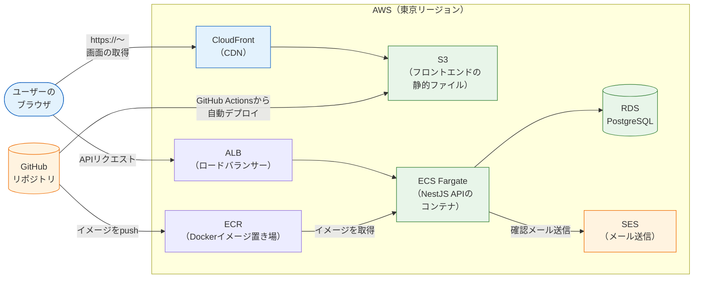

# AWSデプロイ

このセクションでは、これまで自分のPCの中だけで動かしてきたアプリケーションを、**インターネット上の誰でもアクセスできる場所に公開（デプロイ）する方法**を学びます。使うのは、世界で最も広く使われているクラウドサービス **AWS（Amazon Web Services、エーダブリューエス）** です。

[CI/CD](/cicd//)のセクションで「pushしたら自動でテスト・ビルドが走る」仕組みを作りました。このセクションはその続きです。ビルドされた成果物を届ける先、つまり「本番環境」をAWS上に構築し、最終的にはCI/CDパイプラインから自動でデプロイされるところまでをつなげます。

## 最終的に作る構成

先に完成形を見ておきましょう。このセクションを終えると、次の構成がAWS上に出来上がります。[SNS開発（最終プロジェクト）](/sns//)では、この構成の上にSNSアプリを載せて公開します。

図の登場人物を簡単に紹介します（詳しくは[主要サービスの全体像](/aws/core_services/)で1つずつ解説します）。

- **S3 + CloudFront** … Reactでビルドしたフロントエンド（HTML/CSS/JS）を配信します
- **ECR + ECS Fargate + ALB** … NestJSのAPIをDockerコンテナとして動かします
- **RDS** … 本番用のPostgreSQLデータベースです
- **SES** … 登録確認メールなどを送信します
- **GitHub Actions** … [CI/CD](/cicd//)で学んだ仕組みから、上記へ自動デプロイします

そしてもう1つ、このセクションの大きなテーマが **IaC（Infrastructure as Code）** です。上の構成をAWSの管理画面でポチポチ作るのではなく、**TypeScriptのコード（AWS CDK）として書いて**構築します。[TypeScript基礎](/typescript//)を修了した今なら、インフラもいつもの言語で書けます。

## このセクションで学ぶこと

| ページ | 内容 |
|---|---|
| [AWSとは何か](/aws/what_is_aws/) | クラウドの概念、リージョン/AZ、アカウント作成、IAM、**料金の注意と予算アラート** |
| [主要サービスの全体像](/aws/core_services/) | VPC / S3 / CloudFront / ECR / ECS / ALB / RDS / SES / IAM / Route 53 を役割マッピングつきで解説 |
| [IaCとは何か](/aws/what_is_iac/) | なぜ手作業ではだめか、CDKとTerraformの比較、本カリキュラムがCDKを採用する理由 |
| [CDK入門](/aws/cdk_setup/) | CDK導入、スタック/コンストラクトの概念、最初のスタック、diff/deploy/destroy |
| [S3 + CloudFront](/aws/s3_cloudfront/) | フロントエンドのデプロイ（CDKで構築 + Terraform対訳例） |
| [ECR + ECS Fargate](/aws/ecr_ecs/) | APIのデプロイ（CDKで構築 + Terraform対訳例） |
| [RDS](/aws/rds/) | 本番データベース（CDKで構築 + Terraform対訳例） |
| [SESでメール送信](/aws/ses/) | サンドボックス、アドレス検証、NestJSからの送信実装 |
| [CI/CDから自動デプロイ](/aws/deploy_from_cicd/) | GitHub Actions OIDCでキーレス認証、フロント/API双方の自動デプロイ |

## 前提知識

このセクションは中級編のこれまでの内容を総動員します。特に次のページの内容を前提にします。

- [Dockerfileの書き方](/docker/dockerfile/) — APIをコンテナ化してECSで動かします
- [PostgreSQLのセットアップ](/database/postgresql_setup/) — 本番ではRDSに置き換えます
- [ビルドとデプロイの全体像](/cicd/build_and_deploy_flow/) — 「ビルド成果物をどこに置くか」の答えがこのセクションです
- [GitHub Actions基礎](/cicd/github_actions_basics/) — 最終ページで自動デプロイに使います

## 料金に関する注意（最重要）

> **料金に関する注意**
>
> AWSは**従量課金**のサービスです。このセクションには、**実際に料金が発生する操作**が含まれます（特にRDS・ALB・Fargate）。各ページの「料金に関する注意」ボックスを必ず読み、**使い終わったら `cdk destroy` でリソースを削除する**習慣を徹底してください。
>
> また、最初のページ[AWSとは何か](/aws/what_is_aws/)で**予算アラート（AWS Budgets）の設定**を必ず行ってください。万一消し忘れても、メールで気づける保険になります。

学習用に小さい構成を選んでいるため、こまめに削除すれば月数百円〜数千円程度に収まりますが、「作ったら消す」を守ることが何より重要です。

## 学習の流れ

1. まず概念（クラウドとは・各サービスの役割・IaCとは）を固めます
2. CDKの基本操作を、最小のスタック（S3バケット1個）で体験します
3. フロントエンド → API → データベース → メールの順に、本番構成を1つずつコードで構築します
4. 最後にGitHub Actionsと接続し、「pushしたら本番に反映される」状態を完成させます

それでは、[AWSとは何か](/aws/what_is_aws/)から始めましょう。
