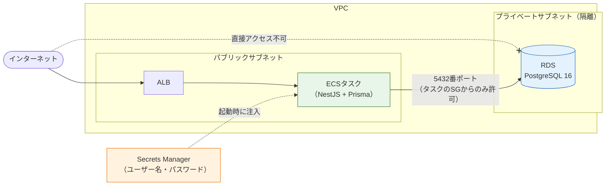
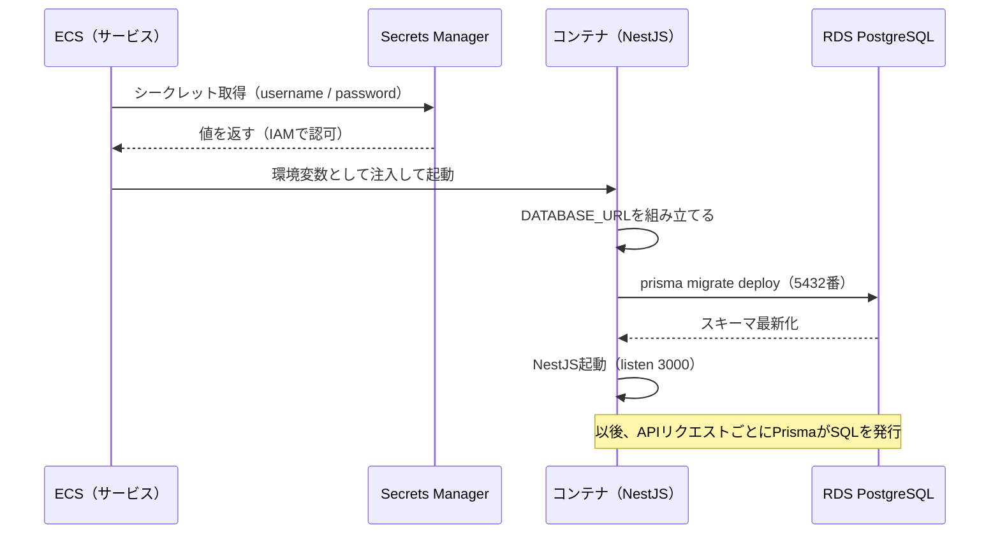

# RDS — 本番データベース

[前のページ](/aws/ecr_ecs/)でAPIは動きましたが、データの保存先がまだありません。開発中は[Docker ComposeのPostgreSQLコンテナ](/docker/dev_environment/)を使ってきましたが、本番のデータベースには「消えない・止まらない・漏れない」という重い要求があります。このページでは **RDS for PostgreSQL** をプライベートサブネットに構築し、パスワードを **Secrets Manager** で安全に管理しながらAPIと接続します。

## 学習目標

- 本番DBにマネージドサービス（RDS）を使う理由を説明できる
- セキュリティグループによる「APIからのみ接続可」の構成を説明できる
- Secrets Managerの役割と、パスワードをコードに書いてはいけない理由を説明できる
- CDKでRDSを構築し、ECSタスクに接続情報を安全に渡せる
- 同じ構成のTerraformコードを読んで、対応関係を説明できる

## 構成の全体像

[ECR + ECS Fargate](/aws/ecr_ecs/)で空けておいたプライベートサブネット（PRIVATE_ISOLATED）に、いよいよ住人が入ります。



押さえるべき設計判断は3つです。

1. **RDSは隔離サブネットに置く** … インターネットから直接到達できる経路を持たせません。データベースの公開は重大事故（全ユーザー情報の漏えい）に直結します
2. **接続はセキュリティグループで絞る** … 「APIタスクのセキュリティグループを持つ相手からの5432番（PostgreSQL）のみ許可」とします。同じVPC内でも、API以外からは接続できません
3. **パスワードはSecrets Managerに置く** … コードや環境変数ファイルに書かず、AWSの金庫サービスに自動生成・保管させ、タスク起動時に注入します

### なぜマネージドDBなのか

「ECSにPostgreSQLコンテナを立てればタダ同然では？」という発想は自然ですが、本番では危険です。コンテナは止まったり作り直されたりする前提の存在で、**データの永続化・バックアップ・障害復旧をすべて自前で設計**しなければなりません。RDSは自動バックアップ（特定時点への復元）、パッチ適用、ストレージの管理、必要ならマルチAZの自動フェイルオーバーまで面倒を見てくれます。**データだけは失敗がやり直せない**ので、マネージドに任せる価値が最も高い部分です。

### なぜパスワードをコードに書いてはいけないのか

[Prismaのセットアップ](/database/prisma_setup/)では `.env` に `DATABASE_URL` を書き、`.gitignore` で除外しました。本番ではさらに踏み込みます。コードやリポジトリにパスワードが存在すると、リポジトリにアクセスできる全員＝パスワードを知る人になり、漏えい時の取り替え（ローテーション）も困難です。**Secrets Manager（シークレッツマネージャー）** は秘密情報専用の金庫で、パスワードの自動生成・暗号化保管・取得の権限管理（IAM）・ローテーションを担います。人間がパスワードを一度も目にしないまま、アプリだけが使える状態を作れます。

> **料金に関する注意**
>
> このページのリソースも**時間課金**です（東京リージョンの概算）。
>
> - **RDS db.t4g.micro（シングルAZ）** … 1時間あたり約3〜4円。**1か月放置で2,500〜3,000円規模**
> - **ストレージ20GB** … 月300円前後
> - **Secrets Manager** … シークレット1個あたり月約60円（作成後30日間は無料）
>
> 新規アカウントの無料クレジットで賄える場合もありますが、前提にしないでください。**multiAzは必ずfalse**（trueにすると費用が約2倍）、作業終了時の `cdk destroy` を徹底してください。

## CDKで構築する

### DbStackを書く

**`lib/db-stack.ts`**

```typescript
import * as cdk from 'aws-cdk-lib';
import { Construct } from 'constructs';
import * as ec2 from 'aws-cdk-lib/aws-ec2';
import * as rds from 'aws-cdk-lib/aws-rds';

interface DbStackProps extends cdk.StackProps {
  vpc: ec2.Vpc;
}

export class DbStack extends cdk.Stack {
  public readonly db: rds.DatabaseInstance;

  constructor(scope: Construct, id: string, props: DbStackProps) {
    super(scope, id, props);

    this.db = new rds.DatabaseInstance(this, 'SnsDatabase', {
      engine: rds.DatabaseInstanceEngine.postgres({
        version: rds.PostgresEngineVersion.VER_16,
      }),
      instanceType: ec2.InstanceType.of(
        ec2.InstanceClass.T4G,
        ec2.InstanceSize.MICRO,
      ),
      vpc: props.vpc,
      vpcSubnets: { subnetType: ec2.SubnetType.PRIVATE_ISOLATED },
      credentials: rds.Credentials.fromGeneratedSecret('snsadmin'),
      databaseName: 'sns',
      allocatedStorage: 20,
      multiAz: false,
      deletionProtection: false,
      removalPolicy: cdk.RemovalPolicy.DESTROY,
    });
  }
}
```

**コード解説**

- `engine: ...postgres({ version: VER_16 })` … エンジンとしてPostgreSQL 16を指定します。開発環境（[PostgreSQLのセットアップ](/database/postgresql_setup/)）とバージョンを揃えることが重要です。開発と本番でバージョンが違うと「ローカルでは動くのに本番で壊れる」原因になります
- `instanceType: T4G, MICRO` … 最小クラスのインスタンス（2vCPU/1GB、ARMベースで割安）です。学習用・小規模本番用の定番です
- `vpcSubnets: PRIVATE_ISOLATED` … [前のページ](/aws/ecr_ecs/)のNetworkStackで作っておいた隔離サブネットに配置します。設計判断1の実装です
- `credentials: rds.Credentials.fromGeneratedSecret('snsadmin')` … **このページの心臓部その1**。ユーザー名 `snsadmin` のパスワードを**Secrets Managerに自動生成**させます。パスワードはコードのどこにも現れません
- `databaseName: 'sns'` … インスタンス内に最初から作っておくデータベース名です
- `allocatedStorage: 20` … ストレージ20GB。最小構成です
- `multiAz: false` … 待機系を持たないシングルAZ構成。**学習用のコスト優先設定**です（本番ではtrueが定石。費用は約2倍になります）
- `deletionProtection: false` / `removalPolicy: DESTROY` … destroyで確実に消すための学習用設定です。実際の本番DBでは削除保護を**有効に**し、removalPolicyはSNAPSHOT（削除時にバックアップを残す）等を選びます

### APIと接続する

ApiStackを修正し、(1) セキュリティグループの許可、(2) 接続情報の注入、を行います。

**`lib/api-stack.ts`**（変更箇所）

```typescript
import * as rds from 'aws-cdk-lib/aws-rds';

interface ApiStackProps extends cdk.StackProps {
  vpc: ec2.Vpc;
  repository: ecr.Repository;
  db: rds.DatabaseInstance; // 追加
}
```

`taskImageOptions` を次のように変更します。

```typescript
        taskImageOptions: {
          image: ecs.ContainerImage.fromEcrRepository(props.repository, 'v1'),
          containerPort: 3000,
          environment: {
            NODE_ENV: 'production',
            DB_HOST: props.db.dbInstanceEndpointAddress,
            DB_PORT: props.db.dbInstanceEndpointPort,
            DB_NAME: 'sns',
          },
          secrets: {
            DB_USER: ecs.Secret.fromSecretsManager(props.db.secret!, 'username'),
            DB_PASSWORD: ecs.Secret.fromSecretsManager(props.db.secret!, 'password'),
          },
        },
```

そして、コンストラクタの末尾（`configureHealthCheck` の後）に1行追加します。

```typescript
    props.db.connections.allowDefaultPortFrom(this.service.service);
```

**コード解説**

- `environment` の `DB_HOST` / `DB_PORT` … RDSの接続先アドレス（**エンドポイント**と呼びます）とポートです。デプロイしてみないと決まらない値ですが、CDKがデプロイ時に解決して環境変数に入れてくれます
- `secrets: { ... ecs.Secret.fromSecretsManager(props.db.secret!, 'password') }` … **心臓部その2**。`environment`（平文の環境変数）と違い、`secrets` に指定した値は**タスク起動時にECSがSecrets Managerから直接取得して**コンテナに注入します。CloudFormationテンプレートやコンソールのタスク定義画面に値が現れません。`'password'` はシークレット（JSON形式）の中のキー名です
- `props.db.secret!` … `fromGeneratedSecret` で作られたシークレットへの参照です。`!`（非nullアサーション）は「この場合は必ず存在する」とTypeScriptに伝える記法です
- `props.db.connections.allowDefaultPortFrom(this.service.service)` … **心臓部その3**。「DBのデフォルトポート（5432）への接続を、このFargateサービス（のセキュリティグループ）から許可する」という意味です。CDKはこの1行から、双方のセキュリティグループにルールを自動追加します。設計判断2がこの1行です

### NestJS側: 接続情報からDATABASE_URLを組み立てる

Prismaは `DATABASE_URL` という1本の接続文字列を期待します（→ [Prismaのセットアップ](/database/prisma_setup/)）。注入された部品から、アプリ起動時に組み立てます。

**`src/main.ts`**（NestJSプロジェクト。`bootstrap()` の前に追加）

```typescript
function buildDatabaseUrl(): void {
  const { DB_HOST, DB_PORT, DB_NAME, DB_USER, DB_PASSWORD } = process.env;
  if (!process.env.DATABASE_URL && DB_HOST && DB_USER && DB_PASSWORD) {
    const password = encodeURIComponent(DB_PASSWORD);
    process.env.DATABASE_URL = `postgresql://${DB_USER}:${password}@${DB_HOST}:${DB_PORT}/${DB_NAME}?schema=public`;
  }
}

buildDatabaseUrl();
```

**コード解説**

- `if (!process.env.DATABASE_URL && ...)` … ローカル開発では従来どおり `.env` の `DATABASE_URL` を使い、本番（部品だけが注入される環境）でだけ組み立てる、という分岐です
- `encodeURIComponent(DB_PASSWORD)` … パスワードに記号が含まれてもURLとして壊れないようにエンコードします
- 組み立てた値を `process.env.DATABASE_URL` に書き戻すことで、PrismaClientは今までと同じ仕組みで接続できます

### マイグレーションをどう流すか

RDSは隔離サブネットにあるため、**手元のPCから `prisma migrate deploy` を直接実行することはできません**（接続経路がないからです。これは安全の裏返しです）。定石は「**DBに届く場所で流す**」こと。最も簡単なのは、コンテナの起動コマンドでマイグレーションを先に実行する方法です。

**`Dockerfile`**（最終行のCMDを変更）

```dockerfile
CMD ["sh", "-c", "pnpm exec prisma migrate deploy && node dist/main.js"]
```

**コード解説**

- `pnpm exec prisma migrate deploy` … 未適用のマイグレーションを適用するコマンドです（開発用の `migrate dev` と違い、対話なし・生成なしの本番用。→ [スキーマとマイグレーション](/database/schema_and_migration/)）。イメージ内では[Dockerfileの書き方](/docker/dockerfile/)で `corepack enable pnpm` 済みなので、コンテナの中でも `pnpm exec` がそのまま使えます
- `&&` … マイグレーション成功後にのみアプリを起動します

タスク（＝DBに接続できる場所）の起動時に必ずスキーマが最新化される、分かりやすい構成です。

### デプロイして動作確認する

**`bin/sns-infra.ts`** にDbStackを追加し、ApiStackへ渡します。

```typescript
import { DbStack } from '../lib/db-stack';

const dbStack = new DbStack(app, 'DbStack', { vpc: networkStack.vpc });

new ApiStack(app, 'ApiStack', {
  vpc: networkStack.vpc,
  repository: ecrStack.repository,
  db: dbStack.db,
});
```

新しいCMDを含むイメージをビルド・push（[前のページ](/aws/ecr_ecs/)の手順で `v2` として）し、`api-stack.ts` のタグを `'v2'` に変えてからデプロイします。

```bash
pnpm exec cdk diff DbStack ApiStack
pnpm exec cdk deploy DbStack ApiStack
```

RDSインスタンスの作成には**10分前後**かかります。完了したら、DBを使うエンドポイント（[CRUD練習](/database/crud_with_prisma/)のメモAPIなど）をALBのURL越しに叩いて、データが保存・取得できることを確認してください。

```bash
curl -X POST http://<ALBのDNS名>/memos \
  -H "Content-Type: application/json" \
  -d '{"title": "本番デビュー", "body": "RDSに保存されました"}'
curl http://<ALBのDNS名>/memos
```

接続情報がどう流れるか、起動シーケンスを整理しておきます。



パスワードがSecrets Manager → ECS → コンテナの環境変数、という経路だけを通り、コード・Git・テンプレートのどこにも現れていないことを確認してください。

## Terraformで書く場合

同じ構成のTerraform対訳例です（読解用）。CDKの `fromGeneratedSecret` と `connections.allowDefaultPortFrom` が隠していた部品が、ここでも姿を現します。

**`db.tf`（対訳例・参考）**

```hcl
# ① DBを置くサブネットのグループ
resource "aws_db_subnet_group" "sns" {
  name       = "sns-db-subnets"
  subnet_ids = module.vpc.intra_subnets
}

# ② DB用セキュリティグループ（タスクからの5432のみ許可）
resource "aws_security_group" "db" {
  name   = "sns-db-sg"
  vpc_id = module.vpc.vpc_id

  ingress {
    from_port       = 5432
    to_port         = 5432
    protocol        = "tcp"
    security_groups = [aws_security_group.task.id]
  }
}

# ③ パスワードの自動生成と保管
resource "random_password" "db" {
  length  = 30
  special = false
}

resource "aws_secretsmanager_secret" "db" {
  name = "sns-db-credentials"
}

resource "aws_secretsmanager_secret_version" "db" {
  secret_id = aws_secretsmanager_secret.db.id
  secret_string = jsonencode({
    username = "snsadmin"
    password = random_password.db.result
  })
}

# ④ RDSインスタンス本体
resource "aws_db_instance" "sns" {
  identifier        = "sns-database"
  engine            = "postgres"
  engine_version    = "16"
  instance_class    = "db.t4g.micro"
  allocated_storage = 20
  db_name           = "sns"

  username = "snsadmin"
  password = random_password.db.result

  db_subnet_group_name   = aws_db_subnet_group.sns.name
  vpc_security_group_ids = [aws_security_group.db.id]
  publicly_accessible    = false
  multi_az               = false

  skip_final_snapshot = true
  deletion_protection = false
}
```

**コード解説（HCL）**

- ① `aws_db_subnet_group` … RDSに「どのサブネット群に置いてよいか」を伝える専用リソースです。CDKでは `vpcSubnets: PRIVATE_ISOLATED` の1プロパティから自動生成されていました
- ② `aws_security_group "db"` … 「タスクのSGを持つ相手からの5432のみ許可」。CDKの `connections.allowDefaultPortFrom(service)` の1行に対応します。`security_groups = [...task.id]` という「SGを送信元に指定する」書き方は[前のページのTerraform例](/aws/ecr_ecs/)と同じパターンです
- ③ `random_password` … Terraformのrandomプロバイダでパスワードを生成します。`special = false` は記号なし（接続文字列のエンコード問題を避ける簡易策）です
- ③ `aws_secretsmanager_secret` / `_version` … 金庫（secret）と、その中身（version）が別リソースです。`jsonencode` でCDKと同じ `{username, password}` 形式のJSONにしています。この3リソースが、CDKの `Credentials.fromGeneratedSecret('snsadmin')` **1行分**です
- ④ `aws_db_instance` … RDS本体。`publicly_accessible = false`（パブリックIPを持たせない）、`multi_az = false` など、CDK版と同じ判断を明示しています
- ④ `skip_final_snapshot = true` … destroy時に「最終スナップショットを取らずに消す」指定。学習用です（本番ではfalseにして、削除時のバックアップを残します）

> Terraformのステートファイルには `random_password` の生成結果などの**秘密情報が平文で記録されます**。実務でTerraformを使う場合、ステートファイルは暗号化されたリモートバックエンド（S3など）に置き、リポジトリには絶対にコミットしません。CDK（CloudFormation）にはローカルのステートファイルがないため、この問題を意識せずに済んでいます。

## 片付け

> **料金に関する注意（削除手順）**
>
> RDSはこのセクションで**最も課金されやすいリソース**です。その日の作業を終えたら必ず削除してください。
>
> ```bash
> pnpm exec cdk destroy ApiStack DbStack NetworkStack EcrStack
> ```
>
> ApiStackがDbStackのセキュリティグループ等を参照しているため、まとめて指定すればCDKが正しい順序で削除します。完了後、**RDSコンソールでインスタンスが消えていること**、Secrets Managerでシークレットが削除（削除予定）になっていることを確認してください。
>
> なお、destroyするとDBの**データも消えます**。学習用なら再デプロイ＋マイグレーションで再現できるので問題ありませんが、「データは消える」ことは理解した上で実行してください。

## 理解度チェック

**Q1. RDSを隔離（プライベート）サブネットに置き、さらにセキュリティグループで制限する——2段階の防御はそれぞれ何を防いでいますか。**

<details markdown="1">
<summary>解答を見る</summary>

- **隔離サブネット** … インターネットからDBへ直接到達する経路そのものをなくします（外部からの攻撃の遮断）
- **セキュリティグループ** … VPCの**内側**からの接続も「APIタスクのSGを持つ相手の5432番」だけに絞ります（内部の別リソースが侵害された場合などの横移動の防止）

ネットワーク経路とファイアウォールの二重防御で、「DBに話しかけられるのはAPIだけ」を実現しています。

</details>

**Q2. データベースのパスワードをコードやリポジトリに書いてはいけない理由を2つ挙げてください。**

<details markdown="1">
<summary>解答を見る</summary>

- リポジトリにアクセスできる人全員（過去の履歴を含む）がパスワードを知り得る状態になり、**漏えいの面が広がる**
- 漏えいした場合の**取り替え（ローテーション）が困難**になる（コード修正・再デプロイが必要で、履歴からは消せない）

Secrets Managerに自動生成・保管させれば、人間が値を見ることなく、アプリだけが使える状態を作れます。

</details>

**Q3. ECSタスク定義の `environment` と `secrets` の違いは何ですか。**

<details markdown="1">
<summary>解答を見る</summary>

どちらもコンテナに環境変数を渡しますが、`environment` は**値そのものをタスク定義に平文で書く**のに対し、`secrets` は**Secrets Manager等への参照だけ**を書き、値はタスク起動時にECSが取得して注入します。`secrets` を使えば、CloudFormationテンプレートやコンソールのタスク定義画面に秘密の値が現れません。パスワード類は必ず `secrets` で渡します。

</details>

**Q4. 手元のPCから本番RDSに `prisma migrate deploy` を直接実行できないのはなぜですか。このページではどう解決しましたか。**

<details markdown="1">
<summary>解答を見る</summary>

RDSが隔離サブネットにあり、インターネット（＝手元のPC）からの接続経路が存在しないからです。これはセキュリティ設計の意図どおりの挙動です。解決策は「DBに届く場所で流す」ことで、このページでは**コンテナの起動コマンドを `pnpm exec prisma migrate deploy && node dist/main.js` に変更**し、タスク起動時にマイグレーションを適用しました。

</details>

**Q5. 学習用設定のうち、実際の本番DBでは逆にすべきものを2つ挙げてください。**

<details markdown="1">
<summary>解答を見る</summary>

- `deletionProtection: false` → 本番では**true**（誤削除の防止）
- `removalPolicy: DESTROY` → 本番では**SNAPSHOT等**（削除時にバックアップを残す）
- `multiAz: false` → 本番では**true**（AZ障害時の自動フェイルオーバー）

いずれも「学習ではコストと片付けやすさを優先、本番ではデータ保護を優先」というトレードオフです。

</details>

## セルフレビュー

- [ ] 構成図（タスク→SG→隔離サブネットのRDS、Secrets Manager）を何も見ずに描ける
- [ ] 本番DBにマネージドサービスを使う理由を自分の言葉で説明できる
- [ ] `Credentials.fromGeneratedSecret` が何を作るかを説明できる
- [ ] `connections.allowDefaultPortFrom` の1行が何を設定するかを説明できる
- [ ] `environment` と `secrets` を正しく使い分けられる
- [ ] 起動シーケンス（シークレット注入→URL組み立て→migrate→listen）を説明できる
- [ ] Terraform対訳例で、CDKの1行に対応する複数リソースを指摘できる
- [ ] `cdk destroy` でRDSの削除まで確認した

## 次のステップ

これで「画面（S3+CloudFront）・API（ECS）・データ（RDS）」が揃い、SNSアプリを動かす本番構成の骨格が完成しました。次のページ[SESでメール送信](/aws/ses/)では、会員登録の確認メールに使うメール送信基盤を整え、NestJSからの送信を実装します。

このページで作ったDB接続の仕組みは、SNS開発の[全体デプロイ](/sns/nestjs/deploy/)でそのまま使います。また、Secrets Managerに保管する情報は、今後JWTの署名鍵（→ [認証](/sns/nestjs/auth/)）などにも増えていきます。
