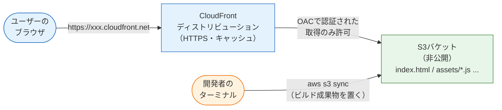
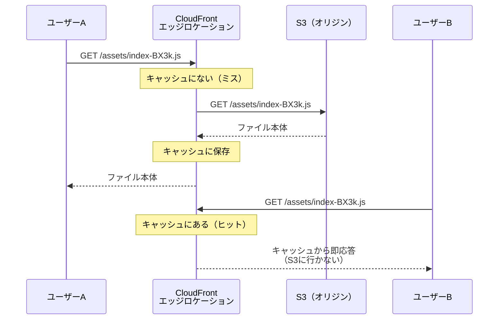

# S3 + CloudFront — フロントエンドのデプロイ

このページでは、Reactアプリを世界に公開します。[ビルドとデプロイの全体像](/cicd/build_and_deploy_flow/)で学んだとおり、`vite build` の成果物はただの静的ファイル（HTML/CSS/JS）です。これを**S3に置き、CloudFrontで配信する**——フロントエンド公開の定石構成を、CDKで構築します。

ページの後半では、同じ構成を**Terraformで書いた場合**の対訳例も読み、ツールに依存しないAWSの概念を確認します。

## 学習目標

- S3 + CloudFront構成の各部品の役割と、リクエストの流れを図で説明できる
- OAC（Origin Access Control）により「バケット非公開のままCloudFront経由でのみ配信」を実現できる
- CDKでこの構成を構築し、ビルド成果物をアップロードして公開できる
- CDNのキャッシュの仕組みと、キャッシュ無効化（invalidation）が必要な場面を説明できる
- 同じ構成のTerraformコードを読んで、対応関係を説明できる

## 構成の全体像

今回作る構成です。[主要サービスの全体像](/aws/core_services/)の図の左半分にあたります。



ポイントは3つあります。

1. CloudFrontの設定単位を**ディストリビューション（distribution、配信設定）**と呼びます。「どこ（オリジン）のコンテンツを、どんなルールで配信するか」の定義です。配信元（ここではS3バケット）のことを**オリジン（origin、源泉）**と呼びます
2. S3バケットは**非公開のまま**にします。代わりに **OAC（Origin Access Control、オリジンアクセスコントロール）** という仕組みで「CloudFrontからの取得だけ」を許可します。ユーザーがバケットに直接アクセスする経路を塞ぎ、入口をCloudFrontに一本化できます
3. ファイルの配置は `aws s3 sync` コマンドで行います。[CI/CDから自動デプロイ](/aws/deploy_from_cicd/)では、この部分をGitHub Actionsに任せます

> **料金に関する注意**
>
> この構成は学習規模ならほぼ無料です。CloudFrontには**常時無料枠（データ転送 月1TB・リクエスト月1,000万件）**があり、S3の保存料金もビルド成果物（数MB）なら月1円未満です。キャッシュ無効化（invalidation）も月1,000パスまで無料です。
>
> ただしS3は「置いてあるだけで保存課金」が続くタイプなので、学習を終えたらページ末尾の手順で `cdk destroy` してください。

## CDKで構築する

[CDK入門](/aws/cdk_setup/)で作った `sns-infra` プロジェクトを拡張します。今回から役割ごとにスタックを分ける構成にします。スタックを分けると、「フロントだけ作り直す」「DBだけ消す」のような部分的な操作ができるようになります。

### フロントエンド用スタックを書く

新しいファイル `lib/frontend-stack.ts` を作成します。

**`lib/frontend-stack.ts`**

```typescript
import * as cdk from 'aws-cdk-lib';
import { Construct } from 'constructs';
import * as s3 from 'aws-cdk-lib/aws-s3';
import * as cloudfront from 'aws-cdk-lib/aws-cloudfront';
import * as origins from 'aws-cdk-lib/aws-cloudfront-origins';

export class FrontendStack extends cdk.Stack {
  constructor(scope: Construct, id: string, props?: cdk.StackProps) {
    super(scope, id, props);

    // ① ビルド成果物を置くバケット（非公開）
    const bucket = new s3.Bucket(this, 'FrontendBucket', {
      blockPublicAccess: s3.BlockPublicAccess.BLOCK_ALL,
      removalPolicy: cdk.RemovalPolicy.DESTROY,
      autoDeleteObjects: true,
    });

    // ② CloudFrontディストリビューション
    const distribution = new cloudfront.Distribution(this, 'FrontendDistribution', {
      defaultBehavior: {
        origin: origins.S3BucketOrigin.withOriginAccessControl(bucket),
        viewerProtocolPolicy: cloudfront.ViewerProtocolPolicy.REDIRECT_TO_HTTPS,
      },
      defaultRootObject: 'index.html',
      errorResponses: [
        {
          httpStatus: 403,
          responseHttpStatus: 200,
          responsePagePath: '/index.html',
        },
      ],
    });

    // ③ デプロイ後に必要な値を出力する
    new cdk.CfnOutput(this, 'BucketName', { value: bucket.bucketName });
    new cdk.CfnOutput(this, 'DistributionId', { value: distribution.distributionId });
    new cdk.CfnOutput(this, 'SiteUrl', {
      value: `https://${distribution.distributionDomainName}`,
    });
  }
}
```

**コード解説**

①のバケット定義:

- `blockPublicAccess: s3.BlockPublicAccess.BLOCK_ALL` … バケットの公開を全面禁止します。「Webサイトなのに非公開？」と思うかもしれませんが、ユーザーへの配信はCloudFrontが担うので、バケット自体は閉じておくのが現在の定石です
- `removalPolicy` / `autoDeleteObjects` … [CDK入門](/aws/cdk_setup/)で学んだ「destroyで確実に片付く」ための学習用設定です

②のディストリビューション定義:

- `defaultBehavior` … 「すべてのパスへのリクエストをどう扱うか」の既定ルールです
- `origin: origins.S3BucketOrigin.withOriginAccessControl(bucket)` … **このページの心臓部**。①のバケットをオリジンに指定し、OACを自動設定します。この1行でCDKは「OACの作成」「バケットポリシー（CloudFrontからのGetObjectのみ許可）の追加」までまとめて行ってくれます
- `viewerProtocolPolicy: REDIRECT_TO_HTTPS` … httpでアクセスされたらhttpsへリダイレクトします。常時HTTPS化の設定です
- `defaultRootObject: 'index.html'` … `https://ドメイン/` のようにパスなしでアクセスされたとき `index.html` を返します
- `errorResponses` … **SPA（シングルページアプリ）配信の重要設定**です。後述します
- `httpStatus: 403, responseHttpStatus: 200, responsePagePath: '/index.html'` … S3が403を返したら、代わりにステータス200で `index.html` を返す、という意味です

③の出力:

- `cdk.CfnOutput` … デプロイ完了時にターミナルへ表示される**出力値**を定義します。自動生成されたバケット名・ディストリビューションID・公開URLは後の作業で使うので、出力しておくと便利です

### なぜ403をindex.htmlに差し替えるのか

[React基礎](/react/what_is_react/)で学んだとおり、SPAは「1枚の `index.html` を読み込み、画面遷移はJavaScript（React Router等）が行う」仕組みです。ここに静的配信特有の落とし穴があります。

ユーザーが `https://サイト/posts` をブックマークして直接開いたとしましょう。CloudFrontはS3に `posts` というファイルを取りに行きますが、**そんなファイルは存在しません**（実体は `index.html` と `assets/` だけ）。非公開バケット + OACの構成では、存在しないキーへのアクセスは403エラーになります。そこで「403が起きたら `index.html` を200で返す」と設定しておけば、どのパスで開いてもReactアプリが起動し、React Routerが正しい画面を表示してくれるのです。

### スタックをアプリに登録する

**`bin/sns-infra.ts`**

```typescript
#!/usr/bin/env node
import * as cdk from 'aws-cdk-lib';
import { FrontendStack } from '../lib/frontend-stack';

const app = new cdk.App();
new FrontendStack(app, 'FrontendStack');
```

**コード解説**

- [CDK入門](/aws/cdk_setup/)の練習用スタック（`SnsInfraStack`）の記述は削除し、`FrontendStack` を登録しました（AWS上の練習バケットをdestroy済みであることを確認してから消してください）
- 以降スタックが増えていくため、deploy時は `pnpm exec cdk deploy FrontendStack` のように**スタック名を指定**します

### デプロイする

```bash
pnpm exec cdk diff FrontendStack
pnpm exec cdk deploy FrontendStack
```

```
 ✅  FrontendStack

✨  Deployment time: 312.8s

Outputs:
FrontendStack.BucketName = frontendstack-frontendbucket1234-abcdefgh
FrontendStack.DistributionId = E1ABCDEFGHIJK
FrontendStack.SiteUrl = https://d1234abcdefgh.cloudfront.net
```

CloudFrontは世界中の拠点に設定を配るため、デプロイに**5分前後**かかります。Outputsの3つの値を控えてください。

この時点で `SiteUrl` を開いても、まだバケットが空なのでエラーページが表示されます。中身を入れましょう。

## ビルド成果物をアップロードする

Reactプロジェクト（[React基礎](/react/setup/)で作ったものでOKです）をビルドします。

```bash
cd ../my-react-app
pnpm run build
```

```
vite v5.2.0 building for production...
✓ built in 1.52s
dist/index.html                   0.46 kB
dist/assets/index-BX3kVQzN.js   143.21 kB
```

`dist/` に成果物ができました。S3へ**同期（sync）**します。バケット名は先ほどのOutputsの値に置き換えてください。

```bash
aws s3 sync dist/ s3://frontendstack-frontendbucket1234-abcdefgh --delete
```

```
upload: dist/index.html to s3://frontendstack-.../index.html
upload: dist/assets/index-BX3kVQzN.js to s3://frontendstack-.../assets/index-BX3kVQzN.js
```

**コード解説**

- `aws s3 sync dist/ s3://バケット名` … ローカルの `dist/` とバケットの中身を比較し、**差分だけ**をアップロードします
- `--delete` … ローカルに存在しないファイルをバケット側から削除します。古いビルドのJSファイル（ハッシュ付きファイル名は毎回変わります）が溜まり続けるのを防ぎます

ブラウザで `https://d1234abcdefgh.cloudfront.net`（自分のSiteUrl）を開いてください。**あなたのReactアプリが、世界中どこからでも見られる状態で表示されているはずです。**

> CDKには `aws-cdk-lib/aws-s3-deployment` の `BucketDeployment` という「deploy時にファイル配置まで行う」コンストラクトもあります。ただ、このカリキュラムでは「インフラの構築（CDK）」と「成果物の配置（CI/CD）」を分けたいので、syncコマンド方式を採用しています。配置の自動化は[CI/CDから自動デプロイ](/aws/deploy_from_cicd/)で行います。

## キャッシュを理解する

CloudFrontの速さの源は**キャッシュ**です。動きをシーケンス図で確認します。



最初のリクエスト（キャッシュミス）だけS3まで取りに行き、2回目以降（キャッシュヒット）はエッジから即座に返します。これが「速くて安い」の正体です。

ただし、キャッシュには副作用があります。**新しいビルドをS3にアップロードしても、エッジには古いキャッシュが残っている**ため、ユーザーにはしばらく古い画面が配信され続けるのです。対策が**キャッシュ無効化（invalidation、インバリデーション）**で、「このパスのキャッシュを捨てよ」とCloudFrontに指示します。

```bash
aws cloudfront create-invalidation \
  --distribution-id E1ABCDEFGHIJK \
  --paths "/*"
```

**コード解説**

- `--distribution-id` … Outputsで控えたディストリビューションIDです
- `--paths "/*"` … 全パスのキャッシュを無効化します。Viteの成果物はJS/CSSのファイル名にハッシュが付く（中身が変わればファイル名も変わる）ため、実質的に問題になるのは `index.html` だけですが、学習用途では `/*` 指定がシンプルで確実です

以後、「ビルド → sync → invalidation」の3点セットがフロントエンドのデプロイ手順になります。デプロイしたのに画面が変わらないときは、まずキャッシュを疑ってください。

## Terraformで書く場合

同じ構成をTerraform（HCL）で書くとどうなるかを見てみます。[IaCとは何か](/aws/what_is_iac/)で説明したとおり、これは**読んで対応関係を理解するための対訳例**です。実際の構築はCDKで行っているので、これを同じアカウントにapplyしないでください（同じ構成が二重にできてしまいます）。

**`main.tf`（対訳例・参考）**

```hcl
provider "aws" {
  region = "ap-northeast-1"
}

# ① ビルド成果物を置くバケット（非公開）
resource "aws_s3_bucket" "frontend" {
  bucket_prefix = "sns-frontend-"
  force_destroy = true
}

resource "aws_s3_bucket_public_access_block" "frontend" {
  bucket                  = aws_s3_bucket.frontend.id
  block_public_acls       = true
  block_public_policy     = true
  ignore_public_acls      = true
  restrict_public_buckets = true
}

# ② OAC（CloudFrontからS3への認証付きアクセス）
resource "aws_cloudfront_origin_access_control" "frontend" {
  name                              = "sns-frontend-oac"
  origin_access_control_origin_type = "s3"
  signing_behavior                  = "always"
  signing_protocol                  = "sigv4"
}

# ③ CloudFrontディストリビューション
resource "aws_cloudfront_distribution" "frontend" {
  enabled             = true
  default_root_object = "index.html"

  origin {
    domain_name              = aws_s3_bucket.frontend.bucket_regional_domain_name
    origin_id                = "s3-frontend"
    origin_access_control_id = aws_cloudfront_origin_access_control.frontend.id
  }

  default_cache_behavior {
    target_origin_id       = "s3-frontend"
    viewer_protocol_policy = "redirect-to-https"
    allowed_methods        = ["GET", "HEAD"]
    cached_methods         = ["GET", "HEAD"]
    cache_policy_id        = "658327ea-f89d-4fab-a63d-7e88639e58f6" # マネージドポリシー CachingOptimized
  }

  custom_error_response {
    error_code         = 403
    response_code      = 200
    response_page_path = "/index.html"
  }

  restrictions {
    geo_restriction {
      restriction_type = "none"
    }
  }

  viewer_certificate {
    cloudfront_default_certificate = true
  }
}

# ④ バケットポリシー（CloudFrontからのGetObjectのみ許可）
data "aws_iam_policy_document" "frontend_bucket" {
  statement {
    actions   = ["s3:GetObject"]
    resources = ["${aws_s3_bucket.frontend.arn}/*"]

    principals {
      type        = "Service"
      identifiers = ["cloudfront.amazonaws.com"]
    }

    condition {
      test     = "StringEquals"
      variable = "AWS:SourceArn"
      values   = [aws_cloudfront_distribution.frontend.arn]
    }
  }
}

resource "aws_s3_bucket_policy" "frontend" {
  bucket = aws_s3_bucket.frontend.id
  policy = data.aws_iam_policy_document.frontend_bucket.json
}
```

**コード解説（HCL）**

- `provider "aws" { region = ... }` … 操作対象のクラウドとリージョンの宣言です。CDKでは環境変数やprofileから決まっていた部分が明示されます
- `resource "リソース型" "名前" { ... }` … HCLの基本構文。「この型のリソースをこの設定で1つ存在させる」という宣言です。`aws_s3_bucket.frontend` のように `型.名前` で他の場所から参照します
- ① `bucket_prefix` … 指定した接頭辞 + ランダム文字列でバケット名を自動生成します（CDKの自動命名に相当）。`force_destroy = true` はCDKの `autoDeleteObjects` に相当し、中身ごと削除を許可します
- ① `aws_s3_bucket_public_access_block` … 公開ブロック設定。CDKでは `blockPublicAccess` という1プロパティでしたが、Terraformでは**独立したリソースとして**4項目を自分で書きます
- ② `aws_cloudfront_origin_access_control` … OACの定義。`signing_protocol = "sigv4"` は「AWS標準の署名方式（SigV4）でリクエストに署名する」という意味です。CDKでは `withOriginAccessControl()` の内部で自動生成されていたものです
- ③ `origin { ... }` … 配信元の定義。`domain_name` にバケットのリージョン付きドメイン名を渡し、`origin_access_control_id` で②と紐づけます
- ③ `default_cache_behavior` … CDKの `defaultBehavior` に対応。`cache_policy_id` にはAWSが用意した推奨キャッシュ設定「CachingOptimized」の固定IDを指定しています（CDKではこれがデフォルトなので書かずに済んでいました）
- ③ `custom_error_response` … SPA用の403→index.html差し替え。CDKの `errorResponses` と1対1対応です
- ③ `restrictions` / `viewer_certificate` … 地域制限なし・CloudFront標準のHTTPS証明書を使う、という指定。**CDKではデフォルト値が入るため書かなかった項目**で、Terraformは必須ブロックとして明示を求めます
- ④ `data "aws_iam_policy_document"` … `resource` が「作るもの」なのに対し、`data` は「値の組み立てや参照」です。ここでは「CloudFrontサービスからの、このディストリビューション経由のGetObjectのみ許可」というポリシーJSONを組み立て、`aws_s3_bucket_policy` でバケットに適用します。**CDKでは `withOriginAccessControl()` が自動でやっていた仕事**です

見比べると分かるとおり、構成要素（バケット・公開ブロック・OAC・ディストリビューション・バケットポリシー）は完全に同じです。CDKのL2コンストラクトが自動でやっていたことを、Terraformでは1つずつ明示する——抽象度の違いがそのまま行数の違い（CDK約40行 vs Terraform約90行）に現れています。どちらが良い悪いではなく、**全部見える**のがTerraformの読みやすさでもあります。

なお、Terraformでは `terraform init`（初期化）→ `terraform plan`（差分確認 = `cdk diff` 相当）→ `terraform apply`（適用 = `cdk deploy` 相当）→ `terraform destroy`（削除）という流れで操作します。

## 片付け

> **料金に関する注意（削除手順）**
>
> 学習を終えたら（または数日触らないなら）削除しましょう。
>
> ```bash
> cd sns-infra
> pnpm exec cdk destroy FrontendStack
> ```
>
> バケットは `autoDeleteObjects` 指定により中身ごと削除されます。CloudFrontの削除には数分かかります。完了後、S3とCloudFrontのコンソールで消えていることを確認してください。コードは残っているので、続きをやるときは `deploy` → `sync` → invalidation で数分で復元できます。

## 理解度チェック

**Q1. S3バケットを非公開にしたまま、どうやってユーザーにファイルを配信していますか。**

<details markdown="1">
<summary>解答を見る</summary>

**OAC（Origin Access Control）**を使います。バケットポリシーで「CloudFrontサービスからの（このディストリビューション経由の）GetObjectのみ許可」とし、CloudFrontがOACの署名付きリクエストでS3から取得、それをユーザーに配信します。ユーザー→S3の直接アクセス経路は存在しないため、入口がCloudFrontに一本化され、HTTPS強制やキャッシュの恩恵を確実に受けられます。

</details>

**Q2. `https://サイト/posts` を直接開くとS3には `posts` というファイルがないのに、Reactアプリが正しく表示されるのはなぜですか。**

<details markdown="1">
<summary>解答を見る</summary>

CloudFrontの `errorResponses`（カスタムエラーレスポンス）で「S3が403を返したら `index.html` をステータス200で返す」と設定しているからです。どのパスでも `index.html` が返ればReactアプリが起動し、React RouterがURLを見て適切な画面を描画します。SPAを静的配信するときの定石設定です。

</details>

**Q3. 新しいビルドをS3にアップロードしたのに、ブラウザに古い画面が表示されます。原因と対処を説明してください。**

<details markdown="1">
<summary>解答を見る</summary>

原因はCloudFrontの**エッジに残った古いキャッシュ**です。S3を更新してもエッジのキャッシュは自動では消えません。対処は `aws cloudfront create-invalidation --distribution-id <ID> --paths "/*"` で**キャッシュ無効化**を実行することです。デプロイ手順は「ビルド → sync → invalidation」の3点セットと覚えてください。

</details>

**Q4. `aws s3 sync` の `--delete` オプションは何のために付けますか。**

<details markdown="1">
<summary>解答を見る</summary>

ローカルの `dist/` に存在しないファイルをバケット側から削除するためです。Viteの成果物はビルドのたびにハッシュ付きの別ファイル名（例: `index-BX3k.js` → `index-Cf91.js`）になるため、`--delete` がないと古いビルドのファイルがバケットに溜まり続けます。

</details>

**Q5. Terraform版では書いたのに、CDK版では書かなかった構成要素を1つ挙げ、なぜCDKでは不要だったか説明してください。**

<details markdown="1">
<summary>解答を見る</summary>

例えば**バケットポリシー**（CloudFrontからのGetObjectのみ許可）です。CDKでは `origins.S3BucketOrigin.withOriginAccessControl(bucket)` というL2コンストラクトの1行が、OACの作成とバケットポリシーの設定まで自動で行うため、明示的に書く必要がありませんでした。ほかに公開ブロックの4項目、キャッシュポリシー、viewer_certificateなども同様です。抽象度（L2の自動設定）の違いが行数の差になっています。

</details>

## セルフレビュー

- [ ] 構成図（ユーザー→CloudFront→S3、OAC）を何も見ずに描ける
- [ ] OACの目的を「バケット非公開のまま配信する仕組み」として説明できる
- [ ] FrontendStackのCDKコードを、各プロパティの意味を説明しながら読める
- [ ] 「ビルド → sync → invalidation」のデプロイ3点セットを実行できる
- [ ] キャッシュヒット/ミスの流れをシーケンス図で説明できる
- [ ] SPAで403→index.html差し替えが必要な理由を説明できる
- [ ] Terraform版のHCLを読んで、CDKコードとの対応関係を指摘できる
- [ ] `cdk destroy FrontendStack` で片付けまで実行した

## 次のステップ

フロントエンドが世界に公開されました。次のページ[ECR + ECS Fargate](/aws/ecr_ecs/)では、もう1つの入口であるAPI側——NestJSアプリのDockerイメージをECRに置き、ECS Fargate + ALBで動かす構成を作ります。[Docker基礎](/docker/dockerfile/)で書いたDockerfileがついに本番で活躍します。

このページの「sync + invalidation」は、[CI/CDから自動デプロイ](/aws/deploy_from_cicd/)でGitHub Actionsのジョブとして自動化します。また、S3へのファイル配置はSNS開発の[プロフィールと画像アップロード](/sns/nestjs/profile_and_images/)でも別の形（presigned URL）で再登場します。
