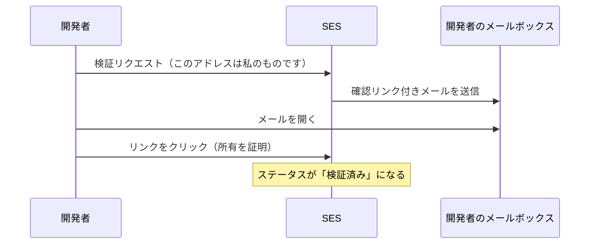
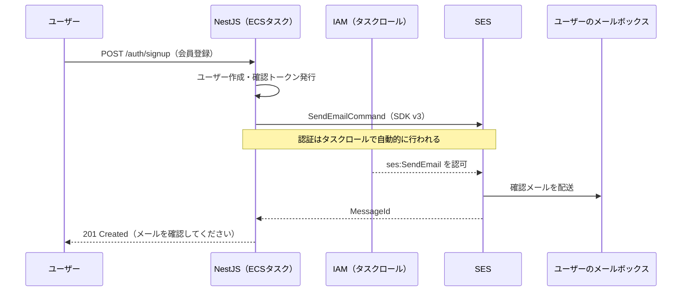

# SESでメール送信

Webアプリには「メールを送る」場面が必ずあります。会員登録の確認、パスワードの再設定、通知——SNSアプリも例外ではありません。このページでは **SES（Simple Email Service）** を使ったメール送信を学びます。SES特有の**サンドボックス**という制限を理解し、メールアドレスを**検証**し、**@aws-sdk/client-ses（AWS SDK for JavaScript v3）** でNestJSから送信する実装までを行います。

ここで作る `MailService` は、SNS開発の[メールアドレス確認](/sns/email_verification/)でそのまま登場します。

## 学習目標

- アプリからのメール送信に専用サービスを使う理由を説明できる
- SESのサンドボックスの制限内容と解除方法を説明できる
- メールアドレスの検証（identity verification）を実行できる
- NestJSからSDK v3でメールを送信する実装を書ける
- ECSタスクにメール送信の権限（IAMロール）を付与できる

## なぜメール送信に専用サービスが必要か

メールの仕組み（SMTP）自体は古くからある技術で、理屈の上では自前のサーバーからも送信できます。しかし現代では、迷惑メールとの戦いの結果、**受信側のプロバイダ（Gmailなど）は「信頼できる送信元」以外からのメールを容赦なく弾く**ようになりました。送信元の信頼は、IPアドレスの実績、送信ドメイン認証（SPF/DKIMという技術）、苦情率などから総合的に判定されます。

個人が立てたサーバーがこの信頼を獲得するのはほぼ不可能です。そこで、**信頼された送信基盤を貸してくれるサービス**（SES、SendGridなど）を使うのが標準になっています。SESはAWSに統合されているため、IAMによる権限管理やSDKでの送信が他のサービスと同じ作法で扱えます。

> **料金に関する注意**
>
> SESの料金は**送信1,000通あたり約0.10 USD（約15円）**と、このセクションで扱うサービスの中では最も安価です。メールアドレスの検証やサンドボックスの利用自体は無料です。学習で数十通送る程度なら、課金は実質ゼロと考えて構いません。
>
> ただし、SESは**リージョン単位**のサービスです。他のリソースと同じ**東京リージョン（ap-northeast-1）**で作業しているか、コンソール右上の表示を必ず確認してください（検証もコードも、リージョンが違うと見つかりません）。

## サンドボックス — 最初は「練習場」から始まる

SESを使い始めると、アカウントは**サンドボックス（sandbox、砂場）**という制限モードに置かれています。制限の内容は次のとおりです。

| 項目 | サンドボックス | 解除後（本番アクセス） |
|---|---|---|
| 送信**先** | **検証済みのアドレスのみ** | 任意のアドレス |
| 送信**元** | 検証済みのアドレスのみ | 検証済みのアドレスのみ（共通） |
| 送信量 | 1日200通・毎秒1通まで | 申請に応じた上限 |

重要なのは送信**先**の制限です。サンドボックス中は、**事前に検証した自分のアドレスにしかメールを送れません**。つまり「登録した任意のユーザーに確認メールを送る」という本番の使い方はできず、開発・テスト専用のモードです。

なぜこんな制限があるのでしょうか。SESの送信基盤は全利用者の共有財産です。新規アカウントが無制限に送信できると、スパム業者がアカウントを量産して悪用し、**SES全体の信頼（＝あなたのメールの到達率）が下がる**からです。サンドボックスは迷惑メール対策の仕組みだと理解してください。

解除（**本番アクセス**の取得）は、SESコンソールの「アカウントダッシュボード」→「本番アクセスのリクエスト」から申請します。ユースケース（どんなメールを誰に送るか、苦情にどう対応するか）を記入し、通常1〜2営業日で審査されます。**このカリキュラムの学習はサンドボックスのままで完結できる**ので、申請は実際のサービス公開時でかまいません。

## メールアドレスを検証する

サンドボックスでは送信元・送信先の両方が検証済みである必要があるので、自分のメールアドレスを**検証（verify）**します。検証とは「このアドレスの持ち主が自分である」ことをSESに証明する手続きです。

コンソールで行う場合: SESコンソール →「ID」（identities）→「IDの作成」→「Eメールアドレス」を選び、自分のアドレスを入力します。CLIなら1コマンドです。

```bash
aws sesv2 create-email-identity --email-identity your-name@example.com
```

実行すると、SESから確認メールが届きます。



メール内のリンクをクリックすると検証が完了し、コンソールのID一覧でステータスが「検証済み」になります。

> **ドメイン検証について:** アドレス単位ではなく**ドメイン単位**（例: `example.com` 全体）で検証する方法もあり、実サービスではこちらが標準です。`no-reply@example.com` のような任意のアドレスを送信元にでき、DKIM（送信ドメイン認証）も設定できて到達率が上がります。ただし独自ドメインの取得と、[Route 53](/aws/core_services/)等でのDNSレコード設定が必要なため、本カリキュラムでは個人アドレスの検証で進めます。

テスト用に、家族の別アドレスや自分のサブアドレス（Gmailなら `name+test@gmail.com` 形式も同一受信箱に届きます）をもう1つ検証しておくと、「別人への送信」の練習ができます。

## NestJSから送信する

### SDKの導入

NestJSプロジェクトに、AWS SDK for JavaScript **v3** のSESクライアントを追加します。v3は「使うサービスのクライアントだけを個別パッケージで入れる」構成が特徴です（バンドルが小さくなります）。

```bash
pnpm add @aws-sdk/client-ses
```

### MailServiceを実装する

メール送信を専用のServiceに切り出します。[ServiceとDI](/backend/service_and_di/)で学んだ構成そのままです。

```bash
pnpm exec nest generate module mail
pnpm exec nest generate service mail
```

**`src/mail/mail.service.ts`**

```typescript
import { Injectable, Logger } from '@nestjs/common';
import { SESClient, SendEmailCommand } from '@aws-sdk/client-ses';

@Injectable()
export class MailService {
  private readonly logger = new Logger(MailService.name);

  private readonly client = new SESClient({
    region: process.env.AWS_REGION ?? 'ap-northeast-1',
  });

  async sendMail(to: string, subject: string, body: string): Promise<void> {
    const command = new SendEmailCommand({
      Source: process.env.MAIL_FROM,
      Destination: {
        ToAddresses: [to],
      },
      Message: {
        Subject: { Data: subject, Charset: 'UTF-8' },
        Body: {
          Text: { Data: body, Charset: 'UTF-8' },
        },
      },
    });

    const result = await this.client.send(command);
    this.logger.log(`メール送信完了 MessageId=${result.MessageId}`);
  }
}
```

**コード解説**

- `import { SESClient, SendEmailCommand } from '@aws-sdk/client-ses';` … SDK v3は「**クライアント**を作り、**コマンド**を `send` する」という統一スタイルです。S3でもECSでも同じ形なので、一度覚えれば応用が利きます
- `new SESClient({ region: ... })` … 接続先リージョンを指定してクライアントを生成します。**認証情報は引数に書いていない**ことに注目してください（後述）
- `Source: process.env.MAIL_FROM` … 送信元アドレス。**検証済みのアドレス**である必要があります。環境変数から読むことで、コードを変えずに環境ごとの差し替えができます
- `Destination.ToAddresses` … 宛先の配列。サンドボックス中はここも検証済みアドレスに限られます
- `Message.Subject` / `Body.Text` … 件名とプレーンテキスト本文。`Charset: 'UTF-8'` は日本語を正しく送るための指定です（HTMLメールにしたい場合は `Body.Html` を使います）
- `await this.client.send(command)` … 実際の送信。戻り値の `MessageId` はSES側での受付番号で、ログに残しておくと調査に役立ちます

### ModuleとテストControllerを用意する

**`src/mail/mail.module.ts`**

```typescript
import { Module } from '@nestjs/common';
import { MailService } from './mail.service';

@Module({
  providers: [MailService],
  exports: [MailService],
})
export class MailModule {}
```

**コード解説**

- `exports: [MailService]` … 他のモジュール（将来の認証モジュールなど）からMailServiceを注入できるよう公開します（→ [ServiceとDI](/backend/service_and_di/)）

動作確認用に、一時的なエンドポイントを生やします（確認が済んだら削除してください）。

**`src/mail/mail.controller.ts`**

```typescript
import { Body, Controller, Post } from '@nestjs/common';
import { MailService } from './mail.service';

@Controller('mail')
export class MailController {
  constructor(private readonly mailService: MailService) {}

  @Post('test')
  async sendTest(@Body() body: { to: string }): Promise<{ ok: boolean }> {
    await this.mailService.sendMail(
      body.to,
      'SES送信テスト',
      'NestJSからSES経由で送信したテストメールです。',
    );
    return { ok: true };
  }
}
```

**コード解説**

- `@Post('test')` … `POST /mail/test` で受けるテスト用ルートです（→ [Controller](/backend/controller/)）
- `constructor(private readonly mailService: MailService)` … DIでMailServiceを注入しています。MailControllerをMailModuleの `controllers` に登録するのを忘れずに

### ローカルで動かす

`.env` に送信元を追加し、起動して叩いてみます。

```bash
# .env に追記: MAIL_FROM=your-name@example.com
pnpm run start:dev
```

```bash
curl -X POST http://localhost:3000/mail/test \
  -H "Content-Type: application/json" \
  -d '{"to": "your-name@example.com"}'
```

```json
{"ok":true}
```

数秒で受信箱にテストメールが届くはずです。届かない場合は、(1) 送信元・送信先の両方が検証済みか、(2) リージョンが `ap-northeast-1` で一致しているか、(3) 迷惑メールフォルダ、の順に確認してください。

ここで「認証情報をコードに書いていないのに、なぜ送信できたのか」を整理します。SDK v3は**認証情報を決まった順序で自動探索**します。ローカルでは[AWSとは何か](/aws/what_is_aws/)で `aws configure` した認証情報（`~/.aws/credentials`）が拾われ、ECS上では**タスクロール**が拾われます。**コードは一切変えずに、環境ごとに適切な認証が使われる**——これがSDKとIAMの設計です。

## 本番（ECS）で動かすための権限

ECS上のNestJSがSESを呼ぶには、タスクに「SESで送信してよい」というIAM権限が必要です。[ECR + ECS Fargate](/aws/ecr_ecs/)のApiStackに追記します。

**`lib/api-stack.ts`**（import追加と、コンストラクタ末尾に追記）

```typescript
import * as iam from 'aws-cdk-lib/aws-iam';

    // SESでのメール送信を許可する
    this.service.taskDefinition.taskRole.addToPrincipalPolicy(
      new iam.PolicyStatement({
        actions: ['ses:SendEmail'],
        resources: ['*'],
      }),
    );
```

また、`taskImageOptions.environment` に `MAIL_FROM` を追加します。

```typescript
          environment: {
            NODE_ENV: 'production',
            // （DB関連の変数は省略）
            MAIL_FROM: 'your-name@example.com',
          },
```

**コード解説**

- `taskDefinition.taskRole` … **タスクロール**は「コンテナの中のアプリ」が使う権限です。[ECSのページ](/aws/ecr_ecs/)のTerraform対訳に出てきた**実行ロール**（ECS自身がイメージpull等に使う）とは別物です。アプリがAWSのAPIを呼ぶ権限は、必ずタスクロールに付けます
- `addToPrincipalPolicy(new iam.PolicyStatement({...}))` … ロールに権限の文（ステートメント）を追加します。`actions` が「何を」、`resources` が「どの対象に」です
- `actions: ['ses:SendEmail']` … SDKの `SendEmailCommand` に対応するアクションだけを許可します。「とりあえず `ses:*`」とせず、**使う操作だけを許可する**のが最小権限の原則です
- `resources: ['*']` … 簡単のため全IDを対象にしています。検証済みIDのARNに絞ることもできます

> CDKでメールアドレスの検証自体をコード化することもできます（`aws-cdk-lib/aws-ses` の `EmailIdentity`）。ただし検証メールのリンクを踏む作業は結局人間に残るため、本カリキュラムでは検証は手作業、権限と設定はコード、という分担にしています。

全体の流れをシーケンス図で確認します。



これはSNS開発の[メールアドレス確認](/sns/email_verification/)で実装する登録フローの先取りです。このページのMailServiceがそのまま部品として使われます。

## 理解度チェック

**Q1. 自前のサーバーではなくSESのような専用サービスからメールを送るのはなぜですか。**

<details markdown="1">
<summary>解答を見る</summary>

現代の受信プロバイダは、送信元の信頼（IPの実績、SPF/DKIMなどの送信ドメイン認証、苦情率）をもとに迷惑メールを厳しく弾いており、**個人のサーバーから送ったメールはほぼ受信箱に届かない**からです。SESなどの専用サービスは、信頼された送信基盤を共有資産として提供してくれます。

</details>

**Q2. サンドボックス中のSESでは何ができて、何ができませんか。**

<details markdown="1">
<summary>解答を見る</summary>

できること: **検証済みアドレスから、検証済みアドレスへの送信**（1日200通・毎秒1通まで）。開発・テストはこれで完結します。
できないこと: **未検証の任意のアドレスへの送信**。つまり実ユーザーへの確認メール送信はできません。実サービス公開時には、コンソールから本番アクセスを申請して解除します。

</details>

**Q3. `new SESClient(...)` にアクセスキーなどの認証情報を書いていないのに、ローカルでもECSでも送信できるのはなぜですか。**

<details markdown="1">
<summary>解答を見る</summary>

SDK v3が認証情報を**決まった順序で自動探索**するからです。ローカルでは `aws configure` で保存した認証情報（`~/.aws/credentials`）が、ECS上では**タスクロール**（タスクに紐づくIAMロールの一時認証情報）が使われます。コードを変えずに環境ごとの認証が切り替わるため、認証情報をコードに埋め込む必要がありません。

</details>

**Q4. ECSの「タスクロール」と「実行ロール」の違いを説明してください。SESの送信権限はどちらに付けますか。**

<details markdown="1">
<summary>解答を見る</summary>

- **実行ロール（execution role）** … ECS基盤自身が使う権限。ECRからのイメージpull、ログ出力、シークレット取得など「コンテナを動かすため」の権限
- **タスクロール（task role）** … コンテナの**中で動くアプリ**がAWSのAPIを呼ぶときの権限

SESの送信はアプリ（NestJS）が行うので、**タスクロール**に `ses:SendEmail` を付けます。

</details>

**Q5. メールが届かないとき、確認すべきポイントを3つ挙げてください。**

<details markdown="1">
<summary>解答を見る</summary>

- 送信元（`MAIL_FROM`）と送信先の**両方が検証済み**か（サンドボックス中は両方必要）
- **リージョンの一致** … 検証したリージョンとSESClientのリージョン（`ap-northeast-1`）が同じか
- **迷惑メールフォルダ**に振り分けられていないか
- （ECSの場合）タスクロールに `ses:SendEmail` の権限があるか、もエラー時の定番確認点です

</details>

## セルフレビュー

- [ ] メール送信に専用サービスを使う理由を自分の言葉で説明できる
- [ ] サンドボックスの制限（送信先・送信量）と、その存在理由を説明できる
- [ ] メールアドレスの検証を実行し、「検証済み」ステータスを確認した
- [ ] SDK v3の「クライアントを作ってコマンドをsendする」スタイルでMailServiceを書ける
- [ ] ローカルからテストメールを送信し、受信を確認した
- [ ] タスクロールと実行ロールの違いを説明できる
- [ ] 最小権限の原則に沿って `ses:SendEmail` だけを許可する理由を説明できる

## 次のステップ

メール送信の部品が揃いました。次は仕上げです。[CI/CDから自動デプロイ](/aws/deploy_from_cicd/)で、ここまで手作業で行ってきたデプロイ（S3 sync、ECRへのpush、サービス更新）をGitHub Actionsに自動化させ、「mainにマージしたら本番に反映される」開発フローを完成させます。

このページのMailServiceは、SNS開発の[メールアドレス確認](/sns/email_verification/)で確認トークン付きメールの送信に使います。コードを残しておいてください。
