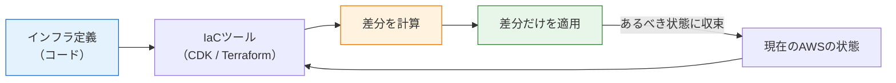
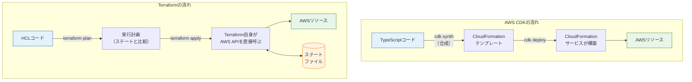

# IaCとは何か

前のページで、SNSアプリに必要なAWSサービスの全体像をつかみました。次の疑問は「では、それらをどうやって作るのか」です。マネジメントコンソール（管理画面）でボタンを押して作ることもできますが、このカリキュラムでは**インフラをコードとして書く**方法、すなわち **IaC（Infrastructure as Code、コードとしてのインフラ）** を採用します。

このページでは、なぜ手作業ではだめなのか、IaCツールの二大勢力である**AWS CDK**と**Terraform**は何が違うのか、そして本カリキュラムがCDKを本筋に選ぶ理由を説明します。

## 学習目標

- IaCとは何か、手作業の構築と比べた利点を説明できる
- 「宣言的」なインフラ定義の意味を説明できる
- AWS CDKとTerraformの仕組みの違いを図で説明できる
- 本カリキュラムがCDKを採用する理由と、Terraform対訳例を併記する意図を説明できる

## 手作業の構築は何がだめなのか

コンソールでの手作業（俗に「ClickOps（クリックオプス）」と呼ばれます）には、致命的な弱点がいくつもあります。開発でコードに起きる問題と対比すると分かりやすいので、並べてみます。

| 問題 | 手作業のインフラ | コードの世界での対応物 |
|---|---|---|
| **再現できない** | 「どの画面で何を選んだか」は記録に残らない。同じ環境をもう一度作れない | コードがあればいつでも再現できる |
| **差分が分からない** | 誰かが設定を変えても気づけない。「いつの間にか動かない」 | `git diff` で変更が見える |
| **レビューできない** | 危険な設定変更も、誰のチェックも受けずに反映される | Pull Requestでレビューできる（→ [GitHubとPull Request](/git/github_and_pr/)） |
| **履歴がない** | 「先週までどういう設定だったか」が分からない | `git log` で履歴を辿れる |
| **ミスが混入する** | 30項目の設定を毎回手で入れれば、いつか必ず間違える | 同じコードは同じ結果を生む |

特に学習者にとって切実なのは**再現性**です。前のページで「使い終わったら削除する」を徹底すると決めました。手作業で30分かけて作った環境を削除するのはためらわれますが、**コードなら削除しても1コマンドで作り直せる**ので、安心して消せます。IaCは料金防衛策とセットなのです。

**IaC（Infrastructure as Code）** とは、サーバー・ネットワーク・データベースなどのインフラ構成を、コンソール操作ではなく**コード（テキストファイル）として定義し、ツールに構築させる**手法です。インフラのコードはGitで管理できるので、上の表の右列の恩恵をすべて受けられます。

## 宣言的に書く、という考え方

IaCツールの多くは**宣言的（declarative）**なスタイルを取ります。これは「作る手順」ではなく「**あるべき最終状態**」を書くということです。

- **命令的（手順を書く）:** 「バケットを作れ。次にバージョニングを有効化しろ。次に…」
- **宣言的（状態を書く）:** 「バージョニングが有効なバケットが**1つ存在する**こと」

宣言的スタイルの強みは、**現在の状態と定義の差分をツールが計算してくれる**ことです。定義を変更して再実行すると、ツールは「今と理想の差」だけを適用します。バケットがすでにあれば何もしませんし、設定が1か所違えばそこだけ直します。この「差分を見てから適用する」流れは、CDKでは `cdk diff` → `cdk deploy`、Terraformでは `terraform plan` → `terraform apply` として体験します。



この図のサイクル（コードと現実の差分を計算して適用する）が、IaCツールの共通の心臓部です。ツールごとの違いは「コードを何語で書くか」「差分計算を誰がやるか」に現れます。

## 二大ツール: AWS CDKとTerraform

実務でよく使われるIaCツールのうち、このカリキュラムに関係する2つを紹介します。

### AWS CDK

**AWS CDK（Cloud Development Kit、シーディーケー）** は、AWS公式のIaCツールです。最大の特徴は、インフラを**TypeScriptなどの汎用プログラミング言語で書く**ことです。

```typescript
// CDK: TypeScriptでS3バケットを定義
const bucket = new s3.Bucket(this, 'FrontendBucket', {
  versioned: true,
});
```

CDKのコードはそのままAWSに送られるわけではありません。実行すると **CloudFormation（クラウドフォーメーション）テンプレート**というJSON/YAML形式の定義に変換（**合成、synthesize**）され、AWSのCloudFormationというサービスが実際の構築を行います。CloudFormationはAWS純正の「宣言的テンプレートからリソースを作る」エンジンで、差分計算や失敗時の巻き戻し（ロールバック）を担当します。

### Terraform

**Terraform（テラフォーム）** は、HashiCorp社が開発したIaCツールで、AWS以外（Google Cloud、Azure、GitHubの設定まで）も同じ書き方で扱える汎用性が特徴です。**HCL（HashiCorp Configuration Language）**という専用の設定言語で書きます。

```hcl
# Terraform: HCLでS3バケットを定義
resource "aws_s3_bucket" "frontend" {
  bucket = "my-sns-frontend-bucket"
}
```

TerraformはCloudFormationを経由せず、**Terraform自身がAWSのAPIを直接呼んで**リソースを作ります。そのために「現実に何を作ったか」を**ステートファイル（state、状態ファイル）**として自前で記録・管理します。

### 仕組みの違いを図で見る



どちらも「コード → 差分計算 → 適用」という流れは同じですが、CDKは**変換してCloudFormationに任せる**方式、Terraformは**自分で状態を記録しながら直接APIを呼ぶ**方式です。状態の管理をAWSに任せられるのがCDKの気楽さ、AWS以外も扱える・挙動が読みやすいのがTerraformの強み、と覚えてください。

### 比較表

| 観点 | AWS CDK | Terraform |
|---|---|---|
| 開発元 | AWS（公式） | HashiCorp |
| 記述言語 | **TypeScript**・Python・Javaなどの汎用言語 | HCL（専用の設定言語） |
| 実行の仕組み | CloudFormationテンプレートに変換して構築 | 自身がAWS APIを直接呼ぶ |
| 状態管理 | CloudFormationが管理（AWS側） | ステートファイルを自分で管理 |
| 対応クラウド | AWSのみ | AWS・Google Cloud・Azureほか多数 |
| 抽象化 | 高レベルの部品（コンストラクト）が豊富。少ない行数で定石構成を作れる | 基本的にリソースを1つずつ書く（モジュールで再利用は可能） |
| プログラミング能力 | ループ・条件分岐・型チェック・補完がフルに使える | HCLの範囲内（ループ等は専用構文） |
| 実務での採用 | AWS中心の組織で人気 | マルチクラウドや専業インフラチームで定番 |

## 本カリキュラムはCDKを本筋にする

このカリキュラムでは**AWS CDK（TypeScript）を本筋**として採用します。理由は明確です。

1. **すでにTypeScriptを書ける。** [TypeScript基礎](/typescript/)を修了し、[React](/react/)も[NestJS](/backend/)もTypeScriptで書いてきました。インフラだけのために新しい言語（HCL）を学ぶより、**同じ言語・同じエディタ補完・同じ型チェック**の延長でインフラを書くほうが、学習コストが圧倒的に低くなります
2. **型と補完が初学者の味方になる。** 「このプロパティに何を渡せるか」をエディタが教えてくれ、間違いはデプロイ前にコンパイルエラーで分かります。これは[TypeScriptの基本型](/typescript/basic_types/)で学んだ恩恵そのものです
3. **高レベルの部品で定石構成が短く書ける。** 後のページで見るように、「ALB付きのFargateサービス一式」が数行で立ち上がります。初学者がまず全体を動かし、それから中身を学ぶ順序に向いています

ただし、Terraformを無視するわけではありません。実務ではTerraformを採用している現場も非常に多く、求人でも頻出します。そこで本カリキュラムでは、各構築ページ（[S3 + CloudFront](/aws/s3_cloudfront/)、[ECR + ECS Fargate](/aws/ecr_ecs/)、[RDS](/aws/rds/)）に「**Terraformで書く場合**」という節を設け、**CDKで作ったものと同じ構成のTerraform対訳例**をHCLの解説つきで併記します。

この方針には学習上の狙いがあります。同じ構成を2つの書き方で見比べると、「ツール固有の書き方」と「AWSそのものの概念（バケット、ディストリビューション、タスク定義…）」が分離して見えてきます。**ツールは変わっても、AWSの概念は共通**です。概念さえ掴めば、現場のツールがどちらでも対応できます。

> 対訳例はあくまで「読んで構造を理解する」ためのものです。実際に手を動かす構築はCDKで行います。同じ構成をCDKとTerraformで二重に作ると、リソースの管理が分裂して事故のもとになるためです（1つの環境は1つのツールで管理する、がIaCの原則です）。

## IaCでも料金は同じだけ発生する

> **料金に関する注意**
>
> IaCはあくまで「作り方」の話であり、**コードで作ったリソースにも手作業と同じ料金がかかります**。むしろ1コマンドで大量のリソースを作れるぶん、「気軽にdeployして放置」のリスクは手作業より高いとも言えます。
>
> その代わり、削除も1コマンドです。CDKなら `cdk destroy`、Terraformなら `terraform destroy` で、そのコードが作ったリソースを**漏れなくまとめて削除**できます。「IaCで作り、IaCで消す」をワンセットの習慣にしてください。[予算アラートの設定](/aws/what_is_aws/)がまだの人は、先に済ませてから次のページに進みましょう。

## 理解度チェック

**Q1. インフラを手作業（コンソール操作）で構築する場合の問題点を3つ挙げてください。**

<details markdown="1">
<summary>解答を見る</summary>

次から3つ挙げられれば正解です。

- **再現できない**（操作の記録が残らず、同じ環境をもう一度作れない）
- **差分・履歴が分からない**（誰がいつ何を変えたか追えない）
- **レビューできない**（危険な変更がチェックなしで反映される）
- **ミスが混入する**（多数の設定を毎回手入力すれば必ず間違える）

IaCならインフラ定義をGitで管理でき、これらがすべて解決します。

</details>

**Q2. 「宣言的」なインフラ定義とはどういう意味ですか。命令的な書き方と対比して説明してください。**

<details markdown="1">
<summary>解答を見る</summary>

作る**手順**（命令的）ではなく、**あるべき最終状態**を書くスタイルです。たとえば「バージョニングが有効なバケットが1つ存在する」と書けば、ツールが現在の状態と比較し、足りない差分だけを適用してくれます。すでに目的の状態であれば何もしません。だからこそ `cdk diff` や `terraform plan` のような「差分の事前確認」が可能になります。

</details>

**Q3. CDKとTerraformでは、コードが実際のAWSリソースになるまでの仕組みがどう違いますか。**

<details markdown="1">
<summary>解答を見る</summary>

- **CDK:** TypeScriptなどのコードをCloudFormationテンプレートに**変換（合成）**し、AWSのCloudFormationサービスが構築・状態管理・ロールバックを行う
- **Terraform:** HCLのコードをもとに、**Terraform自身がAWSのAPIを直接呼んで**構築し、作ったものを**ステートファイル**に自前で記録する

差分を計算してから適用する、という大きな流れは共通です。

</details>

**Q4. 本カリキュラムがCDKを本筋に採用する一番の理由は何ですか。**

<details markdown="1">
<summary>解答を見る</summary>

読者が**すでにTypeScriptを習得している**からです。アプリと同じ言語でインフラを書けるため、新しい言語（HCL）の学習コストが不要で、型チェックとエディタ補完という既習の恩恵をインフラにもそのまま使えます。加えて、高レベルの部品により定石構成を短く書けることも初学者向きです。

</details>

**Q5. CDKで作った環境を片付けるコマンドは何ですか。また、IaCが「使い終わったら削除する」習慣と相性が良いのはなぜですか。**

<details markdown="1">
<summary>解答を見る</summary>

`cdk destroy` です（Terraformなら `terraform destroy`）。IaCではインフラの定義がコードとして残っているため、**削除しても1コマンドで同じ環境を再現できます**。「消すと作り直しが大変だから残しておこう」という消し忘れの動機がなくなり、こまめな削除（＝課金の防止）と相性が良いのです。

</details>

## セルフレビュー

- [ ] IaCとは何かを、手作業の問題点とセットで自分の言葉で説明できる
- [ ] 宣言的なスタイルの意味と利点を説明できる
- [ ] CDKとTerraformの仕組みの違い（CloudFormation経由 / 直接API + ステート）を図に描ける
- [ ] CDK・Terraformそれぞれの強みを1つ以上挙げられる
- [ ] 本カリキュラムがCDKを採用する理由を説明できる
- [ ] 「IaCで作ったものもIaCで消す」の具体的なコマンドを言える

## 次のステップ

IaCの考え方と、CDKを選ぶ理由が固まりました。次のページ[CDK入門](/aws/cdk_setup/)では、実際にCDKをインストールし、スタック・コンストラクトという基本概念を学んだうえで、最初のスタック（S3バケット1個）をデプロイ・削除するまでを体験します。

ここで学んだ「宣言的」「差分適用」の考え方は、`cdk diff` の出力を読むときに効いてきます。また、Terraformの仕組み（ステートファイル）は各構築ページの「Terraformで書く場合」節を読む前提知識になります。
