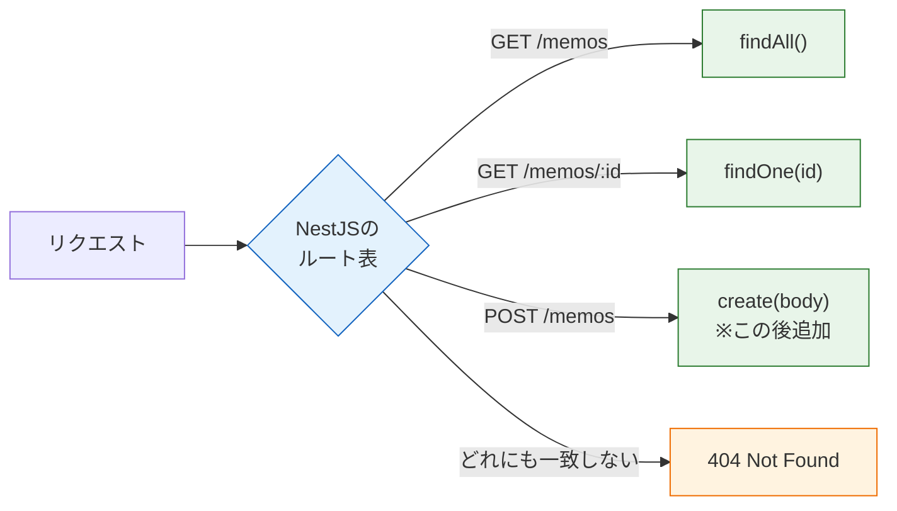

# Controllerとルーティング

[環境構築とプロジェクト作成](/backend/setup/)で、`/`へのGETに応えるサーバーが動きました。このページでは受付係であるControllerを本格的に学びます。複数のURLとメソッドの組み合わせに応える方法（ルーティング）と、リクエストに含まれる3種類の情報 — パスパラメータ・クエリパラメータ・ボディ — の受け取り方を身につけます。

このページでは前ページで作った`memo-api`プロジェクトに、メモ機能用のControllerを追加していきます。サーバーは`pnpm run start:dev`で起動したままにしておいてください。

## 学習目標

- Nest CLIでControllerを生成し、ルーティングを定義できる
- パスパラメータ（`@Param`）でURL中の値を受け取れる
- クエリパラメータ（`@Query`）で検索条件などを受け取れる
- リクエストボディ（`@Body`）でJSONデータを受け取れる
- パスパラメータが文字列で渡ってくることを理解し、数値に変換できる

## ルーティングとは

ルーティング（routing）とは、**「メソッドとパスの組み合わせ」と「実行する処理」を結びつけること**です。[HTTPとREST](/backend/http_and_rest/)で設計したメモAPIの表を思い出してください。

| やりたいこと | メソッド | パス |
|---|---|---|
| 一覧を取得 | GET | `/memos` |
| 1件を取得 | GET | `/memos/1` |
| 作成 | POST | `/memos` |

この左側（設計）と右側（コード上のメソッド）を対応づけるのがControllerの仕事です。

## MemosControllerを生成する

Nest CLIには、部品の雛形を生成する`nest generate`（短縮形は`nest g`）コマンドがあります。手で書いてもよいのですが、CLIを使うと**Moduleへの登録まで自動で行ってくれる**ため、登録忘れを防げます。`@nestjs/cli`はプロジェクト作成時に開発用の依存としてインストール済みなので、`pnpm exec`を付けてプロジェクト内のCLIを実行します。

プロジェクトのルート（`memo-api/`）で、まずメモ機能の箱となるModuleを、続いてControllerを生成します。

```bash
pnpm exec nest g module memos
pnpm exec nest g controller memos
```

実行結果の例:

```
CREATE src/memos/memos.module.ts (82 bytes)
UPDATE src/app.module.ts (312 bytes)
CREATE src/memos/memos.controller.spec.ts (485 bytes)
CREATE src/memos/memos.controller.ts (101 bytes)
UPDATE src/memos/memos.module.ts (170 bytes)
```

**コード解説**

- `CREATE src/memos/memos.module.ts` — メモ機能の箱（MemosModule）が`src/memos/`ディレクトリに作られました。Moduleの詳しい中身は次の[ServiceとDI](/backend/service_and_di/)で扱うので、ここでは「機能の箱が用意された」と理解すれば十分です。
- `UPDATE src/app.module.ts` — MemosModuleがAppModuleの`imports`に自動登録されました。
- `CREATE src/memos/memos.controller.ts` — Controller本体です。`.spec.ts`はテストファイルで、[バックエンドテスト](/testing//)で扱います。
- `UPDATE src/memos/memos.module.ts` — MemosControllerがMemosModuleの`controllers`に自動登録されました。

生成されたControllerは、まだ中身が空です。

**`src/memos/memos.controller.ts`（生成直後）**

```typescript
import { Controller } from '@nestjs/common';

@Controller('memos')
export class MemosController {}
```

`@Controller('memos')`に注目してください。引数の`'memos'`は、**このController内のすべてのルートに共通する接頭辞（プレフィックス）**になります。これから書くルートはすべて`/memos`から始まる、ということです。

## GETルートを定義する

まず「一覧取得」と「1件取得」の2つのGETルートを追加します。データの保管は次ページ以降で整えるので、ここでは固定の値を返して仕組みの理解に集中します。

**`src/memos/memos.controller.ts`**

```typescript
import { Controller, Get, Param } from '@nestjs/common';

@Controller('memos')
export class MemosController {
  @Get()
  findAll() {
    return [
      { id: 1, title: '買い物リスト' },
      { id: 2, title: '読みたい本' },
    ];
  }

  @Get(':id')
  findOne(@Param('id') id: string) {
    return { id: Number(id), title: 'サンプルのメモ' };
  }
}
```

**コード解説**

- `@Get()` — 引数なしなので、担当パスはプレフィックスそのまま、つまり`GET /memos`です。
- `return [...]` — オブジェクトや配列を返すと、NestJSが**自動でJSONに変換**してレスポンスにします。`JSON.stringify`を自分で書く必要はありません。
- `@Get(':id')` — パスの`:id`は「この位置の値は可変」という意味の**パスパラメータ**の宣言です。`GET /memos/1`でも`GET /memos/99`でもこのメソッドが担当します。
- `@Param('id') id: string` — 引数に付けるデコレータです。「パスパラメータ`id`の値を、この引数`id`として受け取る」という宣言です。
- `Number(id)` — 受け取った値を数値に変換しています。理由はすぐ後で説明します。

保存するとwatchモードが再起動し、ログに新しいルートが登録されたことが表示されます。

```
[Nest] LOG [RouterExplorer] Mapped {/memos, GET} route
[Nest] LOG [RouterExplorer] Mapped {/memos/:id, GET} route
```

curlで確認しましょう。

```bash
curl http://localhost:3000/memos
```

実行結果の例:

```json
[{"id":1,"title":"買い物リスト"},{"id":2,"title":"読みたい本"}]
```

```bash
curl http://localhost:3000/memos/42
```

実行結果の例:

```json
{"id":42,"title":"サンプルのメモ"}
```

URLに入れた`42`がレスポンスに反映されています。パスパラメータが受け取れている証拠です。

### 重要：パスパラメータはstringで届く

`@Param('id')`で受け取る値の型は、**必ず`string`**です。URLはただの文字列なので、`/memos/42`の`42`も文字列`"42"`として届きます。

これを忘れると、次のようなバグを踏みます。

```typescript
// id が "42"（string）のとき
id === 42        // false！ 文字列と数値の比較
Number(id) === 42 // true。 数値に変換してから比較する
```

「IDで配列から探したのに見つからない」というトラブルの大半はこれが原因です。**数値として扱いたいパスパラメータは、必ず`Number()`で変換してから使う**と覚えてください（後の[DTOとバリデーション](/backend/dto_and_validation/)で、変換と検証を自動化するより良い方法も学びます）。

## ルーティングの全体像

ここまでで、リクエストの振り分けは次のように整理できます。



どのルートにも一致しないリクエスト（たとえば`GET /notes`）には、NestJSが自動で404 Not Foundを返してくれます。試しに`curl -i http://localhost:3000/notes`を実行すると確認できます。

```json
{"message":"Cannot GET /notes","error":"Not Found","statusCode":404}
```

### ルートの定義順に注意

1つ落とし穴を紹介します。ルートは**Controller内で定義した順に上から照合**されます。たとえば「検索用のルート`GET /memos/search`」を追加したいとき、

```typescript
@Get(':id')     // 先にこれがあると…
findOne() {...}

@Get('search')  // /memos/search も「:id = "search"」として上に吸われてしまう
search() {...}
```

この順番だと、`/memos/search`へのリクエストは`:id`に`"search"`が入ったものとして`findOne`に振り分けられてしまいます。**固定のパスは、可変のパス（`:id`）より上に定義する**のが原則です。

## クエリパラメータを受け取る — @Query

クエリパラメータとは、URLの末尾に`?キー=値`の形で付ける補助情報です。`&`で複数つなげられます。

```
GET /memos?keyword=買い物&limit=10
```

パスパラメータが「対象の特定（どのメモか）」に使うのに対し、クエリパラメータは**検索条件や表示オプションのような「絞り込み・調整」**に使うのが慣例です。あってもなくてもリクエストが成立する、任意の情報に向いています。

`findAll`を拡張して、キーワード検索に対応させてみましょう。

**`src/memos/memos.controller.ts`（findAllを書き換え、importにQueryを追加）**

```typescript
import { Controller, Get, Param, Query } from '@nestjs/common';
```

```typescript
  @Get()
  findAll(@Query('keyword') keyword?: string) {
    const memos = [
      { id: 1, title: '買い物リスト' },
      { id: 2, title: '読みたい本' },
    ];
    if (keyword) {
      return memos.filter((memo) => memo.title.includes(keyword));
    }
    return memos;
  }
```

**コード解説**

- `@Query('keyword') keyword?: string` — クエリパラメータ`keyword`を引数として受け取ります。型に`?`を付けているのは、クエリは**省略されることがある**からです（省略時は`undefined`になります）。[基本型](/typescript/basic_types/)で学んだオプショナルの考え方がここで活きます。
- `if (keyword)` — キーワードが指定されたときだけ絞り込みます。`filter`と`includes`は[JavaScript基礎](/frontend/javascript_basics/)で学んだ配列・文字列のメソッドです。

curlで確認します。URLに`?`や日本語を含む場合は、URL全体を引用符で囲みます。

```bash
curl "http://localhost:3000/memos?keyword=買い物"
```

実行結果の例:

```json
[{"id":1,"title":"買い物リスト"}]
```

クエリなしの`curl http://localhost:3000/memos`では2件とも返ることも確認しておきましょう。なお、クエリパラメータの値も**パスパラメータと同じくすべてstring**で届きます。`?limit=10`の`10`も文字列です。

## リクエストボディを受け取る — @Body

作成（POST）や更新（PATCH）では、登録したいデータ本体を**リクエストボディ**で送ります。受け取りには`@Body`デコレータを使います。

**`src/memos/memos.controller.ts`（createを追加、importにPost / Bodyを追加）**

```typescript
import { Body, Controller, Get, Param, Post, Query } from '@nestjs/common';
```

```typescript
  @Post()
  create(@Body() body: { title: string; body: string }) {
    return {
      id: 3,
      title: body.title,
      body: body.body,
    };
  }
```

**コード解説**

- `@Post()` — `POST /memos`の担当を宣言します。同じパス`/memos`でも、`@Get()`の`findAll`とはメソッドが違うため別のルートとして共存できます。
- `@Body() body: {...}` — リクエストボディのJSONを、JavaScriptのオブジェクトに変換した状態で受け取ります。JSONの解析（パース）はNestJSが自動で行います。
- 型注釈`{ title: string; body: string }` — 受け取る形をTypeScriptの型で表しています。ただし、**この型注釈は実行時には何も検証しない**点に注意してください（理由と対策は次々ページで扱います）。

curlでPOSTを送ってみます。GET以外のメソッドを送るには`-X`オプション、ボディは`-d`オプション、本文の形式の申告には`-H`でヘッダーを付けます。

```bash
curl -i -X POST http://localhost:3000/memos \
  -H "Content-Type: application/json" \
  -d '{"title": "新しいメモ", "body": "本文です"}'
```

実行結果の例:

```
HTTP/1.1 201 Created
Content-Type: application/json; charset=utf-8

{"id":3,"title":"新しいメモ","body":"本文です"}
```

**コード解説**

- `-X POST` — HTTPメソッドをPOSTに指定します。
- `-H "Content-Type: application/json"` — 「ボディはJSONです」という申告です。これを忘れるとNestJSがボディを正しく解析できないので、JSONを送るときは必ず付けます。
- `-d '{...}'` — リクエストボディです。シングルクォートで囲み、中のJSONはダブルクォートで書きます。
- `HTTP/1.1 201 Created` — ステータスコードに注目してください。NestJSは**`@Post()`のルートにはデフォルトで201**を返します。[HTTPとREST](/backend/http_and_rest/)で学んだ「作成成功は201」が、フレームワークの標準として組み込まれているのです（GETなどそれ以外はデフォルト200です）。

デフォルト以外のコードを返したい場合は`@HttpCode(204)`のようなデコレータをメソッドに付けますが、本カリキュラムの範囲では基本的にデフォルトのままで問題ありません。

## 3つの受け取り方の整理

このページで学んだ3つを整理します。

| 種類 | デコレータ | 例 | 主な用途 | 届く型 |
|---|---|---|---|---|
| パスパラメータ | `@Param('id')` | `/memos/42` | 対象の特定（必須） | string |
| クエリパラメータ | `@Query('keyword')` | `/memos?keyword=本` | 絞り込み・オプション（任意） | string |
| リクエストボディ | `@Body()` | `{"title": "..."}` | 作成・更新するデータ本体 | オブジェクト |

「対象はパスで、条件はクエリで、データ本体はボディで」と覚えてください。REST APIの設計で迷ったときの判断基準になります。

## 理解度チェック

**Q1. `@Controller('memos')`と`@Get(':id')`が付いたメソッドは、どのリクエストを担当しますか。**

<details markdown="1">
<summary>解答を見る</summary>

`GET /memos/:id`、つまり`GET /memos/1`や`GET /memos/42`のようなリクエストを担当します。`@Controller('memos')`の引数はController内の全ルート共通の接頭辞になり、`@Get(':id')`の`:id`は可変のパスパラメータを表します。

</details>

**Q2. `GET /memos/42`に対して`@Param('id') id`で受け取った`id`について、`id === 42`は何になりますか。理由も説明してください。**

<details markdown="1">
<summary>解答を見る</summary>

`false`になります。URLは文字列なので、パスパラメータは数値に見えても文字列`"42"`として届きます。`"42" === 42`は型が異なるため`false`です。数値として比較したい場合は`Number(id) === 42`のように変換してから比較します。

</details>

**Q3. 「メモをキーワードで絞り込む」機能を作るとき、キーワードはパスパラメータ・クエリパラメータ・ボディのどれで受け取るのが適切ですか。理由も説明してください。**

<details markdown="1">
<summary>解答を見る</summary>

クエリパラメータ（`GET /memos?keyword=...`）が適切です。キーワードは「絞り込み条件」であり、指定してもしなくてもリクエストが成立する任意の情報だからです。パスパラメータは対象の特定（どのメモか）に、ボディは作成・更新するデータ本体に使うのが慣例です。

</details>

**Q4. 次の2つのルートをこの順で定義すると、`GET /memos/search`はどちらのメソッドに振り分けられますか。**

```typescript
@Get(':id')
findOne(@Param('id') id: string) {...}

@Get('search')
search() {...}
```

<details markdown="1">
<summary>解答を見る</summary>

`findOne`に振り分けられます（`id`に文字列`"search"`が入ります）。ルートは定義した順に上から照合されるため、可変パス`:id`が先にあると`/memos/search`もそれに一致してしまいます。固定のパス（`search`）は可変のパス（`:id`）より上に定義する必要があります。

</details>

**Q5. curlでJSONのボディ付きPOSTを送るとき、`-H "Content-Type: application/json"`を付けるのはなぜですか。**

<details markdown="1">
<summary>解答を見る</summary>

`Content-Type`ヘッダーは「ボディがどんな形式のデータか」をサーバーに申告するものです。`application/json`を指定することで、NestJSはボディをJSONとして解析し、`@Body()`でオブジェクトとして受け取れるようにします。これがないとボディが正しく解析されず、`@Body()`で期待したデータを受け取れません。

</details>

**Q6. NestJSで`@Post()`のルートが成功したとき、デフォルトのステータスコードは何ですか。それはなぜ理にかなっていますか。**

<details markdown="1">
<summary>解答を見る</summary>

201 Createdです。POSTは「新しいリソースの作成」に使うメソッドであり、HTTPの慣例では作成成功に201を返すのが望ましいとされています。NestJSはこの慣例をデフォルトの動作として組み込んでいます（POST以外のルートのデフォルトは200です）。

</details>

## セルフレビュー

- [ ] `pnpm exec nest g module` / `pnpm exec nest g controller`で部品を生成し、自動登録の内容を説明できる
- [ ] `@Controller`の引数と`@Get`等の引数からルートのパスを組み立てられる
- [ ] パスパラメータ・クエリパラメータ・ボディの使い分けを具体例つきで説明できる
- [ ] パスパラメータとクエリパラメータが文字列で届くことを説明し、適切に数値変換できる
- [ ] curlでGET（クエリ付き）とPOST（JSONボディ付き）のリクエストを、見ないで組み立てられる
- [ ] 固定パスと可変パスの定義順の落とし穴を説明できる

## 次のステップ

Controllerでリクエストを受け取れるようになりましたが、今はControllerの中に固定データやロジックを直接書いている状態です。次の[ServiceとDI](/backend/service_and_di/)では、ロジックをServiceに移し、NestJSの心臓部である依存性注入（DI）の仕組みを理解します。

ここで学んだ`@Param` / `@Query` / `@Body`は、[CRUD実践：メモAPIを作る](/backend/crud_practice/)で5つのエンドポイントすべてに登場します。またSNS開発セクションでも、投稿IDの受け取り（パスパラメータ）やタイムラインの絞り込み（クエリ）として使い続けます。
