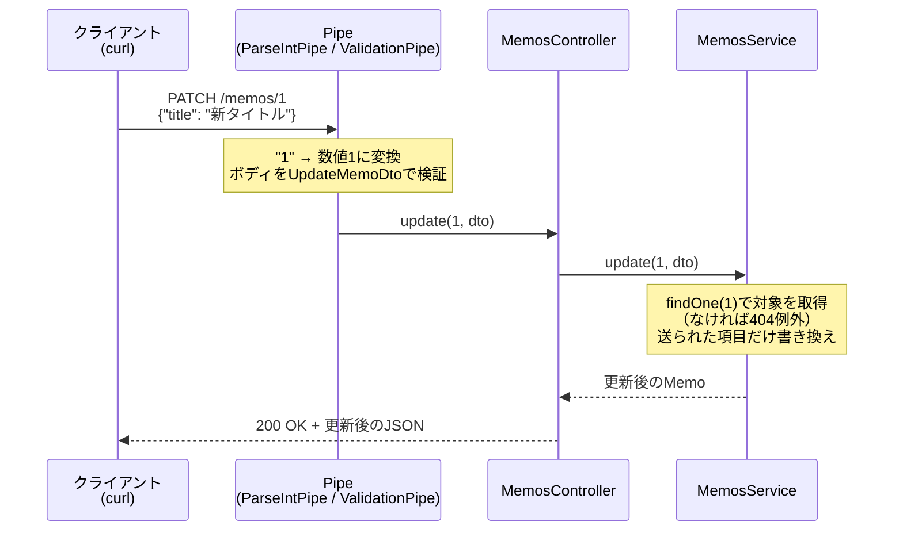
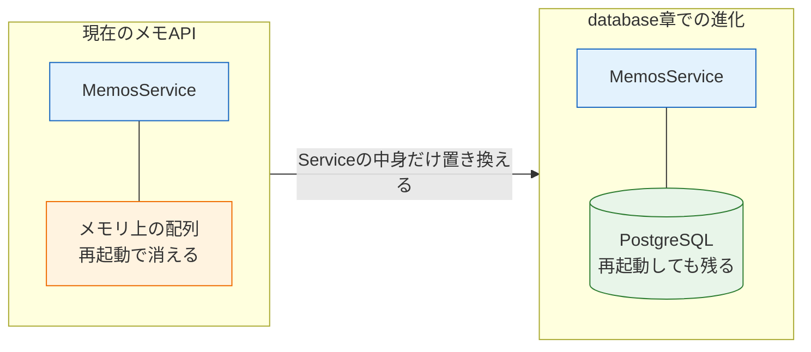

# CRUD実践：メモAPIを作る

このページはセクションの集大成です。[HTTPとREST](/backend/http_and_rest/)で設計し、[Controller](/backend/controller/)・[Service](/backend/service_and_di/)・[DTO](/backend/dto_and_validation/)と部品を揃えてきたメモAPIを、ここで完成させます。作成・取得・更新・削除の4操作を一通り実装し、curlですべてのエンドポイントの動作を確認します。

データの保管場所は引き続き**メモリ上の配列**です。データベースへの永続化は[データベースとPrisma](/database/)セクションで行いますが、Service以外のコードはそのときもほぼそのまま使えます。それが、これまで積み上げてきた分離設計の成果です。

## 学習目標

- CRUDの4操作をREST APIとして実装できる
- NotFoundExceptionで「存在しないリソース」に404を返せる
- 完成したAPIの全エンドポイントをcurlで動作確認できる
- メモリ上のデータ保持の限界を説明できる

## CRUDとは

CRUD（クラッド）とは、データ操作の基本となる4操作の頭文字です。

| 操作 | 意味 | HTTPメソッド |
|---|---|---|
| **C**reate | 作成 | POST |
| **R**ead | 読み取り | GET |
| **U**pdate | 更新 | PATCH（または PUT） |
| **D**elete | 削除 | DELETE |

掲示板の投稿、ECサイトの商品、SNSのユーザー — どんなWebアプリも、その中心にはリソースのCRUDがあります。「CRUDを一通り作れる」ことは、バックエンド開発者としての最初の到達点です。

## 完成形の仕様

これから作るメモAPIの全体仕様です。[HTTPとREST](/backend/http_and_rest/)で設計した表を、実装に必要な情報まで含めて確定させます。

| 操作 | メソッドとパス | リクエスト | 成功 | 失敗 |
|---|---|---|---|---|
| 一覧取得 | `GET /memos` | クエリ`keyword`（任意） | 200 + メモの配列 | — |
| 1件取得 | `GET /memos/:id` | — | 200 + メモ | 404（存在しないID） |
| 作成 | `POST /memos` | ボディ（title, body 必須） | 201 + 作成したメモ | 400（検証エラー） |
| 部分更新 | `PATCH /memos/:id` | ボディ（title, body 任意） | 200 + 更新後のメモ | 400 / 404 |
| 削除 | `DELETE /memos/:id` | — | 200 + 削除したメモ | 404 |

メモ1件のデータ構造には、実務でほぼ必ず付ける**作成日時（createdAt）**を加えます。

```typescript
{
  id: 1,                                  // サーバーが採番する
  title: "買い物リスト",                   // クライアントが送る
  body: "牛乳と卵を買う",                  // クライアントが送る
  createdAt: "2026-06-12T10:00:00.000Z"   // サーバーが記録する
}
```

`id`と`createdAt`はサーバー側で決める値なので、DTO（クライアントが送る形）には含まれない点に注意してください。

## 前提の確認

ここまでのページを終えていれば、プロジェクトは次の状態になっているはずです。

- `src/memos/` に `memos.module.ts` / `memos.controller.ts` / `memos.service.ts` がある
- `src/memos/dto/` に `create-memo.dto.ts` / `update-memo.dto.ts` がある
- `main.ts` で `ValidationPipe`（whitelist付き）が有効になっている
- `pnpm run start:dev` でサーバーが起動できる

不足があれば該当ページに戻って整えてから進んでください。

## Serviceを完成させる

まず、データを司るServiceにCRUDの全メソッドを実装します。ファイルを次の内容に書き換えてください。

**`src/memos/memos.service.ts`（全体）**

```typescript
import { Injectable, NotFoundException } from '@nestjs/common';
import { CreateMemoDto } from './dto/create-memo.dto';
import { UpdateMemoDto } from './dto/update-memo.dto';

export type Memo = {
  id: number;
  title: string;
  body: string;
  createdAt: string;
};

@Injectable()
export class MemosService {
  private memos: Memo[] = [];
  private nextId = 1;

  findAll(keyword?: string): Memo[] {
    if (keyword) {
      return this.memos.filter((memo) => memo.title.includes(keyword));
    }
    return this.memos;
  }

  findOne(id: number): Memo {
    const memo = this.memos.find((memo) => memo.id === id);
    if (!memo) {
      throw new NotFoundException(`id ${id} のメモは存在しません`);
    }
    return memo;
  }

  create(createMemoDto: CreateMemoDto): Memo {
    const memo: Memo = {
      id: this.nextId,
      title: createMemoDto.title,
      body: createMemoDto.body,
      createdAt: new Date().toISOString(),
    };
    this.nextId = this.nextId + 1;
    this.memos.push(memo);
    return memo;
  }

  update(id: number, updateMemoDto: UpdateMemoDto): Memo {
    const memo = this.findOne(id);
    if (updateMemoDto.title !== undefined) {
      memo.title = updateMemoDto.title;
    }
    if (updateMemoDto.body !== undefined) {
      memo.body = updateMemoDto.body;
    }
    return memo;
  }

  remove(id: number): Memo {
    const memo = this.findOne(id);
    this.memos = this.memos.filter((m) => m.id !== id);
    return memo;
  }
}
```

**コード解説**

- `private memos: Memo[] = []` — メモの保管場所です。今回は初期データなしの空配列から始めます。
- `private nextId = 1` — 次に割り当てるIDです。作成のたびに1ずつ増やすことで、IDの重複を防ぎます（採番、と呼びます）。データベース導入後はこの採番もデータベースが担います。
- `findOne` — 見つからない場合に`NotFoundException`を**throw**します。これまで`undefined`を返していた弱点の解消です（詳細は次節）。見つかった場合の返り値の型が`Memo | undefined`から`Memo`になり、呼び出し側が扱いやすくなった点にも注目してください。
- `create` — DTOの内容に、サーバーが決める`id`と`createdAt`を組み合わせて1件分のメモを作り、配列に追加します。`new Date().toISOString()`は現在日時を`2026-06-12T10:00:00.000Z`のような国際標準形式の文字列にします。
- `update` — まず`this.findOne(id)`で対象を取得します。存在しなければここで404の例外が投げられるため、以降は「メモは必ず存在する」前提で書けます。`!== undefined`の判定により、**DTOに含まれていた項目だけ**を書き換えます。これがPATCH（部分更新）の実装です。
- `remove` — 対象の存在を確認したうえで、`filter`で「そのID以外」だけを残した新しい配列に置き換えます。削除したメモを返すのは、クライアントが「何が消えたか」を確認できるようにするためです。

### NotFoundException — 例外でエラーレスポンスを作る

`NotFoundException`は、NestJSが用意している**HTTP例外クラス**の1つです。Controllerでの処理中（またはそこから呼ばれたServiceの中）でこの例外をthrowすると、NestJSが捕まえて、**404 Not Foundのレスポンスに自動変換**してくれます。

```typescript
throw new NotFoundException(`id ${id} のメモは存在しません`);
```

これがクライアントには次のように届きます。

```json
{"message":"id 999 のメモは存在しません","error":"Not Found","statusCode":404}
```

主なHTTP例外クラスを一覧しておきます。すべて`@nestjs/common`からimportできます。

| 例外クラス | ステータスコード |
|---|---|
| `BadRequestException` | 400 |
| `UnauthorizedException` | 401（[SNS開発の認証](/sns/nestjs/auth/)で使用） |
| `NotFoundException` | 404 |
| `InternalServerErrorException` | 500 |

なお、これらの例外を使わずに**予期しないエラー**（プログラムのバグなど）が起きた場合、NestJSは自動で500 Internal Server Errorを返します。[HTTPとREST](/backend/http_and_rest/)で学んだ「500はサーバー側の誤り」が、フレームワークの既定動作として実現されているわけです。

例外を使う設計の利点は、**Serviceの返り値の型が汚れない**ことです。「見つからないかもしれない」を`Memo | undefined`で表現すると、呼び出し側すべてにundefinedチェックが必要になります。例外なら「正常系の型はMemoだけ。異常系は例外で別ルート」と分離でき、コードの見通しが良くなります。

## Controllerを完成させる

次に受付係です。PATCHとDELETEのルートを加え、全メソッドをServiceへの依頼に揃えます。

**`src/memos/memos.controller.ts`（全体）**

```typescript
import {
  Body,
  Controller,
  Delete,
  Get,
  Param,
  ParseIntPipe,
  Patch,
  Post,
  Query,
} from '@nestjs/common';
import { CreateMemoDto } from './dto/create-memo.dto';
import { UpdateMemoDto } from './dto/update-memo.dto';
import { MemosService } from './memos.service';

@Controller('memos')
export class MemosController {
  constructor(private readonly memosService: MemosService) {}

  @Get()
  findAll(@Query('keyword') keyword?: string) {
    return this.memosService.findAll(keyword);
  }

  @Get(':id')
  findOne(@Param('id', ParseIntPipe) id: number) {
    return this.memosService.findOne(id);
  }

  @Post()
  create(@Body() createMemoDto: CreateMemoDto) {
    return this.memosService.create(createMemoDto);
  }

  @Patch(':id')
  update(
    @Param('id', ParseIntPipe) id: number,
    @Body() updateMemoDto: UpdateMemoDto,
  ) {
    return this.memosService.update(id, updateMemoDto);
  }

  @Delete(':id')
  remove(@Param('id', ParseIntPipe) id: number) {
    return this.memosService.remove(id);
  }
}
```

**コード解説**

- `@Patch(':id')` / `@Delete(':id')` — 新登場の2つのルートデコレータです。使い方は`@Get`や`@Post`と同じで、HTTPメソッドだけが異なります。
- `update`メソッド — パスパラメータ（対象の特定）とボディ（更新内容）を**両方**受け取ります。`@Param`と`@Body`は1つのメソッドに同居できます。
- すべてのメソッドが1行 — Controllerは「受け取って、依頼して、返す」だけ。この薄さが正しい姿です。
- ParseIntPipeとDTO — [前ページ](/backend/dto_and_validation/)で導入した検証が全ルートに効いています。不正なIDは400、不正なボディも400、存在しないIDは404（Serviceの例外）と、異常系の応答がすべて自動化されています。

保存して、起動ログで5つのルートが揃ったことを確認します。

```
[Nest] LOG [RouterExplorer] Mapped {/memos, GET} route
[Nest] LOG [RouterExplorer] Mapped {/memos/:id, GET} route
[Nest] LOG [RouterExplorer] Mapped {/memos, POST} route
[Nest] LOG [RouterExplorer] Mapped {/memos/:id, PATCH} route
[Nest] LOG [RouterExplorer] Mapped {/memos/:id, DELETE} route
```

## リクエストの一生 — 全部品の連携

完成したAPIで、1つのリクエストがどう処理されるかを通しで確認します。`PATCH /memos/1`を例にしたシーケンス図です。



Pipe（入口の検証）→ Controller（受付）→ Service（ロジック）という分業の全体が、1本の線としてつながりました。

## curlで全エンドポイントを動作確認する

それでは、APIを一通り操作してみましょう。サーバーを`pnpm run start:dev`で起動し、**別のターミナル**で以下を順番に実行してください。メモリ上のデータはサーバー再起動で消えるため、**途中でソースコードを保存し直すと（watchモードが再起動して）データがリセットされる**点に注意してください。その場合は最初からやり直せば大丈夫です。

### ① 作成（Create）— POST /memos

メモを2件作成します。

```bash
curl -i -X POST http://localhost:3000/memos \
  -H "Content-Type: application/json" \
  -d '{"title": "買い物リスト", "body": "牛乳と卵を買う"}'
```

実行結果の例:

```
HTTP/1.1 201 Created
Content-Type: application/json; charset=utf-8

{"id":1,"title":"買い物リスト","body":"牛乳と卵を買う","createdAt":"2026-06-12T10:00:00.000Z"}
```

サーバーが採番した`id: 1`と`createdAt`が付与されています。続けて2件目を作成します。

```bash
curl -X POST http://localhost:3000/memos \
  -H "Content-Type: application/json" \
  -d '{"title": "読みたい本", "body": "TypeScriptの入門書"}'
```

実行結果の例:

```json
{"id":2,"title":"読みたい本","body":"TypeScriptの入門書","createdAt":"2026-06-12T10:01:00.000Z"}
```

`id`が`2`に進んでいます（以降、ヘッダー確認が不要なコマンドでは`-i`を省略します）。

検証エラーも確認しておきます。`title`を空にして送ってみます。

```bash
curl -i -X POST http://localhost:3000/memos \
  -H "Content-Type: application/json" \
  -d '{"title": "", "body": "本文"}'
```

実行結果の例:

```
HTTP/1.1 400 Bad Request

{"message":["title should not be empty"],"error":"Bad Request","statusCode":400}
```

`@IsNotEmpty()`が働き、400で弾かれました。

### ② 読み取り（Read）— GET /memos と GET /memos/:id

一覧を取得します。

```bash
curl http://localhost:3000/memos
```

実行結果の例:

```json
[{"id":1,"title":"買い物リスト","body":"牛乳と卵を買う","createdAt":"2026-06-12T10:00:00.000Z"},{"id":2,"title":"読みたい本","body":"TypeScriptの入門書","createdAt":"2026-06-12T10:01:00.000Z"}]
```

作成した2件が配列で返ります。キーワード絞り込みも確認します。

```bash
curl "http://localhost:3000/memos?keyword=本"
```

実行結果の例:

```json
[{"id":2,"title":"読みたい本","body":"TypeScriptの入門書","createdAt":"2026-06-12T10:01:00.000Z"}]
```

1件取得と、存在しないIDの404も確認します。

```bash
curl http://localhost:3000/memos/1
```

実行結果の例:

```json
{"id":1,"title":"買い物リスト","body":"牛乳と卵を買う","createdAt":"2026-06-12T10:00:00.000Z"}
```

```bash
curl -i http://localhost:3000/memos/999
```

実行結果の例:

```
HTTP/1.1 404 Not Found

{"message":"id 999 のメモは存在しません","error":"Not Found","statusCode":404}
```

Serviceで投げた`NotFoundException`が、404レスポンスとして届いています。

### ③ 更新（Update）— PATCH /memos/:id

`id: 1`のメモの`title`だけを変更します。

```bash
curl -i -X PATCH http://localhost:3000/memos/1 \
  -H "Content-Type: application/json" \
  -d '{"title": "週末の買い物リスト"}'
```

実行結果の例:

```
HTTP/1.1 200 OK

{"id":1,"title":"週末の買い物リスト","body":"牛乳と卵を買う","createdAt":"2026-06-12T10:00:00.000Z"}
```

`title`だけが変わり、送らなかった`body`は元のまま残っています。これがPATCH（部分更新）の動作です。存在しないIDへの更新は404になることも確認します。

```bash
curl -i -X PATCH http://localhost:3000/memos/999 \
  -H "Content-Type: application/json" \
  -d '{"title": "更新できないはず"}'
```

実行結果の例:

```
HTTP/1.1 404 Not Found

{"message":"id 999 のメモは存在しません","error":"Not Found","statusCode":404}
```

### ④ 削除（Delete）— DELETE /memos/:id

`id: 2`のメモを削除します。

```bash
curl -i -X DELETE http://localhost:3000/memos/2
```

実行結果の例:

```
HTTP/1.1 200 OK

{"id":2,"title":"読みたい本","body":"TypeScriptの入門書","createdAt":"2026-06-12T10:01:00.000Z"}
```

削除されたメモが返りました。一覧で本当に消えたか確認します。

```bash
curl http://localhost:3000/memos
```

実行結果の例:

```json
[{"id":1,"title":"週末の買い物リスト","body":"牛乳と卵を買う","createdAt":"2026-06-12T10:00:00.000Z"}]
```

`id: 2`が消え、1件だけになりました。同じIDをもう一度削除しようとすると、今度は404が返ります。

```bash
curl -i -X DELETE http://localhost:3000/memos/2
```

実行結果の例:

```
HTTP/1.1 404 Not Found

{"message":"id 2 のメモは存在しません","error":"Not Found","statusCode":404}
```

これで、仕様表に書いた**成功・失敗を含むすべての応答**を確認できました。メモAPIの完成です。

## メモリ保持の限界と、この先の話

最後に、このAPIの限界を正しく認識しておきましょう。試しにサーバーを`Ctrl + C`で停止し、再度`pnpm run start:dev`で起動してから一覧を取得してください。

```bash
curl http://localhost:3000/memos
```

実行結果の例:

```json
[]
```

すべてのメモが消えています。データが**サーバープロセスのメモリ上**にしかないため、再起動すれば失われるのです。実際のサービスでは、サーバーの再起動・障害・台数追加はあたりまえに起きるので、データは**データベース**という専用の保管庫に永続化します。



[データベースとPrisma](/database/)セクションでは、このメモAPIを題材に、配列操作をデータベース操作（Prisma）へ置き換えます。ControllerもDTOもルーティングも今日のまま使えます。「Serviceにデータ操作を閉じ込めた」設計判断が、そこで効いてきます。

また、今のAPIは**誰でも**メモを作成・削除できます。「自分のメモだけ操作できる」ようにするには認証（ログイン）と、それに基づくリクエストの保護（Guard）が必要です。これはSNS開発セクションの[認証](/sns/nestjs/auth/)で導入します。

## 理解度チェック

**Q1. CRUDの4操作と、今回のメモAPIでのHTTPメソッド・パスの対応をすべて挙げてください。**

<details markdown="1">
<summary>解答を見る</summary>

- Create（作成）— `POST /memos`
- Read（読み取り）— `GET /memos`（一覧）、`GET /memos/:id`（1件）
- Update（更新）— `PATCH /memos/:id`
- Delete（削除）— `DELETE /memos/:id`

</details>

**Q2. `id`と`createdAt`がCreateMemoDtoに含まれていないのはなぜですか。**

<details markdown="1">
<summary>解答を見る</summary>

DTOは「クライアントが送ってくるデータの形」を定義するものであり、`id`（サーバーが採番する）と`createdAt`（サーバーが記録する）はサーバー側で決める値だからです。もしクライアントに指定させると、IDの重複や日時の偽装といった不整合の原因になります。クライアントから受け取る値と、サーバーが決める値を区別することが重要です。

</details>

**Q3. Serviceの`findOne`で、`undefined`を返す代わりに`NotFoundException`をthrowする設計の利点を2つ説明してください。**

<details markdown="1">
<summary>解答を見る</summary>

1. **返り値の型が単純になる** — 返り値が`Memo | undefined`ではなく`Memo`になり、呼び出し側（Controllerや`update` / `remove`）でのundefinedチェックが不要になります。正常系と異常系のルートが分離され、コードの見通しが良くなります。
2. **HTTPレスポンスへの変換が自動化される** — NestJSがこの例外を捕まえて404 Not Foundのレスポンスに自動変換してくれるため、ステータスコードの設定やエラーボディの組み立てを自分で書く必要がありません。

</details>

**Q4. `PATCH /memos/1`に`{"title": "新タイトル"}`だけを送ったとき、`body`が消えずに残るのは、Serviceのどのコードのおかげですか。**

<details markdown="1">
<summary>解答を見る</summary>

`update`メソッドの`if (updateMemoDto.body !== undefined)`という判定のおかげです。DTOに含まれていない項目は`undefined`なので書き換えがスキップされ、既存の値が残ります。送られてきた項目だけを反映するこの実装が、PATCH（部分更新）の意味を実現しています。

</details>

**Q5. サーバーを再起動するとメモがすべて消えるのはなぜですか。また、それを解決する手段は何ですか。**

<details markdown="1">
<summary>解答を見る</summary>

メモのデータがサーバープロセスのメモリ上（MemosServiceの`memos`配列）にしか存在しないからです。プロセスが終了するとメモリの内容は失われます。解決するには、データをデータベースなどの永続的な保管庫に保存（永続化）します。本カリキュラムでは[データベースとPrisma](/database/)セクションで、このメモAPIをPostgreSQLに永続化する改造を行います。

</details>

**Q6. 今のメモAPIは誰でもすべてのメモを削除できます。これを「ログインした本人のメモだけ削除できる」ようにするために必要な仕組みは何ですか（名前だけで構いません）。**

<details markdown="1">
<summary>解答を見る</summary>

認証（ユーザーが誰であるかを確認する仕組み。ログイン）と、認証情報に基づいてリクエストを通すか弾くかを判断するGuard（ガード）です。どちらもこのセクションでは扱わず、SNS開発セクションの[認証](/sns/nestjs/auth/)で初めて実装します。

</details>

## セルフレビュー

- [ ] 5つのエンドポイントすべてをcurlで叩き、期待どおりの結果を確認した
- [ ] 400（検証エラー）と404（存在しないID）の両方を意図的に発生させられた
- [ ] Service / Controller / DTOのそれぞれの役割を、完成したコードを指しながら説明できる
- [ ] `create`での採番と`createdAt`の付与を、コードを見ずに書ける
- [ ] PATCHの「送られた項目だけ更新する」実装を自分の言葉で説明できる
- [ ] NotFoundExceptionが404レスポンスになるまでの流れを説明できる
- [ ] このAPIの2つの限界（永続化なし・認証なし）と、それぞれをどの章で解決するかを言える
- [ ] 似た題材（例: ブックマークAPI）なら、写経せずに同じ構成で作れる気がする

## 次のステップ

おめでとうございます。設計（REST）から実装（NestJS）、検証（curl）まで、APIをゼロから完成させる一連の流れを経験しました。次の[練習問題](/backend/practice/)で、このセクション全体の理解を確認しましょう。

このメモAPIは今後のセクションの共通題材です。[Docker基礎](/docker/)ではこのAPIをコンテナで動かし、[データベースとPrisma](/database/)では永続化し、[バックエンドテスト](/testing/)ではテストを書きます。プロジェクトは消さずに保管しておいてください。
