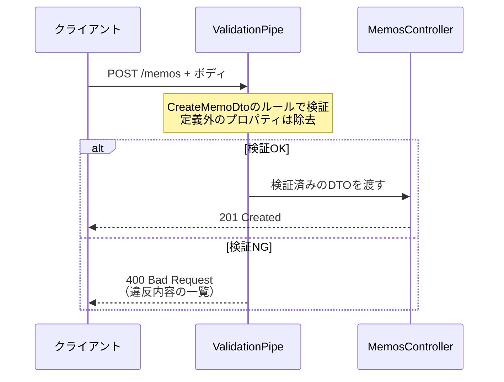

# DTOとバリデーション

[ServiceとDI](/backend/service_and_di/)までで構造は整いましたが、APIには大きな穴が残っています。クライアントが送ってくるデータを**まったく検証していない**のです。このページでは、受け取るデータの形をDTO（ディーティーオー）として定義し、class-validator（クラスバリデータ）とValidationPipe（バリデーションパイプ）で不正なリクエストを自動的に400エラーにする仕組みを導入します。

## 学習目標

- TypeScriptの型注釈が実行時には何も検証しないことを説明できる
- DTOとは何か、なぜ`type`ではなく`class`で書くのかを説明できる
- class-validatorのデコレータでバリデーションルールを宣言できる
- ValidationPipeを有効化し、不正なリクエストに400を返せる
- ParseIntPipeでパスパラメータを安全に数値へ変換できる

## 問題の確認 — 型注釈は実行時に消える

現在の`create`の定義を思い出してください。

```typescript
@Post()
create(@Body() body: { title: string; body: string }) { ... }
```

`title`は`string`と書いてあるので安心に見えます。では、わざと壊れたデータを送ってみましょう。サーバーを起動した状態で実行してください。

```bash
curl -i -X POST http://localhost:3000/memos \
  -H "Content-Type: application/json" \
  -d '{"title": 123, "hack": "余計なデータ"}'
```

実行結果の例:

```
HTTP/1.1 201 Created
Content-Type: application/json; charset=utf-8

{"id":3,"title":123}
```

`title`が数値でも、`body`がなくても、知らないプロパティ`hack`が混ざっていても、**201 Createdで素通り**してしまいました。

なぜでしょうか。[コンパイル](/typescript/compile/)で学んだとおり、TypeScriptの型はコンパイル時のチェックにしか使われず、**コンパイル後のJavaScriptからは消えてしまう**からです。型注釈は「私たちが書くコード」の間違いは防げますが、「外部から実行時に届くデータ」の間違いは防げません。

外部から届くデータは信用できない、という前提に立つのがバックエンドの鉄則です。データベースを導入する前に、入口でデータを検証する仕組みを整えます。

## DTOとは

DTO（Data Transfer Object、データ・トランスファー・オブジェクト）とは、**やり取りするデータの形を定義した専用のクラス**のことです。「メモ作成のリクエストボディはこういう形」という契約書をコードにしたもの、と考えてください。

まずは検証ルールなしの素朴な形で書いてみます。ファイルの置き場所は、慣例に従って`src/memos/dto/`ディレクトリにします。

**`src/memos/dto/create-memo.dto.ts`（第一段階）**

```typescript
export class CreateMemoDto {
  title: string;
  body: string;
}
```

### なぜtypeではなくclassなのか

[基本型](/typescript/basic_types/)以来、データの形は`type`で書いてきました。なぜDTOは`class`なのでしょうか。

理由は先ほどの実験と同じく「**型は実行時に消える**」からです。

- `type`や`interface` — コンパイル時だけの存在。実行時には跡形もなく消える
- `class` — コンパイル後も**実行時にJavaScriptのクラスとして存在し続ける**

これから「実行時に届いたデータを検証する」のですから、検証ルールの置き場所も実行時に存在していなければなりません。classであれば、デコレータで検証ルールを取り付けて、実行時にNestJSがそれを読み取れるのです。

## class-validatorでルールを宣言する

検証ルールの記述には、NestJS公式が推奨するclass-validatorというライブラリを使います。あわせて、検証の前段でデータをDTOクラスのインスタンスへ変換するclass-transformer（クラストランスフォーマー）も必要です。プロジェクトのルートで両方インストールします。

```bash
pnpm add class-validator class-transformer
```

実行結果の例:

```
Packages: +5
+++++
Progress: resolved 720, reused 720, downloaded 0, added 5, done

dependencies:
+ class-transformer 0.5.1
+ class-validator 0.14.1

Done in 2.1s
```

DTOにルールを書き加えます。

**`src/memos/dto/create-memo.dto.ts`**

```typescript
import { IsNotEmpty, IsString, MaxLength } from 'class-validator';

export class CreateMemoDto {
  @IsString()
  @IsNotEmpty()
  @MaxLength(100)
  title: string;

  @IsString()
  @IsNotEmpty()
  body: string;
}
```

**コード解説**

- `@IsString()` — 値が文字列であることを要求します。
- `@IsNotEmpty()` — 空（空文字列・null・undefined）でないこと、つまり実質的な必須指定です。
- `@MaxLength(100)` — 文字数の上限です。タイトルが無制限に長いのは不自然なので制限を設けています。
- デコレータは**プロパティの直前**に置きます。[NestJSとは](/backend/what_is_nestjs/)で学んだ「デコレータは直後の対象への意味づけ」が、ここではプロパティに対して働いています。1つのプロパティに複数のルールを重ねられます。

よく使うデコレータを一覧しておきます。

| デコレータ | 意味 |
|---|---|
| `@IsString()` | 文字列であること |
| `@IsInt()` / `@IsNumber()` | 整数 / 数値であること |
| `@IsBoolean()` | 真偽値であること |
| `@IsNotEmpty()` | 空でないこと（必須） |
| `@IsOptional()` | 省略を許可する（省略時は他のルールを適用しない） |
| `@MaxLength(n)` / `@MinLength(n)` | 文字数の上限 / 下限 |
| `@IsEmail()` | メールアドレスの形式であること |

`@IsEmail()`は、SNS開発セクションの[認証](/sns/nestjs/auth/)でユーザー登録を作るときに活躍します。

## ValidationPipeを有効化する

ルールを書いただけでは、まだ検証は動きません。「リクエストがControllerに届く前に、DTOのルールで検査する」係を有効化する必要があります。それがValidationPipeです。

Pipe（パイプ）とは、NestJSにおいて**リクエストのデータがハンドラ（Controllerのメソッド）に渡る直前に、変換や検証を行う部品**の総称です。アプリ全体で有効化するには、`main.ts`に1行加えます。

**`src/main.ts`**

```typescript
import { ValidationPipe } from '@nestjs/common';
import { NestFactory } from '@nestjs/core';
import { AppModule } from './app.module';

async function bootstrap() {
  const app = await NestFactory.create(AppModule);
  app.useGlobalPipes(new ValidationPipe({ whitelist: true }));
  await app.listen(3000);
}
bootstrap();
```

**コード解説**

- `app.useGlobalPipes(...)` — アプリ全体のすべてのルートに対してPipeを適用します。エンドポイントごとに付け忘れる心配がないため、ValidationPipeはグローバルに設定するのが定石です。
- `new ValidationPipe({ whitelist: true })` — `whitelist: true`は「**DTOに定義されていないプロパティを自動で取り除く**」オプションです。先ほどの`hack`のような余計なデータの混入を防ぎます。

最後に、Controllerの`@Body()`の型をDTOに差し替えます。ValidationPipeは「引数の型がDTOクラスであること」を手がかりに検証を行うため、この差し替えが必須です。

**`src/memos/memos.controller.ts`（createの書き換えとimport追加）**

```typescript
import { CreateMemoDto } from './dto/create-memo.dto';
```

```typescript
  @Post()
  create(@Body() createMemoDto: CreateMemoDto) {
    return createMemoDto; // 動作確認用。次ページでServiceにつなぐ
  }
```

## 検証の動作を確認する

まず、先ほどと同じ壊れたデータを送ってみます。

```bash
curl -i -X POST http://localhost:3000/memos \
  -H "Content-Type: application/json" \
  -d '{"title": 123, "hack": "余計なデータ"}'
```

実行結果の例:

```
HTTP/1.1 400 Bad Request
Content-Type: application/json; charset=utf-8

{"message":["title must be shorter than or equal to 100 characters","title must be a string","body should not be empty","body must be a string"],"error":"Bad Request","statusCode":400}
```

今度は**400 Bad Request**で弾かれました。`message`配列には「どのプロパティが、どのルールに違反したか」が列挙されています。[HTTPとREST](/backend/http_and_rest/)で学んだ「400はクライアント側の誤り」を、自分のAPIが正しく返せるようになりました。

正しいデータも確認します。

```bash
curl -i -X POST http://localhost:3000/memos \
  -H "Content-Type: application/json" \
  -d '{"title": "新しいメモ", "body": "本文です", "hack": "余計なデータ"}'
```

実行結果の例:

```
HTTP/1.1 201 Created
Content-Type: application/json; charset=utf-8

{"title":"新しいメモ","body":"本文です"}
```

検証を通過して201が返り、しかも`whitelist: true`の効果で`hack`がレスポンスから消えています（ハンドラに渡る前に取り除かれたためです）。

ここまでの流れをシーケンス図で整理します。



重要なのは、**不正なリクエストはControllerに到達すらしない**ことです。ControllerとServiceは「データはすでに検証済み」という前提で書けるため、ロジックが守りのif文だらけにならずに済みます。

## 更新用DTO — @IsOptionalの活用

[HTTPとREST](/backend/http_and_rest/)で決めたとおり、更新はPATCH（部分更新）で作ります。「変更したい項目だけ送る」を許すため、更新用DTOでは全項目を省略可能にします。

**`src/memos/dto/update-memo.dto.ts`**

```typescript
import { IsNotEmpty, IsOptional, IsString, MaxLength } from 'class-validator';

export class UpdateMemoDto {
  @IsOptional()
  @IsString()
  @IsNotEmpty()
  @MaxLength(100)
  title?: string;

  @IsOptional()
  @IsString()
  @IsNotEmpty()
  body?: string;
}
```

**コード解説**

- `@IsOptional()` — 「このプロパティは省略してよい。省略された場合は他のルールを適用しない」という宣言です。
- `@IsString()`など他のルール — 省略せず**値を送ってきた場合には**適用されます。つまり「送らなくてもよいが、送るなら正しい文字列で」という意味になります。
- `title?: string` — TypeScriptの型としても`?`で省略可能にし、宣言と型を一致させます。

このDTOは次ページのPATCHエンドポイントで使います。

## ParseIntPipe — パスパラメータの変換と検証

Pipeの仕組みは、ボディ以外にも使えます。[Controllerとルーティング](/backend/controller/)では、パスパラメータを`Number(id)`で手動変換していました。これには弱点があり、`GET /memos/abc`のような数値でないIDが来ると`Number("abc")`は`NaN`になり、そのままロジックに流れ込んでしまいます。

NestJS組み込みのParseIntPipe（パースイントパイプ）を使うと、変換と検証を同時に解決できます。

**`src/memos/memos.controller.ts`（findOneの書き換えとimport追加）**

```typescript
import {
  Body,
  Controller,
  Get,
  Param,
  ParseIntPipe,
  Post,
  Query,
} from '@nestjs/common';
```

```typescript
  @Get(':id')
  findOne(@Param('id', ParseIntPipe) id: number) {
    return this.memosService.findOne(id);
  }
```

**コード解説**

- `@Param('id', ParseIntPipe)` — デコレータの第2引数にPipeを渡すと、その引数だけにPipeが適用されます。ParseIntPipeは「文字列を整数に変換し、**変換できなければ400を返す**」Pipeです。
- `id: number` — 変換後の値を受け取るので、型注釈も`number`になります。`Number(id)`の手動変換は不要になりました。

数値でないIDを送って確認します。

```bash
curl -i http://localhost:3000/memos/abc
```

実行結果の例:

```
HTTP/1.1 400 Bad Request
Content-Type: application/json; charset=utf-8

{"message":"Validation failed (numeric string is expected)","error":"Bad Request","statusCode":400}
```

不正なIDがロジックに届く前に、入口で400として弾かれるようになりました。

## 理解度チェック

**Q1. `@Body() body: { title: string }`と型注釈を書いても、実行時に`title`が数値のリクエストが素通りするのはなぜですか。**

<details markdown="1">
<summary>解答を見る</summary>

TypeScriptの型注釈はコンパイル時のチェックにのみ使われ、コンパイル後のJavaScriptからは消えてしまうからです。実行時に外部から届くデータに対しては、型注釈は何の検証も行いません。実行時の検証には、class-validatorのような実行時に動く仕組みが別途必要です。

</details>

**Q2. DTOを`type`や`interface`ではなく`class`で定義するのはなぜですか。**

<details markdown="1">
<summary>解答を見る</summary>

`type`や`interface`はコンパイル時だけの存在で実行時に消えるのに対し、`class`はコンパイル後もJavaScriptのクラスとして実行時に存在し続けるからです。実行時のバリデーションを行うには、検証ルール（デコレータ）の取り付け先が実行時に存在している必要があるため、classを使います。

</details>

**Q3. ValidationPipeの`whitelist: true`オプションは何をしますか。これがあると何が嬉しいですか。**

<details markdown="1">
<summary>解答を見る</summary>

DTOに定義されていないプロパティを、ハンドラに渡る前に自動で取り除きます。クライアントが余計なプロパティを紛れ込ませても、ControllerやServiceには「DTOで定義した形のデータ」しか届かなくなるため、想定外のデータがロジックやデータ保存に混入する事故を防げます。

</details>

**Q4. 更新用DTOで`@IsOptional()`と`@IsString()`を同じプロパティに付けると、どんな検証になりますか。**

<details markdown="1">
<summary>解答を見る</summary>

「省略してもよいが、値を送ってくる場合は文字列でなければならない」という検証になります。`@IsOptional()`は省略時に他のルールの適用を止めるデコレータなので、プロパティが存在しなければ検証は行われず、存在すれば`@IsString()`などが適用されます。PATCHの部分更新に適した組み合わせです。

</details>

**Q5. `Number(id)`による手動変換と比べたとき、`@Param('id', ParseIntPipe)`の利点は何ですか。**

<details markdown="1">
<summary>解答を見る</summary>

`Number("abc")`は`NaN`を返すだけなので、手動変換では不正な値がそのままロジックに流れ込みます（別途if文での検査が必要です）。ParseIntPipeは変換と検証を同時に行い、整数に変換できない値には自動で400 Bad Requestを返すため、不正なIDがControllerに到達する前に入口で弾かれます。コードも`Number()`の呼び出しが不要になり簡潔になります。

</details>

**Q6. バリデーションエラーのとき、ステータスコードが500ではなく400で返るのはなぜ適切なのですか。**

<details markdown="1">
<summary>解答を見る</summary>

バリデーションエラーの原因は「クライアントが不正な形式のデータを送ったこと」であり、サーバーのプログラムの不具合ではないからです。[HTTPとREST](/backend/http_and_rest/)で学んだとおり、400番台は「クライアント側の誤り」を表します。400を返すことで、クライアント側は「自分の送っているデータを直すべきだ」と正しく判断できます。

</details>

## セルフレビュー

- [ ] 型注釈とバリデーションの違いを「コンパイル時と実行時」という言葉で説明できる
- [ ] DTOの役割と、classで書く理由を自分の言葉で説明できる
- [ ] class-validatorの主要なデコレータ（IsString / IsNotEmpty / IsOptional / MaxLength）を使い分けられる
- [ ] ValidationPipeをグローバルに有効化する手順を、`main.ts`を見ずに書ける
- [ ] whitelistオプションの効果をcurlで確認した
- [ ] 作成用DTOと更新用DTOの違い（必須か省略可能か）を説明できる
- [ ] ParseIntPipeで不正なパスパラメータが400になることを確認した

## 次のステップ

これでメモAPIに必要な部品 — ルーティング、Service、DI、DTO、バリデーション — がすべて揃いました。次の[CRUD実践：メモAPIを作る](/backend/crud_practice/)では、これらを総動員してメモAPIの5つのエンドポイントを完成させ、curlで一通り動作確認します。

DTOとバリデーションは、この後すべてのAPI開発で使います。SNS開発セクションでは、ユーザー登録の入力検証（[認証](/sns/nestjs/auth/)）や投稿の文字数制限（[投稿機能](/sns/nestjs/posts/)）として再登場します。
