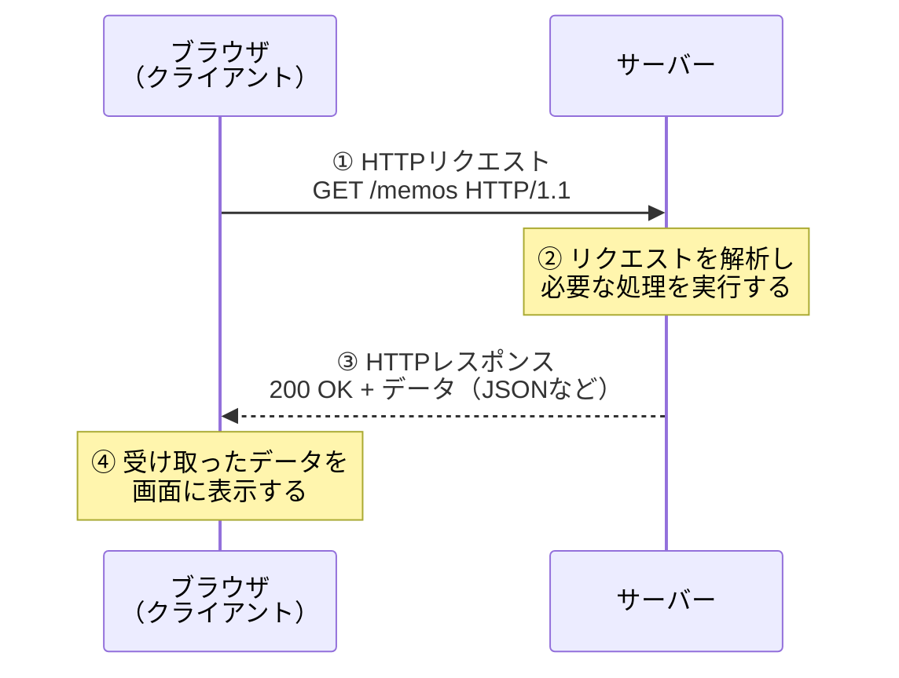
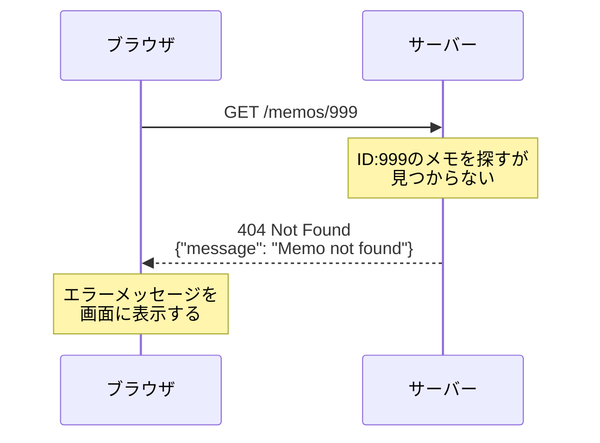
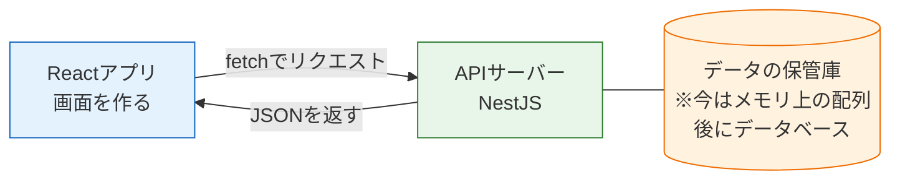

# HTTPとREST

バックエンドの学習を始める前に、まず「ブラウザとサーバーはどうやって会話しているのか」を理解しましょう。このページで学ぶHTTP（エイチティーティーピー）とREST（レスト）は、この後すべてのページの土台になる知識です。[fetchでAPI通信](/react/api_fetch/)では`fetch`でAPIを「呼ぶ側」を経験しましたが、ここからはその通信の中身を正確に理解し、「応える側」を作る準備をします。

## 学習目標

- HTTPのリクエストとレスポンスの構造を説明できる
- 主要なHTTPメソッド（GET/POST/PUT/PATCH/DELETE）の使い分けを説明できる
- 代表的なステータスコード（200/201/400/401/404/500）の意味を説明できる
- RESTの考え方に沿ったURL設計ができる

## ブラウザとサーバーの会話の流れ

WebはすべてHTTP（HyperText Transfer Protocol、ハイパーテキスト・トランスファー・プロトコル）という通信の決まりごとの上で動いています。プロトコルとは「通信の手順とデータの形式に関する約束」のことです。お互いに約束を守るからこそ、世界中のどのブラウザもどのサーバーとも会話できます。

HTTPの会話は、必ず次の形をとります。

1. クライアント（ブラウザなど）が**リクエスト（要求）**を送る
2. サーバーが**レスポンス（応答）**を返す

ブラウザでWebページを開いたときの流れをシーケンス図で見てみましょう。



ポイントは、**通信は必ずクライアントから始まる**ことです。サーバーは自分から話しかけることはできず、リクエストが来るのを待ち、来たら応答する、という受け身の存在です（サーバーから能動的に送る仕組みは後の[リアルタイム通信](/realtime//)セクションで学びます）。

これから私たちがNestJSで作るのは、この図の右側、「リクエストを受け取って、適切なレスポンスを返すプログラム」です。

## HTTPリクエストの中身

リクエストは、実際には次のようなテキストデータです。

```http
POST /memos HTTP/1.1
Host: api.example.com
Content-Type: application/json

{"title": "買い物リスト", "body": "牛乳と卵を買う"}
```

**コード解説**

- `POST /memos HTTP/1.1` — 1行目は**リクエストライン**。「メソッド（POST）」「パス（/memos）」「HTTPのバージョン」の3つを伝えます。
- `Host: ...` と `Content-Type: ...` — **ヘッダー**。通信に関する付加情報です。`Content-Type: application/json`は「本文はJSON形式です」という申告です。
- 空行の後の`{...}` — **ボディ（本文）**。サーバーに渡したいデータ本体です。GETリクエストのようにボディを持たないリクエストもあります。

つまりリクエストは「**どこに（パス）・何をしたいか（メソッド）・必要ならデータ（ボディ）**」の組み合わせです。

## HTTPレスポンスの中身

サーバーが返すレスポンスも同じようにテキストデータです。

```http
HTTP/1.1 201 Created
Content-Type: application/json

{"id": 1, "title": "買い物リスト", "body": "牛乳と卵を買う"}
```

**コード解説**

- `HTTP/1.1 201 Created` — 1行目は**ステータスライン**。処理結果を表す**ステータスコード**（201）と、その意味を表す短い英文（Created）が入ります。
- ヘッダーとボディの構造はリクエストと同じです。APIではボディにJSONを入れて返すのが一般的です。

[fetchでAPI通信](/react/api_fetch/)で書いた`response.json()`は、まさにこのレスポンスボディのJSONを取り出す処理だった、ということです。

## JSON — リクエストとボディの共通言語

ここで、ボディに使われているJSON（ジェイソン、JavaScript Object Notation）を正確に押さえておきます。JSONは**データをテキストで表現するための形式**で、書き方はJavaScriptのオブジェクトリテラルとほぼ同じです。

```json
{
  "id": 1,
  "title": "買い物リスト",
  "done": false,
  "tags": ["家事", "今日中"]
}
```

JavaScriptのオブジェクトと似ていますが、JSONには独自のルールがあります。

- キーは必ず**ダブルクォートで囲む**（`title:`ではなく`"title":`）
- 文字列もダブルクォートのみ（シングルクォート不可）
- 値に使えるのは文字列・数値・真偽値・null・配列・オブジェクトだけ（関数や`undefined`は不可）
- コメントは書けない

JSONはあくまで「ただのテキスト」なので、プログラムで使うには変換が必要です。

- 受信したJSON文字列 → オブジェクト: `JSON.parse(text)`（パース、解析）
- オブジェクト → 送信用のJSON文字列: `JSON.stringify(obj)`（シリアライズ、文字列化）

[fetchでAPI通信](/react/api_fetch/)の`response.json()`はparseを、`fetch`の`body: JSON.stringify(...)`はstringifyを担っていました。そしてこの後学ぶNestJSでは、**この変換を両方向ともフレームワークが自動で行ってくれます**。言語を問わず読み書きできるシンプルさから、JSONは現代のAPIにおける事実上の標準データ形式になっています。

## HTTPメソッド — 「何をしたいか」を伝える

リクエストの先頭につくメソッドは、「この操作で何をしたいのか」をサーバーに伝える動詞です。よく使う5つを覚えましょう。

| メソッド | 意味 | 典型的な用途 | ボディ |
|---|---|---|---|
| GET | 取得 | データを読み取る（一覧・詳細） | なし |
| POST | 作成 | 新しいデータを登録する | あり |
| PUT | 置換 | 既存データを丸ごと置き換える | あり |
| PATCH | 部分更新 | 既存データの一部だけ変更する | あり |
| DELETE | 削除 | 既存データを削除する | 通常なし |

### なぜメソッドを使い分けるのか

「全部POSTでもデータは送れるのでは？」と思うかもしれません。実際、技術的には可能です。しかしメソッドを正しく使い分けることには明確な利点があります。

- **意図が伝わる** — `GET /memos`を見れば「メモを取得するのだな」と、コードを読まなくても分かります。チーム開発ではこの「読めば分かる」が非常に重要です。
- **安全性の区別** — GETは「何度実行してもデータが変わらない」操作と決まっています。ブラウザやネットワーク機器はこの前提でGETの結果をキャッシュ（一時保存して再利用）できます。もしGETでデータを削除するAPIを作ってしまうと、この前提が壊れて思わぬ事故につながります。

### PUTとPATCHの違い

どちらも「更新」ですが、ニュアンスが異なります。

- **PUT** — リソース全体を送り直して**丸ごと置き換える**。送らなかった項目は消える（または初期値になる）のが原則です。
- **PATCH** — **変更したい項目だけ**を送る。送らなかった項目はそのまま残ります。

たとえばメモの`title`だけ変えたいとき、PATCHなら`{"title": "新しいタイトル"}`だけ送れば済みます。実務のAPIではPATCHが採用されることが多く、このセクションのメモAPIでもPATCHを使います。

## ステータスコード — 結果を3桁の数字で伝える

レスポンスの先頭につくステータスコードは、処理結果を表す3桁の数字です。先頭の数字で大分類が決まります。

- **2xx** — 成功
- **4xx** — クライアント側の誤り（リクエストに問題がある）
- **5xx** — サーバー側の誤り（サーバー内部で問題が起きた）

特によく使う6つを押さえましょう。

| コード | 名前 | 意味 | 例 |
|---|---|---|---|
| 200 | OK | 成功 | データの取得・更新・削除に成功した |
| 201 | Created | 作成成功 | POSTで新しいデータが作られた |
| 400 | Bad Request | リクエスト不正 | 必須項目が欠けている、形式が間違っている |
| 401 | Unauthorized | 未認証 | ログインしていない（認証情報がない・無効） |
| 404 | Not Found | 見つからない | 指定したIDのデータやURLが存在しない |
| 500 | Internal Server Error | サーバー内部エラー | サーバーのプログラムで予期せぬエラーが起きた |

### 4xxと5xxの違いが重要な理由

400番台は「**直すべきはクライアント側**」、500番台は「**直すべきはサーバー側**」という責任の所在を表します。

たとえばフロントエンドの開発中にAPIがエラーを返したとき、

- `400`なら「送っているデータの形が違うのでは？」とフロントエンドのコードを疑う
- `500`なら「サーバーのプログラムにバグがあるのでは？」とバックエンドのコードを疑う

というように、数字を見るだけで調査の方向が定まります。自分でAPIを作るときも、この区別を守って正しいコードを返すことが「使いやすいAPI」の条件です。

なお`401 Unauthorized`は「ログインが必要なのにしていない」場合のコードです。認証の実装はこのセクションでは扱わず、SNS開発セクションの[認証](/sns/auth/)で学びますが、コードの意味だけは先に覚えておきましょう。

## エラーになる通信の流れ

成功するときだけでなく、失敗するときの流れも図で確認しておきます。存在しないメモを取得しようとした場合です。



重要なのは、**エラーでも通信としては正常に完了している**ことです。サーバーは「見つかりませんでした」という返事をきちんと返しています。クライアントはステータスコードを見て、成功時とは別の処理（エラーメッセージの表示など）を行います。[fetchでAPI通信](/react/api_fetch/)で`response.ok`をチェックしたのは、まさにこのためでした。

## RESTとは — URLとメソッドの設計ルール

ここまでの部品（パス・メソッド・ステータスコード）をどう組み合わせてAPIを設計するか。その事実上の標準となっている考え方がREST（Representational State Transfer、レプリゼンテーショナル・ステート・トランスファー）です。RESTの流儀に従ったAPIを**REST API**と呼びます。

RESTの中心となるルールは次の2つです。

1. **URLは「リソース（操作対象のモノ）」を表す名詞にする**
2. **操作の種類はHTTPメソッドで表す**

「メモ」というリソースに対するREST APIの設計例を見てみましょう。

| やりたいこと | メソッド | パス | 成功時のコード |
|---|---|---|---|
| メモの一覧を取得 | GET | `/memos` | 200 |
| メモを1件取得 | GET | `/memos/1` | 200 |
| メモを作成 | POST | `/memos` | 201 |
| メモを部分更新 | PATCH | `/memos/1` | 200 |
| メモを削除 | DELETE | `/memos/1` | 200 |

注目してほしいのは、**パスは`/memos`と`/memos/1`の2種類しかない**ことです。`/getMemos`や`/deleteMemo`のような動詞入りのURLは作りません。「対象（URL）」と「操作（メソッド）」を分離することで、APIの全体像が整然とし、初めて見る人でも構造を予測できるようになります。

`/memos/1`の`1`の部分は、対象を特定するID（識別子）です。この部分はリクエストごとに変わるため、**パスパラメータ**と呼ばれます。NestJSでの受け取り方は[Controllerとルーティング](/backend/controller/)で学びます。

### 悪い設計と良い設計の比較

| やりたいこと | 悪い例 | 良い例 |
|---|---|---|
| メモ一覧の取得 | `GET /getAllMemos` | `GET /memos` |
| メモの作成 | `POST /createMemo` | `POST /memos` |
| メモの削除 | `GET /memos/delete?id=1` | `DELETE /memos/1` |

悪い例の3つ目は特に危険です。前述のとおりGETは「データを変更しない」前提でキャッシュされうるため、GETで削除を行う設計は事故のもとです。

## APIサーバーは「JSONを返すサーバー」

最後に、これから作るものの位置づけを整理します。サーバーには大きく2つの仕事のスタイルがあります。

- **HTMLを返すサーバー** — ブラウザがそのまま表示できるページを返す
- **JSONを返すサーバー（APIサーバー）** — データだけを返し、画面の構築はフロントエンド（React）に任せる



本カリキュラムではこの役割分担を採用します。React基礎で作った「呼ぶ側」と、これから作る「応える側」が、HTTPとJSONを共通言語として会話するのです。データの保管庫は当面メモリ上の配列で代用し、[データベースとPrisma](/database//)セクションで本物のデータベースに置き換えます。

## 理解度チェック

**Q1. HTTP通信において、リクエストとレスポンスはそれぞれ誰が送るものですか。また、通信はどちらから始まりますか。**

<details markdown="1">
<summary>解答を見る</summary>

リクエストはクライアント（ブラウザなど）が送り、レスポンスはサーバーが返します。通信は必ずクライアントのリクエストから始まります。サーバーは自分からは話しかけられない受け身の存在で、リクエストを待ち受けて応答することが仕事です。

</details>

**Q2. 「メモを1件削除する」操作をREST APIとして設計するとき、メソッドとパスはどうなりますか。`GET /memos/delete?id=1`という設計の問題点もあわせて説明してください。**

<details markdown="1">
<summary>解答を見る</summary>

`DELETE /memos/1`が正しい設計です。URLは「メモというリソース」を名詞で表し、削除という操作はDELETEメソッドで表します。

`GET /memos/delete?id=1`の問題点は2つあります。第一に、URLに動詞（delete）が入っておりRESTの「URLは名詞」の原則に反します。第二に、GETは「何度実行してもデータが変わらない」前提のメソッドであり、キャッシュなどの仕組みもその前提で動くため、GETでデータを削除すると予期せぬタイミングで削除が実行される事故につながりかねません。

</details>

**Q3. PUTとPATCHの違いを説明してください。メモの`title`だけを変更したい場合、どちらが適していますか。**

<details markdown="1">
<summary>解答を見る</summary>

PUTはリソース全体を送り直して丸ごと置き換える更新で、送らなかった項目は消えるのが原則です。PATCHは変更したい項目だけを送る部分更新で、送らなかった項目はそのまま残ります。

`title`だけを変更したい場合はPATCHが適しています。`{"title": "新しいタイトル"}`だけを送れば、他の項目に影響を与えずに更新できます。

</details>

**Q4. ステータスコード400と500の違いは何ですか。フロントエンド開発中にAPIから400が返ってきた場合、まずどこを疑うべきですか。**

<details markdown="1">
<summary>解答を見る</summary>

400番台はクライアント側の誤り（リクエストに問題がある）、500番台はサーバー側の誤り（サーバー内部で問題が起きた）を表します。

400が返ってきた場合は、まずクライアント側、つまり自分が送っているリクエストを疑います。必須項目が欠けていないか、データの形式（JSONの構造や`Content-Type`ヘッダー）が正しいかを確認します。

</details>

**Q5. POSTで新しいデータの作成に成功したとき、200ではなく201を返すのが望ましいのはなぜですか。**

<details markdown="1">
<summary>解答を見る</summary>

201 Createdは「リクエストが成功し、その結果として新しいリソースが作成された」ことを明示するコードだからです。200 OKでも間違いではありませんが、201を返すことで「作成された」という結果の種類までクライアントに正確に伝わります。ステータスコードを適切に使い分けることは、意図が伝わる使いやすいAPIの条件です。なお、NestJSではPOSTに対してデフォルトで201を返します（詳細は[Controllerとルーティング](/backend/controller/)で学びます）。

</details>

## セルフレビュー

- [ ] リクエストとレスポンスのそれぞれの構造（1行目・ヘッダー・ボディ）を自分の言葉で説明できる
- [ ] GET/POST/PUT/PATCH/DELETEの使い分けを、具体例を挙げて説明できる
- [ ] 200/201/400/401/404/500の意味を見ないで言える
- [ ] 4xxと5xxの違いを「責任の所在」の観点から説明できる
- [ ] 「ブログ記事」を題材に、RESTの流儀でメソッドとパスの一覧表を自力で書ける
- [ ] APIサーバーが「JSONを返すサーバー」であることと、Reactとの役割分担を説明できる

## 次のステップ

HTTPとRESTという共通言語を理解できたので、次の[NestJSとは](/backend/what_is_nestjs/)では、REST APIを効率よく作るためのフレームワークNestJSの全体像を学びます。

このページで学んだ内容は、この後すべてのページで使います。特にメソッドとパスの対応表は[CRUD実践：メモAPIを作る](/backend/crud_practice/)でそのまま実装しますし、ステータスコードの知識は[DTOとバリデーション](/backend/dto_and_validation/)（400を返す仕組み）で再登場します。
