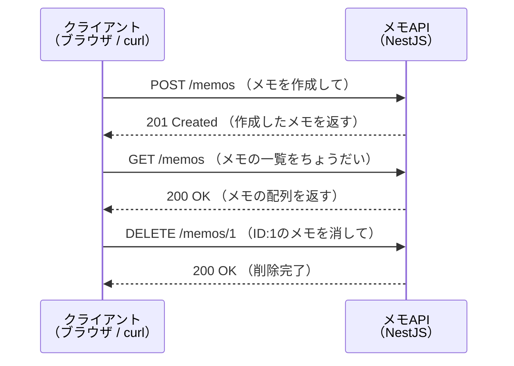

# バックエンド基礎（NestJS）

このセクションでは、Webアプリケーションの「裏側」であるバックエンド（サーバーサイド）を学びます。React基礎のセクションでは、`fetch`を使ってサーバーからデータを取得する方法を学びました。今度は、その「データを返す側」、つまりAPIサーバーを自分の手で作れるようになることが目標です。

フレームワークにはNestJS（ネストジェイエス）を使います。NestJSはTypeScriptで書かれたバックエンドフレームワークで、これまで学んできたTypeScriptの知識をそのまま活かせます。

## このセクションで作れるようになるもの

セクションの終盤では、メモを登録・取得・更新・削除できる「メモAPI」をゼロから作ります。完成すると、次のような通信ができるサーバーが手元で動きます。

ここで作るAPIはデータをメモリ上に保持する簡易版ですが、後の[データベースとPrisma](/database/)セクションでデータベースに永続化する本格的なAPIへと発展させます。さらに最終的には、SNS開発セクションで投稿・いいね・フォローなどの機能を持つ本物のSNSバックエンドを構築します。

## 前提知識

このセクションを始める前に、以下を修了していることを前提とします。

- [TypeScript基礎](/typescript/) — 型、関数、クラスの基本
- [React基礎](/react/) — 特に[fetchでAPI通信](/react/api_fetch/)で学んだ「フロントエンドからAPIを呼ぶ」経験
- [環境構築](/environment/) — Node.js 20とpnpmが使えること（pnpmの導入は[React基礎のセットアップ](/react/setup/)を参照）

## 各ページの内容

| ページ | 内容 |
|---|---|
| [HTTPとREST](/backend/http_and_rest/) | ブラウザとサーバーはどう会話しているのか。HTTPメソッド、ステータスコード、RESTの考え方 |
| [NestJSとは](/backend/what_is_nestjs/) | なぜNestJSを使うのか。Module / Controller / Serviceというアーキテクチャの全体像 |
| [環境構築とプロジェクト作成](/backend/setup/) | Nest CLIでプロジェクトを作り、生成されたファイルを1つずつ読み解いて起動する |
| [Controllerとルーティング](/backend/controller/) | URLと処理を結びつける。パスパラメータ・クエリ・リクエストボディの受け取り方 |
| [ServiceとDI](/backend/service_and_di/) | ロジックの置き場所と、NestJSの心臓部である依存性注入（DI）の仕組み |
| [DTOとバリデーション](/backend/dto_and_validation/) | 受け取るデータの形を定義し、不正なリクエストを自動で弾く |
| [CRUD実践：メモAPIを作る](/backend/crud_practice/) | ここまでの知識を総動員してメモAPIを完成させ、curlで動作確認する |
| [練習問題](/backend/practice/) | 理解の定着を確認する練習問題 |

## 学習の進め方

このセクションは前のページの内容を踏まえて次のページが進む構成です。順番どおりに読み、コードは必ず自分の手で打ち込んで動かしてください。特に[CRUD実践](/backend/crud_practice/)は、それまでのページで学んだ部品がすべて組み合わさるページです。途中で詰まったら、該当する解説ページに戻って確認しましょう。

なお、認証（ログイン機能）やリクエストの保護（Guard）はこのセクションでは扱いません。これらはSNS開発セクションの[認証](/sns/nestjs/auth/)で初めて登場します。まずは「APIを作って動かす」基礎体力をここで身につけます。
