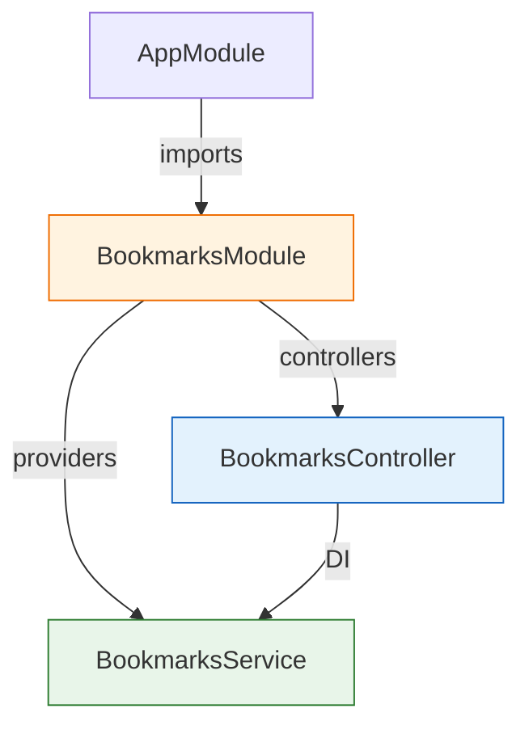

# 練習問題

このセクションの総仕上げです。[CRUD実践](/backend/crud_practice/)でメモAPIを完成させましたが、写経して動いただけでは「作れる」とは言えません。ここでは、設計の確認問題から始めて、メモAPIの拡張、そして**別の題材のAPIをゼロから作る**課題まで、段階的に取り組みます。

各問題は、まず自力で考えて手を動かし、それから解答を開いてください。解答と自分のコードが違っていても、動作が仕様を満たしていれば正解です。

## 学習目標

- RESTの設計をヒントなしで行える
- 既存のAPIに機能（バリデーション・クエリ）を追加できる
- Module / Controller / Service / DTOの構成を自力で組み立てられる
- 作ったAPIをcurlで体系的に動作確認できる

## 問題1: REST設計

「タスク管理アプリ」のバックエンドAPIを設計します。タスク（task）には次の操作が必要です。

- タスクの一覧を取得する
- タスクを1件取得する
- タスクを作成する
- タスクの一部（完了フラグなど）を更新する
- タスクを削除する

RESTの流儀に従って、**メソッド・パス・成功時のステータスコード**の表を書いてください。

<details markdown="1">
<summary>解答を見る</summary>

| 操作 | メソッド | パス | 成功時 |
|---|---|---|---|
| 一覧取得 | GET | `/tasks` | 200 |
| 1件取得 | GET | `/tasks/:id` | 200 |
| 作成 | POST | `/tasks` | 201 |
| 部分更新 | PATCH | `/tasks/:id` | 200 |
| 削除 | DELETE | `/tasks/:id` | 200 |

ポイントは、パスを`/tasks`と`/tasks/:id`の2種類に絞り、操作の種類はHTTPメソッドで表すことです。`/getTasks`や`/tasks/delete`のような動詞入りのパスを書いていたら、[HTTPとREST](/backend/http_and_rest/)を復習してください。作成だけ201である理由も思い出しましょう（新しいリソースが作られたことを明示するためです）。

</details>

## 問題2: コードからルートを読み取る

次のControllerが定義するルートを、「メソッド + パス」の形ですべて挙げてください。また、このコードには1つ落とし穴があります。`GET /articles/drafts`を送るとどうなるか説明してください。

```typescript
@Controller('articles')
export class ArticlesController {
  @Get(':id')
  findOne(@Param('id') id: string) { ... }

  @Get()
  findAll() { ... }

  @Get('drafts')
  findDrafts() { ... }

  @Post()
  create(@Body() dto: CreateArticleDto) { ... }
}
```

<details markdown="1">
<summary>解答を見る</summary>

定義されるルートは次の4つです。

- `GET /articles/:id`
- `GET /articles`
- `GET /articles/drafts`
- `POST /articles`

落とし穴は定義順です。ルートは定義した順に照合されるため、`GET /articles/drafts`は先に定義された`@Get(':id')`に一致してしまい、`findDrafts`ではなく`findOne`が呼ばれます（`id`に文字列`"drafts"`が入ります）。固定パスの`@Get('drafts')`を`@Get(':id')`より上に移動する必要があります。詳細は[Controllerとルーティング](/backend/controller/)を参照してください。

</details>

## 問題3: メモAPIの拡張

[CRUD実践](/backend/crud_practice/)で完成させたメモAPIに、次の2つの機能を追加してください。

1. **本文の文字数制限** — `body`は1000文字以内とする。違反したら400が返ること。
2. **件数制限クエリ** — `GET /memos?limit=5`のように、一覧の最大件数を指定できるようにする。`limit`が省略されたら全件返すこと。

実装後、curlで動作確認まで行ってください。

<details markdown="1">
<summary>解答を見る</summary>

**1. 文字数制限** — DTOにルールを1行足すだけです。`update-memo.dto.ts`にも同様に追加します。

**`src/memos/dto/create-memo.dto.ts`（bodyの部分）**

```typescript
  @IsString()
  @IsNotEmpty()
  @MaxLength(1000)
  body: string;
```

バリデーションの追加にController / Serviceの変更が一切不要であることが、DTOに検証を集約した設計の利点です。

**2. 件数制限クエリ** — Controllerで受け取り、Serviceで絞り込みます。クエリパラメータは文字列で届くため、数値変換を忘れないでください。

**`src/memos/memos.controller.ts`（findAll）**

```typescript
  @Get()
  findAll(
    @Query('keyword') keyword?: string,
    @Query('limit') limit?: string,
  ) {
    return this.memosService.findAll(keyword, limit ? Number(limit) : undefined);
  }
```

**`src/memos/memos.service.ts`（findAll）**

```typescript
  findAll(keyword?: string, limit?: number): Memo[] {
    let result = this.memos;
    if (keyword) {
      result = result.filter((memo) => memo.title.includes(keyword));
    }
    if (limit !== undefined) {
      result = result.slice(0, limit);
    }
    return result;
  }
```

**動作確認の例**（メモを3件作成した状態で）:

```bash
curl "http://localhost:3000/memos?limit=2"
```

実行結果の例（2件だけ返る）:

```json
[{"id":1,...},{"id":2,...}]
```

文字数制限の確認は、1000文字を超える`body`を送って400が返ることを見ます。長い文字列はシェルの機能で生成できます（例: `python3 -c "print('あ'*1001)"`の出力を貼り付けるなど、方法は問いません）。

</details>

## 問題4: ブックマークAPIをゼロから作る

このセクションのまとめとして、**新しいプロジェクトを作るところから**ブックマークAPIを構築してください。仕様は次のとおりです。

**データ構造**

| プロパティ | 型 | 決める側 | 制約 |
|---|---|---|---|
| `id` | number | サーバー（採番） | — |
| `title` | string | クライアント | 必須・100文字以内 |
| `url` | string | クライアント | 必須・URL形式であること |
| `createdAt` | string | サーバー | — |

**エンドポイント**

- `GET /bookmarks` — 一覧取得（200）
- `GET /bookmarks/:id` — 1件取得（200 / 存在しなければ404）
- `POST /bookmarks` — 作成（201 / 検証エラーは400）
- `DELETE /bookmarks/:id` — 削除（200 / 存在しなければ404）

今回は更新（PATCH)は不要です。構成は学んだとおりの分業です。



ヒント: URL形式の検証には、class-validatorの`@IsUrl()`デコレータが使えます。手順に迷ったら、[環境構築とプロジェクト作成](/backend/setup/)からの各ページの流れ（プロジェクト作成 → ValidationPipe有効化 → Module/Controller/Service生成 → DTO → 実装 → curl確認）をそのままなぞってください。

<details markdown="1">
<summary>解答を見る</summary>

**手順の全体**

```bash
pnpm dlx @nestjs/cli@10 new bookmark-api   # パッケージマネージャはpnpmを選択
cd bookmark-api
pnpm add class-validator class-transformer
pnpm exec nest g module bookmarks
pnpm exec nest g controller bookmarks
pnpm exec nest g service bookmarks
```

**`src/main.ts`** — ValidationPipeを有効化します。

```typescript
import { ValidationPipe } from '@nestjs/common';
import { NestFactory } from '@nestjs/core';
import { AppModule } from './app.module';

async function bootstrap() {
  const app = await NestFactory.create(AppModule);
  app.useGlobalPipes(new ValidationPipe({ whitelist: true }));
  await app.listen(3000);
}
bootstrap();
```

**`src/bookmarks/dto/create-bookmark.dto.ts`**

```typescript
import { IsNotEmpty, IsString, IsUrl, MaxLength } from 'class-validator';

export class CreateBookmarkDto {
  @IsString()
  @IsNotEmpty()
  @MaxLength(100)
  title: string;

  @IsUrl()
  url: string;
}
```

**`src/bookmarks/bookmarks.service.ts`**

```typescript
import { Injectable, NotFoundException } from '@nestjs/common';
import { CreateBookmarkDto } from './dto/create-bookmark.dto';

export type Bookmark = {
  id: number;
  title: string;
  url: string;
  createdAt: string;
};

@Injectable()
export class BookmarksService {
  private bookmarks: Bookmark[] = [];
  private nextId = 1;

  findAll(): Bookmark[] {
    return this.bookmarks;
  }

  findOne(id: number): Bookmark {
    const bookmark = this.bookmarks.find((b) => b.id === id);
    if (!bookmark) {
      throw new NotFoundException(`id ${id} のブックマークは存在しません`);
    }
    return bookmark;
  }

  create(dto: CreateBookmarkDto): Bookmark {
    const bookmark: Bookmark = {
      id: this.nextId,
      title: dto.title,
      url: dto.url,
      createdAt: new Date().toISOString(),
    };
    this.nextId = this.nextId + 1;
    this.bookmarks.push(bookmark);
    return bookmark;
  }

  remove(id: number): Bookmark {
    const bookmark = this.findOne(id);
    this.bookmarks = this.bookmarks.filter((b) => b.id !== id);
    return bookmark;
  }
}
```

**`src/bookmarks/bookmarks.controller.ts`**

```typescript
import {
  Body,
  Controller,
  Delete,
  Get,
  Param,
  ParseIntPipe,
  Post,
} from '@nestjs/common';
import { BookmarksService } from './bookmarks.service';
import { CreateBookmarkDto } from './dto/create-bookmark.dto';

@Controller('bookmarks')
export class BookmarksController {
  constructor(private readonly bookmarksService: BookmarksService) {}

  @Get()
  findAll() {
    return this.bookmarksService.findAll();
  }

  @Get(':id')
  findOne(@Param('id', ParseIntPipe) id: number) {
    return this.bookmarksService.findOne(id);
  }

  @Post()
  create(@Body() dto: CreateBookmarkDto) {
    return this.bookmarksService.create(dto);
  }

  @Delete(':id')
  remove(@Param('id', ParseIntPipe) id: number) {
    return this.bookmarksService.remove(id);
  }
}
```

**動作確認の例**

```bash
# 作成（201）
curl -i -X POST http://localhost:3000/bookmarks \
  -H "Content-Type: application/json" \
  -d '{"title": "NestJS公式", "url": "https://nestjs.com"}'

# 不正なURL（400: url must be a URL address）
curl -i -X POST http://localhost:3000/bookmarks \
  -H "Content-Type: application/json" \
  -d '{"title": "壊れたURL", "url": "ただの文字列"}'

# 一覧（200）
curl http://localhost:3000/bookmarks

# 1件取得（200）と存在しないID（404）
curl http://localhost:3000/bookmarks/1
curl -i http://localhost:3000/bookmarks/999

# 削除（200）→ もう一度削除（404）
curl -i -X DELETE http://localhost:3000/bookmarks/1
curl -i -X DELETE http://localhost:3000/bookmarks/1
```

メモAPIと見比べると、**題材が変わっても構成がまったく同じ**であることに気づくはずです。この「型」を身につけたことが、このセクションの最大の成果です。

</details>

## チャレンジ問題（任意）

余力があれば取り組んでください。解答は載せません。ここまでの知識で必ず実装できます。

1. **検索対象の拡大** — メモAPIの`keyword`検索を、`title`だけでなく`body`も対象にする。
2. **更新日時の記録** — メモに`updatedAt`を追加し、PATCHのたびに現在日時へ書き換える。
3. **ブックマークにタグを付ける** — `tags: string[]`（文字列の配列、任意）をブックマークに追加する。配列の各要素が文字列であることの検証には、class-validatorのデコレータに`{ each: true }`オプションを渡す方法を調べてみてください。

## 理解度チェック

最後に、セクション全体を貫く理解を確認します。

**Q1. 「ブラウザがメモ一覧を表示する」までに起きることを、HTTPとNestJSの用語（リクエスト、ルーティング、Controller、Service、JSONなど）を使って順に説明してください。**

<details markdown="1">
<summary>解答を見る</summary>

1. ブラウザ（クライアント）が`GET /memos`というHTTPリクエストを送る
2. NestJSがルート表を参照し、`@Controller('memos')`と`@Get()`で登録されたMemosControllerの`findAll`に振り分ける（ルーティング）
3. ControllerはDIで注入されたMemosServiceの`findAll`を呼び、Serviceがメモの配列を返す
4. NestJSが返り値をJSONに変換し、ステータスコード200とともにHTTPレスポンスとして返す
5. ブラウザ側のコード（Reactなど）がJSONを受け取り、画面に表示する

</details>

**Q2. このセクションで作ったAPIの品質を支えている「3種類の自動的なエラー応答」を、ステータスコードとともに挙げてください。**

<details markdown="1">
<summary>解答を見る</summary>

1. **400 Bad Request** — ValidationPipe + DTO（不正なボディ）、ParseIntPipe（数値でないパスパラメータ）が自動で返す
2. **404 Not Found** — 存在しないルートにはNestJSが自動で返す。存在しないIDにはServiceが投げたNotFoundExceptionをNestJSが変換して返す
3. **500 Internal Server Error** — プログラム中の予期しないエラーをNestJSが捕まえて自動で返す

いずれも「クライアントの誤りは4xx、サーバーの誤りは5xx」という[HTTPとREST](/backend/http_and_rest/)の原則どおりに動いています。

</details>

**Q3. 問題4のブックマークAPIで、もし将来「データベースに保存する」「ログインユーザーのブックマークだけ表示する」という要件が来たら、それぞれ主にどのファイル（層）を変更し、どの章の知識を使うことになりますか。**

<details markdown="1">
<summary>解答を見る</summary>

- **データベースへの保存** — 主にBookmarksService（配列操作をデータベース操作に置き換える）。Controller・DTOはほぼ変更不要です。[データベースとPrisma](/database/)の知識を使います。
- **ログインユーザーによる絞り込み** — 認証の仕組みとGuard、およびControllerでのユーザー情報の受け取りが必要になります。SNS開発セクションの[認証](/sns/auth/)で学びます。

変更の影響範囲を層ごとに見積もれること自体が、Module / Controller / Service / DTOという分業を理解した証拠です。

</details>

## セルフレビュー

セクション全体の到達度を確認しましょう。

- [ ] RESTの設計表（メソッド・パス・ステータスコード）を、題材を与えられたら自力で書ける
- [ ] プロジェクト作成から動くAPIまでの手順を、資料を見ずに再現できる
- [ ] Module / Controller / Service / DTOの役割と関係を図で描ける
- [ ] DIの仕組みと利点を自分の言葉で説明できる
- [ ] `@Param` / `@Query` / `@Body`とPipeによる検証を正しく使い分けられる
- [ ] curlでGET / POST / PATCH / DELETEのリクエストを組み立てられる
- [ ] 問題4のブックマークAPIを、解答をほぼ見ずに完成させられた

## 次のステップ

バックエンド基礎はこれで修了です。チェックが付かない項目があれば、該当ページに戻って復習してから先へ進んでください。

次のセクションは[Docker基礎](/docker/)です。ここで作ったAPIを「どこでも同じように動かす」ためのコンテナ技術を学びます。その後の[データベースとPrisma](/database/)で、メモAPIのデータを本物のデータベースに永続化し、このセクションで予告した進化を実現します。
