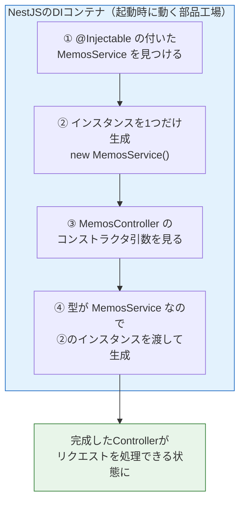
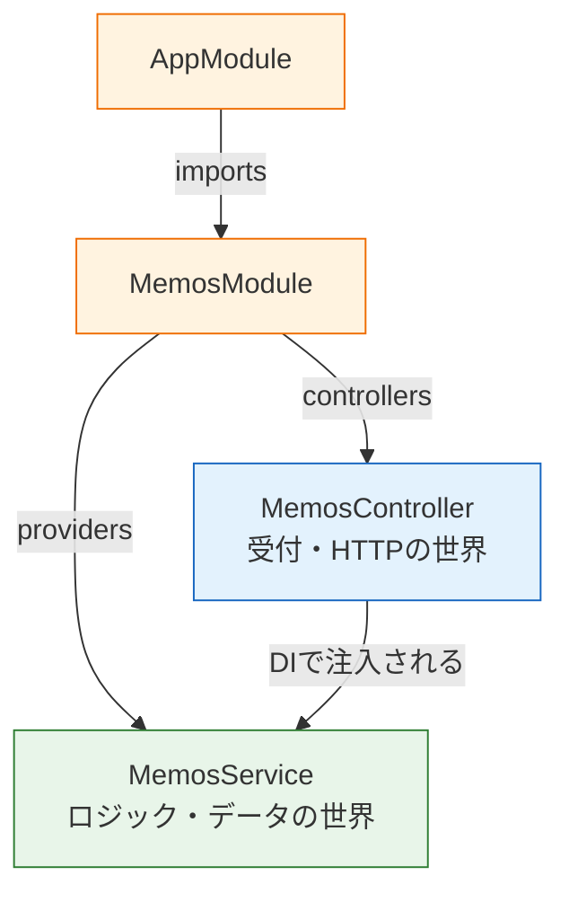

# ServiceとDI

[Controllerとルーティング](/backend/controller/)では、Controllerの中に固定データやロジックを直接書いていました。このページでは、その仕事を本来の担当者であるServiceに移します。あわせて、NestJSの心臓部である**依存性注入（DI）**の仕組みと、部品を束ねるModuleの中身を理解します。「なぜ`new`と書かないのか」という前ページからの疑問に、ここで答えが出ます。

## 学習目標

- Serviceを生成し、ビジネスロジックをControllerから分離できる
- 依存性注入（DI）とは何か、なぜ使うのかを図とともに説明できる
- `@Injectable`とModuleの`providers`の関係を説明できる
- Moduleの各設定項目（imports / controllers / providers / exports）の意味を説明できる

## MemosServiceを生成する

まずはNest CLIでServiceを生成します。プロジェクトのルートで実行してください。

```bash
pnpm exec nest g service memos
```

実行結果の例:

```
CREATE src/memos/memos.service.spec.ts (453 bytes)
CREATE src/memos/memos.service.ts (89 bytes)
UPDATE src/memos/memos.module.ts (247 bytes)
```

Controllerのときと同様、MemosModuleの`providers`への登録（UPDATE行）まで自動で行われています。生成直後のServiceは空のクラスです。

**`src/memos/memos.service.ts`（生成直後）**

```typescript
import { Injectable } from '@nestjs/common';

@Injectable()
export class MemosService {}
```

## ロジックをServiceに移す

前ページでControllerに直接書いていたメモのデータと絞り込みロジックを、Serviceに移します。あわせて、メモのデータ構造を型として定義しておきましょう。

**`src/memos/memos.service.ts`**

```typescript
import { Injectable } from '@nestjs/common';

export type Memo = {
  id: number;
  title: string;
  body: string;
};

@Injectable()
export class MemosService {
  private memos: Memo[] = [
    { id: 1, title: '買い物リスト', body: '牛乳と卵を買う' },
    { id: 2, title: '読みたい本', body: 'TypeScriptの入門書' },
  ];

  findAll(keyword?: string): Memo[] {
    if (keyword) {
      return this.memos.filter((memo) => memo.title.includes(keyword));
    }
    return this.memos;
  }

  findOne(id: number): Memo | undefined {
    return this.memos.find((memo) => memo.id === id);
  }
}
```

**コード解説**

- `export type Memo = {...}` — メモ1件の形を型として定義します。[基本型](/typescript/basic_types/)で学んだオブジェクト型です。Controllerなど他のファイルからも使うので`export`しています。
- `private memos: Memo[] = [...]` — メモを保持する配列です。`private`なので、この配列に触れるのはServiceのメソッド経由だけです。データの出入り口を一本化することで、後でデータベースに置き換えるときもServiceの中だけ直せば済みます。
- `findAll(keyword?: string)` — 前ページの絞り込みロジックをそのまま移しました。HTTPの知識が一切登場しない、純粋なTypeScriptのメソッドである点に注目してください。
- `findOne(id: number): Memo | undefined` — `find`は見つからないと`undefined`を返すため、返り値は[ユニオン型](/typescript/basic_types/)で表現しています。見つからない場合の扱いは[CRUD実践](/backend/crud_practice/)で改善します。

なお、この配列は**サーバーのメモリ上**にあるため、サーバーを再起動するとデータは初期状態に戻ります。watchモードでは保存のたびに再起動されるので、追加したデータが消えるのは正常な動作です。データを残す仕組み（永続化）は[データベースとPrisma](/database/)セクションで導入します。

## ControllerからServiceを使う

次に、ControllerをServiceに仕事を依頼する形に書き換えます。

**`src/memos/memos.controller.ts`**

```typescript
import { Body, Controller, Get, Param, Post, Query } from '@nestjs/common';
import { MemosService } from './memos.service';

@Controller('memos')
export class MemosController {
  constructor(private readonly memosService: MemosService) {}

  @Get()
  findAll(@Query('keyword') keyword?: string) {
    return this.memosService.findAll(keyword);
  }

  @Get(':id')
  findOne(@Param('id') id: string) {
    return this.memosService.findOne(Number(id));
  }

  @Post()
  create(@Body() body: { title: string; body: string }) {
    return { id: 3, title: body.title, body: body.body }; // 仮実装。後のページで完成させる
  }
}
```

**コード解説**

- `constructor(private readonly memosService: MemosService) {}` — このページの主役です。「MemosService型の部品を受け取り、`this.memosService`として保持する」という宣言で、TypeScriptのコンストラクタ引数プロパティという省略記法です。詳しくは次の節で説明します。
- 各ルートのメソッド — 中身が`this.memosService.◯◯(...)`への依頼だけになりました。受付（HTTPの世界）とロジック（データの世界）の境界が、ファイルの境界と一致しています。
- `Number(id)` — 文字列で届くパスパラメータの数値変換はControllerの仕事として残しています。Serviceは「HTTPでは値が文字列で届く」という事情を知らなくてよいからです。

curlで動作が変わっていないことを確認しましょう。

```bash
curl http://localhost:3000/memos/1
```

実行結果の例:

```json
{"id":1,"title":"買い物リスト","body":"牛乳と卵を買う"}
```

外から見た振る舞いは同じまま、内部の構造だけを整理する。これを**リファクタリング**と呼びます。

## 依存性注入（DI）— なぜnewと書かないのか

ここからがこのページの核心です。Controllerのコンストラクタをもう一度見てください。

```typescript
constructor(private readonly memosService: MemosService) {}
```

`MemosController`は`MemosService`がないと仕事ができません。この関係を「ControllerはServiceに**依存**している」と言います。普通のTypeScriptなら、依存する部品は自分で作るはずです。

```typescript
// もしDIがなかったら、自分でnewして用意することになる
export class MemosController {
  private readonly memosService = new MemosService();
}
```

しかしNestJSではそう書きません。**必要な部品はコンストラクタの引数として宣言しておけば、NestJSが外から渡してくれる**のです。この仕組みを**依存性注入（DI、Dependency Injection、ディペンデンシー・インジェクション）**と呼びます。「依存しているもの（Service）を、外部から注入（injection）する」という意味です。

流れを図にすると次のようになります。



NestJSは起動時に、Moduleの登録情報をもとに**DIコンテナ**（部品のインスタンスを生成・管理する仕組み）を組み立てます。`new`を書くのは開発者ではなくDIコンテナです。だからこそ、[環境構築とプロジェクト作成](/backend/setup/)の起動ログに`AppModule dependencies initialized`（依存関係の初期化完了）と表示されていたのです。

### なぜDIを使うのか

「自分で`new`すればいいのに、なぜわざわざ？」という疑問はもっともです。DIの利点は主に3つあります。

1. **部品の差し替えが容易になる** — Controllerは「MemosServiceという型の何か」を受け取るだけで、それをどう作るかを知りません。たとえばテストのときは「本物のServiceの代わりに、決まった値を返す偽物（モック）」を注入できます。これは[バックエンドテスト](/testing/)で実際に行います。
2. **インスタンスを共有できる** — DIコンテナは原則として各部品のインスタンスを**1つだけ**作り、必要とするすべての場所に同じものを渡します（この方式をシングルトンと呼びます）。もし各自が`new`すると、`memos`配列を持つServiceが複数できてしまい、「Aで追加したメモがBから見えない」という不整合が起きます。
3. **生成の順序や手順を任せられる** — 部品が増えて「ServiceAはServiceBに依存し、ServiceBはServiceCに依存する」と連鎖しても、正しい順序での生成はDIコンテナが解決してくれます。

特に2は今のメモAPIに直結します。メモの配列はアプリ内に1つであるべきで、DIのシングルトン方式がそれを自然に保証してくれているのです。

## Moduleの中身を理解する

DIコンテナが「何を生成すべきか」を知る手がかりが、Moduleへの登録です。CLIが更新してきた`MemosModule`を見てみましょう。

**`src/memos/memos.module.ts`**

```typescript
import { Module } from '@nestjs/common';
import { MemosController } from './memos.controller';
import { MemosService } from './memos.service';

@Module({
  controllers: [MemosController],
  providers: [MemosService],
})
export class MemosModule {}
```

**コード解説**

- `controllers: [MemosController]` — このModuleが持つ受付係の一覧。ここに登録されたControllerのルートが有効になります。
- `providers: [MemosService]` — このModuleが持つ「注入可能な部品」の一覧。**providerとは「DIコンテナに生成・提供（provide）を任せる部品」**のことです。Serviceはproviderの代表例です。

そして、このMemosModule自体はAppModuleの`imports`に登録されています。

**`src/app.module.ts`（CLIによる更新後）**

```typescript
import { Module } from '@nestjs/common';
import { AppController } from './app.controller';
import { AppService } from './app.service';
import { MemosModule } from './memos/memos.module';

@Module({
  imports: [MemosModule],
  controllers: [AppController],
  providers: [AppService],
})
export class AppModule {}
```

Moduleの設定項目を整理します。

| 項目 | 意味 |
|---|---|
| `imports` | 取り込む他のModule |
| `controllers` | このModuleの受付係 |
| `providers` | このModuleの注入可能な部品（Serviceなど） |
| `exports` | このModuleのproviderのうち、**他のModuleにも使わせるもの** |

`exports`は今回まだ使いませんが、重要なので触れておきます。providerは原則として**同じModuleの中でだけ**注入できます。他のModuleのServiceを使いたい場合は、提供側が`exports`に載せ、利用側が`imports`でそのModuleを取り込む、という手続きが必要です。[データベースとPrisma](/database/)で作るPrismaServiceは、まさに`exports`を使って全Moduleに提供する典型例になります。

## 登録を忘れるとどうなるか — エラーを読む練習

初学者が最初に踏むエラーを、あえて体験しておきましょう。`memos.module.ts`の`providers`から`MemosService`を一時的に消して保存してみてください。

```typescript
@Module({
  controllers: [MemosController],
  providers: [], // ← 一時的に空にする
})
```

サーバーが再起動に失敗し、次のようなエラーが表示されます。

```
[Nest] ERROR [ExceptionHandler] Nest can't resolve dependencies of the
MemosController (?). Please make sure that the argument MemosService at
index [0] is available in the MemosModule context.
```

**エラーの読み方**

- `can't resolve dependencies of the MemosController` — MemosControllerの依存関係を解決できない（必要な部品を用意できない）
- `the argument MemosService at index [0]` — 原因はコンストラクタの0番目の引数のMemosService
- `is available in the MemosModule context` — MemosModuleの中で利用可能にしてほしい（＝providersに登録してほしい）

つまり「**Controllerが要求している部品が、Moduleに登録されていない**」というエラーです。NestJS開発で非常によく見るエラーなので、この形を覚えておくと将来必ず役立ちます。確認できたら`providers: [MemosService]`に戻して、サーバーが正常に起動することを確かめてください。

## 全体像の再確認

このページを終えた時点の構造を図で確認します。



[NestJSとは](/backend/what_is_nestjs/)で「これから学ぶ」として見せた図が、すべて自分の書いたコードと対応づくようになりました。

## 理解度チェック

**Q1. 依存性注入（DI）とは何かを、「new」という言葉を使って説明してください。**

<details markdown="1">
<summary>解答を見る</summary>

クラスが必要とする部品（依存）を、自分で`new`して作るのではなく、外部（NestJSのDIコンテナ）が生成して渡してくれる仕組みです。利用側はコンストラクタの引数として「この型の部品が必要」と宣言するだけでよく、生成の責任をDIコンテナに任せられます。

</details>

**Q2. DIコンテナは原則として各providerのインスタンスを1つだけ作ります（シングルトン）。今回のメモAPIで、この性質が重要なのはなぜですか。**

<details markdown="1">
<summary>解答を見る</summary>

MemosServiceはメモのデータを`private memos`配列として自身の中に保持しています。もしServiceのインスタンスが複数できると、配列も複数でき、「片方に追加したメモがもう片方には存在しない」というデータの不整合が起きます。インスタンスが1つだけなら、どこから利用しても同じ配列を参照するため、データの一貫性が保たれます。

</details>

**Q3. `@Injectable()`デコレータとModuleの`providers`への登録は、それぞれ何のために必要ですか。**

<details markdown="1">
<summary>解答を見る</summary>

`@Injectable()`は「このクラスはDIコンテナが生成・注入を管理できる部品である」という宣言です。`providers`への登録は「このModuleでその部品を実際に使えるようにする」ための登録です。両方そろって初めて、同じModule内のControllerなどへ注入できるようになります。登録を忘れると`Nest can't resolve dependencies ...`というエラーになります。

</details>

**Q4. ロジックをControllerからServiceへ移したことで、`memos`配列をデータベースに置き換えるとき、修正範囲はどうなりますか。**

<details markdown="1">
<summary>解答を見る</summary>

修正はMemosServiceの中だけで済みます。Controllerは「`memosService.findAll(...)`を呼ぶと結果が返る」というインターフェースにしか依存しておらず、データがメモリ上の配列にあるのかデータベースにあるのかを知らないからです。実際に[データベースとPrisma](/database/)セクションで、この置き換えを行います。

</details>

**Q5. 次のエラーが出ました。原因と対処を説明してください。**

```
Nest can't resolve dependencies of the MemosController (?).
Please make sure that the argument MemosService at index [0]
is available in the MemosModule context.
```

<details markdown="1">
<summary>解答を見る</summary>

MemosControllerがコンストラクタの第1引数（index [0]）でMemosServiceを要求しているのに、MemosModuleの`providers`にMemosServiceが登録されていないことが原因です。`memos.module.ts`の`@Module`の`providers`配列に`MemosService`を追加すれば解決します。

</details>

## セルフレビュー

- [ ] DIとは何か、なぜ使うのかを図を描きながら説明できる
- [ ] `constructor(private readonly xxx: XxxService)`という書き方の意味を説明できる
- [ ] providerという言葉の意味と、`providers`登録の役割を説明できる
- [ ] Moduleの`imports` / `controllers` / `providers` / `exports`の違いを説明できる
- [ ] `Nest can't resolve dependencies`エラーの原因を特定し、自力で直せる
- [ ] ControllerとServiceの責任分担（HTTPの世界とデータの世界）を自分の言葉で説明できる
- [ ] メモリ上の配列のデータがサーバー再起動で消える理由を説明できる

## 次のステップ

構造は整いましたが、`create`の`@Body()`にはまだ大きな弱点があります。型注釈はコンパイル時のチェックにすぎず、**実行時には不正なデータがそのまま素通り**してしまうのです。次の[DTOとバリデーション](/backend/dto_and_validation/)では、受け取るデータの形をDTOとして定義し、不正なリクエストを自動で400エラーにする仕組みを導入します。

このページで学んだDIは、NestJSを使い続ける限りずっと付き合う仕組みです。[データベースとPrisma](/database/)でのPrismaService注入、[バックエンドテスト](/testing/)でのモック注入、SNS開発セクションの全機能で、この知識が前提になります。
