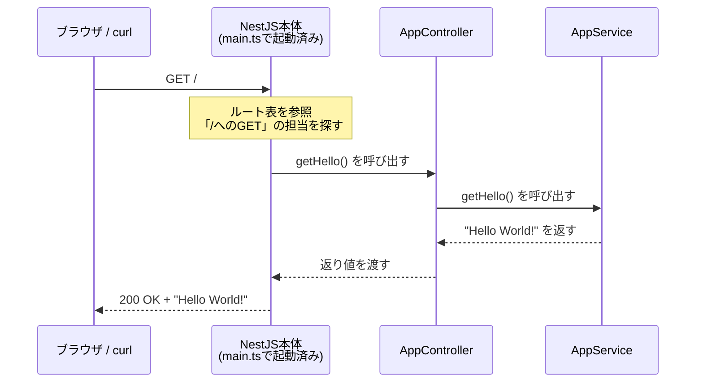

# 環境構築とプロジェクト作成

[NestJSとは](/backend/what_is_nestjs/)で全体像をつかんだので、いよいよ手を動かします。このページではNest CLI（コマンドラインツール）を導入してプロジェクトを作成し、自動生成されたファイルを1つずつ読み解いたうえで、開発サーバーを起動して最初のレスポンスを確認します。

## 学習目標

- Nest CLIを導入し、新しいプロジェクトを作成できる
- 生成された主要ファイル（main.ts / app.module.ts / app.controller.ts / app.service.ts）の役割を説明できる
- 開発サーバーを起動し、ブラウザとcurlで動作確認できる
- リクエストが各ファイルをどう流れるかを説明できる

## 前提の確認

[環境構築](/environment//)で導入したNode.js 20と、pnpmが使えることを確認します（pnpmの導入は[React基礎のセットアップ](/react/setup/)を参照）。ターミナルで次を実行してください。

```bash
node -v
pnpm -v
```

実行結果の例:

```
v20.11.0
9.12.3
```

`v20.x.x`が表示されればOKです。表示されない場合は[Node.jsの導入](/environment/node/)に戻って環境を整えてください。

## Nest CLIの導入

NestJSにはNest CLI（シーエルアイ、Command Line Interface）という公式のコマンドラインツールがあります。プロジェクトの雛形作成や、ControllerやServiceのファイル生成を自動化してくれる道具です。

本カリキュラムでは、Nest CLIをグローバル（PC全体で使える場所）にはインストールせず、pnpmの`dlx`と`exec`を通して実行します。グローバルインストール（`pnpm add -g`）はグローバル用の保存先の設定が別途必要で、未設定だと`ERR_PNPM_NO_GLOBAL_BIN_DIR`というエラーになるなど環境設定で詰まりやすいためです。`pnpm dlx`なら事前のインストールなしにCLIを実行でき、プロジェクト作成後は`pnpm exec`でプロジェクト内にインストール済みのCLIを実行できます。

## プロジェクトの作成

作業用のディレクトリ（どこでも構いません）に移動し、`memo-api`という名前でプロジェクトを作成します。

```bash
pnpm dlx @nestjs/cli@10 new memo-api
```

**コード解説**

- `pnpm dlx` — パッケージを一時的にダウンロードして、そのまま実行するコマンドです（[React基礎のセットアップ](/react/setup/)で触れた`npx`に相当するコマンドです）。
- `@nestjs/cli@10` — 末尾の`@10`でバージョン10系を指定しています。本カリキュラムはNestJS 10で統一します。
- `new memo-api` — Nest CLIの`new`コマンドで、`memo-api`という名前のプロジェクトを作成します。

実行すると、使用するパッケージマネージャを聞かれます。**矢印キーでpnpmを選び、Enter**を押してください。

```
⚡  We will scaffold your app in a few seconds..

? Which package manager would you ❤️  to use? pnpm
CREATE memo-api/.eslintrc.js (663 bytes)
CREATE memo-api/.prettierrc (51 bytes)
CREATE memo-api/README.md (3340 bytes)
CREATE memo-api/nest-cli.json (171 bytes)
CREATE memo-api/package.json (1943 bytes)
CREATE memo-api/tsconfig.json (546 bytes)
CREATE memo-api/src/app.controller.ts (274 bytes)
CREATE memo-api/src/app.module.ts (249 bytes)
CREATE memo-api/src/app.service.ts (142 bytes)
CREATE memo-api/src/main.ts (208 bytes)
...
✔ Installation in progress... ☕

🚀  Successfully created project memo-api
```

ファイルの生成と依存パッケージのインストールが自動で行われます。完了したらプロジェクトに移動し、VS Codeで開きましょう。

```bash
cd memo-api
code .
```

## 生成されたファイルを読み解く

プロジェクトの構成は次のようになっています（主要なものを抜粋）。

```
memo-api/
├── src/                      ← ソースコード（私たちが書く場所）
│   ├── main.ts               ← アプリの起動処理（エントリーポイント）
│   ├── app.module.ts         ← ルートModule
│   ├── app.controller.ts     ← サンプルのController
│   ├── app.controller.spec.ts ← Controllerのテスト（テスト章で学ぶ）
│   └── app.service.ts        ← サンプルのService
├── test/                     ← E2Eテスト用（テスト章で学ぶ）
├── nest-cli.json             ← Nest CLIの設定
├── package.json              ← 依存パッケージとスクリプト定義
├── tsconfig.json             ← TypeScriptの設定
├── .eslintrc.js / .prettierrc ← コード品質ツールの設定（tooling章で学ぶ）
└── node_modules/             ← インストールされたパッケージ
```

前ページで学んだ登場人物（Module / Controller / Service）が、最初から1組生成されています。`src/`の中の4つのファイルを順番に読んでいきましょう。

### main.ts — アプリの起動処理

**`src/main.ts`**

```typescript
import { NestFactory } from '@nestjs/core';
import { AppModule } from './app.module';

async function bootstrap() {
  const app = await NestFactory.create(AppModule);
  await app.listen(3000);
}
bootstrap();
```

**コード解説**

- `NestFactory.create(AppModule)` — ルートModuleである`AppModule`を起点に、NestJSアプリ全体を組み立てます。Moduleの木構造をたどって、必要なControllerやServiceがここですべて準備されます。
- `await app.listen(3000)` — ポート3000でリクエストの待ち受けを開始します。ポートとは、1台のPCの中で通信の宛先を区別する番号です。Vite（React）の開発サーバーが5173番を使っていたように、サーバーごとに別の番号を使います。
- `bootstrap()` — 定義した起動関数を実行します。bootstrap（ブートストラップ）は「起動処理」を指す慣用的な名前です。

このファイルは「アプリを組み立てて、3000番で待ち受ける」だけの短いファイルで、機能を追加しても基本的に変更しません。

### app.module.ts — ルートModule

**`src/app.module.ts`**

```typescript
import { Module } from '@nestjs/common';
import { AppController } from './app.controller';
import { AppService } from './app.service';

@Module({
  imports: [],
  controllers: [AppController],
  providers: [AppService],
})
export class AppModule {}
```

**コード解説**

- `@Module({...})` — このクラスがModuleであることを宣言するデコレータです。クラス本体（`export class AppModule {}`）は空で、すべての情報はデコレータの引数（設定オブジェクト）に書きます。
- `imports: []` — 取り込む他のModuleの一覧。後で`MemosModule`を作ったらここに追加します。
- `controllers: [AppController]` — このModuleに属するControllerの一覧。
- `providers: [AppService]` — このModuleに属するService（など、注入される部品）の一覧。providersという名前の意味は[ServiceとDI](/backend/service_and_di/)で説明します。

Moduleは「この機能には、これらの部品が属しています」という**目次・登録簿**だと考えてください。部品を作ってもここに登録しないとNestJSは認識しません（初学者が最初に踏む典型的なエラーです。後のページで実際に確認します）。

### app.controller.ts — 受付係

**`src/app.controller.ts`**

```typescript
import { Controller, Get } from '@nestjs/common';
import { AppService } from './app.service';

@Controller()
export class AppController {
  constructor(private readonly appService: AppService) {}

  @Get()
  getHello(): string {
    return this.appService.getHello();
  }
}
```

**コード解説**

- `@Controller()` — このクラスを受付係として宣言します。引数が空なので、担当パスはルート（`/`）です。
- `constructor(private readonly appService: AppService)` — 「AppServiceを使います」という宣言です。`new AppService()`と自分で書いていない点に注目してください。インスタンスはNestJSが用意して渡してくれます（詳細は[ServiceとDI](/backend/service_and_di/)）。
- `@Get()` — 「`/`へのGETリクエストはこのメソッドが担当する」という宣言です。
- `return this.appService.getHello();` — 仕事はServiceに依頼し、結果を返します。返り値がそのままレスポンスのボディになります。

### app.service.ts — ロジック担当

**`src/app.service.ts`**

```typescript
import { Injectable } from '@nestjs/common';

@Injectable()
export class AppService {
  getHello(): string {
    return 'Hello World!';
  }
}
```

**コード解説**

- `@Injectable()` — 「このクラスは注入（injection）可能な部品です」という宣言です。これが付いたクラスをModuleの`providers`に登録すると、Controllerなどから利用できるようになります。
- `getHello()` — `'Hello World!'`という文字列を返すだけの、ごく普通のメソッドです。ServiceにはHTTP関連のコードが一切登場しないことを確認してください。

### tsconfig.jsonとデコレータ

[NestJSとは](/backend/what_is_nestjs/)で「デコレータは設定で有効化が必要」と触れました。生成された`tsconfig.json`を開くと、次の2行が確認できます。

```json
"experimentalDecorators": true,
"emitDecoratorMetadata": true,
```

これがデコレータを有効にする設定です。Nest CLIが最初から書いてくれているので変更は不要ですが、「NestJSのプロジェクトではこの設定が前提になっている」ことは知っておきましょう。

## 開発サーバーの起動

それでは起動します。`package.json`にはいくつかの起動スクリプトが定義されていますが、開発中は**watchモード（ファイルを保存すると自動で再起動するモード）**を使います。

```bash
pnpm run start:dev
```

実行結果の例:

```
[Nest] 12345  - 2026/06/12 10:00:00     LOG [NestFactory] Starting Nest application...
[Nest] 12345  - 2026/06/12 10:00:00     LOG [InstanceLoader] AppModule dependencies initialized
[Nest] 12345  - 2026/06/12 10:00:00     LOG [RoutesResolver] AppController {/}: 
[Nest] 12345  - 2026/06/12 10:00:00     LOG [RouterExplorer] Mapped {/, GET} route
[Nest] 12345  - 2026/06/12 10:00:00     LOG [NestApplication] Nest application successfully started
```

ログの読み方も重要です。

- `AppModule dependencies initialized` — AppModuleの部品の組み立てが完了した
- `Mapped {/, GET} route` — 「`/`へのGET」というルート（URLと処理の対応）が1件登録された

つまり起動ログを見れば、**どのURLが有効になったか**が分かります。今後ルートを追加したら、このログで登録を確認する習慣をつけましょう。

### ブラウザで確認

ブラウザで `http://localhost:3000` を開いてください。`Hello World!`と表示されれば成功です。`localhost`（ローカルホスト）は「自分のPC自身」を指す特別なホスト名で、`:3000`は`main.ts`で指定したポート番号です。

### curlで確認

今後のAPI開発では、ブラウザだけでなくcurl（カール）というコマンドラインのHTTPクライアントを多用します。GET以外のメソッドを送ったり、レスポンスの詳細を確認したりするのにブラウザのアドレスバーでは不十分だからです。別のターミナルを開いて実行してみましょう。

```bash
curl -i http://localhost:3000
```

実行結果の例:

```
HTTP/1.1 200 OK
X-Powered-By: Express
Content-Type: text/html; charset=utf-8
Content-Length: 12

Hello World!
```

**コード解説**

- `curl -i URL` — 指定したURLにGETリクエストを送ります。`-i`はレスポンスヘッダーも表示するオプションです。
- `HTTP/1.1 200 OK` — [HTTPとREST](/backend/http_and_rest/)で学んだステータスラインがそのまま見えています。
- `X-Powered-By: Express` — NestJSが内部でExpressを使っている証拠がこんなところに現れています。

教材どおりの画面ではなく、**生のHTTPレスポンス**を確認できるのがcurlの利点です。

## リクエストはどう流れたのか

いま起きたことを、ファイルの対応関係とともにシーケンス図で確認します。



`@Get()`というデコレータの宣言に基づいてNestJSがルート表を作り、リクエストを適切なメソッドに振り分け、返り値をレスポンスに変換する。前ページで図解した分業が、実際のファイルの上で動いていることが確認できました。

## watchモードを体験する

最後に、開発の基本サイクルを体験しておきます。サーバーを起動したまま、`src/app.service.ts`の返り値を書き換えてみてください。

**`src/app.service.ts`（変更箇所）**

```typescript
  getHello(): string {
    return 'Hello NestJS!';
  }
```

保存すると、サーバーのターミナルに再起動のログが流れます。ブラウザを再読み込みすると`Hello NestJS!`に変わっているはずです。

「編集 → 保存 → 自動再起動 → 確認」がバックエンド開発の基本サイクルです。確認できたら、サーバーは`Ctrl + C`で停止できます（次ページ以降も使うので、起動したままでも構いません）。

## 理解度チェック

**Q1. `src/`に生成された4つのファイル（main.ts / app.module.ts / app.controller.ts / app.service.ts）の役割をそれぞれ一言で説明してください。**

<details markdown="1">
<summary>解答を見る</summary>

- `main.ts` — エントリーポイント。AppModuleを起点にアプリを組み立て、ポート3000で待ち受けを開始する
- `app.module.ts` — ルートModule。このアプリに属するControllerとService（部品）の登録簿
- `app.controller.ts` — 受付係。`/`へのGETリクエストを受け取り、Serviceに処理を依頼する
- `app.service.ts` — ロジック担当。`Hello World!`という文字列を返す実際の仕事をする

</details>

**Q2. `pnpm run start:dev`の「watchモード」とは何ですか。開発中にこれを使う利点は何ですか。**

<details markdown="1">
<summary>解答を見る</summary>

ソースファイルの変更を監視し、保存されるたびに自動でサーバーを再起動してくれるモードです。コードを変更するたびに手動でサーバーを停止・再起動する手間がなくなり、「編集 → 保存 → 確認」のサイクルを高速に回せます。

</details>

**Q3. 起動ログに`Mapped {/, GET} route`と表示されました。これは何を意味しますか。**

<details markdown="1">
<summary>解答を見る</summary>

「パス`/`へのGETリクエスト」というルート（URLと処理の対応）が1件登録されたことを意味します。これは`AppController`の`@Get()`が付いた`getHello()`メソッドに対応しています。起動ログを見れば、どのURLとメソッドの組み合わせが有効になったかを確認できるため、ルートを追加したときの確認手段として有用です。

</details>

**Q4. `curl -i http://localhost:3000`を実行したとき、`localhost`と`3000`はそれぞれ何を指していますか。**

<details markdown="1">
<summary>解答を見る</summary>

`localhost`は「自分のPC自身」を指す特別なホスト名です。`3000`はポート番号で、1台のPCの中で通信の宛先を区別する番号です。`main.ts`の`app.listen(3000)`で指定した番号と一致しています。つまりこのコマンドは「自分のPCの3000番ポートで待ち受けているサーバーにGETリクエストを送る」という意味になります。

</details>

**Q5. `app.controller.ts`では`new AppService()`と書いていないのに、`this.appService.getHello()`が動くのはなぜですか（現時点での理解で構いません）。**

<details markdown="1">
<summary>解答を見る</summary>

コンストラクタに`private readonly appService: AppService`と書くことで、「このControllerはAppServiceを使う」とNestJSに宣言しているからです。NestJSは起動時にAppServiceのインスタンスを自分で生成し、Controllerのコンストラクタに自動で渡してくれます。この仕組みを依存性注入（DI）と呼び、詳細は[ServiceとDI](/backend/service_and_di/)で学びます。

</details>

## セルフレビュー

- [ ] `pnpm dlx @nestjs/cli@10 new`でプロジェクトを作成できた
- [ ] `src/`の4ファイルの役割を、ファイルを見ながら自分の言葉で説明できる
- [ ] `pnpm run start:dev`でサーバーを起動し、ブラウザとcurlの両方で動作確認できた
- [ ] `curl -i`の出力から、ステータスライン・ヘッダー・ボディを指し示せる
- [ ] リクエストがNestJS → Controller → Service → レスポンスと流れる経路を説明できる
- [ ] Serviceの返り値を書き換えて、watchモードによる自動再起動を確認した

## 次のステップ

プロジェクトが動いたので、次の[Controllerとルーティング](/backend/controller/)では、受付係であるControllerを本格的に学びます。`/memos`や`/memos/1`のような複数のルートを定義し、パスパラメータ・クエリ・ボディといったリクエストの情報を受け取る方法を身につけます。

ここで作った`memo-api`プロジェクトは、このセクションの最後の[CRUD実践：メモAPIを作る](/backend/crud_practice/)まで継続して育てていきます。削除せずに残しておいてください。
