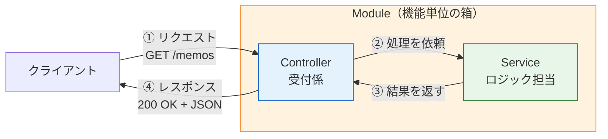
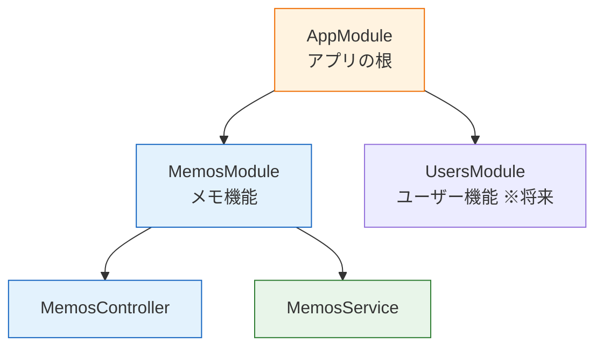

# NestJSとは

[HTTPとREST](/backend/http_and_rest/)で、これから作るものが「リクエストを受け取ってJSONを返すAPIサーバー」だと分かりました。このページでは、それを作るための道具であるNestJS（ネストジェイエス）を紹介します。なぜフレームワークを使うのか、その中でなぜNestJSなのか、そしてNestJSアプリがどんな部品（Module / Controller / Service）で構成されるのかを、コードを書き始める前に俯瞰します。

## 学習目標

- フレームワークを使う理由を説明できる
- NestJSの特徴と採用する理由を説明できる
- Module / Controller / Serviceの役割分担を図とともに説明できる
- デコレータの基本的な読み方が分かる

## フレームワークはなぜ必要か

実は、Node.jsには標準でHTTPサーバーを作る機能があります。最小のサーバーはこれだけで書けます。

**`server.ts`（参考：素のNode.jsの場合）**

```typescript
import { createServer } from "node:http";

const server = createServer((req, res) => {
  if (req.method === "GET" && req.url === "/memos") {
    res.writeHead(200, { "Content-Type": "application/json" });
    res.end(JSON.stringify([{ id: 1, title: "買い物リスト" }]));
  } else {
    res.writeHead(404, { "Content-Type": "application/json" });
    res.end(JSON.stringify({ message: "Not Found" }));
  }
});

server.listen(3000);
```

**コード解説**

- `createServer((req, res) => {...})` — リクエストが来るたびに呼ばれる関数を登録します。`req`がリクエスト、`res`がレスポンスです。
- `if (req.method === "GET" && req.url === "/memos")` — メソッドとURLの組み合わせを自分でif文で判定しています。
- `res.writeHead(...)` / `res.end(...)` — ステータスコードとヘッダー、ボディを自分で組み立てて返します。

これでも動きますが、想像してみてください。エンドポイント（APIの窓口となるURLとメソッドの組み合わせ）が30個あるAPIでは、このif文が30分岐になります。さらに「URLから`/memos/1`の`1`を取り出す」「JSONのボディを解析する」「入力値を検証する」といった処理も、すべて自分で書くことになります。これらは**どのAPIでも必要になる定型処理**です。

フレームワークとは、こうした定型処理を肩代わりし、開発者が「アプリ固有のロジック」に集中できるようにする骨組みのことです。フロントエンドでReactが「DOM操作の定型処理」を肩代わりしてくれたのと同じ関係です。

## なぜNestJSか

Node.jsのバックエンドフレームワークはいくつもありますが、本カリキュラムではNestJS 10を採用します。理由は次のとおりです。

- **TypeScriptが第一言語** — NestJS自体がTypeScriptで書かれており、[TypeScript基礎](/typescript/)で学んだ型の知識がそのまま活きます。フロントエンド（React + TypeScript）と言語を統一できるのも大きな利点です。
- **構造が最初から決まっている** — 後述するModule / Controller / Serviceという役割分担がフレームワークの設計として組み込まれています。「どこに何を書くべきか」で迷いにくく、誰が書いても似た構造になるため、チーム開発や学習に向いています。
- **必要な道具が一通り揃っている** — 入力値の検証、テストの仕組み、WebSocket対応など、実務で必要になる機能が公式に提供されています。後の[バックエンドテスト](/testing/)や[リアルタイム通信](/realtime/)のセクションでも、NestJSの機能をそのまま使います。

最小限の道具だけを提供するExpress（エクスプレス）という軽量フレームワークも広く使われており、実はNestJSも内部ではExpressを利用しています。NestJSは「Expressの上に、アプリケーションの構造化の仕組みを載せたもの」と理解しておくとよいでしょう。

## NestJSアプリの全体像 — 3つの登場人物

NestJSアプリは、役割の異なる3種類の部品を組み合わせて作ります。

- **Controller（コントローラ）** — リクエストの受付係。「どのURL・メソッドのリクエストを、どの処理につなぐか」を担当します。
- **Service（サービス）** — ビジネスロジック（アプリ固有の処理・計算・データ操作）の担当。「メモを保存する」「一覧を取り出す」といった実際の仕事をします。
- **Module（モジュール）** — ControllerとServiceをひとまとめに束ねる箱。機能単位（メモ機能、ユーザー機能など）の整理役です。

リクエストが処理される流れを図で見てみましょう。



Controllerは受付に徹し、実際の仕事はServiceに任せる。この分業がNestJSの基本姿勢です。

### なぜ分けるのか

「1つのファイルに全部書けばいいのでは」と思うかもしれません。分ける理由は主に2つあります。

1. **変更に強くなる** — 「URLを変えたい」ならControllerだけ、「保存のロジックを変えたい」ならServiceだけを直せば済みます。受付とロジックが混ざっていると、片方の変更がもう片方を壊すリスクが上がります。
2. **テストしやすくなる** — Serviceは「HTTPと無関係な、ただのクラス」なので、サーバーを起動しなくても単体でテストできます。これは[バックエンドテスト](/testing/)セクションで実感することになります。

この「受付」と「ロジック」の分離は、Reactで「画面の見た目（コンポーネント）」と「データ取得処理」を分けたのと同じ発想です。ソフトウェア設計に共通する**関心の分離**という原則の一つの形です。

## NestJSのコードを覗いてみる

実際のNestJSのコードを先に見てみましょう。詳細は次ページ以降で1つずつ学ぶので、ここでは雰囲気をつかめば十分です。

**`src/memos/memos.controller.ts`（抜粋）**

```typescript
import { Controller, Get } from "@nestjs/common";
import { MemosService } from "./memos.service";

@Controller("memos")
export class MemosController {
  constructor(private readonly memosService: MemosService) {}

  @Get()
  findAll() {
    return this.memosService.findAll();
  }
}
```

**コード解説**

- `@Controller("memos")` — 「このクラスは`/memos`というパスの受付係です」という宣言です。この`@`で始まる記法が、次に説明する**デコレータ**です。
- `constructor(private readonly memosService: MemosService)` — 「このクラスはMemosServiceを使います」という宣言です。インスタンスの生成はNestJSが自動で行います（この仕組みが[ServiceとDI](/backend/service_and_di/)で学ぶ依存性注入です）。
- `@Get()` — 「GETリクエストが来たら、この直下のメソッドを実行する」という宣言です。
- `return this.memosService.findAll();` — 実際の仕事はServiceに依頼し、返り値をそのまま返します。NestJSが返り値を自動でJSONに変換してレスポンスにしてくれます。

素のNode.jsの例と見比べてください。if文によるURL判定も、`res.writeHead`によるレスポンス組み立ても消えています。開発者が書くのは「どのURLで（デコレータ）」「何をするか（メソッドの中身）」だけです。

## デコレータ — `@`で始まる印

上のコードに出てきた`@Controller(...)`や`@Get()`は、[TypeScript基礎](/typescript/)では登場しなかった新しい文法です。これは**デコレータ（decorator、装飾するもの）**と呼ばれ、NestJSを読み書きするうえで避けて通れないので、ここで丁寧に導入します。

### デコレータとは

デコレータは、**クラスやメソッドの直前に置いて、それに追加の情報や機能を与える印**です。「装飾」という名前のとおり、対象そのものの中身は変えずに、外から意味づけをします。

```typescript
@Controller("memos")   // ← このクラスへの「意味づけ」
export class MemosController {

  @Get()               // ← このメソッドへの「意味づけ」
  findAll() { ... }
}
```

日常の例でいえば、書類に押す「承認済」のハンコや、荷物に貼る「ワレモノ注意」のシールに似ています。書類や荷物の中身は変わりませんが、印が付くことで、それを扱う人（ここではNestJS）の振る舞いが変わります。

- `@Controller("memos")`という印を見たNestJSは、「`/memos`へのリクエストはこのクラスに回そう」と判断します。
- `@Get()`という印を見たNestJSは、「GETリクエストならこのメソッドを呼ぼう」と判断します。

### デコレータの読み方のコツ

- デコレータは**直後にあるもの（クラス・メソッド・引数）に対して**作用します。`@Get()`は直後の`findAll()`に付いています。
- `@Controller("memos")`のように**引数を取れます**。引数で意味づけの詳細（この場合はパス）を指定します。
- デコレータは関数の一種ですが、当面は「NestJSへの宣言を書くための専用記法」と捉えれば十分です。自分でデコレータを定義することは、このカリキュラムでは行いません。
- デコレータは`@nestjs/common`などのパッケージから`import`して使います。`@Controller`が突然使えるわけではなく、ファイル冒頭の`import { Controller, Get } from "@nestjs/common";`で取り込まれています。

なお、デコレータという仕組み自体はNestJS専用ではありません。Angular（アンギュラー）というフロントエンドフレームワークや、後の[データベースとPrisma](/database/)セクションに関連するORMライブラリなど、TypeScriptの世界では広く使われている記法です。ここで読み方に慣れておくと、他のライブラリのコードを読むときにも役立ちます。

なお、デコレータはTypeScriptの設定で有効化が必要な機能ですが、Nest CLIが生成するプロジェクトでは最初から有効になっているため、設定を意識する必要はありません（[環境構築とプロジェクト作成](/backend/setup/)で確認します）。

### NestJSはデコレータでできている

この後のページで出会う主なデコレータを先に一覧しておきます。すべて「NestJSへの宣言」です。

| デコレータ | 付ける場所 | 意味 | 学ぶページ |
|---|---|---|---|
| `@Module(...)` | クラス | この機能のまとまり（Module）を定義する | [ServiceとDI](/backend/service_and_di/) |
| `@Controller(...)` | クラス | リクエストの受付係にする | [Controllerとルーティング](/backend/controller/) |
| `@Get()` `@Post()` など | メソッド | メソッドとHTTPメソッド・パスを結びつける | [Controllerとルーティング](/backend/controller/) |
| `@Param()` `@Query()` `@Body()` | 引数 | リクエストの各部分を引数として受け取る | [Controllerとルーティング](/backend/controller/) |
| `@Injectable()` | クラス | DIで注入できる部品にする | [ServiceとDI](/backend/service_and_di/) |
| `@IsString()` など | プロパティ | 入力値の検証ルールを宣言する | [DTOとバリデーション](/backend/dto_and_validation/) |

## アプリ全体はModuleの木構造

部品が増えてきたとき、NestJSはModuleを単位にアプリを整理します。アプリには必ず1つのルートModule（慣例で`AppModule`）があり、機能ごとのModuleがそこにぶら下がります。



このセクションで作るメモAPIは`AppModule`と`MemosModule`の小さな構成ですが、SNS開発セクションでは投稿・いいね・フォローなど機能ごとのModuleが並ぶ、より大きな木に育ちます。構造のルールが同じなので、小さなアプリで身につけた読み方が大きなアプリでもそのまま通用します。

## よくある疑問

学習を始める前に、初学者からよく出る2つの疑問に答えておきます。

### Reactを学んだのに、また別のフレームワーク？

ReactとNestJSは競合するものではなく、**担当する場所が違います**。Reactはブラウザの中（フロントエンド）で画面を作るためのライブラリで、NestJSはサーバーの上（バックエンド）でAPIを作るためのフレームワークです。

| | React | NestJS |
|---|---|---|
| 動く場所 | ブラウザ | サーバー |
| 主な仕事 | 画面の構築・ユーザー操作への反応 | リクエストの処理・データの管理 |
| 共通点 | TypeScriptで書く / 部品（コンポーネント・Module）を組み合わせて作る | 同左 |

1つのWebアプリは、この2つが[HTTPとREST](/backend/http_and_rest/)で学んだ通信で会話することで成立します。どちらも「TypeScriptで、部品を組み合わせて作る」という思想は共通なので、Reactで身につけた感覚の多くがNestJSでも役立ちます。

### 学習はNestJSからでよいのか、Expressが先では？

「まず素のExpressで仕組みを理解してからNestJSへ」という学習順もよく勧められます。一理ある考え方ですが、本カリキュラムではNestJSから始めます。理由は、Expressは構造の決まりがない分、初学者は「どこに何を書くべきか」という設計の判断を最初から自力で迫られるからです。NestJSなら正しい構造がレールとして敷かれており、そのレールに沿って書くこと自体が良い設計の練習になります。HTTPの土台は前ページで押さえましたし、NestJSの内部がExpressであることも学んだので、必要になればExpressのコードも読み解けるはずです。

## このセクションで扱わないこと

NestJSには他にも多くの仕組みがありますが、このセクションでは上記の基本に絞ります。特に、リクエストを処理前に検査して通行を許可・拒否する**Guard（ガード）**という仕組みは、ログイン機能とセットで使うものなので、SNS開発セクションの[認証](/sns/auth/)で初めて登場します。「そういうものが後で出てくる」とだけ覚えておいてください。

## 理解度チェック

**Q1. フレームワークを使わずに素のNode.jsでAPIサーバーを書く場合、どのような不便がありますか。2つ挙げてください。**

<details markdown="1">
<summary>解答を見る</summary>

例として次のような点が挙げられます。

- メソッドとURLの組み合わせをif文で自分で判定する必要があり、エンドポイントが増えると分岐が膨大になる
- レスポンスの組み立て（ステータスコード・ヘッダー・JSON変換）、パスからのID抽出、ボディの解析、入力値の検証など、どのAPIでも必要な定型処理をすべて自分で書く必要がある

フレームワークはこれらの定型処理を肩代わりし、開発者がアプリ固有のロジックに集中できるようにしてくれます。

</details>

**Q2. Controller / Service / Moduleのそれぞれの役割を一言で説明してください。**

<details markdown="1">
<summary>解答を見る</summary>

- **Controller** — リクエストの受付係。どのURL・メソッドのリクエストをどの処理につなぐかを担当する
- **Service** — ビジネスロジックの担当。データの操作や計算など、実際の仕事をする
- **Module** — ControllerとServiceを機能単位で束ねる箱

Controllerは受付に徹して実際の仕事はServiceに任せる、という分業が基本です。

</details>

**Q3. ControllerとServiceを分けることの利点を2つ説明してください。**

<details markdown="1">
<summary>解答を見る</summary>

1. **変更に強くなる** — URLの変更はControllerだけ、ロジックの変更はServiceだけ、と修正範囲を限定できる
2. **テストしやすくなる** — ServiceはHTTPと無関係のただのクラスなので、サーバーを起動せずに単体でテストできる

これは「関心の分離」という設計原則の実践であり、Reactで見た目とデータ取得処理を分けたのと同じ発想です。

</details>

**Q4. 次のコードで、`@Controller("memos")`と`@Get()`はそれぞれ何に対して、どんな意味づけをしていますか。**

```typescript
@Controller("memos")
export class MemosController {
  @Get()
  findAll() { ... }
}
```

<details markdown="1">
<summary>解答を見る</summary>

- `@Controller("memos")`は直後の**クラス**`MemosController`に対して、「`/memos`というパスへのリクエストの受付係である」という意味づけをしています。
- `@Get()`は直後の**メソッド**`findAll()`に対して、「GETリクエストが来たらこのメソッドを実行する」という意味づけをしています。

デコレータは直後にあるものに作用する、という読み方がポイントです。

</details>

**Q5. デコレータとは何かを、コードの動作を変える観点から自分の言葉で説明してください。**

<details markdown="1">
<summary>解答を見る</summary>

デコレータは、クラスやメソッド、引数の直前に`@名前(...)`の形で置き、対象に追加の情報や機能を与える印です。対象そのものの中身（メソッドの実装など）は変えませんが、印を読み取る側（NestJS）の振る舞いを変えます。たとえば`@Get()`が付いたメソッドは、NestJSによって「GETリクエストの処理担当」として登録されます。荷物に貼る「ワレモノ注意」のシールのように、中身は変えずに扱われ方を変えるもの、と例えられます。

</details>

## セルフレビュー

- [ ] フレームワークが肩代わりしてくれる「定型処理」の例を3つ挙げられる
- [ ] 本カリキュラムがNestJSを採用する理由を2つ以上説明できる
- [ ] Controller / Service / Moduleの役割分担を、図を描いて説明できる
- [ ] リクエストがController → Service → Controllerと流れてレスポンスになるまでを口頭で説明できる
- [ ] デコレータが「直後の対象への意味づけ」であることを、具体例を挙げて説明できる
- [ ] `@Controller` `@Get` `@Injectable` `@Module`がそれぞれ何に付くデコレータか言える

## 次のステップ

全体像がつかめたので、次の[環境構築とプロジェクト作成](/backend/setup/)では、実際にNest CLIでプロジェクトを作成し、生成されたファイルを1つずつ読み解きながらサーバーを起動します。

このページで学んだModule / Controller / Serviceの3層構造は、このセクション全体はもちろん、[データベースとPrisma](/database/)でのPrismaServiceの組み込みや、SNS開発セクションの全機能実装でも一貫して使う、バックエンド開発の背骨になります。
