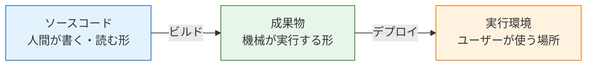
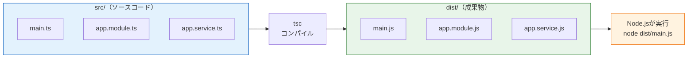
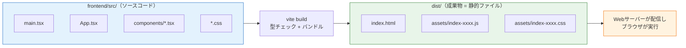
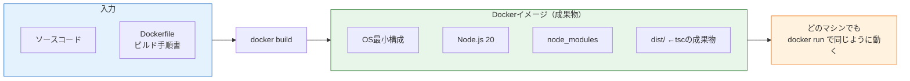
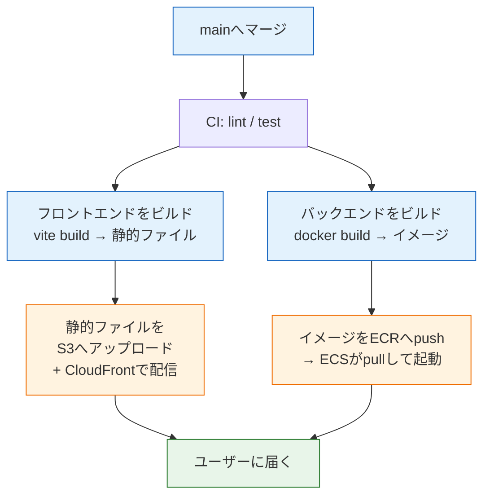
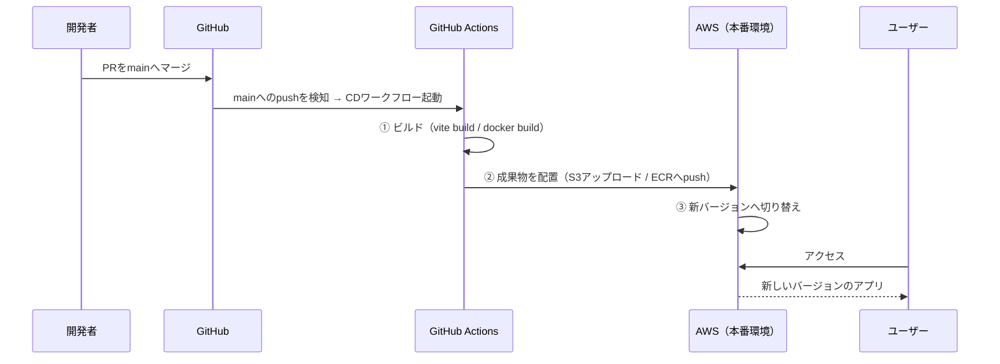

# ビルドとデプロイの流れ

前のページのCIパイプラインでは、最後に `pnpm run build` を実行して「ビルドが通ること」を確認しました。しかし「ビルドが**何を作っているのか**」「その成果物が**どこへ行くのか**」はまだ説明していません。このページでは、ビルドの成果物の正体を3つの具体例（tsc / vite build / Dockerイメージ）で確かめ、それらをユーザーへ届ける **CD（デプロイ自動化）** の全体像を整理します。実際にAWSへデプロイするのは[AWSデプロイ](/aws/)のセクションで行うため、ここでは「地図」を手に入れることがゴールです。

## 学習目標

- 「ビルド」とは何か、「ソースコード」と「成果物」の違いを説明できる
- tsc・vite build・docker build がそれぞれ何を生成し、どこで実行・配置されるかを説明できる
- デプロイとは成果物を実行環境に配置することだと説明できる
- CD（自動デプロイ）の全体像を図でイメージでき、CIとの接続点を説明できる

## ビルドとは何か

**ビルド（build）** とは、人間が書いたソースコードから、**実行・配布に適した形の成果物（アーティファクト、artifact）を生成する**ことです。

なぜそのまま動かさないのでしょうか。私たちが書いているTypeScriptを思い出してください。[コンパイルとは](/typescript/compile/)で学んだとおり、TypeScriptはそのままではNode.jsやブラウザで実行できず、JavaScriptへの変換（コンパイル）が必要でした。つまり、**開発に都合がよい形（ソースコード）と、実行に都合がよい形（成果物）は別物**なのです。ビルドはこの2つをつなぐ変換工程です。



そして **デプロイ（deploy）** とは、この成果物を実行環境（サーバーやCDNなど）に配置して、ユーザーが使える状態にすることです。「ビルド＝作る」「デプロイ＝届ける」と覚えてください。

このカリキュラムで登場するビルドは3種類あります。順に見ていきましょう。

## 例1: tsc — TypeScriptをJavaScriptに変換する

最も基本的なビルドが、TypeScriptコンパイラ **tsc** によるコンパイルです。NestJSの `pnpm run build`（実体は `nest build`）も、内部ではtscを使ってこれを行っています。

[NestJSのセットアップ](/backend/setup/)で作ったプロジェクトでビルドを実行してみると、結果を実際に確認できます。

```bash
cd backend
pnpm run build
ls dist
```

```
main.js  main.js.map  app.module.js  app.controller.js  app.service.js  ...
```

`src/` の中の `.ts` ファイルと対応する `.js` ファイルが、**`dist/`**（distribution＝配布の略）ディレクトリに生成されています。これがバックエンドのビルド成果物です。



重要なポイントを整理します。

- 本番サーバーで実行されるのは `dist/` のJavaScriptです。`node dist/main.js` で起動します。本番環境にTypeScriptのソースコードもtsc自体も不要です
- ビルド時に**型チェックが行われる**ため、「ビルドが通る＝型エラーがない」ことの保証になります。CIでbuildを回した理由の1つです
- `dist/` はソースコードから何度でも生成できる「複製物」なので、Gitでは管理しません（[.gitignore](/git/basic_commands/)に入れます）

## 例2: vite build — Reactアプリを静的ファイルにする

フロントエンドのビルドは少し性質が違います。[Reactのセットアップ](/react/setup/)で使ってきた `pnpm run dev` は開発用サーバーで、本番では使いません。本番用には `pnpm run build`（実体は `tsc && vite build`）を実行します。

```bash
cd frontend
pnpm run build
ls dist
```

```
index.html  assets/
```

```bash
ls dist/assets
```

```
index-BHnh5oWN.js  index-D8b2x1Qe.css
```

成果物は `dist/` に入った **静的ファイル（static files）** —— つまりHTML・JavaScript・CSSの3点セットです。**静的ファイル**とは、リクエストのたびに内容が変わらない、配信するだけでよいファイルのことです。



tscのビルドとの違いに注目してください。

- 数十個あった `.tsx` ファイルが、**少数のJavaScriptファイルにまとめられて（バンドルされて）います**。ブラウザがファイルを1つずつ取りに来るより、まとめて少回数で取得する方が高速だからです
- ファイル名に `index-BHnh5oWN.js` のような**ハッシュ（ランダムに見える文字列）**が付いています。これは内容が変わるとファイル名も変わる仕組みで、ブラウザのキャッシュを正しく更新するためのものです
- 成果物は「実行するプログラム」ではなく「**配信するファイル**」です。Node.jsのようなランタイムは不要で、静的ファイルを配れるサーバー（後述のS3 + CloudFrontなど）に置くだけで動きます

実行する場所も対照的です。バックエンドの成果物は**サーバー上のNode.js**が実行しますが、フロントエンドの成果物は配信された後、**ユーザーのブラウザ**が実行します。

## 例3: docker build — アプリと実行環境を丸ごと固める

3つ目は[Docker基礎](/docker/)で学んだ **Dockerイメージのビルド**です。[Dockerfile](/docker/dockerfile/)で書いたとおり、`docker build` はDockerfileの手順に従ってイメージを生成します。

```bash
cd backend
docker build -t sns-backend .
```

実は、バックエンド用のDockerfileの中では、例1のtscビルドが**含まれて**います。Dockerfileの典型的な流れを思い出してください。

```dockerfile
FROM node:20
WORKDIR /app
RUN corepack enable pnpm && corepack prepare pnpm@9 --activate
COPY package.json pnpm-lock.yaml ./
RUN pnpm install --frozen-lockfile
COPY . .
RUN pnpm run build         # ← この中でtscが動き、dist/ が作られる
CMD ["node", "dist/main.js"]
```

なお `corepack prepare pnpm@9 --activate` は、pnpmを9系に固定するためのものです。Corepackは固定しないと最新のpnpmを取得し、Node.js 20非対応のバージョンが入ることがあります（→ [Dockerfile](/docker/dockerfile/)）。

つまりDockerイメージとは、「`dist/`（tscの成果物）+ node_modules + Node.js 20本体 + OSの最小構成」を**1つの箱に固めた成果物**です。



`dist/` だけをサーバーに置く方式と比べた利点は、[コンテナとは何か](/docker/what_is_container/)で学んだとおりです。実行環境（Node.jsのバージョンまで含めて）ごと成果物に閉じ込めるので、「サーバーにNode.jsを入れる」「バージョンを揃える」という作業自体が消えます。本番ではこのイメージを **レジストリ（registry、イメージの保管庫）** に登録し、サーバー側はレジストリからpullして `docker run` するだけです。

## 3つのビルドの整理

| | tsc (nest build) | vite build | docker build |
|---|---|---|---|
| 入力 | `.ts` ファイル | `.tsx` / `.ts` / `.css` | ソースコード + Dockerfile |
| 成果物 | `dist/`（JSファイル群） | `dist/`（HTML/JS/CSSの静的ファイル） | Dockerイメージ |
| 成果物を実行・利用する場所 | サーバー上のNode.js | ユーザーのブラウザ（サーバーは配信のみ） | コンテナランタイム（任意のマシン） |
| 配置先（デプロイ先）の例 | サーバーに直接配置 | S3 + CloudFront などの静的配信 | レジストリ（ECR）→ ECSなど |
| このカリキュラムでの位置づけ | docker buildの内部で使用 | フロントエンドの本番ビルド | バックエンドの本番ビルド |

このカリキュラムの最終構成では、**フロントエンドは「vite buildの静的ファイル」を配信サービスへ、バックエンドは「Dockerイメージ」をコンテナ実行サービスへ**届けます。何をビルドして何をどこに置くかが、フロントとバックで異なることを押さえてください。

## CD — デプロイを自動化する

成果物の正体が分かったので、いよいよCDの全体像です。[CI/CDとは何か](/cicd/what_is_cicd/)で学んだとおり、CDは「mainブランチへのマージなどをきっかけに、ビルドとデプロイを自動実行する」仕組みでした。具体的には、CIと同じGitHub Actionsのワークフローとして書きます。やることは次の図のとおりです。



図に出てくるS3 / CloudFront / ECR / ECSはAWSのサービス名です。今は名前を覚える必要はなく、「**静的ファイルの置き場**」「**イメージの保管庫と実行係**」くらいの理解で十分です。それぞれの役割は[AWSの主要サービス](/aws/core_services/)で1つずつ学びます。

時系列で見ると、CDのワークフローは次のシーケンスになります。



ポイントは、**CIとCDが同じ技術（GitHub ActionsのワークフローYAML）の延長線上にある**ことです。CIで書いた「checkout → pnpm/Node.jsの準備 → pnpm install --frozen-lockfile → pnpm run build」の後ろに、「成果物をAWSへ送るステップ」を足せばCDになります。新しい概念はAWS側の受け皿だけで、自動化の仕組み自体はすでに学び終えています。

## 身近な実例 — このサイトのbuild→deploy

[GitHub Actions入門](/cicd/github_actions_basics/)で読んだ、このカリキュラムサイト自身の `.github/workflows/jekyll.yml` を、今日の知識でもう一度見てみましょう。あのワークフローはまさに「ビルド→デプロイ」の2ジョブ構成でした。

- **buildジョブ** — Jekyllが Markdown（ソースコード）から HTML（静的ファイル＝成果物）を生成し、`actions/upload-pages-artifact` で成果物をアップロードする
- **deployジョブ** — `needs: build` でビルドの成功を待ち、`actions/deploy-pages` で成果物をGitHub Pages（静的ファイルの配信サービス）へ配置する

「ソースコードをビルドして静的ファイルを作り、配信サービスへ置く」——これは、vite buildの成果物をS3 + CloudFrontへ置く構成と**まったく同じ型**です。皆さんがこのページを読めているのは、誰かが手作業でサーバーにファイルをコピーしたからではなく、mainへのpushを引き金にこのCDが動いたからです。

## ここから先 — 実際のCDはAWSセクションで

CDの全体像はつかめましたが、実際に動かすには受け皿となるインフラ（S3、CloudFront、ECR、ECSなど）が必要です。そのため、この続きは[AWSデプロイ](/aws/)のセクションで行います。流れは次のとおりです。

1. [AWSとは何か](/aws/what_is_aws/)・[主要サービス](/aws/core_services/)で受け皿の知識を身につける
2. [S3とCloudFront](/aws/s3_cloudfront/)・[ECRとECS](/aws/ecr_ecs/)で受け皿を実際に構築する
3. [GitHub ActionsからAWSへ自動デプロイ](/aws/deploy_from_cicd/)で、このページの図をワークフローとして実装し、CDを完成させる

そして[SNS開発（最終プロジェクト）](/sns/nestjs/deploy/)では、自分のSNSアプリをこの一式のCI/CDに載せて運用します。このセクションで学んだ「ビルド成果物の正体」と「CDの地図」が、そのまま土台になります。

## 理解度チェック

**Q1. 「ビルド」と「デプロイ」の違いを、それぞれ一言で説明してください。**

<details markdown="1">
<summary>解答を見る</summary>

ビルドは、ソースコード（人間が書く形）から実行・配布に適した成果物（機械が実行する形）を生成することです。デプロイは、その成果物を実行環境（サーバーや配信サービス）に配置してユーザーが使える状態にすることです。「ビルド＝作る」「デプロイ＝届ける」という関係です。

</details>

**Q2. tscのビルド成果物（`dist/`）と、vite buildの成果物（`dist/`）は、同じ名前のディレクトリですが性質が違います。違いを説明してください。**

<details markdown="1">
<summary>解答を見る</summary>

tscの `dist/` は、サーバー上のNode.jsが `node dist/main.js` として**実行する**JavaScriptファイル群です。一方、vite buildの `dist/` は、HTML・JS・CSSの静的ファイルで、サーバーは**配信するだけ**、実行するのはユーザーのブラウザです。つまり「サーバーで実行されるプログラム」と「ブラウザに配るファイル」という違いがあり、デプロイ先もそれぞれ「コンテナなどの実行環境」と「静的ファイル配信サービス」に分かれます。

</details>

**Q3. Dockerイメージのビルドには、tscのビルドが含まれていると言えます。どういうことか説明してください。**

<details markdown="1">
<summary>解答を見る</summary>

バックエンドのDockerfileには `RUN pnpm run build` という行があり、`docker build` の過程でこの行が実行されてtscが動き、`dist/` が生成されます。Dockerイメージはこの `dist/` に加えて、node_modules・Node.js本体・OSの最小構成まで丸ごと1つに固めた成果物です。つまり「dockerビルド⊃tscビルド」という入れ子の関係で、Dockerイメージは実行環境ごとパッケージした、より自己完結的な成果物だと言えます。

</details>

**Q4. フロントエンドの成果物のファイル名に `index-BHnh5oWN.js` のようなハッシュが付くのは何のためですか。**

<details markdown="1">
<summary>解答を見る</summary>

ブラウザのキャッシュを正しく更新するためです。ファイルの内容が変わるとハッシュ（ファイル名）も変わるため、新しいバージョンをデプロイすると、ブラウザは「別の名前のファイル」として確実に新しいものを取得します。逆に内容が変わらなければ同じ名前のままなので、キャッシュを長期間有効にして高速に配信できます。

</details>

**Q5. CIのワークフローとCDのワークフローは、技術的にはどんな関係にありますか。**

<details markdown="1">
<summary>解答を見る</summary>

どちらも同じGitHub ActionsのワークフローYAMLで書きます。CIは「checkout → 環境準備 → lint / test / build」で終わりますが、CDはその後ろに「ビルド成果物をデプロイ先（S3やECRなど）へ送るステップ」を追加したものです。トリガーも、CIは push / pull_request、CDは「mainへのpush（マージ）」が典型という違いがあるだけで、仕組みは地続きです。

</details>

## セルフレビュー

- [ ] ビルドとデプロイの違いを自分の言葉で説明できる
- [ ] tscの成果物（dist/のJS）が、どこで・何によって実行されるかを説明できる
- [ ] vite buildの成果物が静的ファイルであり、ブラウザで実行されることを説明できる
- [ ] Dockerイメージが「アプリ＋実行環境を丸ごと固めた成果物」であることを説明できる
- [ ] フロントエンドとバックエンドで、ビルド成果物とデプロイ先が異なる理由を説明できる
- [ ] mainへのマージからユーザーに届くまでのCDの流れを、図を見ずに説明できる
- [ ] このカリキュラムサイト自身のデプロイが「ビルド→デプロイ」の同じ型であることを説明できる

## 次のステップ

これでCI/CDセクションは完了です。「pushすれば機械がチェックする」CIを実際に構築し、「マージすれば機械がデプロイする」CDの地図を手に入れました。

次の[AWSデプロイ](/aws/)セクションでは、デプロイの受け皿となるクラウドインフラを学び、構築します。その最後の[GitHub ActionsからAWSへ自動デプロイ](/aws/deploy_from_cicd/)で、このページで描いたCDの図が現実のものになります。CIパイプラインの作り方を忘れたら、いつでも[CIパイプラインを作る](/cicd/ci_pipeline/)に戻って確認してください。
