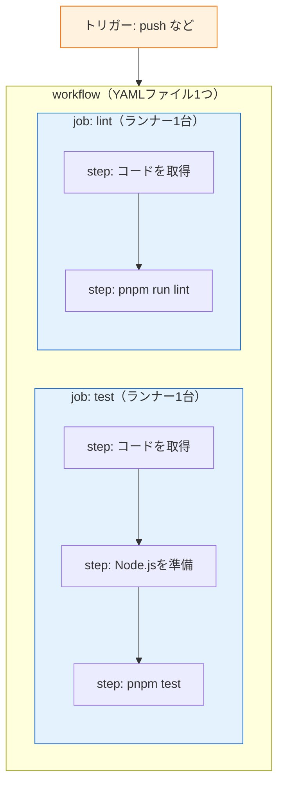

# GitHub Actions入門

前のページで「pushをきっかけに自動チェックが走る」というCIの全体像をつかみました。このページでは、それを実現する **GitHub Actions（ギットハブ・アクションズ）** の仕組みを学び、最小のワークフローを実際に動かします。設定ファイルはYAML形式で書きますが、**1行ずつ意味を解説する**ので、YAMLが初めてでも読み進められます。

## 学習目標

- workflow / job / step / runner という4つの構成要素の関係を説明できる
- ワークフローファイル（YAML）を1行ずつ読み解ける
- `on` / `jobs` / `steps` / `uses` / `run` の役割を説明できる
- `actions/checkout`・`pnpm/action-setup`・`actions/setup-node` が何をするアクションか説明できる
- 自分のリポジトリでワークフローを動かし、実行結果をActionsタブで確認できる

## GitHub Actionsの構成要素

GitHub Actionsでは、自動化の内容を **ワークフロー（workflow）** という単位で定義します。ワークフローはリポジトリ内の `.github/workflows/` ディレクトリに置いたYAMLファイルで記述し、pushなどの **トリガー（イベント）** をきっかけに実行されます。

ワークフローの内部構造は次の3階層です。

- **workflow（ワークフロー）** — 自動化のひとまとまり。「CIを実行する」「サイトをデプロイする」など。YAMLファイル1つが1ワークフロー
- **job（ジョブ）** — ワークフローの中の実行単位。1つのジョブは1台の**ランナー（runner）**＝GitHubが用意する仮想マシン上で実行される。複数のジョブは原則並列に動く
- **step（ステップ）** — ジョブの中の個々の手順。「コードを取得する」「`pnpm test` を実行する」など、上から順に実行される



図のとおり、トリガーが発生するとワークフローが起動し、その中のジョブがそれぞれ別のランナー（仮想マシン）で動きます。ジョブの中ではステップが上から順に実行されます。

ここで重要なのは、**ランナーは毎回まっさらな状態で起動する**ことです。あなたのPCとは別物の、何もインストールされていない（OSと基本ツールだけの）Linuxマシンが毎回新しく用意される、とイメージしてください。だからこそ「コードを取得する」「Node.jsを準備する」というステップが毎回必要になります。これは後で具体的に見ます。

## 最初のワークフローを書く

まず、CIらしいことは何もしない、メッセージを表示するだけの最小ワークフローを動かしてみます。[Git/GitHub基礎](/git/github_and_pr/)で作成した練習用リポジトリ（なければ新しいリポジトリ）を使ってください。

リポジトリのルートに `.github/workflows/` ディレクトリを作り、その中にYAMLファイルを置きます。

```bash
mkdir -p .github/workflows
```

**`.github/workflows/hello.yml`**

```yaml
name: Hello CI

on:
  push:

jobs:
  greet:
    runs-on: ubuntu-latest
    steps:
      - name: Say hello
        run: echo "Hello, GitHub Actions!"
      - name: Show date
        run: date
```

**コード解説**（1行ずつ）

- `name: Hello CI` — このワークフローの表示名です。GitHubのActionsタブにこの名前で表示されます。省略するとファイルパスが表示名になります
- `on:` — **トリガー**の定義です。「どのイベントが起きたらこのワークフローを実行するか」を指定します
- `  push:` — pushイベントをトリガーにします。これで「どのブランチへのpushでも」ワークフローが起動します
- `jobs:` — ここから下にジョブを列挙します
- `  greet:` — ジョブのID（名前）です。自分で自由に決められます
- `    runs-on: ubuntu-latest` — このジョブを実行するランナーのOSを指定します。`ubuntu-latest` は「最新のUbuntu Linux」です。WindowsやmacOSのランナーもありますが、サーバー開発では通常Linuxを使います
- `    steps:` — ここから下にステップを列挙します。`-` で始まる項目が1つのステップで、上から順に実行されます
- `      - name: Say hello` — ステップの表示名です。ログ画面にこの名前が表示されます
- `        run: echo "Hello, GitHub Actions!"` — **`run` はシェルコマンドを実行する**指定です。ランナーのターミナルで `echo ...` を打つのと同じです
- `      - name: Show date` — 2つ目のステップです
- `        run: date` — 現在日時を表示するコマンドです。ランナー上で実行されるので、表示されるのはランナー（仮想マシン）の時刻です

YAMLでは**インデント（字下げ）が構造を表す**ため、スペースの数を正確に揃える必要があります。タブ文字は使えません。スペース2個単位のインデントが慣例です。

### pushして動かす

ファイルをコミットしてpushします。

```bash
git add .github/workflows/hello.yml
git commit -m "Add hello workflow"
git push origin main
```

pushが完了したら、ブラウザでGitHubのリポジトリを開き、上部の **Actions** タブをクリックしてください。次のように確認できます。

1. 左側に「Hello CI」というワークフロー名が表示される
2. 実行履歴に「Add hello workflow」（コミットメッセージ）の行があり、緑のチェックマークが付いている
3. その行をクリック → ジョブ `greet` をクリックすると、ステップごとのログが見られる
4. 「Say hello」を展開すると `Hello, GitHub Actions!` と出力されている

これで「pushしたらGitHub上で自動的にコマンドが実行される」体験ができました。ここに `echo` の代わりに `pnpm test` を書けばCIになる、というのが基本のアイデアです。

## uses — 既製のアクションを使う

ステップには `run`（シェルコマンドの実行）のほかに、もう1つ書き方があります。**`uses`** です。

```yaml
- uses: actions/checkout@v4
```

`uses` は、**アクション（action）** と呼ばれる「再利用可能な部品」を呼び出す指定です。世界中の開発者やGitHub公式が「よく使う処理」をアクションとして公開しており、それを1行で利用できます。書式は次のとおりです。

```
uses: <所有者>/<リポジトリ名>@<バージョン>
```

`actions/checkout@v4` なら「GitHubの `actions` オーガニゼーションが公開している `checkout` というアクションの v4 を使う」という意味です。バージョンを `@v4` のように固定するのは、アクションが更新されて急に挙動が変わるのを防ぐためです。

Node.jsプロジェクトのCIで必ず登場する公式アクションを押さえましょう。

### actions/checkout — リポジトリのコードを取得する

先ほど述べたとおり、ランナーは毎回まっさらな仮想マシンとして起動します。つまり、**起動直後のランナーにはあなたのリポジトリのコードが存在しません**。`actions/checkout` は、ワークフローを起動したコミットのコードをランナー上にclone（チェックアウト）するアクションです。

```yaml
- uses: actions/checkout@v4
```

ほぼすべてのワークフローで、最初のステップはこれになります。これを忘れると、後続の `pnpm install --frozen-lockfile` などが「package.jsonが見つからない」と失敗します。

### pnpm/action-setup と actions/setup-node — pnpmとNode.jsを準備する

ランナーにはNode.jsが入っていることもありますが、バージョンは保証されません。また、**pnpmは最初から入っていません**。そこで、`pnpm/action-setup` でpnpmをインストールし、続けて `actions/setup-node` で指定したバージョンのNode.jsをインストールします。この2つはセットで使います。

```yaml
- uses: pnpm/action-setup@v4
  with:
    version: 10

- uses: actions/setup-node@v4
  with:
    node-version: '20'
    cache: 'pnpm'
```

**コード解説**

- `uses: pnpm/action-setup@v4` — pnpmをランナーにインストールする公式アクションです。`actions/setup-node` より**前に**実行します（後述の `cache: 'pnpm'` がpnpmを必要とするためです）
- `with:` — **アクションに渡すパラメータ**を書くキーです。`run` への引数ではなく、アクション専用の設定だと考えてください
- `version: 10` — インストールするpnpmのバージョンです。手元で使っているpnpmとメジャーバージョンを揃えます
- `uses: actions/setup-node@v4` — Node.jsセットアップ用の公式アクションを使います
- `node-version: '20'` — Node.js 20系をインストールします。このカリキュラムの開発環境（[Node.jsの導入](/environment/node/)）と同じバージョンに揃えることで、「手元では動くがCIでは動かない」を防ぎます
- `cache: 'pnpm'` — pnpmのキャッシュを有効にします。`pnpm install --frozen-lockfile` でダウンロードしたパッケージを次回の実行で再利用し、実行時間を短縮します。なくても動きますが、付けるのが定番です

## Node.jsプロジェクトの典型的なワークフロー

`run` と `uses` が分かったので、実際のCIに近いワークフローを読んでみましょう。テスト（[Jest](/testing/unit_test/)）が設定済みのNode.jsプロジェクトを想定します。

**`.github/workflows/test.yml`**

```yaml
name: Test

on:
  push:
    branches: [main]
  pull_request:

jobs:
  test:
    runs-on: ubuntu-latest
    steps:
      - name: Checkout
        uses: actions/checkout@v4

      - name: Setup pnpm
        uses: pnpm/action-setup@v4
        with:
          version: 10

      - name: Setup Node.js
        uses: actions/setup-node@v4
        with:
          node-version: '20'
          cache: 'pnpm'

      - name: Install dependencies
        run: pnpm install --frozen-lockfile

      - name: Run tests
        run: pnpm test
```

**コード解説**（1行ずつ）

- `name: Test` — ワークフローの表示名です
- `on:` — トリガーの定義です。今回は2種類のイベントを指定しています
- `  push:` / `    branches: [main]` — pushのうち、**mainブランチへのpushのみ**でトリガーします。`branches` で対象ブランチを絞り込めます
- `  pull_request:` — **Pull Requestの作成・更新時**にもトリガーします。これによりPR画面にチェック結果が表示されます。CIではこの2つの組み合わせが定番です
- `jobs:` / `  test:` — `test` という名前のジョブを定義します
- `    runs-on: ubuntu-latest` — Ubuntu Linuxのランナーで実行します
- `    steps:` — 以下、5つのステップを順に実行します
- `      - name: Checkout` / `uses: actions/checkout@v4` — まっさらなランナーにリポジトリのコードを取得します。**必ず最初に行う**ステップです
- `      - name: Setup pnpm` / `uses: pnpm/action-setup@v4` — ランナーにpnpm（バージョン10）をインストールします。次のステップの `cache: 'pnpm'` より前に必要です
- `      - name: Setup Node.js` / `uses: actions/setup-node@v4` — Node.js 20をインストールし、pnpmキャッシュを有効化します
- `      - name: Install dependencies` / `run: pnpm install --frozen-lockfile` — 依存パッケージをインストールします。ただの `pnpm install` ではなく **`--frozen-lockfile` 付き**で実行する点に注意してください（下で説明します）
- `      - name: Run tests` / `run: pnpm test` — テストを実行します。テストが1つでも失敗すると `pnpm test` が0以外の終了コードを返し、**ステップが失敗扱いになり、ジョブ全体が赤いバツになります**

### pnpm install --frozen-lockfile と pnpm install の違い

CIでは `pnpm install` の代わりに `pnpm install --frozen-lockfile` を使うのが定番です。

| | `pnpm install` | `pnpm install --frozen-lockfile` |
|---|---|---|
| インストールの基準 | package.json（条件を満たす範囲で新しいものを入れることがある） | **pnpm-lock.yaml に記録されたバージョンを厳密に再現** |
| pnpm-lock.yaml | 更新されることがある | 一切変更しない。lockと矛盾があればエラー |

CIの目的は「**手元と同じ条件で再現性のあるチェックをすること**」なので、lockファイルどおりに毎回正確にインストールし、lockファイルの書き換えを禁止する `--frozen-lockfile`（frozenは「凍結された」の意味）が適しています。

### ステップの成否と終了コード

GitHub Actionsは、各ステップのコマンドの**終了コード**で成否を判定します。終了コードが0なら成功、0以外なら失敗です。`pnpm test` はテストが落ちると0以外を返すため、自動的に「テスト失敗＝ステップ失敗＝ジョブ失敗（赤いバツ）」となります。あるステップが失敗すると、後続のステップは原則実行されません。

## トリガー（on）の主な種類

`on` に指定できるイベントは多数ありますが、まずは次の4つを覚えれば十分です。

| トリガー | 発火するタイミング | 主な用途 |
|---|---|---|
| `push` | ブランチにpushされたとき | CI、mainへのマージ後のデプロイ |
| `pull_request` | PRの作成・更新時 | PRのチェック（CI） |
| `workflow_dispatch` | GitHubの画面上でボタンを押したとき | 手動実行（再デプロイなど） |
| `schedule` | cron式で指定した時刻 | 定期実行（毎晩のテストなど） |

書き方の例をまとめて示します。

```yaml
on:
  push:
    branches: [main]        # mainへのpushのみ
  pull_request:             # すべてのPR
  workflow_dispatch:        # 手動実行ボタンを有効化
  schedule:
    - cron: '0 0 * * *'     # 毎日 0:00 UTC（日本時間 9:00）
```

**コード解説**

- `push.branches` — 対象ブランチを配列で指定します。`[main]` のほか `['main', 'develop']` のように複数も指定できます
- `pull_request` — 何も付けなければすべてのPRが対象です。`branches: [main]` を付けると「mainに向けたPRのみ」に絞れます
- `workflow_dispatch` — これを書いておくと、Actionsタブに「Run workflow」ボタンが表示され、好きなタイミングで実行できます。デバッグにも便利です
- `schedule.cron` — cron（クーロン）式で定期実行を指定します。時刻は**UTC（協定世界時）**で解釈されるため、日本時間から9時間引いて指定します

## 身近な実例 — このカリキュラムサイトのCI

実は、皆さんが読んでいるこのカリキュラムサイトも、GitHub Actionsで自動チェックされています。リポジトリの `.github/workflows/ci.yml` がそのワークフローです。学んだ知識で読んでみましょう（抜粋）。

**`.github/workflows/ci.yml`**（抜粋）

```yaml
name: CI

on:
  pull_request:
  push:
    branches:
      - main

jobs:
  cloudflare-site:
    name: Cloudflare site build
    runs-on: ubuntu-latest
    defaults:
      run:
        working-directory: cloudflare-site
    steps:
      - name: Checkout
        uses: actions/checkout@v4

      - name: Setup pnpm
        uses: pnpm/action-setup@v4
        with:
          version: 10

      - name: Setup Node.js
        uses: actions/setup-node@v4
        with:
          node-version: 20
          cache: pnpm
          cache-dependency-path: cloudflare-site/pnpm-lock.yaml

      - name: Install dependencies
        run: pnpm install --frozen-lockfile

      - name: Build
        run: pnpm build
```

**コード解説**

- `on.pull_request` — Pull Request作成・更新時に起動します。本文やリンクを壊した変更を、mainに入れる前に検出するためです
- `on.push.branches: main` — mainブランチへ入った変更でも起動します。mainの状態が常にビルド可能か確認します
- `defaults.run.working-directory: cloudflare-site` — このリポジトリではサイト本体が `cloudflare-site/` 配下にあるため、`run` コマンドの実行場所を固定します
- `pnpm/action-setup@v4` と `actions/setup-node@v4` — このサイトはAstro/Viteで作っているため、Node.jsとpnpmを準備します
- `cache-dependency-path: cloudflare-site/pnpm-lock.yaml` — lockファイルがリポジトリ直下ではなく `cloudflare-site/` にあるため、キャッシュの基準ファイルを明示します
- `pnpm install --frozen-lockfile` — lockファイル通りに依存を入れます。CIでは手元と違う依存が勝手に入らないように固定します
- `pnpm build` — Astroサイトを静的ファイルへビルドします。Markdownやリンクの構文が壊れていると、このステップで失敗します

つまりこのワークフローは、「**PRまたはmainへのpush → 依存インストール → サイトビルド**」というCIです。実際のデプロイは、この後の[ビルドとデプロイの流れ](/cicd/build_and_deploy_flow/)と[AWSデプロイ](/aws/)で扱います。

## 失敗したときのログの読み方

ワークフローが赤いバツになったら、次の手順で原因を調べます。

1. Actionsタブ → 失敗した実行（赤いバツの行）をクリック
2. 失敗したジョブ（赤いバツが付いたもの）をクリック
3. 失敗したステップが自動的に展開され、エラーメッセージが表示される

ログの内容は、手元のターミナルで同じコマンドを実行したときの出力とほぼ同じです。たとえば `pnpm test` が失敗していれば、Jestのエラー出力がそのまま表示されます。**まず手元で同じコマンドを実行して再現させ、修正してから再pushする**のが基本の直し方です。修正をpushすれば、ワークフローは自動的に再実行されます。

## 理解度チェック

**Q1. workflow / job / step の関係を説明してください。**

<details markdown="1">
<summary>解答を見る</summary>

workflowは自動化のひとまとまりで、YAMLファイル1つに対応します。workflowは1つ以上のjobを含み、各jobはそれぞれ別のランナー（仮想マシン）上で原則並列に実行されます。jobは1つ以上のstepを含み、stepはそのjobのランナー上で上から順に実行されます。stepには、シェルコマンドを実行する `run` と、既製のアクションを呼び出す `uses` の2種類があります。

</details>

**Q2. ほとんどのワークフローで、最初のステップが `uses: actions/checkout@v4` になるのはなぜですか。**

<details markdown="1">
<summary>解答を見る</summary>

ランナーは毎回まっさらな仮想マシンとして起動するため、起動直後にはリポジトリのコードが存在しないからです。`actions/checkout` がワークフローを起動したコミットのコードをランナー上に取得することで、初めて `pnpm install --frozen-lockfile` や `pnpm test` などコードを必要とするコマンドが実行できるようになります。

</details>

**Q3. 次のYAMLで、このワークフローが実行されるのはどんなときですか。**

```yaml
on:
  push:
    branches: [main]
  pull_request:
```

<details markdown="1">
<summary>解答を見る</summary>

(1) mainブランチへpushされたとき（他のブランチへのpushでは動かない）、(2) Pull Requestが作成・更新されたとき（こちらはブランチの絞り込みがないのですべてのPRが対象）、の2つの場合に実行されます。CIの定番の組み合わせで、「PRの段階でチェックし、mainに入るときにも再チェックする」という意図です。

</details>

**Q4. CIで `pnpm install` ではなく `pnpm install --frozen-lockfile` を使うのはなぜですか。**

<details markdown="1">
<summary>解答を見る</summary>

`pnpm install --frozen-lockfile` は pnpm-lock.yaml に記録されたバージョンを厳密に再現してインストールし、lockファイルを一切変更しないからです。`pnpm install` は条件の範囲内で新しいバージョンを入れたりlockファイルを書き換えたりすることがあり、実行のたびに結果が変わる可能性があります。CIの目的は再現性のあるチェックなので、毎回同じ依存関係を保証する `--frozen-lockfile` が適しています。

</details>

**Q5. `run` と `uses` の違いを説明してください。**

<details markdown="1">
<summary>解答を見る</summary>

`run` はランナー上でシェルコマンドをそのまま実行する指定です（例: `run: pnpm test`）。`uses` は、GitHub上で公開されている再利用可能な部品「アクション」を呼び出す指定です（例: `uses: actions/setup-node@v4`）。アクションへの設定値は `with:` で渡します。自分で書くコマンドは `run`、よくある定型処理（コード取得、言語ランタイム準備など）は既製のアクションを `uses` で使う、と使い分けます。

</details>

**Q6. ステップの成功・失敗は何によって判定されますか。また、`pnpm test` でテストが1件落ちるとワークフローはどうなりますか。**

<details markdown="1">
<summary>解答を見る</summary>

コマンドの終了コードで判定されます。0なら成功、0以外なら失敗です。`pnpm test` はテストが落ちると0以外の終了コードを返すため、そのステップは失敗となり、後続ステップは実行されず、ジョブ全体が失敗（赤いバツ）になります。PRをトリガーにしていれば、PR画面にも失敗が表示されます。

</details>

## セルフレビュー

- [ ] workflow / job / step / runner の関係を図に描ける
- [ ] `.github/workflows/` にYAMLを置けばワークフローが有効になることを知っている
- [ ] `on` / `jobs` / `runs-on` / `steps` / `name` / `run` / `uses` / `with` の役割をそれぞれ説明できる
- [ ] `actions/checkout`・`pnpm/action-setup`・`actions/setup-node` が何をするか、なぜ必要かを説明できる
- [ ] push と pull_request トリガーの違いと、CIで両方指定する理由を説明できる
- [ ] Node.jsプロジェクトの基本的なCIワークフロー（checkout → pnpm/action-setup → setup-node → pnpm install --frozen-lockfile → pnpm test）を写経せずに書ける
- [ ] 失敗したワークフローのログをActionsタブから辿って原因を特定できる

## 次のステップ

ワークフローの読み書きができるようになりました。次の[CIパイプラインを作る](/cicd/ci_pipeline/)では、この知識を使って、NestJSバックエンドとReactフロントエンドからなるリポジトリに lint + test + build のCIを組み込み、Pull Request上でチェックが緑になるところまでを実践します。

また、ここで読んだ `jekyll.yml` のような「ビルドして成果物をデプロイする」構成は、[ビルドとデプロイの流れ](/cicd/build_and_deploy_flow/)と[AWSデプロイ](/aws/deploy_from_cicd/)につながっていきます。
