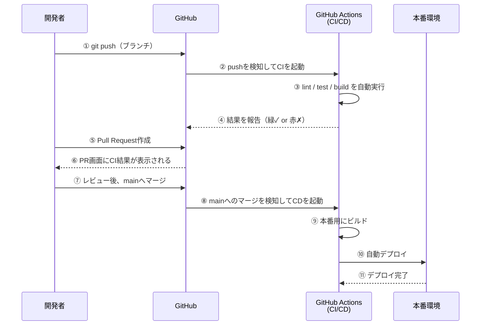
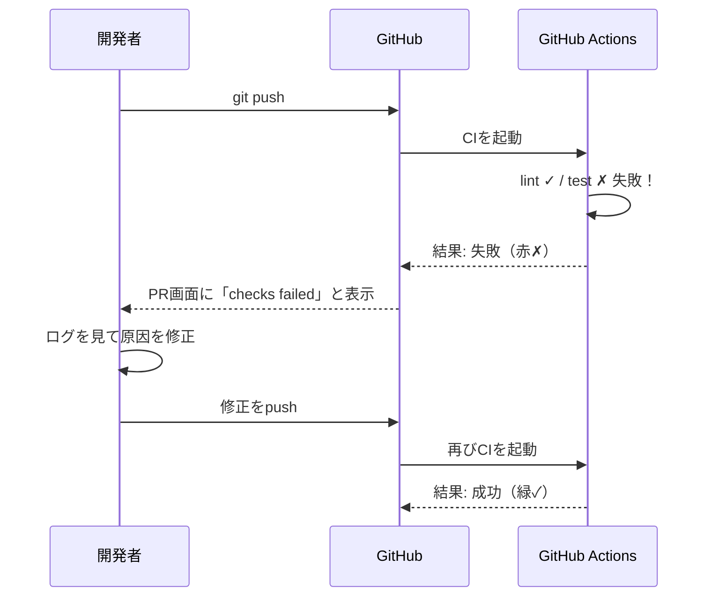
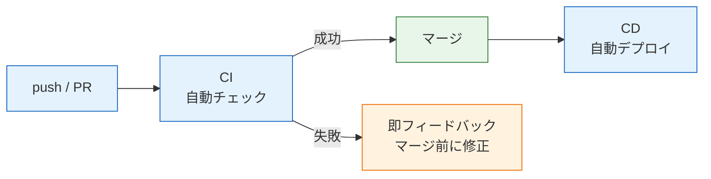

# CI/CDとは何か

このページでは、CI/CDという仕組みが「何を自動化するのか」「なぜ必要なのか」を学びます。具体的なツールの操作に入る前に、まず解決したい問題をはっきりさせましょう。[GitHubとPull Request](/git/github_and_pr/)で学んだ開発フローを思い出しながら読み進めてください。

## 学習目標

- CI（継続的インテグレーション）が何を指すのか、自分の言葉で説明できる
- CD（継続的デリバリー／デプロイ）が何を指すのか、CIとの違いを説明できる
- 手作業の開発フローにどんな問題があり、CI/CDがそれをどう解決するのかを説明できる
- push から自動チェック・自動デプロイまでの流れを図でイメージできる

## CI/CDがない世界を想像する

まず、CI/CDがない開発現場で何が起きるかを見てみましょう。あなたが3人チームでSNSアプリを開発しているとします。開発のルールは次のとおりです。

1. コードを書いたら、`pnpm run lint` でコードスタイルをチェックする
2. `pnpm test` でテストを実行し、全部パスすることを確認する
3. `pnpm run build` でビルドが通ることを確認する
4. 問題なければGitHubにpushして、Pull Requestを出す
5. レビューが通ったらマージし、サーバーに手作業でデプロイする

一見まともなルールに見えますが、これは**すべて人間の注意力に依存しています**。実際には、次のような事故が起きます。

- 「急いでいたのでテストを実行せずにpushした。実はテストが落ちるコードだった」
- 「自分のPCでは動いたのに、他のメンバーのPCではビルドが失敗した（Node.jsのバージョンが違った）」
- 「レビューする側が、動くかどうかを毎回手元で確認しなければならず、レビューに時間がかかる」
- 「デプロイ手順が複雑で、手順書のステップを1つ飛ばしてしまい、本番環境が壊れた」

ポイントは、これらが「気をつけていれば防げる」類のミスだということです。しかし人間は必ずミスをします。**気をつけなくても防げる仕組み**を作るのが、CI/CDの発想です。

先回りして、それぞれの事故がCI/CDのどの仕組みで防がれるのかを対応表にしておきます。このページを読み終えたあとに見返すと、全体像の確認になります。

| 手作業フローでの事故 | 防ぐ仕組み |
|---|---|
| テストを実行せずにpushしてしまった | CI: pushのたびに必ずテストが自動実行される |
| 自分のPCでは動くが、他の環境では動かない | CI: 毎回同じ構成のクリーンな環境でチェックされる |
| レビュアーが動作確認に時間を取られる | CI: PRに機械のチェック結果が表示され、人間は中身に集中できる |
| デプロイ手順を1つ飛ばして本番が壊れた | CD: デプロイが自動化されたスクリプトで毎回同じ手順で実行される |

## CIとは — 継続的インテグレーション

**CI（Continuous Integration、継続的インテグレーション）** とは、コードの変更をリポジトリに取り込む（インテグレーションする）たびに、**ビルドやテストなどのチェックを自動で実行する**仕組み・習慣のことです。

「インテグレーション（統合）」という言葉は、複数人が書いたコードを1つのコードベースに合流させることを指します。[ブランチとマージ](/git/branch_and_merge/)で学んだとおり、各自がブランチで作業し、mainブランチへマージするのが現代の開発スタイルです。CIは、このマージの前後で「壊れたコードが混ざっていないか」を機械的に検査します。

CIで自動実行する代表的なチェックは、すでに皆さんが手動で実行してきたものばかりです。

| チェック | コマンド例 | 学んだ場所 |
|---|---|---|
| リント（コードスタイル・バグの静的検査） | `pnpm run lint` | [ESLint](/tooling/eslint/) |
| フォーマットの検査 | `pnpm exec prettier --check .` | [Prettier](/tooling/prettier/) |
| テスト | `pnpm test` | [単体テスト](/testing/unit_test/) / [E2Eテスト](/testing/e2e_test/) |
| ビルド（コンパイルが通るか） | `pnpm run build` | [コンパイルとは](/typescript/compile/) |

つまりCIとは、**新しい何かを学ぶというより、すでに知っているコマンドを「pushのたびに必ず・自動で」実行させる仕組み**です。

### CIはいつ動くのか

CIが動くタイミングは、典型的には次の2つです。

- **pushしたとき** — ブランチに変更を送るたびにチェックが走る
- **Pull Requestを作成・更新したとき** — 「このPRをマージしても安全か」を検査する

特にPull Requestとの組み合わせが強力です。PRの画面にはCIの結果が「緑のチェックマーク（成功）」または「赤いバツ（失敗）」として表示されます。レビュアーは「テストが通っているか」を手元で確認する必要がなくなり、コードの設計や読みやすさといった、人間にしかできないレビューに集中できます。

## CDとは — 継続的デリバリー／デプロイ

**CD** には2つの意味があり、どちらも使われます。

- **Continuous Delivery（継続的デリバリー）** — いつでもデプロイできる状態を常に保つこと。デプロイ自体は人間がボタンを押して実行する
- **Continuous Deployment（継続的デプロイ）** — mainブランチへのマージなどをきっかけに、本番環境へのデプロイまで完全に自動で行うこと

**デプロイ（deploy、配備）** とは、ビルドしたアプリケーションをサーバーなどの実行環境に配置して、ユーザーが使える状態にすることです。ビルドとデプロイの詳細は[ビルドとデプロイの流れ](/cicd/build_and_deploy_flow/)で掘り下げます。

2つのCDの違いは「最後のデプロイを人間が承認するか、完全自動か」だけです。共通しているのは、**デプロイ作業そのものを手順書ではなくコード（スクリプト）にして、機械に実行させる**という点です。手作業のデプロイは「手順を飛ばす」「環境によって結果が変わる」というリスクを常に抱えますが、自動化されたデプロイは毎回まったく同じ手順で実行されます。

## 全体の流れをシーケンス図で見る

CIとCDがそろうと、開発フローは次のようになります。登場人物は、開発者・GitHub・CI/CDサービス（このカリキュラムではGitHub Actions）・本番環境の4つです。

この図で押さえてほしいのは次の3点です。

- **①〜④がCI**です。開発者がやることは「pushする」だけで、チェックはGitHub Actionsが勝手に実行します
- **⑧〜⑪がCD**です。mainブランチにマージされたコードは、人手を介さず本番環境に反映されます
- 開発者が手を動かすのは①⑤⑦だけです。「チェックを忘れる」「デプロイ手順を間違える」という人為ミスが、構造的に起きなくなります

逆に、CIが失敗した場合の流れも見ておきましょう。

テストが落ちるコードは、**マージされる前に**発見されます。壊れたコードがmainブランチに入り込んでから「誰がいつ壊したのか」を調べる事後対応に比べて、圧倒的に低コストです。これがCIの最大の価値である「**問題の早期発見**」です。

### CIは「速さ」も大事

シーケンス図から分かるとおり、CIが失敗すると開発者は修正して再pushします。つまりCIは「push → 結果を見る → 直す」というループの一部です。このループは速いほど快適で、CIの実行に30分かかると、開発者は結果を待たずに別の作業へ移ってしまい、フィードバックの価値が下がります。

そのためCIには「数分以内に終わること」が期待されます。実行に長時間かかるチェック（大量のE2Eテストなど）をすべてpushのたびに回すのではなく、

- pushのたび: lint・単体テストなど**速いチェック**
- マージ前やデプロイ前: **時間のかかるチェック**

のように使い分けるのが実務での工夫です。このカリキュラムで作るCIは数分で終わる規模なので、まずは「全部回す」で問題ありません。

## CI/CDがもたらす価値の整理

ここまでの内容を、価値ごとに整理します。

| 価値 | 説明 |
|---|---|
| 問題の早期発見 | 壊れたコードがmainに混ざる前に、自動チェックで見つかる |
| 再現性 | チェックもデプロイも毎回同じ環境・同じ手順で実行される。「自分のPCでは動いた」が起きない |
| レビューの質向上 | 機械にできる検査は機械に任せ、人間は設計や可読性のレビューに集中できる |
| デプロイの高速化・安全化 | 手順書が不要になり、リリースの頻度を上げられる。失敗してもやり直しが容易 |
| 心理的安全性 | 「うっかりミスでも仕組みが止めてくれる」と分かっていると、変更に挑戦しやすくなる |

一人で開発しているときでもCIの価値は変わりません。むしろ一人開発はレビュアーがいないぶん、機械によるチェックが唯一の安全網になります。

## 自動化は段階的に導入すればよい

「CIもCDも全部そろえないと意味がない」と思う必要はありません。実際の現場でも、自動化は次のような段階を踏んで育てていくのが普通です。

1. **CIだけ導入する** — pushのたびにlintとテストが走る。これだけでも「壊れたコードがmainに入る」事故はほぼなくなる
2. **継続的デリバリーにする** — デプロイをスクリプト化し、ボタン1つで実行できるようにする。デプロイの再現性が手に入る
3. **継続的デプロイにする** — mainへのマージで本番反映まで完全自動にする。リリースの頻度を最大化できる

このカリキュラムも同じ順序で進みます。このセクションではまず**1のCI**を完成させます。**2と3にあたるCD**は、デプロイ先のインフラ（AWS）の知識が必要になるため、[AWSデプロイ](/aws//)のセクションで構築します。「CIを作って動かす → デプロイ先を学ぶ → CDでつなぐ」という流れを頭に入れておいてください。

## 用語の整理

このセクションで繰り返し登場する用語を、ここでまとめて定義しておきます。以降のページで迷子になったら、この表に戻ってきてください。

| 用語 | 読み | 意味 |
|---|---|---|
| CI | シーアイ | Continuous Integration。push/PRのたびにビルド・テストなどのチェックを自動実行すること |
| CD | シーディー | Continuous Delivery / Deployment。デプロイ作業を自動化すること |
| パイプライン | — | lint→test→buildのような、一連のチェック・処理の流れ |
| ワークフロー | — | GitHub Actionsにおける自動化の定義単位。YAMLファイル1つに対応する |
| ビルド | — | ソースコードから実行・配布可能な成果物を生成すること（詳細は[ビルドとデプロイの流れ](/cicd/build_and_deploy_flow/)） |
| デプロイ | — | 成果物を実行環境に配置し、ユーザーが使える状態にすること |

「パイプライン」と「ワークフロー」は近い意味で使われることも多い言葉です。このカリキュラムでは、概念としての処理の流れを「パイプライン」、GitHub Actionsの具体的な定義（YAML）を「ワークフロー」と呼び分けます。

## CI/CDを実現するツール

CI/CDの考え方を実現するサービスはたくさんあります。代表的なものを挙げます。

| ツール | 特徴 |
|---|---|
| **GitHub Actions** | GitHubに組み込み。リポジトリにYAMLファイルを置くだけで使える。公開リポジトリは無料 |
| CircleCI | 老舗のCIサービス。GitHubと連携して使う |
| GitLab CI/CD | GitLab（GitHubの競合サービス）に組み込みのCI/CD |
| Jenkins | 自前のサーバーにインストールして運用する歴史あるツール |

このカリキュラムでは **GitHub Actions（ギットハブ・アクションズ）** を使います。理由は次のとおりです。

- すでに皆さんはGitHubでコードを管理しており、**追加のサービス登録が不要**
- リポジトリに設定ファイルを1つ置くだけで動き始める
- Pull Requestとの統合が最初から組み込まれている
- 業界でも採用例が非常に多く、実務でそのまま役立つ

実は、皆さんが今読んでいるこのカリキュラムのサイト自体も、GitHub Actionsで自動デプロイされています。リポジトリにMarkdownファイルをpushすると、サイトが自動でビルドされて公開される——まさにCI/CDの実例です。この仕組みの中身は次のページ以降で読み解いていきます。

## 理解度チェック

**Q1. CI（継続的インテグレーション）とは何をする仕組みですか。「自動」という言葉を使って説明してください。**

解答を見る

コードの変更をリポジトリにpushしたり、Pull Requestを作成したりするたびに、lint・テスト・ビルドなどのチェックを**自動で**実行する仕組みです。チェックの内容自体は手動で実行できるコマンド（`pnpm run lint` や `pnpm test`）と同じですが、「人間が実行を忘れても必ず実行される」点が本質です。これにより、壊れたコードがmainブランチに混ざる前に問題を発見できます。

**Q2. Continuous Delivery（継続的デリバリー）と Continuous Deployment（継続的デプロイ）の違いは何ですか。**

解答を見る

どちらも「デプロイ作業を自動化されたスクリプトで行う」点は共通です。違いは最後の一歩です。

- **継続的デリバリー**: いつでもデプロイできる状態を保つが、本番へのデプロイの実行は人間が承認（ボタンを押すなど）する
- **継続的デプロイ**: mainブランチへのマージなどをきっかけに、本番デプロイまで完全自動で行う

人間の承認を挟むかどうかが分かれ目です。

**Q3. CIをPull Requestと組み合わせると、レビューにどんな良い影響がありますか。**

解答を見る

PR画面にCIの結果（緑のチェック／赤のバツ）が表示されるため、レビュアーは「このコードはビルドが通るか」「テストはパスするか」を手元で確認する必要がなくなります。機械的な検査を機械に任せることで、人間は設計の妥当性やコードの読みやすさといった、人間にしか判断できない観点のレビューに集中できます。また、テストが落ちているPRはそもそもレビューする前に作成者へ差し戻せます。

**Q4. 「自分のPCでは動いたのに、他の人のPCでは動かない」という問題を、CIはなぜ防げるのですか。**

解答を見る

CIのチェックは、開発者個人のPCではなく、CIサービスが用意する**毎回同じ構成の実行環境**（たとえばNode.js 20が入ったクリーンなLinux環境）で実行されるからです。個人のPCはNode.jsのバージョンやインストール済みパッケージがまちまちですが、CI環境は設定ファイルで固定されているため、「環境の違いによって結果が変わる」ことがなくなります。チェックの基準が「あなたのPC」から「中立な共通環境」に移る、と考えると分かりやすいでしょう。

**Q5. 一人で開発しているプロジェクトでも、CIを導入する意味はありますか。理由とともに答えてください。**

解答を見る

あります。むしろ一人開発ではレビュアーがいないため、CIが唯一の「自分以外のチェック役」になります。テストの実行忘れ・lintの実行忘れは一人開発でも頻繁に起きますし、数か月後の自分は他人と同じくらい当時のコードを覚えていません。pushのたびに必ずチェックが走る仕組みは、未来の自分を守る安全網になります。

**Q6. このカリキュラムでは、CIとCDをどの順序で構築しますか。CDを後回しにする理由も答えてください。**

解答を見る

このセクション（CI/CD）でまずCI（lint・テスト・ビルドの自動チェック）を構築し、CD（AWSへの自動デプロイ）は[AWSデプロイ](/aws//)のセクションで構築します。CDを後回しにするのは、デプロイには「成果物を配置する先」つまりクラウドインフラ（S3、ECSなど）の知識と構築が必要だからです。CIはGitHubだけで完結するため、先に導入して効果を得られます。実務でも「まずCIだけ導入する」段階的な進め方が一般的です。

## セルフレビュー

- [ ] CIとCDがそれぞれ何の略で、何を自動化するのかを自分の言葉で説明できる
- [ ] 手作業の開発フローで起きる典型的な事故を2つ以上挙げられる
- [ ] push からCIによる自動チェック、マージ後の自動デプロイまでの流れを、図を見ずに口頭で説明できる
- [ ] CIが失敗したとき、開発者が何をすればよいか説明できる
- [ ] 継続的デリバリーと継続的デプロイの違いを説明できる
- [ ] このカリキュラムでGitHub Actionsを採用する理由を1つ以上挙げられる

## 次のステップ

CI/CDが「何を・なぜ」自動化するのかをつかみました。次の[GitHub Actions入門](/cicd/github_actions_basics/)では、GitHub Actionsのワークフローファイル（YAML）を実際に書き、「pushしたら自動で何かが動く」を自分の手で体験します。

ここで学んだ概念は、[CIパイプラインを作る](/cicd/ci_pipeline/)で実際のNestJS/Reactリポジトリに適用し、さらに[AWSデプロイ](/aws/deploy_from_cicd/)では本物のCD（AWSへの自動デプロイ）として完成させます。
