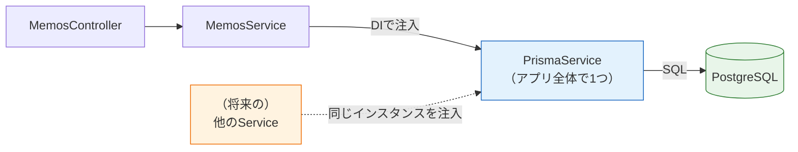
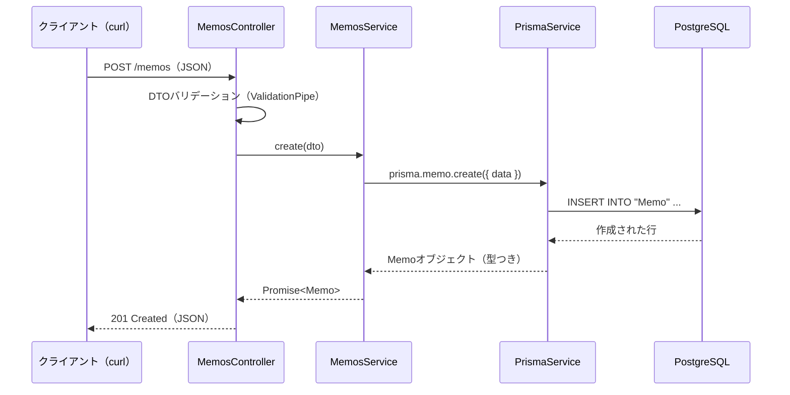

# Prisma ClientでCRUD

[前のページ](/database/schema_and_migration/)で `Memo` テーブルが完成し、Prisma Clientも生成されました。このページでは、Prisma Clientの基本操作を学んだうえで、[バックエンド基礎で作ったメモAPI](/backend/crud_practice/)を**メモリ上の配列からデータベースへ**移行します。NestJSにPrismaを組み込む定番パターン（PrismaService）も丁寧に解説します。このページを終えると、「サーバーを再起動してもデータが消えないAPI」が完成します。

## 学習目標

- Prisma Clientの基本メソッド（findMany / findUnique / create / update / delete）を使える
- PrismaServiceを作り、NestJSのDIコンテナにPrismaを組み込める
- `onModuleInit` などのライフサイクルフックの役割を説明できる
- メモAPIのServiceを配列実装からPrisma実装に書き換えられる
- データが永続化されたことをcurlと再起動で確認できる

## Prisma Clientの基本操作

まず、Prisma Clientでデータベースを操作するコードの「読み方」を押さえましょう。Prisma Clientの操作は、すべて次の形をしています。

```typescript
prisma.モデル名（小文字始まり）.メソッド(オプション)
```

`Memo` モデルに対する5つの基本操作と、それぞれが発行するSQLの対応は次のとおりです。[SQLのページ](/database/postgresql_setup/)で学んだ知識がそのまま活きます。

| Prisma Clientのコード | 発行されるSQLのイメージ | 意味 |
|---|---|---|
| `prisma.memo.findMany()` | `SELECT * FROM "Memo";` | 全件取得 |
| `prisma.memo.findUnique({ where: { id: 1 } })` | `SELECT * FROM "Memo" WHERE id = 1;` | 1件取得 |
| `prisma.memo.create({ data: {...} })` | `INSERT INTO "Memo" ...;` | 作成 |
| `prisma.memo.update({ where: { id: 1 }, data: {...} })` | `UPDATE "Memo" SET ... WHERE id = 1;` | 更新 |
| `prisma.memo.delete({ where: { id: 1 } })` | `DELETE FROM "Memo" WHERE id = 1;` | 削除 |

2つ、重要な性質があります。

1. **すべて非同期（Promiseを返す）** — データベースへの問い合わせはネットワーク越しの通信なので、結果は `await` で待ちます。[ReactのAPI通信](/react/api_fetch/)で学んだ `fetch` と同じ事情です
2. **型がついている** — `findMany()` の戻り値は自動的に `Memo[]` 型になります。この `Memo` 型は、スキーマから自動生成されて `@prisma/client` からインポートできます

```typescript
import { Memo } from '@prisma/client';
// Memo型の中身（自動生成）:
// { id: number; title: string; content: string; done: boolean;
//   createdAt: Date; updatedAt: Date }
```

スキーマを変更してマイグレーションすれば型も追従する、というのがPrismaの最大の強みです。

検索条件や並べ替えはオプションで指定します。SQLの `WHERE` / `ORDER BY` / `LIMIT` に対応するイメージです。

```typescript
// done が false のメモを、作成日時の新しい順に10件
const memos = await prisma.memo.findMany({
  where: { done: false },
  orderBy: { createdAt: 'desc' },
  take: 10,
});
```

**コード解説**

- `where: { done: false }` — SQLの `WHERE done = false` に相当します
- `orderBy: { createdAt: 'desc' }` — `ORDER BY "createdAt" DESC` に相当します。`'asc'` で昇順です
- `take: 10` — `LIMIT 10` に相当します

## NestJSにPrismaを組み込む — PrismaService

それでは、メモAPIのプロジェクトにPrismaを組み込みます。やみくもにコードを書く前に、設計方針を理解しましょう。

### なぜPrismaServiceを作るのか

Prisma Clientは `new PrismaClient()` でインスタンスを作って使います。しかし、各ServiceがそれぞれPrismaClientを `new` すると、データベースへの**接続がサービスの数だけ増えて**しまいます。接続はデータベースにとって貴重な資源です。

そこで、[Serviceと依存性注入](/backend/service_and_di/)で学んだDI（依存性注入）の出番です。PrismaClientを**ただ1つのインスタンス**としてDIコンテナに登録し、必要なServiceに注入してもらう。この役割を担うのが **PrismaService** という定番パターンです。



図のとおり、データベース接続の窓口をPrismaServiceに一本化し、各ServiceはPrismaServiceを通じてデータベースを操作します。

### PrismaServiceを書く

`src/prisma` ディレクトリを作り、次の2ファイルを作成します。

**`src/prisma/prisma.service.ts`**（新規作成）

```typescript
import { Injectable, OnModuleDestroy, OnModuleInit } from '@nestjs/common';
import { PrismaClient } from '@prisma/client';

@Injectable()
export class PrismaService
  extends PrismaClient
  implements OnModuleInit, OnModuleDestroy
{
  async onModuleInit() {
    await this.$connect();
  }

  async onModuleDestroy() {
    await this.$disconnect();
  }
}
```

**コード解説**

- `@Injectable()` — このクラスをDIコンテナに登録できるようにします（[Serviceと依存性注入](/backend/service_and_di/)の復習です）
- `extends PrismaClient` — PrismaServiceは**PrismaClientを継承**しています。これにより `prismaService.memo.findMany()` のように、PrismaClientの全機能をそのまま使えます
- `implements OnModuleInit, OnModuleDestroy` — NestJSの**ライフサイクルフック**のインターフェースです。「アプリの起動時・終了時に呼んでほしい処理がある」とNestJSに伝えるための宣言です
- `onModuleInit()` — **アプリ起動時（モジュールの初期化完了時）にNestJSが自動で呼ぶ**メソッドです。ここで `this.$connect()` を呼び、データベースへ明示的に接続します
- `$connect()` — PrismaClientのデータベース接続メソッドです。実は呼ばなくても最初のクエリ時に自動接続されるのですが、明示的に接続することで、(1)接続情報の間違いを**起動時にすぐ検出**できる（最初のリクエストが来るまで気づかない、を防ぐ）、(2)最初のリクエストが接続待ちで遅くなるのを防ぐ、という2つの利点があります
- `onModuleDestroy()` — **アプリ終了時にNestJSが自動で呼ぶ**メソッドです。`$disconnect()` で接続を行儀よく閉じます。終了時に接続を放置しないのは、データベース側に不要な接続を残さないためです

### PrismaModuleを書く

PrismaServiceを他のモジュールから使えるように、モジュールとしてまとめます。

**`src/prisma/prisma.module.ts`**（新規作成）

```typescript
import { Module } from '@nestjs/common';
import { PrismaService } from './prisma.service';

@Module({
  providers: [PrismaService],
  exports: [PrismaService],
})
export class PrismaModule {}
```

**コード解説**

- `providers: [PrismaService]` — PrismaServiceをこのモジュールのDIコンテナに登録します
- `exports: [PrismaService]` — **このモジュールの外**（PrismaModuleをimportした他のモジュール）からもPrismaServiceを注入できるようにします。exportsを忘れると、他のモジュールで注入しようとしたときに「依存を解決できない」というエラーになります（NestJSで非常によくあるミスです）

### MemosModuleにPrismaModuleを読み込む

メモ機能のモジュールから、PrismaModuleを使えるようにします。

**`src/memos/memos.module.ts`**（importsを追加）

```typescript
import { Module } from '@nestjs/common';
import { PrismaModule } from '../prisma/prisma.module';
import { MemosController } from './memos.controller';
import { MemosService } from './memos.service';

@Module({
  imports: [PrismaModule],
  controllers: [MemosController],
  providers: [MemosService],
})
export class MemosModule {}
```

**コード解説**

- `imports: [PrismaModule]` — PrismaModuleがexportしているPrismaServiceを、このモジュール内で注入できるようになります

これで配線は完了です。「PrismaModuleがPrismaServiceを提供し、MemosModuleがそれを読み込み、MemosServiceに注入される」という流れを押さえてください。

## MemosServiceを配列からPrismaへ書き換える

いよいよ本丸です。[バックエンド基礎](/backend/crud_practice/)で書いたMemosServiceは、おおよそ次のような配列実装でした。

```typescript
// 【変更前】メモリ上の配列で管理していた実装（抜粋）
@Injectable()
export class MemosService {
  private memos: Memo[] = [];
  private nextId = 1;

  findAll(): Memo[] {
    return this.memos;
  }

  create(dto: CreateMemoDto): Memo {
    const memo = { id: this.nextId++, ...dto };
    this.memos.push(memo);
    return memo;
  }
  // ...
}
```

これをPrismaで全面的に書き換えます。

**`src/memos/memos.service.ts`**（全体を書き換え）

```typescript
import { Injectable, NotFoundException } from '@nestjs/common';
import { Memo } from '@prisma/client';
import { PrismaService } from '../prisma/prisma.service';
import { CreateMemoDto } from './dto/create-memo.dto';
import { UpdateMemoDto } from './dto/update-memo.dto';

@Injectable()
export class MemosService {
  constructor(private readonly prisma: PrismaService) {}

  async findAll(): Promise<Memo[]> {
    return this.prisma.memo.findMany({
      orderBy: { createdAt: 'desc' },
    });
  }

  async findOne(id: number): Promise<Memo> {
    const memo = await this.prisma.memo.findUnique({
      where: { id },
    });
    if (!memo) {
      throw new NotFoundException(`id ${id} のメモは存在しません`);
    }
    return memo;
  }

  async create(dto: CreateMemoDto): Promise<Memo> {
    return this.prisma.memo.create({
      data: {
        title: dto.title,
        content: dto.content,
      },
    });
  }

  async update(id: number, dto: UpdateMemoDto): Promise<Memo> {
    await this.findOne(id); // 存在しなければここでNotFoundExceptionが飛ぶ
    return this.prisma.memo.update({
      where: { id },
      data: dto,
    });
  }

  async remove(id: number): Promise<void> {
    await this.findOne(id); // 存在チェック
    await this.prisma.memo.delete({
      where: { id },
    });
  }
}
```

**コード解説**

- `constructor(private readonly prisma: PrismaService)` — コンストラクタでPrismaServiceを受け取ります。NestJSのDIコンテナが、起動時に自動でインスタンスを渡してくれます。`private readonly` を付けることで `this.prisma` として使えるようになる書き方は[DIのページ](/backend/service_and_di/)で学んだとおりです
- `private memos: Memo[] = []` と `nextId` が**消えた** — データの保管とIDの採番は、すべてデータベースの仕事になりました
- `findAll()` — `findMany` で全件取得します。`orderBy` で新しい順に並べるのは、SQLの `ORDER BY "createdAt" DESC` に相当します。戻り値の型が `Promise<Memo[]>` に変わった点に注意してください（データベースアクセスは非同期のため）
- `findOne(id)` — `findUnique` は主キーやユニーク制約のあるフィールドで1件を取得します。**見つからない場合は `null` を返す**ので、`null` なら `NotFoundException` を投げて404レスポンスにします（[コントローラ](/backend/controller/)で学んだNestJSの例外クラスです）
- `create(dto)` — `data` に渡したオブジェクトがそのままINSERTされます。`id` / `createdAt` / `updatedAt` / `done` はスキーマの `@default` や `@updatedAt` により自動で値が入るため、書く必要がありません
- `update(id, dto)` — 先に `findOne` で存在チェックをしています。存在しないidで `prisma.memo.update` を呼ぶと、Prismaは `P2025` というコード（対象レコードが見つからない）の実行時エラーを投げ、そのままだと500エラーになってしまいます。先にチェックして404を返すほうが、APIの利用者に親切です
- `data: dto` — `UpdateMemoDto` は全フィールドが省略可能（partial）なDTOでした。Prismaの `update` は、**`data` に含まれるフィールドだけを更新**するので、partialなDTOをそのまま渡せます
- `remove(id)` — `delete` で行を削除します。こちらも存在チェックをしてから実行します

なお、DTO（`CreateMemoDto` / `UpdateMemoDto`）は[バックエンド章で作ったもの](/backend/dto_and_validation/)をそのまま使います。バリデーションの仕組みは何も変わりません。

### Controllerはほぼ変わらない

ここで注目してほしいのは、**MemosControllerの変更がほぼ不要**なことです。

**`src/memos/memos.controller.ts`**（変更不要。確認のため抜粋）

```typescript
@Controller('memos')
export class MemosController {
  constructor(private readonly memosService: MemosService) {}

  @Get()
  findAll() {
    return this.memosService.findAll();
  }

  @Get(':id')
  findOne(@Param('id', ParseIntPipe) id: number) {
    return this.memosService.findOne(id);
  }
  // ... POST / PATCH / DELETE も同様
}
```

Serviceのメソッドが `Memo[]` から `Promise<Memo[]>` を返すようになりましたが、**NestJSはハンドラがPromiseを返すと自動でawaitしてくれる**ため、Controllerはそのままで動きます。

「保存先が配列からデータベースに変わる」という大改造をしたのに、ControllerもDTOも無傷。これこそが、[バックエンド基礎](/backend/what_is_nestjs/)で学んだ**Controller（受付）とService（業務処理）を分離する設計**の威力です。変更の影響範囲が層の中に閉じ込められています。

## 動作確認 — データは本当に永続化されたか

アプリを起動して確かめましょう。PostgreSQLコンテナの起動を確認してから、NestJSを起動します。

```bash
docker compose ps   # dbがUpであることを確認
pnpm run start:dev
```

実行結果の例:

```
[Nest] 12345  - 2026/06/12 10:00:00     LOG [NestFactory] Starting Nest application...
[Nest] 12345  - 2026/06/12 10:00:00     LOG [InstanceLoader] PrismaModule dependencies initialized
[Nest] 12345  - 2026/06/12 10:00:00     LOG [InstanceLoader] MemosModule dependencies initialized
[Nest] 12345  - 2026/06/12 10:00:00     LOG [NestApplication] Nest application successfully started
```

`PrismaModule dependencies initialized` が出ていれば、PrismaServiceの組み込みに成功しています（このタイミングで `onModuleInit` → `$connect()` が実行されています）。

リクエストがデータベースまで届く全体の流れを確認しておきましょう。



### curlでCRUDを一周する

別のターミナルから順に実行します（[メモAPIのページ](/backend/crud_practice/)と同じ流れです）。

**作成（POST）**

```bash
curl -X POST http://localhost:3000/memos \
  -H "Content-Type: application/json" \
  -d '{"title": "買い物", "content": "牛乳と卵を買う"}'
```

実行結果の例:

```json
{"id":1,"title":"買い物","content":"牛乳と卵を買う","done":false,"createdAt":"2026-06-12T01:05:00.123Z","updatedAt":"2026-06-12T01:05:00.123Z"}
```

`id` の自動採番、`done` の既定値、`createdAt`/`updatedAt` の自動設定が、すべてデータベース側で行われています。

**一覧（GET）**

```bash
curl http://localhost:3000/memos
```

実行結果の例:

```json
[{"id":1,"title":"買い物","content":"牛乳と卵を買う","done":false,"createdAt":"2026-06-12T01:05:00.123Z","updatedAt":"2026-06-12T01:05:00.123Z"}]
```

**更新（PATCH）**

```bash
curl -X PATCH http://localhost:3000/memos/1 \
  -H "Content-Type: application/json" \
  -d '{"done": true}'
```

実行結果の例:

```json
{"id":1,"title":"買い物","content":"牛乳と卵を買う","done":true,"createdAt":"2026-06-12T01:05:00.123Z","updatedAt":"2026-06-12T01:08:30.456Z"}
```

`done` だけが更新され、`updatedAt` も自動で進んでいます。

**存在しないidへのアクセス（404の確認）**

```bash
curl -i http://localhost:3000/memos/999
```

実行結果の例:

```
HTTP/1.1 404 Not Found
...
{"message":"id 999 のメモは存在しません","error":"Not Found","statusCode":404}
```

`findOne` での存在チェックが効いています。

### 再起動テスト — このページのハイライト

それでは、このセクションの目的が達成されたかを確かめる、いちばん大事なテストです。**NestJSを `Ctrl + C` で停止し、もう一度起動して**から一覧を取得してください。

```bash
# Ctrl + C で停止 → 再起動
pnpm run start:dev
```

```bash
curl http://localhost:3000/memos
```

実行結果の例:

```json
[{"id":1,"title":"買い物","content":"牛乳と卵を買う","done":true,...}]
```

**メモが残っています。** 配列実装ではここで必ず `[]` になっていました。データはNestJSのメモリではなくPostgreSQL（の[ボリューム](/docker/docker_compose/)）にあるので、アプリを何度再起動しても消えません。psqlやPrisma Studio（`pnpm exec prisma studio`）で `Memo` テーブルを覗けば、同じデータが見えるはずです。

## 理解度チェック

**Q1. 各Serviceがそれぞれ `new PrismaClient()` するのではなく、PrismaServiceを1つ作ってDIで注入するのはなぜですか。**

<details markdown="1">
<summary>解答を見る</summary>

PrismaClientのインスタンスごとにデータベースへの接続が作られるため、サービスの数だけ `new` すると接続が無駄に増えてデータベースの資源を圧迫するからです。

PrismaServiceとしてDIコンテナに1つだけ登録すれば、アプリ全体で同じインスタンス（同じ接続）を共有できます。また、接続の開始・終了の管理（ライフサイクルフック）も1か所に集約できます。

</details>

**Q2. PrismaServiceの `onModuleInit` で `$connect()` を呼ぶのはなぜですか。呼ばなくても動くのに明示する利点を説明してください。**

<details markdown="1">
<summary>解答を見る</summary>

`onModuleInit` はNestJSがアプリ起動時に自動で呼ぶライフサイクルフックです。ここで `$connect()` を呼ばなくても、PrismaClientは最初のクエリ実行時に自動接続します。

それでも明示する利点は2つあります。

1. 接続情報の間違い（.envのミスやDB停止）を**起動時に即座に検出**できる。自動接続に任せると、最初のリクエストが来るまでエラーに気づけない
2. 最初のリクエストが「接続確立の待ち時間」を被らずに済む

</details>

**Q3. PrismaModuleの `exports: [PrismaService]` を書き忘れると何が起きますか。**

<details markdown="1">
<summary>解答を見る</summary>

PrismaModuleをimportした他のモジュール（MemosModuleなど）でPrismaServiceを注入できず、起動時に「Nest can't resolve dependencies of the MemosService」のようなエラーになります。

`providers` はあくまで「そのモジュール内」への登録であり、モジュールの外に公開するには `exports` が必要です。NestJSで頻出のつまずきポイントなので覚えておきましょう。

</details>

**Q4. `findUnique` で取得した結果が `null` だった場合、Serviceでは何をすべきですか。また、存在しないidで `prisma.memo.update` を直接呼ぶと何が起きますか。**

<details markdown="1">
<summary>解答を見る</summary>

- `findUnique` が `null` を返したら、`NotFoundException` を投げてHTTP 404として返すのが定石です。`null` のまま返すと、クライアントは「成功したのに中身がない」という分かりにくいレスポンスを受け取ります
- 存在しないidで `update`（や `delete`）を直接呼ぶと、Prismaは「対象レコードが見つからない」という実行時エラー（コード P2025）を投げます。捕捉しなければ500 Internal Server Errorになってしまうため、先に存在チェックをして404を返すのが親切な実装です

</details>

**Q5. Serviceを配列実装からPrisma実装へ全面的に書き換えたのに、Controllerはほぼ変更不要でした。これはどのような設計の効果ですか。**

<details markdown="1">
<summary>解答を見る</summary>

Controller（HTTPの受付・ルーティング）とService（業務処理・データ管理）を分離するレイヤードアーキテクチャの効果です。

Controllerは「Serviceのメソッドを呼ぶ」ことしか知らず、Serviceの内部実装（配列かデータベースか）に依存していません。そのため、保存先の変更という大きな改造でも影響がService層に閉じました。NestJSがPromiseを自動でawaitしてくれることも、変更を小さくするのに寄与しています。

</details>

## セルフレビュー

- [ ] findMany / findUnique / create / update / delete が、それぞれどんなSQLに対応するか言える
- [ ] PrismaServiceを写経せずに書ける（extends / implements / onModuleInit / onModuleDestroy）
- [ ] ライフサイクルフック（onModuleInit / onModuleDestroy）がいつ呼ばれるか説明できる
- [ ] PrismaModuleのproviders / exportsの違いを説明できる
- [ ] findUniqueの結果がnullのときにNotFoundExceptionを投げる理由を説明できる
- [ ] update/deleteの前に存在チェックをする理由（P2025と500エラー）を説明できる
- [ ] curlでCRUDを一周し、再起動後もデータが残ることを確認した
- [ ] リクエストからデータベースまでの流れをシーケンス図に描ける

## 次のステップ

メモAPIのデータベース永続化が完成しました。しかし、ここまで扱ったのはテーブル1つだけです。実際のアプリでは、ユーザーと投稿のように複数のテーブルが関係し合います。次のページでは、Prismaでテーブル同士の**リレーション**を定義し、クエリする方法を学びます。

- 前のページ: [スキーマ定義とマイグレーション](/database/schema_and_migration/)
- 次のページ: [リレーション](/database/relations/)
- ここで作ったPrismaService + PrismaModuleのパターンは、[SNS開発](/sns/project_setup/)でもそのまま使います。また、データベースを使ったServiceのテスト方法は[バックエンドテスト](/testing//)で学びます
