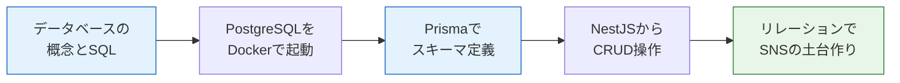

# データベースとPrisma

このセクションでは、Webアプリケーションの心臓部とも言える**データベース**を学びます。

## なぜデータベースを学ぶのか

[バックエンド基礎](/backend//)のセクションで、NestJSを使ってメモAPIを作りました。あのAPIには、実は大きな弱点がありました。データをメモリ上の配列に保存していたため、**サーバーを再起動するとデータがすべて消えてしまう**のです。

実際のWebサービスでは、こんなことは許されません。X（旧Twitter）の投稿が、サーバーの再起動のたびに消えてしまったら誰も使わないでしょう。

データを安全に、永続的に保存する仕組み。それがデータベースです。

## このセクションで学ぶこと

| ページ | 内容 |
|---|---|
| [データベースとは](/database/what_is_database/) | RDBの概念、テーブル・行・列、主キーと外部キー、SQLの基礎 |
| [PostgreSQLを起動して触ってみる](/database/postgresql_setup/) | Docker ComposeでPostgreSQL 16を起動し、psqlで生のSQLを実行する |
| [Prismaの導入](/database/prisma_setup/) | ORMとは何か、Prismaのセットアップ、schema.prismaと.env |
| [スキーマ定義とマイグレーション](/database/schema_and_migration/) | モデル定義、`prisma migrate dev`、マイグレーションの仕組み |
| [Prisma ClientでCRUD](/database/crud_with_prisma/) | Prisma Clientの基本操作、NestJSへの組み込み（PrismaService） |
| [リレーション](/database/relations/) | 1対多・多対多の関係、include/selectによるクエリ |
| [練習問題](/database/practice/) | メモAPIをデータベース永続化に改造する総合演習 |

## このセクションの前提知識

以下のセクションを修了していることを前提とします。

- [TypeScript基礎](/typescript//) — Prismaのコードはすべて TypeScript で書きます
- [バックエンド基礎（NestJS）](/backend//) — 特に[メモAPIの実装](/backend/crud_practice/)をこのセクションで改造します
- [Docker基礎](/docker//) — PostgreSQLは[Docker Compose](/docker/docker_compose/)で起動します

## 学んだことはどこで使うのか

このセクションの内容は、この後のカリキュラム全体で繰り返し使います。

- **[バックエンドテスト](/testing//)** — データベースを使ったAPIのテスト方法を学びます
- **[AIチャット開発（RAG）](/ai-chat//)** — PostgreSQLの拡張機能 pgvector を使ってベクトル検索を実装します
- **[SNS開発（最終プロジェクト）](/sns//)** — ユーザー、投稿、いいね、フォローなど、すべてのデータをPrismaで管理します。このセクションで学ぶ「1対多」「多対多」のリレーションが主役になります

データベースは、一度身につければどんなWebサービスの開発でも必ず役に立つ、息の長いスキルです。じっくり取り組んでいきましょう。

まずは[データベースとは](/database/what_is_database/)から始めます。
