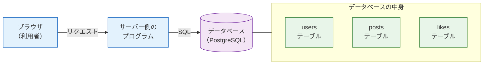
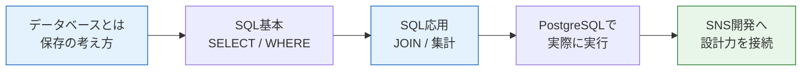
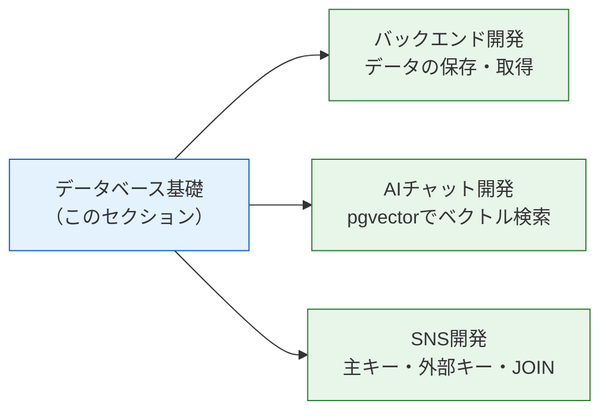

# データベース基礎

このセクションでは、Webアプリケーションの心臓部とも言える**データベース**を学びます。

## なぜデータベースを学ぶのか

Webサービスでは、ユーザー情報、投稿、コメント、購入履歴、学習進捗など、あとから見返したいデータを扱います。これらのデータは、ページを閉じたり、サーバーを再起動したりしても消えてはいけません。

もしX（旧Twitter）の投稿が、サーバーの再起動のたびに消えてしまったら誰も使わないでしょう。ログイン情報や購入履歴が消えるサービスも成立しません。

データを安全に、永続的に保存する仕組み。それがデータベースです。

このデータベースが、Webアプリ全体のどこに位置し、何を抱えているのかを図で俯瞰しておきましょう。

図の読み方です。利用者のブラウザ（青）はサーバー側のプログラム（青）に要求を出し、プログラムが SQL を通じてデータベース（紫）にアクセスします。データベースの中には `users` や `posts` といった複数のテーブル（緑）が保管されています。このセクションでは、主にこのデータベースと SQL の部分をじっくり学びます。

## このセクションで学ぶこと

| ページ | 内容 |
|---|---|
| [データベースとは](/database/what_is_database/) | DBが必要な理由、RDB、テーブル・行・列、主キーと外部キー |
| [SQL基本構文](/database/sql_basic/) | `SELECT`、列指定、`WHERE`、`INSERT`、`UPDATE`、`DELETE` を表と結果で理解する |
| [SQL応用構文](/database/sql_applied/) | `ORDER BY`、`LIMIT`、`LIKE`、`JOIN`、`GROUP BY`、集計を具体例で理解する |
| [PostgreSQLでSQLを実行する](/database/postgresql_setup/) | 起動済みのPostgreSQLにpsqlで入り、学んだSQLを実際に実行する |

## このセクションの前提知識

以下のセクションを修了していることを前提とします。

- [Docker基礎](/docker/) — コンテナの考え方を理解します
- [Docker Compose + PostgreSQL / MySQL](/docker/database_compose/) — PostgreSQLを起動できる状態にします

## 学んだことはどこで使うのか

このセクションの内容は、この後のカリキュラム全体で繰り返し使います。

- **バックエンド開発** — サーバー側のプログラムからデータを保存・取得するときに使います
- **[AIチャット開発（RAG）](/ai-chat/)** — PostgreSQLの拡張機能 pgvector を使ってベクトル検索を実装します
- **[SNS開発（最終プロジェクト）](/sns/)** — ユーザー、投稿、いいね、フォローなど、すべてのデータ設計で主キー・外部キー・JOINの考え方を使います

ここで学ぶ基礎が、この先のどのセクションにつながっていくのかを図で確認しておきましょう。

図の読み方です。中央の青がいま学ぶ「データベース基礎」で、そこから伸びる3本の矢印（緑）が、この知識を実際に使う後続セクションです。ここで身につけたテーブル設計や SQL は、これらすべての土台になります。

データベースは、一度身につければどんなWebサービスの開発でも必ず役に立つ、息の長いスキルです。じっくり取り組んでいきましょう。

まずは[データベースとは](/database/what_is_database/)から始めます。
