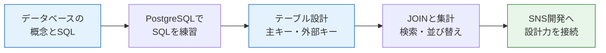

# データベース基礎

このセクションでは、Webアプリケーションの心臓部とも言える**データベース**を学びます。

## なぜデータベースを学ぶのか

[バックエンド基礎](/backend/)のセクションで、NestJSを使ってメモAPIを作りました。あのAPIには、実は大きな弱点がありました。データをメモリ上の配列に保存していたため、**サーバーを再起動するとデータがすべて消えてしまう**のです。

実際のWebサービスでは、こんなことは許されません。X（旧Twitter）の投稿が、サーバーの再起動のたびに消えてしまったら誰も使わないでしょう。

データを安全に、永続的に保存する仕組み。それがデータベースです。

## このセクションで学ぶこと

| ページ | 内容 |
|---|---|
| [データベースとは](/database/what_is_database/) | RDBの概念、テーブル・行・列、主キーと外部キー、SQLの基礎 |
| [PostgreSQLを起動して触ってみる](/database/postgresql_setup/) | 起動済みのPostgreSQLにpsqlで入り、生のSQLを実行する |

## このセクションの前提知識

以下のセクションを修了していることを前提とします。

- [バックエンド基礎（NestJS）](/backend/) — APIがなぜDBを必要とするのかを理解しやすくなります
- [Docker基礎](/docker/) — DBコンテナの起動は[Docker Compose + PostgreSQL / MySQL](/docker/database_compose/)で学びます

## 学んだことはどこで使うのか

このセクションの内容は、この後のカリキュラム全体で繰り返し使います。

- **[バックエンドテスト](/testing/)** — データベースを使ったAPIのテスト方法を学びます
- **[AIチャット開発（RAG）](/ai-chat/)** — PostgreSQLの拡張機能 pgvector を使ってベクトル検索を実装します
- **[SNS開発（最終プロジェクト）](/sns/)** — ユーザー、投稿、いいね、フォローなど、すべてのデータ設計で主キー・外部キー・JOINの考え方を使います

データベースは、一度身につければどんなWebサービスの開発でも必ず役に立つ、息の長いスキルです。じっくり取り組んでいきましょう。

まずは[データベースとは](/database/what_is_database/)から始めます。
