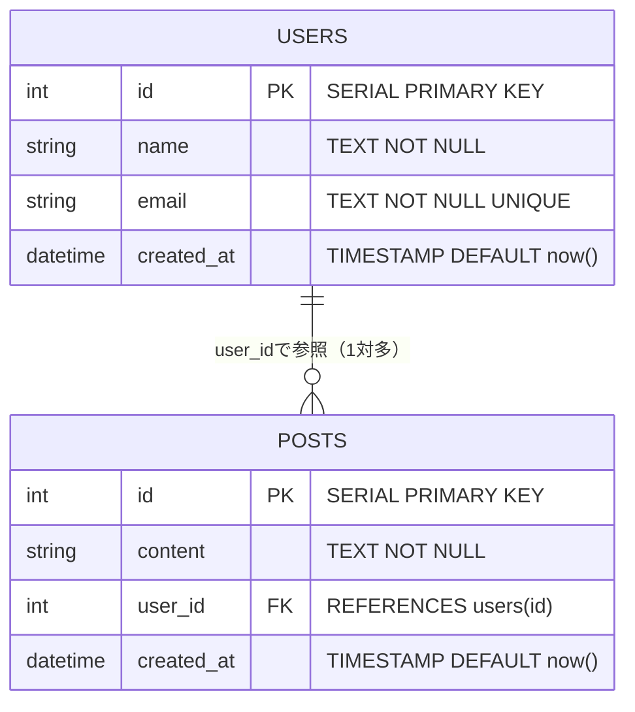

# PostgreSQLを起動して触ってみる

[前のページ](/database/what_is_database/)でデータベースの概念とSQLの基礎を学びました。このページでは、PostgreSQL 16に`psql`というコマンドラインツールから接続し、生のSQLを一通り実行します。「読めるSQL」を「書けるSQL」にすることが目的です。

PostgreSQLコンテナの立て方そのものは、[Docker Compose + PostgreSQL / MySQL](/docker/database_compose/)で独立して扱います。このページでは、DBが起動している前提で、`psql`とSQLの練習に集中します。

## 学習目標

- Docker ComposeでPostgreSQL 16を起動し、psqlで接続できる
- CREATE TABLEでテーブルを作成できる
- INSERT/SELECT/UPDATE/DELETEを自分で書いて実行できる
- WHERE・ORDER BYで絞り込みと並べ替えができる
- JOINで2つのテーブルを結合した結果を取得できる

## PostgreSQLコンテナを起動する

### compose.yamlの確認

[Docker Compose + PostgreSQL / MySQL](/docker/database_compose/)で作成した `compose.yaml` には、PostgreSQLのサービスが含まれていました。データベース部分を抜き出すと次のような構成です。

**`compose.yaml`**

```yaml
services:
  db:
    image: postgres:16
    environment:
      POSTGRES_USER: postgres
      POSTGRES_PASSWORD: postgres
      POSTGRES_DB: memo
    ports:
      - "5432:5432"
    volumes:
      - db-data:/var/lib/postgresql/data

volumes:
  db-data:
```

**コード解説**

- `image: postgres:16` — PostgreSQL 16の公式イメージを使います。バージョンを固定するのは、[Dockerfileのページ](/docker/dockerfile/)で学んだとおり「環境を再現可能にする」ためです
- `POSTGRES_USER` / `POSTGRES_PASSWORD` — データベースに接続するためのユーザー名とパスワードです。開発環境なので簡単な値にしていますが、本番環境では推測されない値を使います
- `POSTGRES_DB: memo` — 起動時に `memo` という名前のデータベースを自動作成します。この章の目的は[バックエンド基礎で作ったメモAPI](/backend/crud_practice/)のデータを永続化することなので、DB名も `memo` です
- `ports: "5432:5432"` — PostgreSQLの標準ポート5432を、手元のPC（ホスト）にも公開します。後でPrismaがここに接続します
- `volumes: db-data:...` — [ボリューム](/docker/docker_compose/)を使い、コンテナを削除してもデータが消えないようにしています。`/var/lib/postgresql/data` はPostgreSQLがデータファイルを置く場所です

ここでは練習用に、上記の内容だけを書いた `compose.yaml` を新しいディレクトリに用意しても構いませんし、Docker章で作ったプロジェクトをそのまま使っても構いません。

### 起動する

`compose.yaml` のあるディレクトリで起動します。

```bash
docker compose up -d
```

実行結果の例:

```
[+] Running 2/2
 ✔ Network myapp_default  Created
 ✔ Container myapp-db-1   Started
```

`-d` はバックグラウンド実行のオプションでした（[Docker Compose](/docker/docker_compose/)の復習です）。起動できたか確認します。

```bash
docker compose ps
```

実行結果の例:

```
NAME         IMAGE         COMMAND                  SERVICE   CREATED          STATUS          PORTS
myapp-db-1   postgres:16   "docker-entrypoint.s…"   db        10 seconds ago   Up 9 seconds    0.0.0.0:5432->5432/tcp
```

`STATUS` が `Up` になっていれば成功です。

## psqlで接続する

**psql（ピーエスキューエル）**は、PostgreSQLに付属するコマンドラインクライアントです。SQLを直接打ち込んで実行できます。

コンテナの中でpsqlを起動しましょう。[コンテナ内でコマンドを実行する](/docker/install_and_basics/) `docker compose exec` を使います。

```bash
docker compose exec db psql -U postgres -d memo
```

**コード解説**

- `docker compose exec db` — `db` サービスのコンテナ内でコマンドを実行します
- `psql -U postgres` — ユーザー `postgres`（compose.yamlの `POSTGRES_USER`）として接続します
- `-d memo` — 接続先のデータベース名（compose.yamlの `POSTGRES_DB`）です

実行結果の例:

```
psql (16.4 (Debian 16.4-1.pgdg120+1))
Type "help" for help.

memo=#
```

`memo=#` というプロンプトが出れば接続成功です。ここからはSQLとpsqlのコマンドを打ち込めます。

### psqlの基本コマンド

psqlには、SQLとは別に `\`（バックスラッシュ）で始まる便利コマンドがあります。よく使うものを覚えておきましょう。

| コマンド | 意味 |
|---|---|
| `\l` | データベースの一覧を表示 |
| `\dt` | 現在のデータベースのテーブル一覧を表示 |
| `\d テーブル名` | テーブルの構造（列と型）を表示 |
| `\q` | psqlを終了 |

## テーブルを作る — CREATE TABLE

[前のページ](/database/what_is_database/)で例に使ったユーザーテーブルを、実際に作ってみましょう。psqlのプロンプトに次のSQLを入力します（複数行に分けて入力でき、`;` を打った時点で実行されます）。

```sql
CREATE TABLE users (
  id SERIAL PRIMARY KEY,
  name TEXT NOT NULL,
  email TEXT NOT NULL UNIQUE,
  created_at TIMESTAMP NOT NULL DEFAULT now()
);
```

実行結果の例:

```
CREATE TABLE
```

**コード解説**

- `CREATE TABLE users (...)` — `users` という名前のテーブルを作ります
- `id SERIAL PRIMARY KEY` — `SERIAL` は「1, 2, 3, ...と自動採番される整数」、`PRIMARY KEY` は主キー指定です。これで「重複しない自動採番のid」になります
- `name TEXT NOT NULL` — `TEXT` は文字列型、`NOT NULL` は「空を許さない」という制約です
- `email TEXT NOT NULL UNIQUE` — `UNIQUE` は「テーブル内で重複を許さない」制約です。同じメールアドレスで2人登録できないようにします
- `created_at TIMESTAMP NOT NULL DEFAULT now()` — `TIMESTAMP` は日時型。`DEFAULT now()` で、値を指定しなければ現在日時が自動で入ります

テーブルができたか確認しましょう。

```
memo=# \dt
```

実行結果の例:

```
        List of relations
 Schema | Name  | Type  |  Owner
--------+-------+-------+----------
 public | users | table | postgres
(1 row)
```

`\d users` でテーブルの構造も確認できます。

```
memo=# \d users
```

実行結果の例:

```
                                 Table "public.users"
   Column   |            Type             | Collation | Nullable |      Default
------------+-----------------------------+-----------+----------+--------------------
 id         | integer                     |           | not null | nextval('users_id_seq'...)
 name       | text                        |           | not null |
 email      | text                        |           | not null |
 created_at | timestamp without time zone |           | not null | now()
```

## INSERT — データを追加する

ユーザーを3人追加してみましょう。

```sql
INSERT INTO users (name, email) VALUES ('太郎', 'taro@example.com');
INSERT INTO users (name, email) VALUES ('花子', 'hanako@example.com');
INSERT INTO users (name, email) VALUES ('次郎', 'jiro@example.com');
```

実行結果の例（1文ごとに表示されます）:

```
INSERT 0 1
```

`INSERT 0 1` の最後の `1` は「1行追加された」という意味です。なお、複数行を一度に追加することもできます。

```sql
INSERT INTO users (name, email) VALUES
  ('三郎', 'saburo@example.com'),
  ('四郎', 'shiro@example.com');
```

実行結果の例:

```
INSERT 0 2
```

ここで、`UNIQUE` 制約の働きも確認しておきましょう。既に存在するメールアドレスで追加しようとすると失敗します。

```sql
INSERT INTO users (name, email) VALUES ('偽太郎', 'taro@example.com');
```

実行結果の例:

```
ERROR:  duplicate key value violates unique constraint "users_email_key"
DETAIL:  Key (email)=(taro@example.com) already exists.
```

このように、データベースは**制約によってデータの整合性を守ってくれます**。アプリケーションのバリデーション（[DTOとバリデーション](/backend/dto_and_validation/)）とデータベースの制約は、二重の防御として両方使うのが基本です。

## SELECT — データを取得する

### 全件取得

```sql
SELECT * FROM users;
```

実行結果の例:

```
 id | name |       email        |         created_at
----+------+--------------------+----------------------------
  1 | 太郎 | taro@example.com   | 2026-06-12 09:00:01.123456
  2 | 花子 | hanako@example.com | 2026-06-12 09:00:02.234567
  3 | 次郎 | jiro@example.com   | 2026-06-12 09:00:03.345678
  4 | 三郎 | saburo@example.com | 2026-06-12 09:00:04.456789
  5 | 四郎 | shiro@example.com  | 2026-06-12 09:00:04.456789
(5 rows)
```

### 列を絞る

```sql
SELECT id, name FROM users;
```

実行結果の例:

```
 id | name
----+------
  1 | 太郎
  2 | 花子
  3 | 次郎
  4 | 三郎
  5 | 四郎
(5 rows)
```

実務では `SELECT *` よりも必要な列だけを指定する方が、通信量が減り高速になります。後で学ぶPrismaの `select` オプションはこれに対応します。

### WHERE — 条件で絞り込む

```sql
-- idが2のユーザー
SELECT * FROM users WHERE id = 2;

-- 名前が「太郎」のユーザー
SELECT * FROM users WHERE name = '太郎';

-- idが3以上のユーザー
SELECT * FROM users WHERE id >= 3;
```

条件は `AND` や `OR` で組み合わせられます。

```sql
SELECT * FROM users WHERE id >= 2 AND id <= 4;
```

実行結果の例:

```
 id | name |       email        |         created_at
----+------+--------------------+----------------------------
  2 | 花子 | hanako@example.com | 2026-06-12 09:00:02.234567
  3 | 次郎 | jiro@example.com   | 2026-06-12 09:00:03.345678
  4 | 三郎 | saburo@example.com | 2026-06-12 09:00:04.456789
(3 rows)
```

部分一致の検索には `LIKE` を使います。`%` は「任意の0文字以上」を表すワイルドカードです。

```sql
-- 名前が「郎」で終わるユーザー
SELECT * FROM users WHERE name LIKE '%郎';
```

### ORDER BY — 並べ替える

```sql
-- idの降順（大きい順）に並べる
SELECT id, name FROM users ORDER BY id DESC;
```

実行結果の例:

```
 id | name
----+------
  5 | 四郎
  4 | 三郎
  3 | 次郎
  2 | 花子
  1 | 太郎
(5 rows)
```

**コード解説**

- `ORDER BY id DESC` — `id` 列で並べ替えます。`DESC`（descending、降順）は大きい順、`ASC`（ascending、昇順）は小さい順です。省略すると `ASC` になります
- SNSのタイムラインで「新しい投稿が上」に表示されるのは、`ORDER BY created_at DESC` のような並べ替えの結果です

件数を制限する `LIMIT` と組み合わせると、「最新3件」のような取得ができます。

```sql
SELECT id, name FROM users ORDER BY id DESC LIMIT 3;
```

## UPDATE — データを更新する

```sql
UPDATE users SET name = '太郎丸' WHERE id = 1;
```

実行結果の例:

```
UPDATE 1
```

`UPDATE 1` は「1行更新された」という意味です。確認してみましょう。

```sql
SELECT id, name FROM users WHERE id = 1;
```

実行結果の例:

```
 id |  name
----+--------
  1 | 太郎丸
(1 row)
```

前のページで注意したとおり、**WHERE句を忘れると全行が更新されます**。UPDATEを打つ前に、同じWHERE句でSELECTして対象行を確認する習慣をつけると安全です。

```sql
-- まずSELECTで対象を確認してから...
SELECT * FROM users WHERE id = 1;
-- 同じWHERE句でUPDATEする
UPDATE users SET name = '太郎' WHERE id = 1;
```

## DELETE — データを削除する

```sql
DELETE FROM users WHERE id = 5;
```

実行結果の例:

```
DELETE 1
```

これで四郎さん（id=5）が削除されました。`SELECT * FROM users;` で確認すると4行になっているはずです。DELETEもWHERE句を忘れると全行が消えるので、SELECTで確認してから実行しましょう。

## JOIN入門 — 2つのテーブルを結合する

最後に、RDBの真骨頂である**JOIN（ジョイン、結合）**を体験します。JOINは、外部キーでつながった複数のテーブルを1つの表として取得する操作です。

### 投稿テーブルを作る

[前のページ](/database/what_is_database/)で見たとおり、`users` を参照する `posts` テーブルを作ります。これから作る2つのテーブルの関係をER図で確認しておきましょう。



この図をそのままSQLにしたものが、次のCREATE TABLEです。

```sql
CREATE TABLE posts (
  id SERIAL PRIMARY KEY,
  content TEXT NOT NULL,
  user_id INTEGER NOT NULL REFERENCES users(id),
  created_at TIMESTAMP NOT NULL DEFAULT now()
);
```

**コード解説**

- `user_id INTEGER NOT NULL REFERENCES users(id)` — ここが外部キーの指定です。`REFERENCES users(id)` により、「`user_id` には `users.id` に存在する値しか入れられない」という**外部キー制約**がつきます

投稿をいくつか追加します。

```sql
INSERT INTO posts (content, user_id) VALUES
  ('おはようございます', 1),
  ('Prismaの勉強中', 2),
  ('今日はいい天気', 1),
  ('psql楽しい', 3);
```

外部キー制約の働きを確認しましょう。存在しないユーザーid（999）で投稿を追加しようとすると失敗します。

```sql
INSERT INTO posts (content, user_id) VALUES ('幽霊の投稿', 999);
```

実行結果の例:

```
ERROR:  insert or update on table "posts" violates foreign key constraint "posts_user_id_fkey"
DETAIL:  Key (user_id)=(999) is not present in table "users".
```

「存在しないユーザーの投稿」というありえないデータを、データベースが未然に防いでくれました。

### JOINで「投稿と投稿者名」を一緒に取得する

`posts` テーブルだけをSELECTすると、`user_id` という数字しか分かりません。「誰が書いたか」を名前で表示するには、`users` テーブルと結合します。

```sql
SELECT posts.id, posts.content, users.name
FROM posts
JOIN users ON posts.user_id = users.id;
```

実行結果の例:

```
 id |      content       |  name
----+--------------------+--------
  1 | おはようございます | 太郎
  2 | Prismaの勉強中     | 花子
  3 | 今日はいい天気     | 太郎
  4 | psql楽しい         | 次郎
```

**コード解説**

- `FROM posts JOIN users` — `posts` テーブルと `users` テーブルを結合します
- `ON posts.user_id = users.id` — 結合の条件です。「`posts.user_id` と `users.id` が一致する行同士をつなげる」という意味で、まさに外部キーの参照をたどっています
- `posts.id` のように `テーブル名.列名` と書くのは、両方のテーブルに `id` 列があり、どちらの `id` か曖昧になるためです

WHEREやORDER BYと組み合わせることもできます。

```sql
-- 太郎の投稿だけを新しい順に
SELECT posts.content, posts.created_at
FROM posts
JOIN users ON posts.user_id = users.id
WHERE users.name = '太郎'
ORDER BY posts.created_at DESC;
```

JOINにはいくつか種類がありますが、まずはこの基本形（INNER JOIN。`JOIN` と書けばこれになります）を押さえれば十分です。Prismaを使うと、このJOINに相当する操作を `include` というオプションで簡単に書けるようになります（[リレーション](/database/relations/)で学びます）。

## 後片付け

psqlを終了するには `\q` を入力します。

```
memo=# \q
```

コンテナを停止する場合は次のとおりです。

```bash
docker compose stop
```

`stop` ならボリュームのデータは残るので、次回 `docker compose up -d` すれば作ったテーブルもデータもそのまま使えます。`docker compose down -v` とすると**ボリュームごと削除されてデータが消える**ので、消したい場合だけ使ってください。

なお、ここで作った `users` / `posts` テーブルはSQL練習用です。次のページからはPrismaがテーブルを管理するため、このまま残しておいても構いませんし、`DROP TABLE posts; DROP TABLE users;`（テーブルの削除。外部キーの都合で `posts` が先です）で消しても構いません。ただし[マイグレーションのページ](/database/schema_and_migration/)で `prisma migrate dev` を初めて実行する際、PrismaがこれらのPrisma管理外のテーブルを検出し、データベースのリセットを促すことがあります。練習用テーブルはここでDROPしておくのが無難です。

## 理解度チェック

**Q1. `docker compose exec db psql -U postgres -d memo` というコマンドの各部分は何をしていますか。**

<details markdown="1">
<summary>解答を見る</summary>

- `docker compose exec db` — Composeで起動中の `db` サービスのコンテナ内でコマンドを実行する
- `psql` — PostgreSQLのコマンドラインクライアントを起動する
- `-U postgres` — ユーザー `postgres` として接続する
- `-d memo` — データベース `memo` に接続する

つまり「dbコンテナの中でpsqlを起動し、postgresユーザーとしてmemoデータベースに接続する」コマンドです。

</details>

**Q2. `users` テーブルから、名前の列だけを、idの降順で3件取得するSQLを書いてください。**

<details markdown="1">
<summary>解答を見る</summary>

```sql
SELECT name FROM users ORDER BY id DESC LIMIT 3;
```

- `SELECT name` で列を `name` だけに絞る
- `ORDER BY id DESC` でidの降順（大きい順）に並べ替える
- `LIMIT 3` で先頭から3件に制限する

</details>

**Q3. `posts` テーブルの `user_id` に `REFERENCES users(id)` という外部キー制約をつけました。この制約があると、何ができなくなりますか。**

<details markdown="1">
<summary>解答を見る</summary>

`users.id` に存在しない値を `posts.user_id` に入れることができなくなります。つまり「存在しないユーザーが書いた投稿」という矛盾したデータの作成を、データベースが拒否してくれます。

また、投稿が紐づいているユーザーを先に削除することもできなくなります（参照されている行を消すと投稿が宙に浮いてしまうため）。

</details>

**Q4. 「すべての投稿について、本文と投稿者の名前を一覧する」SQLを書いてください。テーブルは `posts`（`content`, `user_id` を持つ）と `users`（`id`, `name` を持つ）です。**

<details markdown="1">
<summary>解答を見る</summary>

```sql
SELECT posts.content, users.name
FROM posts
JOIN users ON posts.user_id = users.id;
```

`posts.user_id = users.id` という外部キーの対応を `ON` 句に書くことで、投稿の行とユーザーの行が結合され、1つの表として取得できます。

</details>

**Q5. `docker compose stop` と `docker compose down -v` の違いは何ですか。データベースの観点で説明してください。**

<details markdown="1">
<summary>解答を見る</summary>

- `stop` — コンテナを停止するだけです。ボリュームは残るため、テーブルやデータはそのまま保持され、次回 `up` したときに復元されます
- `down -v` — コンテナとネットワークに加えて**ボリュームも削除**します。PostgreSQLのデータファイルはボリュームにあるため、テーブルもデータもすべて消えます

開発を中断するだけなら `stop`、まっさらな状態からやり直したいときだけ `down -v` を使います。

</details>

## セルフレビュー

- [ ] Docker ComposeでPostgreSQLを起動し、psqlで接続する手順を写経せずに実行できる
- [ ] `\l` `\dt` `\d` `\q` の意味を言える
- [ ] CREATE TABLEで、主キー・NOT NULL・UNIQUE・DEFAULTを使ったテーブルを定義できる
- [ ] INSERT/SELECT/UPDATE/DELETEを自分で書ける
- [ ] WHEREとORDER BYを組み合わせたSELECTを書ける
- [ ] UPDATE/DELETEの前にSELECTで対象を確認する理由を説明できる
- [ ] JOINのON句に何を書くべきか（外部キーの対応）を説明できる
- [ ] ボリュームを消すとデータが消える理由を説明できる

## 次のステップ

生のSQLでデータベースを操作する感覚がつかめました。しかし、アプリケーションのコードの中でSQLを文字列として組み立てるのは大変です。次のページでは、TypeScriptからデータベースを型安全に操作するためのツール **Prisma** を導入します。

- 前のページ: [データベースとは](/database/what_is_database/)
- 次のページ: [Prismaの導入](/database/prisma_setup/)
- このページで学んだSQLの知識は、Prismaが裏で発行しているSQLを理解する土台になります。また[SNS開発](/sns/)でパフォーマンスを考えるときにも役立ちます
