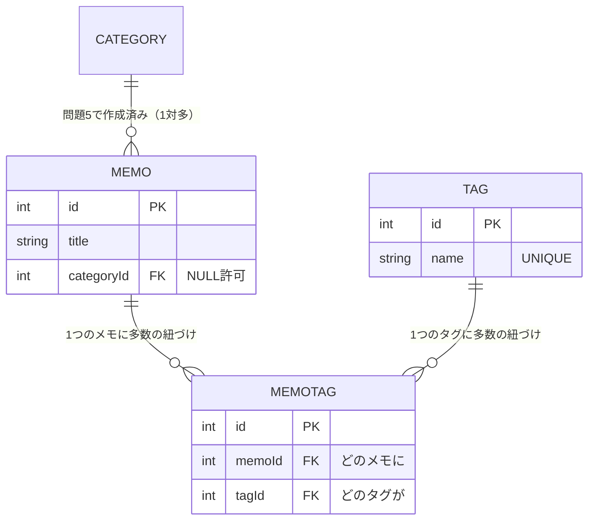

# 練習問題

このセクションの総仕上げです。[Prisma ClientでCRUD](/database/crud_with_prisma/)でデータベース永続化したメモAPIを、自分の力でさらに育てていきます。スキーマの変更、マイグレーション、検索クエリ、そしてリレーションまで、セクション全体の知識を総動員する構成になっています。

問題は段階的に難しくなります。まず自分で考えて書き、行き詰まったらヒントを見て、それでも難しければ解答例を確認してください。解答例を見た場合も、**必ず自分の手で打ち直して動作確認まで行う**ことが力になります。

## 学習目標

- スキーマ変更からマイグレーション、API実装までの一連の流れを自力で実行できる
- クエリパラメータと組み合わせた検索・絞り込み・並べ替えを実装できる
- 1対多・多対多のリレーションを自分で設計し、メモAPIに組み込める

## 準備

以下が完了している状態から始めます。

- PostgreSQL 16がDocker Composeで起動している（[PostgreSQLを起動して触ってみる](/database/postgresql_setup/)）
- メモAPIがPrismaでデータベース永続化されている（[Prisma ClientでCRUD](/database/crud_with_prisma/)）
- `Memo` モデルに `done Boolean @default(false)` まで追加済み（[スキーマ定義とマイグレーション](/database/schema_and_migration/)）

各問題の動作確認にはcurlを使います。データの中身の確認には `pnpm exec prisma studio` が便利です。

## 問題1: 優先度フィールドの追加

メモに**優先度**を表すフィールドを追加してください。

- フィールド名は `priority`、整数型
- 既定値は `0`（既存のメモも `0` になること）
- マイグレーション名は `add_priority_to_memo`
- 追加後、`POST /memos` で `priority` を指定して作成できるようにする（`CreateMemoDto` に「0以上の整数、省略可」のバリデーションを追加）

<details markdown="1">
<summary>ヒントを見る</summary>

- スキーマ変更→ `pnpm exec prisma migrate dev` の流れは[スキーマ定義とマイグレーション](/database/schema_and_migration/)の「2回目のマイグレーション」と同じです
- 既存データのあるテーブルにNOT NULLの列を足すとき、何が必要だったかを思い出してください
- DTOのバリデーションには `class-validator` の `@IsInt()` `@Min(0)` `@IsOptional()` が使えます（[DTOとバリデーション](/backend/dto_and_validation/)）

</details>

<details markdown="1">
<summary>解答例を見る</summary>

**`prisma/schema.prisma`**（Memoモデルに1行追加）

```prisma
model Memo {
  id        Int      @id @default(autoincrement())
  title     String
  content   String
  done      Boolean  @default(false)
  priority  Int      @default(0)  // ← 追加
  createdAt DateTime @default(now())
  updatedAt DateTime @updatedAt
}
```

`@default(0)` が重要です。既存の行にも値が必要なので、既定値がないとマイグレーション時に既存データの扱いに困ります。

```bash
pnpm exec prisma migrate dev --name add_priority_to_memo
```

**`src/memos/dto/create-memo.dto.ts`**（フィールドを追加）

```typescript
import { IsInt, IsNotEmpty, IsOptional, IsString, Min } from 'class-validator';

export class CreateMemoDto {
  @IsString()
  @IsNotEmpty()
  title: string;

  @IsString()
  @IsNotEmpty()
  content: string;

  @IsOptional()
  @IsInt()
  @Min(0)
  priority?: number;
}
```

`priority` は省略可能（`?` と `@IsOptional()`）なので、Serviceの `create` では `data` に渡すフィールドへ追加します。

**`src/memos/memos.service.ts`**（createのdataに追加）

```typescript
  async create(dto: CreateMemoDto): Promise<Memo> {
    return this.prisma.memo.create({
      data: {
        title: dto.title,
        content: dto.content,
        priority: dto.priority, // undefinedなら既定値0が使われる
      },
    });
  }
```

`dto.priority` が `undefined` の場合、Prismaはそのフィールドを「指定なし」として扱い、スキーマの `@default(0)` が適用されます。

動作確認:

```bash
curl -X POST http://localhost:3000/memos \
  -H "Content-Type: application/json" \
  -d '{"title": "重要タスク", "content": "至急対応", "priority": 3}'
```

</details>

## 問題2: キーワード検索

`GET /memos?keyword=牛乳` のように、**タイトルまたは本文にキーワードを含む**メモだけを返す検索機能を実装してください。

- `keyword` が指定されなければ、これまでどおり全件返す
- タイトル・本文の**どちらかに**含まれていれば一致とする（部分一致）

<details markdown="1">
<summary>ヒントを見る</summary>

- クエリパラメータの受け取りは `@Query('keyword')` です（[コントローラ](/backend/controller/)）
- Prismaの部分一致は `{ title: { contains: keyword } }` と書きます。SQLの `LIKE '%keyword%'` に相当します
- 「AまたはB」の条件は `OR: [条件1, 条件2]` です

</details>

<details markdown="1">
<summary>解答例を見る</summary>

**`src/memos/memos.controller.ts`**（findAllを変更）

```typescript
import { Query } from '@nestjs/common'; // 既存のimportに追加

  @Get()
  findAll(@Query('keyword') keyword?: string) {
    return this.memosService.findAll(keyword);
  }
```

**`src/memos/memos.service.ts`**（findAllを変更）

```typescript
  async findAll(keyword?: string): Promise<Memo[]> {
    return this.prisma.memo.findMany({
      where: keyword
        ? {
            OR: [
              { title: { contains: keyword } },
              { content: { contains: keyword } },
            ],
          }
        : undefined,
      orderBy: { createdAt: 'desc' },
    });
  }
```

**コード解説**

- `keyword ? {...} : undefined` — キーワードがあるときだけ `where` を組み立てます。`where: undefined` は「条件なし＝全件」と同じ意味になります
- `OR: [...]` — 配列内のいずれかの条件に一致する行を返します。SQLの `WHERE title LIKE '%...%' OR content LIKE '%...%'` に相当します
- `contains` — 部分一致です。前方一致なら `startsWith`、完全一致ならフィールドに値を直接書きます

動作確認:

```bash
curl "http://localhost:3000/memos?keyword=牛乳"
```

URLに日本語やクエリパラメータを含むときは、シェルの解釈を避けるため引用符で囲みます。

</details>

## 問題3: 絞り込みと並べ替え

`GET /memos` を次の仕様に拡張してください（問題2の機能は残したまま）。

- `?done=true` または `?done=false` で完了状態の絞り込みができる（省略時は両方）
- 結果の並び順を「`priority` の大きい順 → 同じ優先度なら作成日時の新しい順」にする

<details markdown="1">
<summary>ヒントを見る</summary>

- クエリパラメータは**常に文字列**で届きます。`'true'` という文字列を `boolean` に変換する処理が必要です
- 複数キーの並べ替えは、`orderBy` に**配列**を渡します: `orderBy: [{ ... }, { ... }]`

</details>

<details markdown="1">
<summary>解答例を見る</summary>

**`src/memos/memos.controller.ts`**

```typescript
  @Get()
  findAll(
    @Query('keyword') keyword?: string,
    @Query('done') done?: string,
  ) {
    // 'true'/'false'という文字列をbooleanに変換。指定なしはundefinedのまま
    const doneFilter = done === undefined ? undefined : done === 'true';
    return this.memosService.findAll(keyword, doneFilter);
  }
```

**`src/memos/memos.service.ts`**

```typescript
  async findAll(keyword?: string, done?: boolean): Promise<Memo[]> {
    return this.prisma.memo.findMany({
      where: {
        done, // undefinedなら条件として無視される
        ...(keyword
          ? {
              OR: [
                { title: { contains: keyword } },
                { content: { contains: keyword } },
              ],
            }
          : {}),
      },
      orderBy: [{ priority: 'desc' }, { createdAt: 'desc' }],
    });
  }
```

**コード解説**

- `where: { done, ... }` — Prismaは、値が `undefined` のフィールドを**条件として扱いません**。そのため `done` が未指定なら絞り込みなしになります。この性質のおかげで条件の組み立てがシンプルに書けます
- `...(keyword ? {...} : {})` — スプレッド構文で、キーワードがあるときだけOR条件を混ぜています
- `orderBy: [{ priority: 'desc' }, { createdAt: 'desc' }]` — 配列の順に優先されます。SQLの `ORDER BY priority DESC, "createdAt" DESC` に相当します

動作確認:

```bash
curl "http://localhost:3000/memos?done=false&keyword=買"
```

</details>

## 問題4: ページネーション

メモが増えてきたときのために、`GET /memos?page=2&limit=5` のような**ページネーション（pagination、ページ分割）**を実装してください。

- `limit` は1ページあたりの件数（省略時は10）
- `page` はページ番号で1始まり（省略時は1）
- 例: `page=2&limit=5` なら「6件目から5件」を返す

<details markdown="1">
<summary>ヒントを見る</summary>

- Prismaでは `take`（取得件数）と `skip`（読み飛ばす件数）を使います。SQLの `LIMIT` と `OFFSET` に相当します
- 「page=2, limit=5 → skip=5」になる計算式を考えてください

</details>

<details markdown="1">
<summary>解答例を見る</summary>

**`src/memos/memos.controller.ts`**

```typescript
  @Get()
  findAll(
    @Query('keyword') keyword?: string,
    @Query('done') done?: string,
    @Query('page') page?: string,
    @Query('limit') limit?: string,
  ) {
    const doneFilter = done === undefined ? undefined : done === 'true';
    const pageNum = page ? parseInt(page, 10) : 1;
    const limitNum = limit ? parseInt(limit, 10) : 10;
    return this.memosService.findAll(keyword, doneFilter, pageNum, limitNum);
  }
```

**`src/memos/memos.service.ts`**

```typescript
  async findAll(
    keyword?: string,
    done?: boolean,
    page = 1,
    limit = 10,
  ): Promise<Memo[]> {
    return this.prisma.memo.findMany({
      where: {
        done,
        ...(keyword
          ? {
              OR: [
                { title: { contains: keyword } },
                { content: { contains: keyword } },
              ],
            }
          : {}),
      },
      orderBy: [{ priority: 'desc' }, { createdAt: 'desc' }],
      skip: (page - 1) * limit,
      take: limit,
    });
  }
```

**コード解説**

- `skip: (page - 1) * limit` — 1ページ目はskip 0、2ページ目はskip 5（limit=5の場合）...という計算です。pageが1始まりなので `-1` します
- `take: limit` — そこから `limit` 件を取得します

動作確認（メモを十数件作ってから）:

```bash
curl "http://localhost:3000/memos?page=2&limit=5"
```

なお、本格的なページネーションでは「総件数」も一緒に返すのが一般的です。`prisma.memo.count({ where })` で件数を取得できます。余力があれば `{ items: [...], total: 42 }` という形のレスポンスに挑戦してみてください。

</details>

## 問題5: カテゴリ機能（1対多）

メモを「仕事」「プライベート」のような**カテゴリ**で分類できるようにしてください。[リレーション](/database/relations/)で学んだ1対多の応用です。

- `Category` モデル: `id` / `name`（重複不可）
- 1つのメモは**0または1つ**のカテゴリに属する（カテゴリなしも許す）
- 1つのカテゴリには多数のメモが属する
- `GET /memos` のレスポンスに、カテゴリの `id` と `name` を含める
- `POST /memos` で `categoryId` を指定できるようにする（省略可）

<details markdown="1">
<summary>ヒントを見る</summary>

- 「カテゴリなしも許す」= 外部キーが**NULLを許可**する、ということです。リレーションフィールドと外部キーの**両方**に `?` を付けます
- レスポンスへの含め方は `include` または `select` です。今回は隠すべき情報がないので `include` で十分です

</details>

<details markdown="1">
<summary>解答例を見る</summary>

**`prisma/schema.prisma`**（Categoryを追加、Memoに2行追加）

```prisma
model Category {
  id    Int    @id @default(autoincrement())
  name  String @unique
  memos Memo[]
}

model Memo {
  id         Int       @id @default(autoincrement())
  title      String
  content    String
  done       Boolean   @default(false)
  priority   Int       @default(0)
  category   Category? @relation(fields: [categoryId], references: [id])
  categoryId Int?
  createdAt  DateTime  @default(now())
  updatedAt  DateTime  @updatedAt
}
```

**コード解説**

- `category Category?` と `categoryId Int?` — 両方に `?` を付けることで「カテゴリを持たないメモ」を許します。外部キー列がNULL許可になります
- `memos Memo[]`（Category側） — カテゴリから所属メモ一覧をたどるためのリレーションフィールドです

```bash
pnpm exec prisma migrate dev --name add_category
```

**`src/memos/dto/create-memo.dto.ts`**（フィールド追加）

```typescript
  @IsOptional()
  @IsInt()
  categoryId?: number;
```

**`src/memos/memos.service.ts`**（createとfindAllを変更。抜粋）

```typescript
  async create(dto: CreateMemoDto): Promise<Memo> {
    return this.prisma.memo.create({
      data: {
        title: dto.title,
        content: dto.content,
        priority: dto.priority,
        categoryId: dto.categoryId,
      },
    });
  }

  // findAllのfindManyにincludeを追加
  return this.prisma.memo.findMany({
    where: { /* 問題3・4と同じ */ },
    include: { category: true },
    orderBy: [{ priority: 'desc' }, { createdAt: 'desc' }],
    skip: (page - 1) * limit,
    take: limit,
  });
```

カテゴリ自体を作るAPIも必要です。最小構成の例を載せます（[NestJSのモジュール構成](/backend/service_and_di/)に従い、categoriesディレクトリを作ります）。

**`src/categories/categories.service.ts`**

```typescript
import { Injectable } from '@nestjs/common';
import { PrismaService } from '../prisma/prisma.service';

@Injectable()
export class CategoriesService {
  constructor(private readonly prisma: PrismaService) {}

  create(name: string) {
    return this.prisma.category.create({ data: { name } });
  }

  findAll() {
    return this.prisma.category.findMany();
  }
}
```

**`src/categories/categories.controller.ts`**

```typescript
import { Body, Controller, Get, Post } from '@nestjs/common';
import { CategoriesService } from './categories.service';

@Controller('categories')
export class CategoriesController {
  constructor(private readonly categoriesService: CategoriesService) {}

  @Post()
  create(@Body('name') name: string) {
    return this.categoriesService.create(name);
  }

  @Get()
  findAll() {
    return this.categoriesService.findAll();
  }
}
```

**`src/categories/categories.module.ts`**

```typescript
import { Module } from '@nestjs/common';
import { PrismaModule } from '../prisma/prisma.module';
import { CategoriesController } from './categories.controller';
import { CategoriesService } from './categories.service';

@Module({
  imports: [PrismaModule],
  controllers: [CategoriesController],
  providers: [CategoriesService],
})
export class CategoriesModule {}
```

`AppModule` の `imports` に `CategoriesModule` を追加するのを忘れずに。

動作確認:

```bash
curl -X POST http://localhost:3000/categories \
  -H "Content-Type: application/json" -d '{"name": "仕事"}'
# → {"id":1,"name":"仕事"}

curl -X POST http://localhost:3000/memos \
  -H "Content-Type: application/json" \
  -d '{"title": "会議準備", "content": "資料を作る", "categoryId": 1}'

curl http://localhost:3000/memos
# → 各メモに "category": {"id":1,"name":"仕事"} が含まれる
```

</details>

## 問題6: タグ機能（多対多・チャレンジ）

最後はチャレンジ問題です。1つのメモに複数の**タグ**を付けられるようにしてください。カテゴリと違い、メモから見てもタグは複数——つまり**多対多**です。[リレーション](/database/relations/)のLikeと同じ構造が使えます。

- `Tag` モデル: `id` / `name`（重複不可）
- 中間テーブル `MemoTag` で多対多を表現する（同じメモに同じタグは1回まで）
- `POST /memos/:id/tags/:tagId` でメモにタグを付ける
- `DELETE /memos/:id/tags/:tagId` でタグを外す
- `GET /memos/:id` のレスポンスにタグの一覧を含める

完成形のテーブル構造をER図で示します。これを目標にスキーマを書いてください。



<details markdown="1">
<summary>ヒントを見る</summary>

- LikeがUserとPostを結んだように、MemoTagがMemoとTagを結びます。`@@unique([memoId, tagId])` も忘れずに
- タグを外すときは、複合ユニークから生成される `memoId_tagId` キーが使えます
- メモが削除されたときMemoTagはどうなるべきでしょうか。`onDelete: Cascade` を思い出してください
- レスポンスに含めるとき、`include: { tags: true }` だと中間テーブルの行が返ります。`include: { tags: { include: { tag: true } } }` とネストすると、タグ本体まで取れます

</details>

<details markdown="1">
<summary>解答例を見る</summary>

**`prisma/schema.prisma`**（TagとMemoTagを追加、Memoに1行追加）

```prisma
model Tag {
  id    Int       @id @default(autoincrement())
  name  String    @unique
  memos MemoTag[]
}

model MemoTag {
  id     Int  @id @default(autoincrement())
  memo   Memo @relation(fields: [memoId], references: [id], onDelete: Cascade)
  memoId Int
  tag    Tag  @relation(fields: [tagId], references: [id], onDelete: Cascade)
  tagId  Int

  @@unique([memoId, tagId])
}

model Memo {
  // ...既存のフィールドはそのまま...
  tags MemoTag[]
}
```

**コード解説**

- `MemoTag` — 「どのメモに・どのタグが」を1行とする中間テーブルです。Likeの「どのユーザーが・どの投稿に」と同じ構造です
- `@@unique([memoId, tagId])` — 同じメモに同じタグを二重に付けられないようにします
- `onDelete: Cascade`（両方） — メモまたはタグが削除されたら、その紐づけも自動で消えるようにします

```bash
pnpm exec prisma migrate dev --name add_tags
```

**`src/memos/memos.service.ts`**（メソッドを追加・変更）

```typescript
  // findOneを変更: タグ本体まで含めて返す
  async findOne(id: number) {
    const memo = await this.prisma.memo.findUnique({
      where: { id },
      include: {
        category: true,
        tags: { include: { tag: true } },
      },
    });
    if (!memo) {
      throw new NotFoundException(`id ${id} のメモは存在しません`);
    }
    return memo;
  }

  // タグを付ける
  async addTag(memoId: number, tagId: number) {
    await this.findOne(memoId); // メモの存在チェック（なければ404）
    return this.prisma.memoTag.create({
      data: { memoId, tagId },
    });
  }

  // タグを外す
  async removeTag(memoId: number, tagId: number) {
    // 紐づけの存在チェック（なければ404）。存在しない行をdeleteすると500になるため
    const memoTag = await this.prisma.memoTag.findUnique({
      where: {
        memoId_tagId: { memoId, tagId },
      },
    });
    if (!memoTag) {
      throw new NotFoundException(
        `メモ ${memoId} にタグ ${tagId} は付いていません`,
      );
    }
    await this.prisma.memoTag.delete({
      where: {
        memoId_tagId: { memoId, tagId },
      },
    });
  }
```

**`src/memos/memos.controller.ts`**（ハンドラを追加）

```typescript
  @Post(':id/tags/:tagId')
  addTag(
    @Param('id', ParseIntPipe) id: number,
    @Param('tagId', ParseIntPipe) tagId: number,
  ) {
    return this.memosService.addTag(id, tagId);
  }

  @Delete(':id/tags/:tagId')
  removeTag(
    @Param('id', ParseIntPipe) id: number,
    @Param('tagId', ParseIntPipe) tagId: number,
  ) {
    return this.memosService.removeTag(id, tagId);
  }
```

タグの作成APIは、問題5のカテゴリとまったく同じ構造で `src/tags/` に作れます（ここでは省略します。自分で作ってみてください）。

動作確認:

```bash
# タグを作る（tags APIを実装した場合）
curl -X POST http://localhost:3000/tags \
  -H "Content-Type: application/json" -d '{"name": "緊急"}'

# メモ1にタグ1を付ける
curl -X POST http://localhost:3000/memos/1/tags/1

# もう一度付けようとすると、@@uniqueによりエラーになる（=二重付与の防止）

# タグつきでメモを取得
curl http://localhost:3000/memos/1
# → "tags": [{"id":1,"memoId":1,"tagId":1,"tag":{"id":1,"name":"緊急"}}]

# タグを外す
curl -X DELETE http://localhost:3000/memos/1/tags/1
```

`tags` の構造が少し深い（中間テーブル越しにtagがある）ことに気づいたでしょうか。レスポンスを `["緊急"]` のような平らな形に整形したい場合は、Serviceで `memo.tags.map((t) => t.tag.name)` のように変換してから返す方法があります。これも余力があれば挑戦してみてください。

</details>

## 理解度チェック

仕上げに、手を動かした内容を概念として整理できているか確認しましょう。

**Q1. 問題1で、既存データのあるテーブルに `priority Int` を追加するとき `@default(0)` が必要でした。もし既定値なしの必須フィールドとして追加しようとしたら、何が問題になりますか。**

<details markdown="1">
<summary>解答を見る</summary>

既存の行に入れる `priority` の値が決められないことが問題です。NOT NULLの列は全行に値が必要ですが、既存行には値がありません。Prismaは警告を出し、場合によってはテーブルのデータを消して作り直す選択を迫られます。

既定値を付ければ「既存行にはこの値を入れる」とデータベースに指示でき、データを保ったまま列を追加できます。

</details>

**Q2. 問題5のカテゴリ（1対多・省略可）と問題6のタグ（多対多）で、スキーマの構造が大きく異なりました。「メモとカテゴリ」が中間テーブル不要で、「メモとタグ」に中間テーブルが必要なのはなぜですか。**

<details markdown="1">
<summary>解答を見る</summary>

メモから見たカテゴリは最大1つなので、Memoテーブルに外部キー `categoryId` を1列持てば表現できます（1対多）。

一方タグは、メモから見ても複数、タグから見ても複数（多対多）です。外部キー1列ではどちら側に置いても複数の関係を表現できないため、「どのメモに・どのタグが」を1行とする中間テーブル（MemoTag）が必要になります。

</details>

**Q3. このセクション全体を通じて、「アプリ側のバリデーション（class-validator）」と「データベース側の制約（UNIQUE、NOT NULL、外部キー、@@unique）」の両方が登場しました。なぜ両方必要なのですか。**

<details markdown="1">
<summary>解答を見る</summary>

役割が異なるためです。

- アプリ側のバリデーションは、不正なリクエストを早期に弾き、利用者に分かりやすいエラーメッセージ（400 Bad Request）を返すためのもの
- データベース側の制約は、**どんな経路からの書き込みであっても**整合性を守る最後の砦です。アプリのバグ、別のアプリからの書き込み、手作業のSQLなど、バリデーションを通らない経路でも矛盾したデータの混入を防ぎます

二重の防御にすることで、片方に漏れがあってもデータの整合性が保たれます。

</details>

## セルフレビュー

- [ ] スキーマ変更→マイグレーション→DTO・Service修正→curlで確認、という一連の流れを自力で回せた
- [ ] contains / OR / orderBy（複数キー）/ take / skip を使ったクエリを書けた
- [ ] クエリパラメータが文字列で届くことを理解し、boolean/numberへの変換を実装できた
- [ ] NULL許可のリレーション（`Category?` と `Int?`）を定義できた
- [ ] 中間テーブルによる多対多を、ヒントなしでLikeの構造から応用できた
- [ ] 複合ユニーク制約と `memoId_tagId` キーによる削除を使えた
- [ ] うまく動かないとき、エラーメッセージ・Prisma Studio・psqlを使って自分で原因を調べられた

## 次のステップ

おつかれさまでした。これで「データベースとPrisma」のセクションは完了です。メモリ上の配列から始まったメモAPIは、検索・分類・タグ付けまでできる本格的なAPIに成長しました。

- 前のページ: [リレーション](/database/relations/)
- 次のセクション: [コード品質と開発ツール](/tooling/) — チーム開発に欠かせないPrettier/ESLintを導入します
- ここで身につけたスキーマ設計とクエリの力は、[バックエンドテスト](/testing/)でのテストDB、[RAG開発](/ai-chat/embeddings_and_pgvector/)でのpgvector、そして[SNS開発](/sns/)でのユーザー・投稿・いいね・フォローの実装で、繰り返しフル活用します
