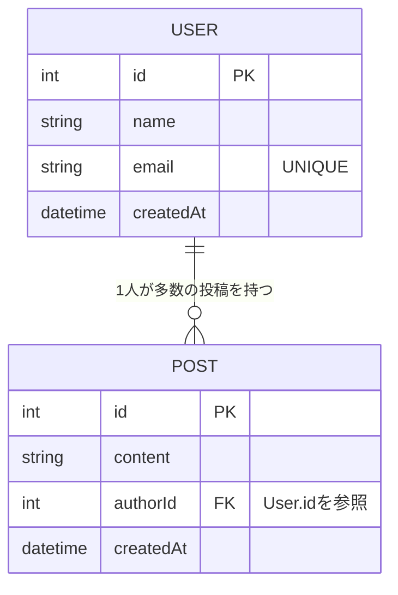
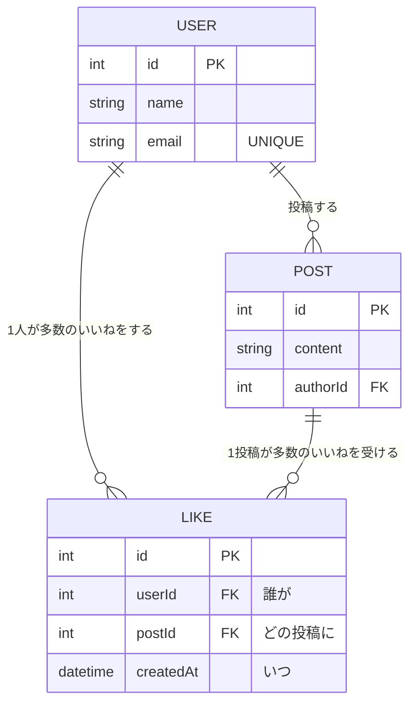

# リレーション

[前のページ](/database/crud_with_prisma/)まではテーブル1つ（Memo）だけを扱ってきました。しかし実際のアプリでは、複数のテーブルが関係し合います。このページでは、[データベースとは](/database/what_is_database/)で概念だけ学んだ**主キーと外部キーによる関係**を、Prismaの**リレーション（relation）**として定義し、クエリする方法を学びます。

題材はSNSです。「ユーザーが投稿する（1対多）」「ユーザーが投稿にいいねする（多対多）」という2つの関係をここで作ります。これは[最終プロジェクトのSNS開発](/sns/)で本格的に使う構造の予行演習であり、ここを理解すればSNSのデータ設計の核心はもう手に入ったことになります。

## 学習目標

- 1対多のリレーションをPrismaスキーマで定義できる（`@relation`、外部キー）
- 多対多のリレーションを中間テーブルで定義できる（`@@unique` による複合ユニーク制約）
- `include` と `select` を使ってリレーション先のデータを一緒に取得できる
- ネストした `create` や `connect` でリレーションを持つデータを作成できる
- 「いいね／いいね解除」をPrismaのクエリとして書ける

## 1対多 — ユーザーと投稿

### スキーマ定義

「1人のユーザーは多数の投稿を持ち、1つの投稿は必ず1人のユーザーに属する」——これが**1対多（one-to-many）**の関係です。`schema.prisma` に `User` と `Post` のモデルを追加します（Memoモデルはそのまま残して構いません）。

**`prisma/schema.prisma`**（モデルを追加）

```prisma
model User {
  id        Int      @id @default(autoincrement())
  name      String
  email     String   @unique
  createdAt DateTime @default(now())
  posts     Post[]
}

model Post {
  id        Int      @id @default(autoincrement())
  content   String
  createdAt DateTime @default(now())
  author    User     @relation(fields: [authorId], references: [id])
  authorId  Int
}
```

**コード解説**

- `posts Post[]`（User側） — 「ユーザーは複数の投稿を持つ」ことを表す**リレーションフィールド**です。配列型である点が「多」を表しています
- `author User @relation(fields: [authorId], references: [id])`（Post側） — 「投稿は1人のユーザー（author）に属する」ことを表します。`@relation` の意味は「**このモデルの `authorId` フィールドが、Userモデルの `id` を参照する**」です
- `authorId Int` — これが実際にテーブルに作られる**外部キーの列**です
- 重要な区別: `authorId` は**実際の列**ですが、`author` と `posts` は**テーブルには存在しません**。これらはPrismaがクエリ時にJOINなどで解決してくれる「仮想的なつながり」です。テーブルにあるのはあくまで外部キー `authorId` だけ、という点は[SQLで体験したposts.user_id](/database/postgresql_setup/)と同じです

ER図で確認しましょう。



マイグレーションを実行してテーブルを作ります（[前々ページ](/database/schema_and_migration/)の復習です）。

```bash
pnpm exec prisma migrate dev --name add_user_and_post
```

実行結果の例:

```
Applying migration `20260612110000_add_user_and_post`
Your database is now in sync with your schema.
✔ Generated Prisma Client (v5.22.0) to ./node_modules/@prisma/client in 50ms
```

### 動かして学ぶ — playgroundスクリプト

リレーションのクエリは種類が多いので、APIに組み込む前に、単体のスクリプトで一通り試してみましょう。プロジェクトに次のファイルを作ります。

**`prisma/playground.ts`**（新規作成）

```typescript
import { PrismaClient } from '@prisma/client';

const prisma = new PrismaClient();

async function main() {
  // 何度でも実行し直せるように、毎回データを消してから始める
  await prisma.post.deleteMany();
  await prisma.user.deleteMany();

  // --- ここに、これから学ぶクエリを書いていく ---
}

main()
  .catch((e) => console.error(e))
  .finally(() => prisma.$disconnect());
```

**コード解説**

- `deleteMany()` — 条件を指定しなければ全行削除です。練習用に毎回まっさらにします。**Postを先に**消すのは、Userを先に消すと「投稿が存在しないユーザーを参照する」状態になり、外部キー制約違反になるためです
- `main().catch(...).finally(...)` — エラーを表示し、最後に必ず接続を閉じる定型パターンです

実行は次のコマンドです（NestJSプロジェクトに入っているts-nodeを使います）。

```bash
pnpm exec ts-node prisma/playground.ts
```

以降のコードは、`main()` の「ここに書く」の部分に追記しては実行する、を繰り返してください。

### リレーションごと作成する — ネストしたcreate

ユーザーと投稿を一度に作れます。

```typescript
  const taro = await prisma.user.create({
    data: {
      name: '太郎',
      email: 'taro@example.com',
      posts: {
        create: [
          { content: 'おはようございます' },
          { content: '今日はいい天気' },
        ],
      },
    },
    include: { posts: true },
  });
  console.log(JSON.stringify(taro, null, 2));
```

実行結果の例:

```json
{
  "id": 1,
  "name": "太郎",
  "email": "taro@example.com",
  "createdAt": "2026-06-12T02:00:00.000Z",
  "posts": [
    { "id": 1, "content": "おはようございます", "authorId": 1, "createdAt": "..." },
    { "id": 2, "content": "今日はいい天気", "authorId": 1, "createdAt": "..." }
  ]
}
```

**コード解説**

- `posts: { create: [...] }` — ユーザーの作成と同時に、そのユーザーに属する投稿を作ります。`authorId` を自分で書いていないのに、各投稿の `authorId` に太郎のidが自動で入っている点に注目してください。リレーション定義のおかげです
- `include: { posts: true }` — 戻り値に**リレーション先（posts）を含める**指定です。includeについては後で詳しく説明します

既存のユーザーに投稿を追加する場合は、`connect`（既存の行へつなぐ）を使います。

```typescript
  const hanako = await prisma.user.create({
    data: { name: '花子', email: 'hanako@example.com' },
  });

  await prisma.post.create({
    data: {
      content: 'Prismaのリレーションを勉強中',
      author: { connect: { id: hanako.id } },
    },
  });
```

**コード解説**

- `author: { connect: { id: hanako.id } }` — 「既存のUser（id = hanako.id）にこの投稿をつなぐ」という意味です。新しく作る `create` と、既存につなぐ `connect` の使い分けがポイントです
- なお、`data: { content: '...', authorId: hanako.id }` のように外部キーへ直接値を入れる書き方もでき、結果は同じです

### include — リレーション先を一緒に取得する

「投稿の一覧を、**投稿者の名前つきで**取得したい」——SQLでは[JOIN](/database/postgresql_setup/)を書いた場面です。Prismaでは `include` を使います。

```typescript
  const postsWithAuthor = await prisma.post.findMany({
    include: { author: true },
    orderBy: { createdAt: 'desc' },
  });
  console.log(JSON.stringify(postsWithAuthor, null, 2));
```

実行結果の例:

```json
[
  {
    "id": 3,
    "content": "Prismaのリレーションを勉強中",
    "authorId": 2,
    "createdAt": "...",
    "author": { "id": 2, "name": "花子", "email": "hanako@example.com", "createdAt": "..." }
  },
  ...
]
```

**コード解説**

- `include: { author: true }` — 各投稿に、リレーションフィールド `author` の中身（Userの行）を含めて返します。Prismaが裏でJOIN相当の処理をしてくれます
- 逆方向も同様です。`prisma.user.findMany({ include: { posts: true } })` とすれば「各ユーザーとその投稿一覧」が取れます

### select — 必要なフィールドだけに絞る

`include: { author: true }` はUserの**全フィールド**を返します。しかしこの中には `email` が含まれており、SNSのタイムラインAPIがこれをそのまま返すと**メールアドレスの漏洩**になります。必要なフィールドだけに絞るのが `select` です。

```typescript
  const timeline = await prisma.post.findMany({
    select: {
      id: true,
      content: true,
      createdAt: true,
      author: {
        select: { id: true, name: true },
      },
    },
    orderBy: { createdAt: 'desc' },
  });
  console.log(JSON.stringify(timeline, null, 2));
```

実行結果の例:

```json
[
  {
    "id": 3,
    "content": "Prismaのリレーションを勉強中",
    "createdAt": "...",
    "author": { "id": 2, "name": "花子" }
  },
  ...
]
```

**コード解説**

- `select: { id: true, content: true, ... }` — 指定したフィールド**だけ**が返ります（includeは「全フィールド＋リレーション追加」、selectは「指定したものだけ」）
- `author: { select: { id: true, name: true } }` — リレーション先もさらにselectで絞れます。emailが結果に含まれていない点を確認してください
- SQLで「`SELECT *` より列を指定する方がよい」と学んだのと同じ話です。**外部に返すデータは必要最小限に**——セキュリティとパフォーマンスの両方に効く原則です

### リレーションを条件にした検索

「太郎の投稿だけ」のような絞り込みも、リレーションをたどって書けます。

```typescript
  const taroPosts = await prisma.post.findMany({
    where: {
      author: { name: '太郎' },
    },
  });
  console.log(taroPosts.length); // 2
```

SQLで書いた「JOINしてWHERE」（[JOIN入門](/database/postgresql_setup/)の最後の例）と同じことが、オブジェクトのネストで表現できています。

## 多対多 — いいね（Like）

### なぜ中間テーブルが必要か

次は「いいね」です。関係を考えてみましょう。

- 1人のユーザーは、**多数の投稿**にいいねできる
- 1つの投稿は、**多数のユーザー**からいいねされる

どちらから見ても「多」。これが**多対多（many-to-many）**の関係です。

ここで問題が起きます。1対多のときは「多」の側（Post）に外部キー（authorId）を1つ置けば済みました。しかし多対多では、Postに `likedUserId` を置いても1人分しか記録できず、Userに `likedPostId` を置いても1件分しか記録できません。

解決策は、**「誰が・どの投稿に」いいねしたかを1行とする専用のテーブル**を作ることです。これを**中間テーブル（ちゅうかんテーブル。join table）**と呼びます。多対多は「1対多を2つ組み合わせたもの」として表現するのです。



LIKEテーブルの1行が「いいね1回」に対応します。USERとPOSTの間に直接の線はなく、LIKEを経由して多対多が実現されている点を図で確認してください。

### スキーマ定義

**`prisma/schema.prisma`**（Likeを追加し、User/Postにリレーションフィールドを追記）

```prisma
model User {
  id        Int      @id @default(autoincrement())
  name      String
  email     String   @unique
  createdAt DateTime @default(now())
  posts     Post[]
  likes     Like[]
}

model Post {
  id        Int      @id @default(autoincrement())
  content   String
  createdAt DateTime @default(now())
  author    User     @relation(fields: [authorId], references: [id])
  authorId  Int
  likes     Like[]
}

model Like {
  id        Int      @id @default(autoincrement())
  user      User     @relation(fields: [userId], references: [id])
  userId    Int
  post      Post     @relation(fields: [postId], references: [id], onDelete: Cascade)
  postId    Int
  createdAt DateTime @default(now())

  @@unique([userId, postId])
}
```

**コード解説**

- `model Like` — 中間テーブルです。`userId`（誰が）と `postId`（どの投稿に）の2つの外部キーを持ち、UserとPostそれぞれと1対多の関係を結びます
- `@@unique([userId, postId])` — **複合ユニーク制約**です。「同じユーザーが同じ投稿に2回いいねする」ことをデータベースのレベルで禁止します。`@` が2つの属性はフィールドではなく**モデル全体**への指定で、ブロックの末尾に書きます
- `onDelete: Cascade`（postのリレーション） — 「参照先のPostが削除されたら、それに付いたLikeも**連動して自動削除**する」という指定です。これがないと、いいねが付いた投稿は削除できません（外部キー制約違反になるため）。投稿が消えたらいいねも消えるのが自然なので、Cascade（カスケード＝連鎖）を指定します
- `likes Like[]`（UserとPostの両方に追記） — それぞれの側から、いいねの一覧をたどれるようにするリレーションフィールドです

なお、Prismaには中間テーブルを自分で書かない「暗黙の多対多」という機能もありますが、本カリキュラムでは**明示的に中間テーブルを定義する方法**を使います。`createdAt`（いつ、いいねしたか）のような追加情報を持てるうえ、テーブル構造が目に見えて学習にも実務にも向いているためです。

マイグレーションします。

```bash
pnpm exec prisma migrate dev --name add_like
```

### いいねのクエリ

playgroundの続きに書いて試しましょう（冒頭のdeleteManyに `await prisma.like.deleteMany();` を**最初の行として**追加しておいてください。Likeが2つのテーブルを参照しているため、いちばん先に消す必要があります）。

**いいねする（作成）**

```typescript
  // 花子が、太郎の投稿(id: taro.posts[0].id)にいいねする
  await prisma.like.create({
    data: {
      userId: hanako.id,
      postId: taro.posts[0].id,
    },
  });
```

同じ組み合わせでもう一度 `create` すると、`@@unique` 制約により `Unique constraint failed` エラーになります。「二重いいね」がデータベースのレベルで防がれていることを、ぜひ一度わざと実行して確かめてください。

**いいね解除（削除）**

```typescript
  await prisma.like.delete({
    where: {
      userId_postId: {
        userId: hanako.id,
        postId: taro.posts[0].id,
      },
    },
  });
```

**コード解説**

- `userId_postId` — `@@unique([userId, postId])` を定義すると、Prismaが**2つのフィールド名をアンダースコアでつないだ複合キー名**を自動生成します。これにより「誰が・どの投稿に」の組み合わせで1行を特定して削除できます。Likeの `id` を知らなくても消せるのがポイントです

**いいね数つきでタイムラインを取得（_count）**

いいねの「数」だけ欲しいのに、Likeの行を全部取得するのは無駄です。件数だけを取る `_count` を使います。

```typescript
  const timelineWithLikes = await prisma.post.findMany({
    select: {
      id: true,
      content: true,
      author: { select: { id: true, name: true } },
      _count: { select: { likes: true } },
    },
    orderBy: { createdAt: 'desc' },
  });
  console.log(JSON.stringify(timelineWithLikes, null, 2));
```

実行結果の例:

```json
[
  {
    "id": 1,
    "content": "おはようございます",
    "author": { "id": 1, "name": "太郎" },
    "_count": { "likes": 1 }
  },
  ...
]
```

**コード解説**

- `_count: { select: { likes: true } }` — リレーション先の**件数だけ**を集計して返します。SQLの `COUNT` と `GROUP BY` に相当する処理をPrismaがやってくれます。SNSの「いいね 3件」という表示はまさにこれです

**あるユーザーがいいねした投稿の一覧**

```typescript
  const likedPosts = await prisma.post.findMany({
    where: {
      likes: { some: { userId: hanako.id } },
    },
  });
```

**コード解説**

- `likes: { some: { userId: hanako.id } }` — 「likesの中に、userIdが花子であるものが**1つでも存在する**(some)投稿」という条件です。リレーション先の条件には `some`（いずれかが一致）のほか、`every`（すべて一致）、`none`（1つも一致しない）が使えます

## 理解度チェック

**Q1. 次のPostモデルで、実際にデータベースのテーブルに列として存在するのはどのフィールドですか。**

```prisma
model Post {
  id       Int    @id @default(autoincrement())
  content  String
  author   User   @relation(fields: [authorId], references: [id])
  authorId Int
  likes    Like[]
}
```

<details markdown="1">
<summary>解答を見る</summary>

`id`、`content`、`authorId` の3つです。

`author` と `likes` はリレーションフィールドで、テーブルには存在しません。Prismaがクエリ時（includeなど）に、外部キーをたどって解決してくれる仮想的なつながりです。テーブルにあるのは外部キーの列 `authorId` だけです。

</details>

**Q2. 「ユーザーと投稿」は1対多なのに、「ユーザーと投稿へのいいね」はなぜ多対多になるのですか。また、多対多はどうやってテーブルで表現しますか。**

<details markdown="1">
<summary>解答を見る</summary>

- 1つの投稿の作者は必ず1人なので、投稿から見るとユーザーは「1」、ユーザーから見ると投稿は「多」——よって1対多です
- いいねは、1人が多数の投稿にでき、1つの投稿が多数の人からされるため、どちらから見ても「多」——よって多対多です

多対多は、外部キー1つでは表現できないため、「誰が・どれに」を1行とする**中間テーブル**（Like）を作り、「User対Like」「Post対Like」という2つの1対多に分解して表現します。

</details>

**Q3. `include` と `select` の違いを説明し、SNSのタイムラインAPIで `include: { author: true }` をそのまま使うことの問題点を挙げてください。**

<details markdown="1">
<summary>解答を見る</summary>

- `include` — モデルの全フィールドに**加えて**、指定したリレーション先（こちらも既定では全フィールド）を返す
- `select` — **指定したフィールドだけ**を返す。リレーション先もネストしたselectで絞れる

`include: { author: true }` はUserの全フィールドを返すため、`email` のような公開すべきでない情報までAPIレスポンスに含まれてしまいます。外部に返すデータは `select` で必要最小限に絞るべきです。

</details>

**Q4. Likeモデルの `@@unique([userId, postId])` は何のためにあり、これがクエリにどんな利点をもたらしますか。**

<details markdown="1">
<summary>解答を見る</summary>

「同じユーザーが同じ投稿に2回いいねする」という重複データを、データベースの制約として禁止するためです。アプリ側のチェックをすり抜けても、データベースが最後の砦になります。

さらに、複合ユニーク制約があると、Prismaが `userId_postId` という複合キーを生成してくれるため、`delete({ where: { userId_postId: { userId, postId } } })` のように「誰が・どの投稿に」の組み合わせで1行を特定でき、いいね解除がLikeのidを知らなくても書けます。

</details>

**Q5. Likeの `post` リレーションに `onDelete: Cascade` を付けないと、投稿の削除時に何が起きますか。**

<details markdown="1">
<summary>解答を見る</summary>

いいねが1件でも付いている投稿を削除しようとすると、外部キー制約違反のエラーになります。Likeの行が「存在しない投稿」を参照する状態になってしまうのを、データベースが拒否するためです。

`onDelete: Cascade` を付けると、投稿の削除時にそれを参照するLikeの行も連鎖して自動削除されるため、「投稿が消えたらいいねも消える」という自然な動作になります。

</details>

## セルフレビュー

- [ ] 1対多のリレーションを、`@relation` と外部キーを使って写経せずに定義できる
- [ ] リレーションフィールドと外部キー列の違い（テーブルに存在するか）を説明できる
- [ ] 多対多に中間テーブルが必要な理由を自分の言葉で説明できる
- [ ] ER図を見て、1対多・多対多の関係を読み取り、逆に自分で描ける
- [ ] include / select / _count の使い分けを説明できる
- [ ] ネストしたcreateとconnectの違いを説明できる
- [ ] 複合ユニーク制約（@@unique）の役割と、`userId_postId` での削除を書ける
- [ ] 「いいね」「いいね解除」「いいね数の取得」のクエリを書ける

## 次のステップ

これでPrismaの主要機能を一通り学びました。次は総仕上げの練習問題で、ここまでの内容を自力で組み立てます。

- 前のページ: [Prisma ClientでCRUD](/database/crud_with_prisma/)
- 次のページ: [練習問題](/database/practice/)
- このページのUser / Post / Likeは、[SNS開発](/sns/)でほぼそのままの形で再登場します。投稿機能は[投稿のCRUD](/sns/posts/)で、いいね機能は[いいね](/sns/likes/)で、さらにフォロー機能では「ユーザー対ユーザー」という自己参照の多対多（[フォロー](/sns/follow/)）に発展します
