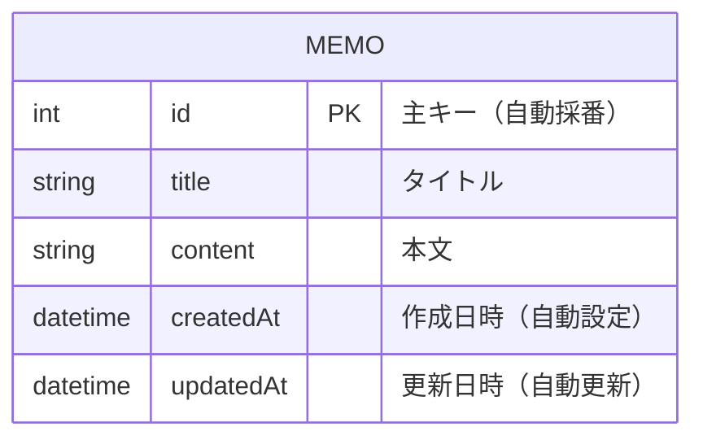
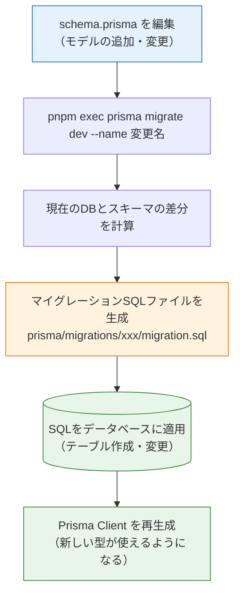

# スキーマ定義とマイグレーション

[前のページ](/database/prisma_setup/)でPrismaの初期設定が完了しました。このページでは、`schema.prisma` に**モデル**（テーブルの設計図）を定義し、**マイグレーション**という仕組みで実際のデータベースにテーブルを作成します。マイグレーションはチーム開発・本番運用に欠かせない重要概念なので、「なぜ必要か」から丁寧に理解していきましょう。

## 学習目標

- Prismaのモデル定義の文法（フィールド・型・属性）を読み書きできる
- マイグレーションとは何か、なぜ手作業のSQLではだめなのかを説明できる
- `prisma migrate dev` の一連の動作を順に説明できる
- スキーマ変更→マイグレーション→クライアント再生成のサイクルを実践できる

## モデルを定義する

[メモAPI](/backend/crud_practice/)で扱っていたメモを、データベースのテーブルとして設計しましょう。バックエンド章のメモは次のような形でした。

```typescript
// バックエンド章でのメモの型
interface Memo {
  id: number;
  title: string;
  content: string;
}
```

これをPrismaの**モデル（model）**として `schema.prisma` に書きます。モデル1つがテーブル1つに対応します。

**`prisma/schema.prisma`**（全体）

```prisma
generator client {
  provider = "prisma-client-js"
}

datasource db {
  provider = "postgresql"
  url      = env("DATABASE_URL")
}

model Memo {
  id        Int      @id @default(autoincrement())
  title     String
  content   String
  createdAt DateTime @default(now())
  updatedAt DateTime @updatedAt
}
```

**コード解説**

- `model Memo { ... }` — `Memo` というモデルを定義します。データベースには `Memo` という名前のテーブルが作られます
- `id Int @id @default(autoincrement())` — `Int`（整数）型の `id` フィールド。`@id` は**主キー**の指定、`@default(autoincrement())` は「既定値として自動採番する」という意味です。SQLで書いた `SERIAL PRIMARY KEY` に相当します
- `title String` / `content String` — 文字列型のフィールドです。Prismaでは何も指定しなければ `NOT NULL`（必須）になります
- `createdAt DateTime @default(now())` — 日時型。`@default(now())` で作成時に現在日時が自動で入ります
- `updatedAt DateTime @updatedAt` — `@updatedAt` をつけると、**行が更新されるたびにPrismaが自動で現在日時を入れて**くれます。作成日時・更新日時の2つは、ほとんどのテーブルに付ける定番フィールドです

### フィールド定義の文法

モデルの各行は次の構造です。

```
フィールド名  型  属性（@で始まる。複数可）
```

よく使う型と属性をまとめておきます。

| Prismaの型 | 意味 | PostgreSQLでの型 |
|---|---|---|
| `Int` | 整数 | integer |
| `String` | 文字列 | text |
| `Boolean` | 真偽値 | boolean |
| `DateTime` | 日時 | timestamp |
| `Float` | 浮動小数点数 | double precision |

| 属性 | 意味 |
|---|---|
| `@id` | 主キー |
| `@default(...)` | 既定値。`autoincrement()`（自動採番）、`now()`（現在日時）など |
| `@unique` | 重複を許さない（SQLのUNIQUE制約） |
| `@updatedAt` | 更新のたびに現在日時を自動設定 |

また、型の後ろに `?` をつけると「NULLを許可する（省略可能）」になります。TypeScriptのオプショナルと同じ感覚です。

```prisma
model Memo {
  // ...
  memo String?  // あってもなくてもよいフィールド
}
```

定義したモデルは、ER図にすると次のとおりです。まだテーブル1つだけのシンプルな構造です。



## マイグレーションとは

`schema.prisma` にモデルを書いただけでは、**データベースには何も起きていません**。設計図を描いただけで、まだ建物は建っていない状態です。設計図を実際のテーブルに反映する仕組みが**マイグレーション（migration、マイグレーション＝移行）**です。

### なぜ手作業のSQLではだめなのか

「[前のページ](/database/postgresql_setup/)で学んだ `CREATE TABLE` を自分でpsqlから打てばいいのでは？」と思うかもしれません。個人の練習ならそれでも動きますが、実際の開発では破綻します。

1. **チームメンバーのデータベースとずれる** — あなたが手作業でテーブルを変更しても、他のメンバーのデータベースは古いままです。「自分の環境では動くのに」という問題の温床になります
2. **本番環境への反映漏れが起きる** — 開発環境で加えた変更を、本番環境に適用し忘れる事故が起きます
3. **変更の履歴が残らない** — 「いつ、誰が、なぜこの列を追加したのか」が分からなくなります

マイグレーションは、**データベースへの変更をSQLファイルとして記録し、どの環境でも同じ順番で適用できるようにする**仕組みです。変更がファイルになるため、[Git](/git/what_is_git/)で管理でき、コードと同じようにレビューや履歴の追跡ができます。「データベース版のバージョン管理」と考えると分かりやすいでしょう。

### prisma migrate dev の流れ

開発中にマイグレーションを行うコマンドが `prisma migrate dev` です。このコマンド1つで、次の一連の処理が自動で行われます。



ポイントは「**差分**」です。Prismaはスキーマとデータベースの現状を比較し、足りない変更だけをSQLにします。そのため、スキーマを少し変えて `migrate dev` を繰り返す、という小さなサイクルで開発を進められます。

## マイグレーションを実行する

実際にやってみましょう。[PostgreSQLが起動していること](/database/postgresql_setup/)を確認したら、プロジェクトのルートで次を実行します。

```bash
pnpm exec prisma migrate dev --name init
```

**コード解説**

- `--name init` — このマイグレーションにつける名前です。「何の変更か」が分かる名前（今回は初回なので `init`）をつけます。Gitのコミットメッセージと同じ発想です

実行結果の例:

```
Prisma schema loaded from prisma/schema.prisma
Datasource "db": PostgreSQL database "memo", schema "public" at "localhost:5432"

Applying migration `20260612090000_init`

The following migration(s) have been created and applied from new schema changes:

migrations/
  └─ 20260612090000_init/
    └─ migration.sql

Your database is now in sync with your schema.

✔ Generated Prisma Client (v5.22.0) to ./node_modules/@prisma/client in 45ms
```

出力を読むと、図で見た流れがそのまま起きていることが分かります。

1. マイグレーションファイル `20260612090000_init/migration.sql` が**作成**された
2. それがデータベースに**適用**された（`Applying migration`）
3. Prisma Clientが**再生成**された（`Generated Prisma Client`）

### 生成されたSQLを読んでみる

`prisma/migrations/` の下に、実際に実行されたSQLファイルができています。開いてみましょう。

**`prisma/migrations/20260612090000_init/migration.sql`**

```sql
-- CreateTable
CREATE TABLE "Memo" (
    "id" SERIAL NOT NULL,
    "title" TEXT NOT NULL,
    "content" TEXT NOT NULL,
    "createdAt" TIMESTAMP(3) NOT NULL DEFAULT CURRENT_TIMESTAMP,
    "updatedAt" TIMESTAMP(3) NOT NULL,

    CONSTRAINT "Memo_pkey" PRIMARY KEY ("id")
);
```

[PostgreSQLのページ](/database/postgresql_setup/)で自分の手で書いた `CREATE TABLE` と、ほぼ同じSQLが生成されています。Prismaがやっているのは魔法ではなく、**自分でも書けるSQLの自動生成**だと実感できるはずです。生のSQLを先に学んだのはこのためです。

### データベース側を確認する

本当にテーブルができたか、psqlでも確認してみましょう。

```bash
docker compose exec db psql -U postgres -d memo -c "\dt"
```

実行結果の例:

```
              List of relations
 Schema |        Name        | Type  |  Owner
--------+--------------------+-------+----------
 public | Memo               | table | postgres
 public | _prisma_migrations | table | postgres
```

**コード解説**

- `-c "\dt"` — psqlを対話モードで開かず、コマンド `\dt`（テーブル一覧）だけ実行して終了します
- `Memo` — モデルから作られたテーブルです
- `_prisma_migrations` — Prismaが自動で作る**マイグレーションの適用履歴テーブル**です。「どのマイグレーションまで適用済みか」をデータベース自身が記録しており、これにより同じマイグレーションが二重に適用されることを防いでいます

## スキーマを変更してみる — 2回目のマイグレーション

マイグレーションの真価は「変更の積み重ね」にあります。メモに「完了したかどうか」を表すフィールドを追加してみましょう。

**`prisma/schema.prisma`**（Memoモデルに1行追加）

```prisma
model Memo {
  id        Int      @id @default(autoincrement())
  title     String
  content   String
  done      Boolean  @default(false)  // ← 追加
  createdAt DateTime @default(now())
  updatedAt DateTime @updatedAt
}
```

**コード解説**

- `done Boolean @default(false)` — 真偽値のフィールドです。`@default(false)` を付けているのが重要なポイントです。**既にデータが入っているテーブル**に必須（NOT NULL）の列を追加する場合、既存の行に入れる値が必要になります。既定値があれば既存行には自動で `false` が入ります

変更をマイグレーションします。

```bash
pnpm exec prisma migrate dev --name add_done_to_memo
```

実行結果の例:

```
Applying migration `20260612093000_add_done_to_memo`

The following migration(s) have been created and applied from new schema changes:

migrations/
  └─ 20260612093000_add_done_to_memo/
    └─ migration.sql

Your database is now in sync with your schema.

✔ Generated Prisma Client (v5.22.0) to ./node_modules/@prisma/client in 42ms
```

`prisma/migrations/` には、2つ目のディレクトリが増えています。

```
prisma/migrations/
├── 20260612090000_init/
│   └── migration.sql          ← 1回目: テーブル作成
└── 20260612093000_add_done_to_memo/
    └── migration.sql          ← 2回目: done列の追加
```

2つ目の `migration.sql` の中身は次のとおりです。

```sql
-- AlterTable
ALTER TABLE "Memo" ADD COLUMN "done" BOOLEAN NOT NULL DEFAULT false;
```

差分（done列の追加）だけがSQLになっています。このように、マイグレーションファイルは**変更の歴史**として積み重なっていきます。新しいメンバーがプロジェクトに参加したときは、リポジトリをクローンして `pnpm exec prisma migrate dev` を実行するだけで、全マイグレーションが順に適用され、同じ構造のデータベースが再現されます。

### マイグレーションファイルはGitにコミットする

`prisma/migrations/` ディレクトリは、**必ずGitにコミットしてください**。マイグレーションファイルこそが「チーム全員と本番環境でデータベース構造を揃える」ための共有物だからです。一方、[前のページ](/database/prisma_setup/)で見たとおり `.env` はコミットしません。「設計図と履歴は共有、接続情報（秘密）は共有しない」と整理して覚えましょう。

## Prisma Studioでデータを見る

Prismaには、ブラウザでテーブルの中身を見たり編集したりできる**Prisma Studio（プリズマスタジオ）**というGUIツールが付属しています。

```bash
pnpm exec prisma studio
```

実行結果の例:

```
Prisma Studio is up on http://localhost:5555
```

ブラウザで `http://localhost:5555` を開くと、`Memo` テーブルが表示されます。「Add record」から手でメモを1件追加してみてください。psqlを使わなくてもデータを確認できるため、次ページ以降の動作確認で重宝します。終了するにはターミナルで `Ctrl + C` を押します。

## つまずいたときは

- **`Error: P1001: Can't reach database server`** — データベースに接続できていません。`docker compose ps` でPostgreSQLが起動しているか、`.env` の `DATABASE_URL` が正しいかを確認します
- **`Drift detected`（スキーマのずれを検出）** — psqlなどで手作業でテーブルを変更すると、マイグレーション履歴と実際の構造がずれてこの警告が出ることがあります。開発用データベースであれば `pnpm exec prisma migrate reset` でデータベースを初期化し、全マイグレーションを最初から適用し直せます（**データはすべて消える**ので、開発環境専用の操作です）。Prismaを使い始めたら、テーブル構造の変更は必ずスキーマ＋マイグレーション経由で行いましょう

## 理解度チェック

**Q1. 次のモデル定義の各属性（`@id`、`@default(autoincrement())`、`@unique`、`@updatedAt`）の意味を説明してください。**

```prisma
model User {
  id        Int      @id @default(autoincrement())
  email     String   @unique
  updatedAt DateTime @updatedAt
}
```

<details markdown="1">
<summary>解答を見る</summary>

- `@id` — このフィールドが主キーであることを示す
- `@default(autoincrement())` — 値を指定しなければ1, 2, 3...と自動採番される
- `@unique` — テーブル内で値の重複を許さない（同じemailのユーザーは登録できない）
- `@updatedAt` — 行が更新されるたびに、Prismaが現在日時を自動で設定する

</details>

**Q2. テーブルの作成・変更を、psqlから手作業のSQLで行うのではなくマイグレーションで行うのはなぜですか。**

<details markdown="1">
<summary>解答を見る</summary>

手作業だと、(1)チームメンバーごとにデータベース構造がずれる、(2)本番環境への反映漏れが起きる、(3)変更の履歴が残らない、という問題があるためです。

マイグレーションは変更をSQLファイルとして記録し、Gitで共有して、どの環境でも同じ順番で適用できます。「データベース構造のバージョン管理」と言えます。

</details>

**Q3. `pnpm exec prisma migrate dev --name xxx` を実行すると、何が順番に起きますか。3つ挙げてください。**

<details markdown="1">
<summary>解答を見る</summary>

1. schema.prismaと現在のデータベースの**差分が計算され、マイグレーションSQLファイルが生成**される（`prisma/migrations/日時_xxx/migration.sql`）
2. そのSQLが**データベースに適用**される（テーブルの作成・変更が実際に行われる）
3. **Prisma Clientが再生成**され、新しいモデル・フィールドが型として使えるようになる

</details>

**Q4. `prisma/migrations/` はGitにコミットすべきですが、`.env` はコミットしてはいけません。それぞれの理由を説明してください。**

<details markdown="1">
<summary>解答を見る</summary>

- `prisma/migrations/` — データベース構造の変更履歴であり、チームメンバーや本番環境と構造を揃えるための共有物だからです。コミットしないと他の環境でテーブルを再現できません
- `.env` — データベースのパスワードなどの秘密情報を含むからです。コミットするとリポジトリの閲覧者全員に漏れます

「構造（設計図と履歴）は共有する、秘密（接続情報）は共有しない」と整理できます。

</details>

**Q5. データの入った既存テーブルに、必須（NOT NULL）のBoolean列を追加するマイグレーションを行いたいとき、スキーマ定義で気をつけることは何ですか。**

<details markdown="1">
<summary>解答を見る</summary>

`@default(false)` のように**既定値を指定する**ことです。

NOT NULLの列を追加するとき、既存の行にもその列の値が必要になります。既定値がないとPrismaは既存行に入れる値が分からず、マイグレーション時に警告が出たり、データの作り直しが必要になったりします。既定値があれば、既存行にはその値が自動で入ります。

</details>

## セルフレビュー

- [ ] モデル定義の「フィールド名・型・属性」という文法構造を説明できる
- [ ] `@id` `@default` `@unique` `@updatedAt` `?`（NULL許可）を使ったモデルを写経せずに書ける
- [ ] マイグレーションが解決する問題（環境のずれ・反映漏れ・履歴）を自分の言葉で説明できる
- [ ] `migrate dev` 実行時の3ステップ（SQL生成→適用→クライアント再生成)を順に言える
- [ ] 生成されたmigration.sqlを開き、何をするSQLか読み取れる
- [ ] `_prisma_migrations` テーブルの役割を説明できる
- [ ] migrationsディレクトリと.envのGit上の扱いの違いを理由つきで説明できる
- [ ] Prisma Studioでテーブルの中身を確認できる

## 次のステップ

テーブルができ、Prisma Clientも生成されました。次はいよいよTypeScriptのコードからデータベースを読み書きし、NestJSのメモAPIをデータベース永続化に対応させます。

- 前のページ: [Prismaの導入](/database/prisma_setup/)
- 次のページ: [Prisma ClientでCRUD](/database/crud_with_prisma/)
- ここで学んだ「スキーマ変更→migrate dev」のサイクルは、[リレーション](/database/relations/)でのモデル追加、[SNS開発](/sns/project_setup/)でのER図の実装まで、この先ずっと使い続けます
