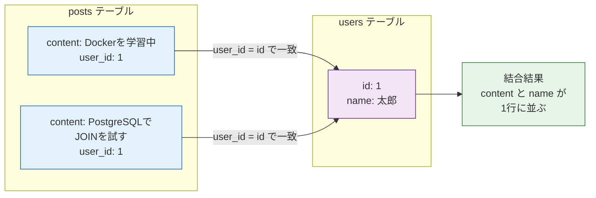
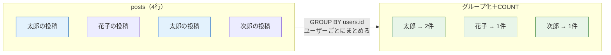
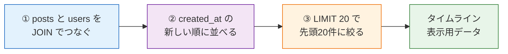

# SQL応用構文

このページでは、一覧画面や検索機能、SNSの投稿一覧でよく使うSQLを学びます。基本構文と同じように、実際の表と結果を見ながら理解します。

## 例に使うテーブル

`users` テーブル:

| id | name | role |
|---:|---|---|
| 1 | 太郎 | student |
| 2 | 花子 | mentor |
| 3 | 次郎 | student |

`posts` テーブル:

| id | user_id | content | likes_count | created_at |
|---:|---:|---|---:|---|
| 1 | 1 | Dockerを学習中 | 5 | 2026-06-01 |
| 2 | 2 | SQLのWHEREを解説しました | 12 | 2026-06-02 |
| 3 | 1 | PostgreSQLでJOINを試す | 8 | 2026-06-03 |
| 4 | 3 | Reactで一覧画面を作った | 3 | 2026-06-04 |

`posts.user_id` は `users.id` を参照する外部キーです。

## ORDER BY: 並び替える

いいね数が多い順に投稿を並べます。

```sql
SELECT content, likes_count
FROM posts
ORDER BY likes_count DESC;
```

結果:

| content | likes_count |
|---|---:|
| SQLのWHEREを解説しました | 12 |
| PostgreSQLでJOINを試す | 8 |
| Dockerを学習中 | 5 |
| Reactで一覧画面を作った | 3 |

`DESC` は降順、`ASC` は昇順です。新しい投稿順なら `created_at DESC` をよく使います。

## LIMIT: 件数を制限する

上位2件だけ取得します。

```sql
SELECT content, likes_count
FROM posts
ORDER BY likes_count DESC
LIMIT 2;
```

結果:

| content | likes_count |
|---|---:|
| SQLのWHEREを解説しました | 12 |
| PostgreSQLでJOINを試す | 8 |

一覧画面で「最初の20件だけ取る」「ランキング上位10件だけ取る」といった場面で使います。

## LIKE: 文字列を検索する

本文に `SQL` を含む投稿を探します。

```sql
SELECT content
FROM posts
WHERE content LIKE '%SQL%';
```

結果:

| content |
|---|
| SQLのWHEREを解説しました |

`%` は「任意の文字列」です。`'%SQL%'` は「前後に何か文字があってもよいのでSQLを含む」という意味です。

## IN: 複数の候補から選ぶ

ユーザーIDが1または3の投稿だけ取得します。

```sql
SELECT user_id, content
FROM posts
WHERE user_id IN (1, 3);
```

結果:

| user_id | content |
|---:|---|
| 1 | Dockerを学習中 |
| 1 | PostgreSQLでJOINを試す |
| 3 | Reactで一覧画面を作った |

複数条件を `OR` で長く書くより読みやすくなります。

## JOIN: 複数テーブルをつなぐ

投稿一覧に投稿者名を表示したい場合、`posts` だけでは `user_id` しか分かりません。投稿者名は `users` にあります。そこでJOINを使います。

```sql
SELECT
  posts.content,
  users.name
FROM posts
JOIN users ON posts.user_id = users.id;
```

結果:

| content | name |
|---|---|
| Dockerを学習中 | 太郎 |
| SQLのWHEREを解説しました | 花子 |
| PostgreSQLでJOINを試す | 太郎 |
| Reactで一覧画面を作った | 次郎 |

`ON posts.user_id = users.id` は「postsのuser_idとusersのidが一致する行をつなぐ」という意味です。SNSの投稿一覧、コメント一覧、いいね一覧ではJOINの考え方が必ず出てきます。

JOINが `posts` と `users` の2つのテーブルを、外部キーを手がかりにどうつなぐのかを図で見てみましょう。



図の読み方です。左の `posts`（青）が持つ `user_id` と、右の `users`（紫）が持つ `id` が一致する行どうしを線でつなぎます。たとえば `user_id` が1の投稿は、`id` が1の太郎さんと結びつきます。その結果（緑）、投稿本文（`content`）と投稿者名（`name`）が同じ1行に並んだ表が得られます。これがJOINの正体です。

## COUNT / GROUP BY: 集計する

ユーザーごとの投稿数を数えます。

```sql
SELECT
  users.name,
  COUNT(posts.id) AS posts_count
FROM users
JOIN posts ON posts.user_id = users.id
GROUP BY users.id, users.name;
```

結果:

| name | posts_count |
|---|---:|
| 太郎 | 2 |
| 花子 | 1 |
| 次郎 | 1 |

`COUNT(posts.id)` は投稿数を数えます。`GROUP BY` は「どの単位で集計するか」を指定します。この例ではユーザーごとに投稿をまとめています。

`GROUP BY` が4件の投稿を「ユーザーごと」にまとめ、`COUNT` が各グループの件数を数える流れを図にしてみましょう。



図の読み方です。左の4行の投稿を `GROUP BY` でユーザーごとの山に仕分けします（青で示した2件はどちらも太郎の投稿です）。その後 `COUNT` で各山の件数を数えると、右のように「太郎=2件、花子=1件、次郎=1件」という集計結果（緑）になります。集計とは「行をグループにまとめて、各グループを1行に要約すること」だとイメージしてください。

## 実務でよくある組み合わせ

タイムラインのように「新しい順で、投稿者名つきで、20件だけ取得する」SQLは次のようになります。

```sql
SELECT
  posts.id,
  posts.content,
  users.name AS author_name,
  posts.created_at
FROM posts
JOIN users ON posts.user_id = users.id
ORDER BY posts.created_at DESC
LIMIT 20;
```

ここでは、列指定、JOIN、並び替え、件数制限を組み合わせています。実際のWebアプリでは、単独の構文よりもこのように複数の構文を組み合わせて使うことが多いです。

この組み合わせSQLが、どんな順番で処理されてタイムラインのデータになるのかを図で追ってみましょう。



図の読み方です。まず①JOINで投稿に投稿者名を結びつけ（青）、②ORDER BYで新しい順に並べ替え（紫）、③LIMITで先頭20件だけに絞り込み（オレンジ）、最後に画面に出すタイムラインのデータ（緑）が完成します。複雑に見えるSQLも、このように「つなぐ→並べる→絞る」の段階に分けて読めば理解できます。

## 応用構文の優先順位

初学者がまず覚える順番は次で十分です。

1. `WHERE` で絞る
2. `ORDER BY` で並べる
3. `LIMIT` で件数を絞る
4. `JOIN` で投稿者名など別テーブルの情報を取る
5. `COUNT` と `GROUP BY` で集計する

次はPostgreSQLに接続し、ここまで読んだSQLを実際に実行します。

- 次のページ: [PostgreSQLでSQLを実行する](/database/postgresql_setup/)
