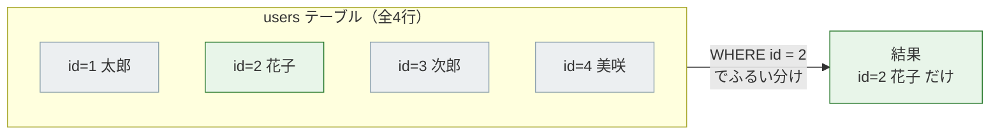
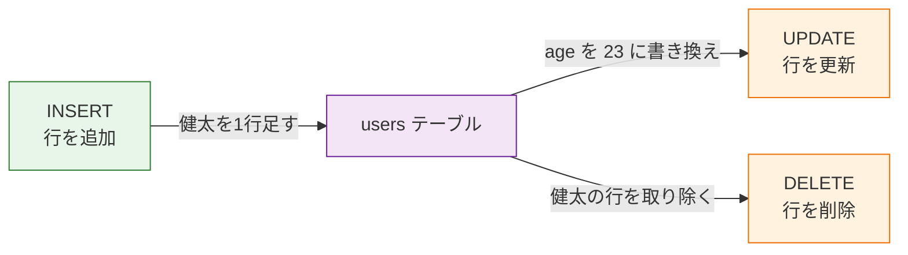
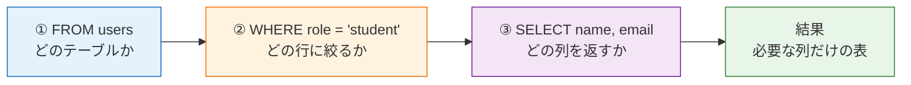

# SQL基本構文

このページでは、SQLの基本構文を「実際の表」と「取得結果」を見ながら学びます。まだPostgreSQLに接続できていなくても読めるように、ここでは実行前後のイメージを重視します。

## 例に使うusersテーブル

まず、次の `users` テーブルがあると考えます。

| id | name | email | age | role | created_at |
|---:|---|---|---:|---|---|
| 1 | 太郎 | taro@example.com | 24 | student | 2026-06-01 |
| 2 | 花子 | hanako@example.com | 31 | mentor | 2026-06-02 |
| 3 | 次郎 | jiro@example.com | 19 | student | 2026-06-03 |
| 4 | 美咲 | misaki@example.com | 28 | student | 2026-06-04 |

列は `id`、`name`、`email`、`age`、`role`、`created_at` です。行は1人分のユーザーデータです。

## SELECT: 行を取得する

すべての行・すべての列を取得します。

```sql
SELECT * FROM users;
```

結果:

| id | name | email | age | role | created_at |
|---:|---|---|---:|---|---|
| 1 | 太郎 | taro@example.com | 24 | student | 2026-06-01 |
| 2 | 花子 | hanako@example.com | 31 | mentor | 2026-06-02 |
| 3 | 次郎 | jiro@example.com | 19 | student | 2026-06-03 |
| 4 | 美咲 | misaki@example.com | 28 | student | 2026-06-04 |

`*` は「すべての列」という意味です。学習中は便利ですが、実務では必要な列だけを指定することが多いです。

## 列を指定して取得する

名前とメールアドレスだけが欲しい場合は、列名を指定します。

```sql
SELECT name, email FROM users;
```

結果:

| name | email |
|---|---|
| 太郎 | taro@example.com |
| 花子 | hanako@example.com |
| 次郎 | jiro@example.com |
| 美咲 | misaki@example.com |

一覧画面では軽い情報だけ取る、詳細画面では必要な列を追加で取る、という場面で使います。

## WHERE: 条件で絞り込む

`WHERE` は「条件に合う行だけ」を取り出す構文です。

```sql
SELECT * FROM users WHERE id = 2;
```

結果:

| id | name | email | age | role | created_at |
|---:|---|---|---:|---|---|
| 2 | 花子 | hanako@example.com | 31 | mentor | 2026-06-02 |

`WHERE id = 2` は「id列が2の行だけ」という意味です。

`WHERE` が4行のテーブルからどの行を残し、どの行を除くのかを図で見てみましょう。



図の読み方です。左が全4行のテーブルで、`WHERE id = 2` という条件のふるいにかけると、条件に合う行（緑＝花子）だけが結果に残り、合わない行（灰色）は取り除かれます。`WHERE` は「テーブルから条件に合う行だけをすくい取る道具」だとイメージしてください。

年齢で絞り込むこともできます。

```sql
SELECT name, age FROM users WHERE age >= 25;
```

結果:

| name | age |
|---|---:|
| 花子 | 31 |
| 美咲 | 28 |

`>=` は「以上」です。SQLでは、`=`、`<>`、`>`、`>=`、`<`、`<=` のような比較演算子をよく使います。

## AND / OR: 条件を組み合わせる

`AND` は「両方を満たす」、`OR` は「どちらかを満たす」です。

```sql
SELECT name, age, role
FROM users
WHERE role = 'student' AND age >= 20;
```

結果:

| name | age | role |
|---|---:|---|
| 太郎 | 24 | student |
| 美咲 | 28 | student |

`student` で、かつ20歳以上のユーザーだけが取れています。

## INSERT: 行を追加する

新しいユーザーを追加します。

```sql
INSERT INTO users (name, email, age, role)
VALUES ('健太', 'kenta@example.com', 22, 'student');
```

追加後のイメージ:

| id | name | email | age | role | created_at |
|---:|---|---|---:|---|---|
| 5 | 健太 | kenta@example.com | 22 | student | 2026-06-25 |

`id` や `created_at` は、自動採番やデフォルト値を設定しておけばSQLで指定しなくても入ります。

## UPDATE: 行を更新する

idが5のユーザーの年齢を更新します。

```sql
UPDATE users
SET age = 23
WHERE id = 5;
```

更新後:

| id | name | email | age | role | created_at |
|---:|---|---|---:|---|---|
| 5 | 健太 | kenta@example.com | 23 | student | 2026-06-25 |

`UPDATE` では `WHERE` が特に重要です。`WHERE` を忘れると全行が更新されます。

危険な例:

```sql
UPDATE users SET role = 'student';
```

これは全ユーザーの `role` を `student` にしてしまいます。更新前には、同じ条件で `SELECT` して対象を確認する癖をつけてください。

## DELETE: 行を削除する

idが5のユーザーを削除します。

```sql
DELETE FROM users WHERE id = 5;
```

`DELETE` も `WHERE` を忘れると全行が削除されます。

危険な例:

```sql
DELETE FROM users;
```

これは `users` テーブルの全行削除です。実務では事故になりやすいので、`UPDATE` と `DELETE` は必ず条件を確認してから実行します。

ここまでに出てきた `INSERT`・`UPDATE`・`DELETE` が、テーブルに対してそれぞれどんな作用をするのかを1枚の図に整理しましょう。



図の読み方です。中央の紫が `users` テーブルです。`INSERT`（緑）はテーブルに新しい行を増やす操作、`UPDATE` と `DELETE`（オレンジ＝既存データを変える注意操作）はそれぞれ既存の行を書き換える・取り除く操作です。`UPDATE` と `DELETE` は一度実行すると元のデータが変わってしまうため、オレンジで「注意」を表しています。

## 基本構文の読み方

SQLは英語の語順に近い構造です。

```sql
SELECT name, email
FROM users
WHERE role = 'student';
```

読み方:

1. `users` テーブルから
2. `role` が `student` の行だけを選び
3. `name` と `email` の列を返す

この「テーブルを決める→行を絞る→列を選ぶ」という処理の順番を図にすると、SQLの動きがつかみやすくなります。



図の読み方です。SQLは書く順番こそ `SELECT` が先頭ですが、データベースの中では「①テーブルを決める（青）→②行を絞る（オレンジ）→③列を選ぶ（紫）」という順で処理が進み、最後に必要な部分だけの表（緑）が返ってきます。この流れを意識すると、複雑なSQLも段階に分けて読めるようになります。

最初はこの読み方ができれば十分です。次は、並び替え、件数制限、曖昧検索、JOIN、集計といった応用構文へ進みます。

- 次のページ: [SQL応用構文](/database/sql_applied/)
