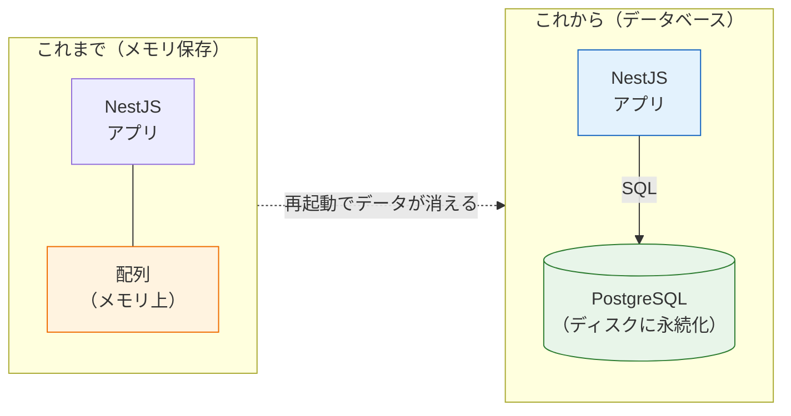
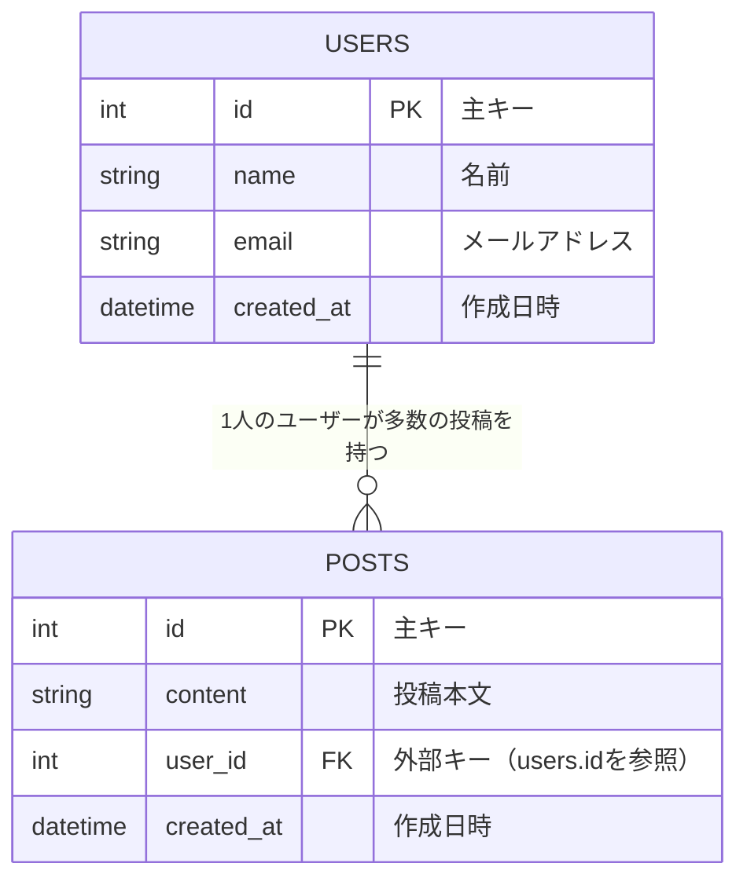

# データベースとは

このページでは、データベースの基本概念を学びます。[バックエンド基礎](/backend/crud_practice/)で作ったメモAPIは、データをメモリ上の配列に保存していたため、サーバーを止めるとデータが消えてしまいました。この問題を解決するのがデータベースです。まずは「データベースとは何か」「どういう仕組みでデータを管理しているのか」を、コードを書く前にしっかり理解しましょう。

## 学習目標

- データベースが必要な理由を、メモリ保存との違いから説明できる
- リレーショナルデータベース（RDB）のテーブル・行・列の構造を説明できる
- 主キーと外部キーの役割を説明できる
- SQLの4つの基本操作（SELECT/INSERT/UPDATE/DELETE）が何をするものか説明できる

## なぜデータベースが必要なのか

### メモリ保存の問題点

[メモAPIの実装](/backend/crud_practice/)では、次のようにデータを保存していました。

```typescript
// Service内の配列にデータを保持していた
private memos: Memo[] = [];
```

この方法には、致命的な問題が3つあります。

1. **サーバーを再起動するとデータが消える** — 配列はプログラムのメモリ上にあるため、プロセスが終了すれば消えます
2. **複数のサーバーでデータを共有できない** — 実際のサービスはサーバーを複数台動かすことがありますが、メモリ上の配列は各サーバーで別々になってしまいます
3. **大量のデータを効率よく検索できない** — 100万件のデータから条件に合うものを探すとき、配列を先頭から全部見るのは非効率です

### データベースが解決すること

**データベース（database、データベース）**とは、データを整理して保存し、効率よく検索・更新できるようにした仕組みです。そして、データベースを管理するソフトウェアを**DBMS（Database Management System、データベース管理システム）**と呼びます。

データベースを使うと、先ほどの3つの問題はこう解決されます。

1. データは**ディスク（ストレージ）に保存**されるため、再起動しても消えません
2. データベースは独立したサーバーとして動くため、**複数のアプリケーションから同じデータを参照**できます
3. **インデックス**という仕組みにより、大量のデータからでも高速に検索できます



図のように、これからはアプリケーションとは別に「データを預かる専門のサーバー」を立て、アプリケーションはそこへ問い合わせる形になります。

## リレーショナルデータベース（RDB）

データベースにはいくつか種類がありますが、最も広く使われているのが**リレーショナルデータベース（Relational Database、リレーショナルデータベース。略してRDB）**です。「relational」は「関係のある」という意味で、データを**表（テーブル）の形**で管理し、表同士を**関係（リレーション）**でつなぐのが特徴です。

代表的なRDBMS（リレーショナルデータベース管理システム）には次のようなものがあります。

| 名前 | 特徴 |
|---|---|
| **PostgreSQL（ポストグレスキューエル）** | 高機能で拡張性が高いオープンソースRDBMS。本カリキュラムで採用 |
| MySQL（マイエスキューエル） | 世界で最も普及しているオープンソースRDBMS |
| SQLite（エスキューライト） | ファイル1つで完結する軽量RDBMS。スマホアプリなどに組み込まれる |

本カリキュラムでは**PostgreSQL 16**を使います。機能が豊富で、後の[RAGのセクション](/ai-chat/)で使うpgvectorのような拡張機能も充実しているためです。

### テーブル・行・列

RDBでは、データを**テーブル（table、テーブル＝表）**で管理します。テーブルはExcelの表をイメージすると分かりやすいです。

例として、ユーザー情報を保存する `users` テーブルを考えます。

| id | name | email | created_at |
|---|---|---|---|
| 1 | 太郎 | taro@example.com | 2026-06-01 10:00:00 |
| 2 | 花子 | hanako@example.com | 2026-06-02 11:30:00 |
| 3 | 次郎 | jiro@example.com | 2026-06-03 09:15:00 |

- **列（column、カラム）** — 縦方向。`id`、`name`、`email` のような「項目」です。各列には型（数値、文字列、日時など）が決まっています。TypeScriptで変数に型をつけたのと同じ発想です
- **行（row、ロウ。レコードとも呼ぶ）** — 横方向。「太郎のデータ一式」のような「1件のデータ」です

TypeScriptのオブジェクトと対応させると理解しやすいでしょう。

```typescript
// テーブルの「1行」は、オブジェクト1つに相当する
const user = {
  id: 1,
  name: "太郎",
  email: "taro@example.com",
};

// テーブル全体は、オブジェクトの配列に相当する
const users: User[] = [/* ... */];
```

ただし配列と違い、テーブルは「各列の型が厳密に決まっている」「ディスクに永続化される」「高速に検索できる」という性質を持ちます。

### 主キー（Primary Key）

**主キー（primary key、プライマリキー）**とは、テーブルの中で**行を一意に（重複なく）特定するための列**です。

先ほどの `users` テーブルでは `id` が主キーです。「id = 2 のユーザー」と言えば、必ず花子さん1人に決まります。名前は同姓同名がありえるため主キーには向きません。

主キーには次のルールがあります。

- **重複してはいけない** — id = 1 のユーザーが2人いてはいけません
- **空（NULL）にできない** — idのないユーザーは存在できません

多くの場合、主キーには「1, 2, 3, ...」と自動で増える連番（**自動採番**）を使います。メモAPIでメモに `id` を振っていたのと同じ考え方です。

### 外部キー（Foreign Key）と「関係」

RDBの真価は、**複数のテーブルを関係づけられる**ことにあります。

SNSを想像してください。ユーザーが投稿（ポスト）をします。このとき「どの投稿を誰が書いたか」を記録する必要があります。そこで `posts` テーブルに、`users` テーブルの主キーを参照する列 `user_id` を持たせます。

| id | content | user_id |
|---|---|---|
| 1 | おはようございます | 1 |
| 2 | データベースの勉強中 | 2 |
| 3 | 今日はいい天気 | 1 |

`user_id` のように、**他のテーブルの主キーを参照する列**を**外部キー（foreign key、フォーリンキー）**と呼びます。この表からは「投稿1と投稿3は太郎（id=1）が書いた」と読み取れます。

この関係を図にすると次のようになります。これは**ER図（Entity Relationship Diagram、イーアール図）**と呼ばれる、テーブル間の関係を表す図です。



図の読み方を説明します。

- 四角がテーブル、その中の各行が列を表します。`PK` は主キー（Primary Key）、`FK` は外部キー（Foreign Key）の印です
- テーブル間を結ぶ線が「関係」です。`||--o{` という記号は「1対多」、つまり「1人のユーザーは0個以上の投稿を持つ」ことを表します

このように「ユーザー1人に対して投稿が複数ある」関係を**1対多（one-to-many）**と呼びます。ここではまず、「外部キーでテーブル同士をつなぐ」という基本イメージを持っておいてください。

### なぜテーブルを分けるのか

「投稿テーブルにユーザー名も直接書けばいいのでは？」と思うかもしれません。仮にそうしてみましょう。

| id | content | user_name | user_email |
|---|---|---|---|
| 1 | おはようございます | 太郎 | taro@example.com |
| 3 | 今日はいい天気 | 太郎 | taro@example.com |

太郎さんの情報が2回書かれています。もし太郎さんが名前を「太郎丸」に変えたら、**すべての投稿行を探して書き換える**必要があります。1か所でも書き換え漏れがあると、データに矛盾が生じます。

テーブルを分けて外部キーで参照していれば、`users` テーブルの1行を直すだけで済みます。このように「同じ情報を二重に持たない」ようにデータを整理する設計手法を**正規化（normalization、せいきか）**と呼びます。いまは「重複を避けるためにテーブルを分け、外部キーでつなぐ」と覚えておけば十分です。

## SQL — データベースと会話する言語

データベースに対して「データをください」「保存してください」と指示するための言語が**SQL（Structured Query Language、エスキューエル）**です。RDBMSの種類を問わず、ほぼ共通の文法で使えます。

SQLの基本は次の4つの操作です。これはHTTPメソッドやCRUDと綺麗に対応します（[HTTPとREST](/backend/http_and_rest/)の復習です）。

| 操作 | SQL | CRUD | HTTPメソッド（REST APIの場合） |
|---|---|---|---|
| 取得 | `SELECT` | Read | GET |
| 作成 | `INSERT` | Create | POST |
| 更新 | `UPDATE` | Update | PATCH / PUT |
| 削除 | `DELETE` | Delete | DELETE |

それぞれの文法は、次の[SQL基本構文](/database/sql_basic/)で実際の表と実行結果を見ながら詳しく学びます。ここではまず「データベースに対して取得・追加・更新・削除を命令する言語がSQL」と押さえてください。

## アプリケーションとデータベースの関係

最後に、Webアプリケーション全体の中でデータベースがどこに位置するかを確認しましょう。ブラウザからのリクエストがデータベースまで届く流れをシーケンス図で表すと、次のようになります。

```mermaid
sequenceDiagram
    participant B as ブラウザ（React）
    participant A as APIサーバー（NestJS）
    participant D as データベース（PostgreSQL）
    B->>A: GET /memos（HTTPリクエスト）
    A->>D: SELECT * FROM memos;（SQL）
    D-->>A: 行データ（メモの一覧）
    A-->>B: JSON（HTTPレスポンス）
    Note over B,D: ブラウザは直接DBに接続しない。必ずAPIサーバーを経由する
```

重要なポイントは2つです。

- **ブラウザは直接データベースに接続しません。** もし接続できてしまうと、悪意あるユーザーがデータを盗んだり書き換えたりできてしまいます。必ずAPIサーバーが間に立ち、認可やバリデーションを行ったうえでデータベースを操作します
- アプリケーションとデータベースの間では**SQL**が基本になります。フレームワークやORMを使う場合でも、裏側ではSQL相当の問い合わせが行われます

つまりこのセクションの学習は、「まず生のSQLでデータベースの動きを理解する」ことに集中します。SQLを知らずに便利なライブラリだけ使うと、トラブル時に何が起きているか分からなくなるため、遠回りに見えてもSQLから学びます。

## 理解度チェック

**Q1. メモAPIのようにデータをメモリ上の配列で保持する方法には、どんな問題がありましたか。2つ以上挙げてください。**

<details markdown="1">
<summary>解答を見る</summary>

主な問題は次の3つです。

1. サーバーを再起動するとデータがすべて消える（メモリはプロセス終了とともに解放されるため）
2. 複数のサーバー間でデータを共有できない
3. 大量データの検索が非効率（配列を先頭から全件走査することになる）

データベースはデータをディスクに永続化し、独立したサーバーとして複数アプリから利用でき、インデックスで高速に検索できるため、これらをすべて解決します。

</details>

**Q2. 主キーと外部キーの違いを説明してください。**

<details markdown="1">
<summary>解答を見る</summary>

- **主キー（primary key）** — そのテーブルの中で行を一意に特定するための列。重複もNULL（空）も許されません。例: `users` テーブルの `id`
- **外部キー（foreign key）** — 他のテーブルの主キーを参照する列。テーブル同士を関係づけるために使います。例: `posts` テーブルの `user_id`（`users.id` を参照）

主キーは「自分の身分証明書」、外部キーは「他のテーブルへの紐づけ」と整理できます。

</details>

**Q3. 次のSQLは何をするものですか。また、このSQLに潜む危険を指摘してください。**

```sql
UPDATE users SET name = '匿名';
```

<details markdown="1">
<summary>解答を見る</summary>

`users` テーブルの `name` 列を `'匿名'` に更新するSQLですが、**`WHERE` 句がないため全行が更新されてしまいます**。つまり、すべてのユーザーの名前が「匿名」に書き換わります。

特定の行だけを更新したい場合は、必ず `WHERE id = 1` のような条件をつけます。UPDATEとDELETEを書くときは、実行前にWHERE句の有無を確認する習慣をつけましょう。

</details>

**Q4. 投稿テーブルにユーザー名を直接保存せず、`user_id` という外部キーでユーザーテーブルを参照する設計にするのはなぜですか。**

<details markdown="1">
<summary>解答を見る</summary>

同じ情報（ユーザー名）を複数の行に重複して持つと、ユーザー名が変わったときにすべての投稿行を書き換える必要があり、書き換え漏れによるデータの矛盾が起きやすくなるためです。

外部キーで参照していれば、ユーザー名は `users` テーブルの1行にだけ存在するので、1か所の修正で済みます。このように重複を排除する設計手法を正規化と呼びます。

</details>

**Q5. ブラウザ（フロントエンド）から直接データベースに接続しないのはなぜですか。**

<details markdown="1">
<summary>解答を見る</summary>

ブラウザで動くコードはユーザーが自由に閲覧・改変できるため、ブラウザから直接データベースに接続できるようにすると、接続情報（パスワードなど）が漏れ、誰でもデータを読み書きできてしまうからです。

必ずAPIサーバー（NestJS）を間に挟み、サーバー側で認証・認可・バリデーションを行ったうえでデータベースを操作します。

</details>

## セルフレビュー

- [ ] データベースが必要な理由を、メモリ保存の問題点とあわせて自分の言葉で説明できる
- [ ] テーブル・行・列の関係を、TypeScriptのオブジェクトと対応づけて説明できる
- [ ] 主キーと外部キーの役割の違いを自分の言葉で説明できる
- [ ] ER図（erDiagram）を見て、テーブル構造と1対多の関係を読み取れる
- [ ] SELECT/INSERT/UPDATE/DELETEがそれぞれCRUDのどれに対応するか言える
- [ ] UPDATE/DELETEでWHERE句を忘れると何が起きるか説明できる
- [ ] ブラウザ→APIサーバー→データベースという3層の流れを図に描ける

## 次のステップ

データベースの概念を理解できたら、次は実際の表を使ってSQLの基本構文を読みます。

- 次のページ: [SQL基本構文](/database/sql_basic/) — 表と実行結果を見ながら、`SELECT`、`WHERE`、`INSERT`、`UPDATE`、`DELETE` を理解します
- このページで学んだ主キー・外部キー・1対多の関係は、[SNS開発](/sns/)のER図設計でフル活用します
