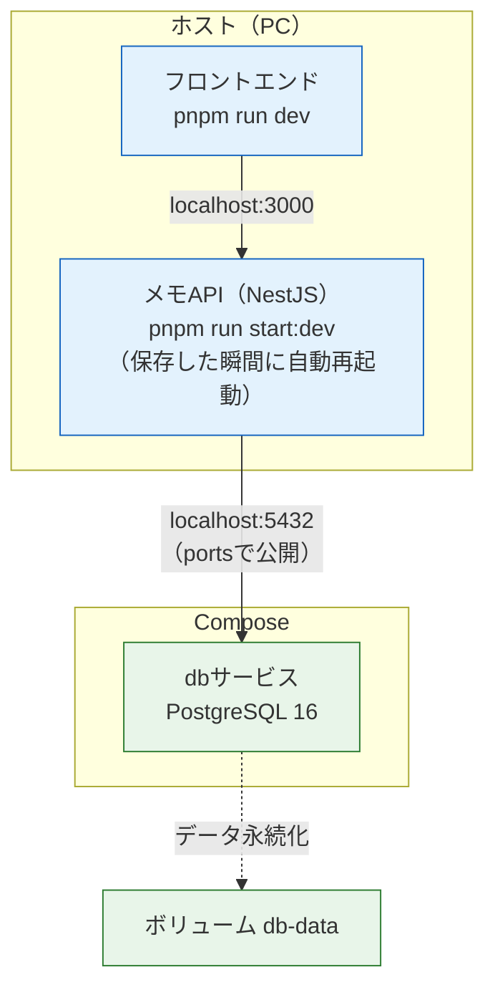

# 開発環境をComposeで組む

前のページ（[Docker Composeで複数コンテナを動かす](/docker/docker_compose/)）で、API + PostgreSQLの2コンテナを起動できるようになりました。Composeの仕組みを学ぶ題材としては、これで十分です。しかし「毎日の開発で使う環境」として考えると、実はAPIまでコンテナで動かす必要はありません。

このページはDocker基礎の総仕上げとして、本カリキュラムで**開発環境の標準形**と呼ぶ構成を組み上げます。標準形とは、**PostgreSQLだけをComposeで起動し、APIとフロントエンドは手元（ホスト）で `pnpm run dev`（NestJSは `pnpm run start:dev`）で動かす**形です。そしてこの構成は、次の章[データベースとPrisma](/database//)以降、最終プロジェクトまでずっと使い続けます。

## 学習目標

- 開発環境で「どこまでをコンテナにするか」の判断と、DBだけをコンテナ化する理由を説明できる
- PostgreSQL 16だけを起動するcompose.yaml（環境変数・ポート・ボリューム・healthcheck）を書ける
- ローカルで動くAPIから、`localhost:5432` でコンテナ内のDBへ接続する形を説明できる
- healthcheckを使って「コンテナの起動」と「アプリの準備完了」の違いを確認できる
- 発展として、アプリごとコンテナ化する構成（バインドマウント・`build.target`）を説明できる

## 開発環境の標準形 — どこまでコンテナにするか

前のページの構成では、自作のメモAPIもコンテナで動かしていました。しかし[Dockerfileを書く](/docker/dockerfile/)で作ったイメージは**本番用**です。TypeScriptをビルド済みのJavaScriptにして `node dist/main.js` で動かす、固めた構成でした。開発中にこのまま使うと、コードを1行直すたびにイメージをビルドし直すことになり、開発のテンポが台無しです。

そこで、開発環境では役割を次のように分けます。

| 対象 | 動かし方 | 理由 |
|---|---|---|
| 自作アプリ（API・フロントエンド） | ホストで `pnpm run dev` / `pnpm run start:dev` | コードを毎日書き換えるから |
| ミドルウェア（PostgreSQLなど） | Composeでコンテナとして起動 | 自分では作らず、起動できればよいから |

**自作アプリをホストで動かす理由**は3つあります。

1. **ホットリロードが最速** — `pnpm run start:dev` はNestJSに最初から用意されているウォッチモード（ファイル変更を監視して自動で再起動するモード）です（[NestJSのセットアップ](/backend/setup/)で使ったコマンドです）。ホストでそのまま動かせば、保存した瞬間に再起動されます。コンテナ越しにこれを実現するには後述の工夫が必要で、速度面でも不利になることがあります。
2. **デバッグが簡単** — エディタのデバッガを直接つなげますし、エラーもターミナルにそのまま出ます。コンテナの中で動くプロセスを調べるより、何枚も壁が少ない状態です。
3. **Dockerの知識は「自分で作らないミドルウェア」にまず活きる** — PostgreSQLのようなソフトウェアは、PCに直接インストールすると手順が多く、消すのも大変です。コンテナなら、公式イメージからコマンド1つで起動でき、不要になれば消すだけです。Dockerの「環境を丸ごと持ち運ぶ」利点が最も効くのは、まずこの部分です。

では、[Dockerfileを書く](/docker/dockerfile/)で学んだアプリのコンテナ化は無駄だったのでしょうか。そうではありません。あれは**デプロイ（本番）のための技術**です。本番サーバーでは、アプリを「どこでも同じように動く箱」にして配置することが効いてきます。あのマルチステージ版Dockerfileは、[CI/CD](/cicd//)と[AWSデプロイ](/aws//)の章で主役になります。**開発ではDBだけコンテナ、本番ではアプリもコンテナ**——この整理を覚えてください。



この図が標準形の全体像です。コードを書く対象（青）はすべてホストにあり、コンテナの中にいるのはPostgreSQL（緑）だけです。APIからDBへは、`ports:` で公開された `localhost:5432` を通って接続します。

## PostgreSQLだけのcompose.yamlを書く

それでは標準形のcompose.yamlです。前ページのものからAPIサービスを外し、DBサービスにhealthcheck（ヘルスチェック。後述）を加えます。

**`memo-api/compose.yaml`**

```yaml
services:
  db:
    image: postgres:16
    environment:
      POSTGRES_USER: postgres
      POSTGRES_PASSWORD: postgres
      POSTGRES_DB: memo
    ports:
      - "5432:5432"
    volumes:
      - db-data:/var/lib/postgresql/data
    healthcheck:
      test: ["CMD-SHELL", "pg_isready -U postgres -d memo"]
      interval: 5s
      timeout: 5s
      retries: 5

volumes:
  db-data:
```

**コード解説**

- `image: postgres:16` — Docker Hubの公式イメージを使います（本カリキュラムはPostgreSQL 16で統一）。自作アプリのサービスがないので、このファイルに `build:` は登場しません。
- `environment:` — 初回起動時に「ユーザー `postgres` / パスワード `postgres` / データベース `memo`」を自動作成させます（前ページの復習です）。パスワードは開発専用のダミーなので直接書いて構いません。本番の秘密情報の扱いは[AWSデプロイ](/aws//)の章（Secrets Manager）で学びます。
- `ports: - "5432:5432"` — PostgreSQLの標準ポート5432をホストに公開します。前ページでは「コンテナ同士の通信には不要」と学びましたが、標準形ではAPIが**ホストで**動くため、この公開が**接続の生命線**になります。
- `volumes: - db-data:/var/lib/postgresql/data` — 名前付きボリュームでデータを永続化します。コンテナを作り直してもデータは残ります。
- `healthcheck:` — このサービスが「健康（接続を受け付けられる状態）かどうか」の判定方法です。次で詳しく説明します。

### healthcheck — 起動と準備完了は別物

```yaml
    healthcheck:
      test: ["CMD-SHELL", "pg_isready -U postgres -d memo"]
      interval: 5s
      timeout: 5s
      retries: 5
```

コンテナが「起動した」ことと、中のPostgreSQLが「接続を受け付けられる」ことは別物です。PostgreSQLは起動直後に初期化処理を行うため、その間に接続すると失敗します。

- `test:` — 健康かどうかを確かめるコマンドです。`pg_isready` はPostgreSQL付属の「接続を受け付けられる状態か」を確認するコマンドです。
- `interval: 5s` / `retries: 5` — 5秒間隔で最大5回確認します。成功するとサービスは `healthy`（健康）と判定されます。
- `timeout: 5s` — 1回の確認の待ち時間の上限です。

healthcheckを書いておくと、`docker compose ps` で「起動しているか」だけでなく「**接続できる状態か**」まで読み取れるようになります。また、後半の発展構成では、この判定を使って起動順を制御します。

### 起動して確認する

```bash
docker compose up -d
docker compose ps
```

実行結果の例:

```
NAME            IMAGE         COMMAND                  SERVICE   CREATED          STATUS                    PORTS
memo-api-db-1   postgres:16   "docker-entrypoint.s…"   db        15 seconds ago   Up 14 seconds (healthy)   0.0.0.0:5432->5432/tcp
```

`STATUS` に `(healthy)` と表示されています。healthcheckが通り、PostgreSQLが接続を受け付けられる状態だと分かります。

## ローカルのAPIから接続する

DBが立ち上がったので、ホスト側のAPIから見た「DBの場所」を整理します。データベースへの**接続文字列**は次の形です。

```
postgresql://ユーザー名:パスワード@ホスト名:ポート/データベース名
              postgres   postgres  localhost 5432  memo
```

ホスト名が `localhost` である点に注目してください。前ページでは「コンテナ間の接続先はサービス名 `db`」と学びましたが、それは**接続する側もコンテナの中にいる**場合の話です。標準形ではAPIはホストで動くので、ホストから見える入口、つまり `ports:` で公開した `localhost:5432` に接続します。

| 接続する側 | 接続先のホスト名 | 通り道 |
|---|---|---|
| ホストで動くAPI（標準形） | `localhost` | `ports:` で公開された5432番 |
| コンテナで動くAPI（発展構成） | `db`（サービス名） | Composeのネットワーク |

「どこで動いているプログラムから見るか」で接続先の名前が変わる——前ページの知識がそのままここで効いています。

なお、現時点のメモAPIはメモリ上の配列で動いているため、この接続文字列はまだ使いません。次の章でPrismaを導入すると、`DATABASE_URL` という名前の環境変数（`.env` ファイルに書きます）として、この値がそのまま接続設定になります。ここでは「DBの場所は `localhost:5432`」という形を頭に入れておけば十分です。

### 開発の一日の流れ

標準形での開発は、毎回この流れになります。

```bash
# 1. DBをコンテナで起動する（compose.yamlのあるディレクトリで）
docker compose up -d

# 2. APIをホストで起動する
pnpm run start:dev
```

`pnpm run start:dev` の実行結果の例:

```
[Nest] 12345  - LOG [NestFactory] Starting Nest application...
[Nest] 12345  - LOG [RoutesResolver] MemosController {/memos}:
[Nest] 12345  - LOG [NestApplication] Nest application successfully started
```

この状態で、VS Codeで `src/memos/memos.service.ts` に小さな変更（コメントを1行足すなど）をして**保存**してください。ウォッチモードが変更を検知し、その瞬間にAPIが自動で再起動します。イメージのビルドも、コンテナの再作成も不要です。動作も確認しておきましょう。

```bash
curl -X POST http://localhost:3000/memos -H "Content-Type: application/json" -d '{"title": "Docker学習", "content": "開発環境の標準形が完成した"}'
curl http://localhost:3000/memos
```

実行結果の例:

```
[{"id":1,"title":"Docker学習","content":"開発環境の標準形が完成した"}]
```

作業を終えるときは、APIは `Ctrl + C` で止め、DBはComposeで片付けます（データはボリュームに残ります）。

```bash
docker compose down
```

**ターミナルで `docker compose up -d` と打てばDBが立ち上がり、`pnpm run start:dev` でコードを書き始められる**——これが、この先のすべての章で毎日繰り返す形です。

## 発展: アプリごとコンテナ化する

標準形があれば日々の開発には十分ですが、**APIもコンテナで動かしながら開発する**構成も実務には存在します。次のような場面で選ばれる構成です。

- **チームで環境を完全に揃えたい** — Node.jsのバージョンやOSの差まで含めて、全員の実行環境をイメージで統一したい場合
- **本番イメージの検証** — 本番に近い形（コンテナ）で動かしたときの挙動を、手元で確かめたい場合

ここからは、その構成に必要な道具を順に見ていきます。普段使いは標準形で構いません。「こういう形も組める」と分かる状態を目指してください。

### バインドマウント — 手元のコードをコンテナに見せる

コンテナの中で動くAPIに、ホストで編集したコードを即座に届ける仕組みが**バインドマウント（Bind Mount）**です。名前付きボリューム（`db-data`）がDockerの管理する「名前付きの置き場」を取り付けるのに対し、バインドマウントは**ホストの特定のディレクトリそのもの**をコンテナに取り付けます。

```yaml
volumes:
  - ./:/app
```

と書くと、「ホストのカレントディレクトリ（`./` = プロジェクトのフォルダ）を、コンテナの `/app` に取り付ける」という意味になります。コンテナの `/app` は、コピーではなく**ホストのフォルダそのもの**になるため、VS Codeでファイルを保存すれば、その瞬間にコンテナの中のファイルも変わります。これとウォッチモードを組み合わせれば、コンテナ内でもホットリロードが動きます。

| 方式 | 書き方の例 | 実体の場所 | 主な用途 |
|---|---|---|---|
| 名前付きボリューム | `db-data:/var/lib/postgresql/data` | Dockerが管理する領域 | DBなどのデータ永続化 |
| バインドマウント | `./:/app` | ホストの指定したフォルダ | 開発中のソースコード共有 |

### Dockerfileに開発用ステージを追加する

次に、「コンテナの中で `start:dev` で動かす」ためのステージを用意します。[Dockerfileを書く](/docker/dockerfile/)で作ったマルチステージビルドを、3ステージ構成に発展させます。

**`memo-api/Dockerfile`**

```dockerfile
# ---- ステージ1: 開発用 ----
FROM node:20-slim AS development

RUN corepack enable pnpm && corepack prepare pnpm@9 --activate

WORKDIR /app

COPY package.json pnpm-lock.yaml ./

RUN pnpm install --frozen-lockfile

COPY . .

CMD ["pnpm", "run", "start:dev"]

# ---- ステージ2: ビルド用 ----
FROM development AS builder

RUN pnpm run build

# ---- ステージ3: 本番用（最終イメージ） ----
FROM node:20-slim

RUN corepack enable pnpm && corepack prepare pnpm@9 --activate

WORKDIR /app

ENV NODE_ENV=production

COPY package.json pnpm-lock.yaml ./

RUN pnpm install --prod --frozen-lockfile

COPY --from=builder /app/dist ./dist

EXPOSE 3000

CMD ["node", "dist/main.js"]
```

**コード解説**

- `FROM node:20-slim AS development` — 開発用ステージです。依存をインストールし、ウォッチモード（`start:dev`）で起動します。`devDependencies` も含めてインストールするので、TypeScriptコンパイラも使えます。
- `RUN corepack enable pnpm && corepack prepare pnpm@9 --activate` — Corepackは固定しないと最新のpnpmを取得し、Node.js 20非対応のバージョンが入ることがあるため、9系に固定します（→ [Dockerfileを書く](/docker/dockerfile/)）。
- `FROM development AS builder` — ビルド用ステージは、開発用ステージを**土台として再利用**しています（`FROM` には手前のステージ名も指定できます）。依存インストールやCOPYをやり直す必要がなく、`pnpm run build` を足すだけで済みます。
- ステージ3（本番用） — [Dockerfileを書く](/docker/dockerfile/)の本番用と同じです。`docker build` をターゲット指定なしで実行すると、**最後のステージ**が最終イメージになるため、本番ビルドの手順はこれまでと変わりません。

1つのDockerfileに「開発用」と「本番用」が同居し、用途に応じて取り出せる形になりました。開発用ステージだけを取り出す方法が、次のComposeの `target` です。

### アプリ込みのcompose.yaml

発展構成のcompose.yamlは次のとおりです（標準形のファイルを置き換えるのではなく、こういう形もあるという例として読んでください）。

```yaml
services:
  api:
    build:
      context: .
      target: development
    ports:
      - "3000:3000"
    volumes:
      - ./:/app
      - /app/node_modules
    environment:
      DATABASE_URL: postgresql://postgres:postgres@db:5432/memo
    depends_on:
      db:
        condition: service_healthy

  db:
    image: postgres:16
    environment:
      POSTGRES_USER: postgres
      POSTGRES_PASSWORD: postgres
      POSTGRES_DB: memo
    ports:
      - "5432:5432"
    volumes:
      - db-data:/var/lib/postgresql/data
    healthcheck:
      test: ["CMD-SHELL", "pg_isready -U postgres -d memo"]
      interval: 5s
      timeout: 5s
      retries: 5

volumes:
  db-data:
```

`db` サービスは標準形と同じです。`api` サービスに登場した新しい設定を解説します。

- `build.target: development` — `build:` を詳細形式で書き、`context: .`（ビルドコンテキスト）に加えて `target: development` を指定しています。「Dockerfileの `development` ステージまでをビルドして、それをイメージとして使う」という意味になり、コンテナは `CMD ["pnpm", "run", "start:dev"]` で起動します。本番用ステージ（ステージ3）は使われません。
- `volumes:` の1行目（`./:/app`） — 先ほど説明したバインドマウントです。手元のプロジェクトフォルダがコンテナの `/app` になります。
- `volumes:` の2行目（`- /app/node_modules`） — 重要な定番テクニックです。バインドマウントはホストのフォルダでコンテナの `/app` を**丸ごと覆い隠す**ため、イメージのビルド時に `pnpm install` で作ったコンテナ内の `node_modules` も隠れてしまい、代わりにホスト側の `node_modules`（macOS用のバイナリが入っているかもしれない）が見えてしまいます。コンテナ側のパスだけを書くと「`/app/node_modules` には匿名のボリュームを当てる」という意味になり、その部分だけ覆いから除外されます。結果として、**コードはホストのものを、`node_modules` はコンテナ内のものを**使えます。
- `DATABASE_URL` のホスト名が `db` — APIが**コンテナの中で**動くので、接続先はサービス名になります（標準形の `localhost` との対比を思い出してください）。
- `depends_on` + `condition: service_healthy` — 「apiは dbに依存する」という宣言です。単に「dbのコンテナが起動した後」ではなく、healthcheckの判定を使って「**dbがhealthyになった後**」にapiを起動してくれます。APIの起動時点でDBが接続を受け付けられないと接続エラーで落ちるため、コンテナ同士をつなぐ構成では起動順の制御が必要になるのです。

この構成で `docker compose up -d --build` すれば、「API + DB」がまとめて立ち上がり、コードを保存すればコンテナ内のAPIが自動再起動します。リポジトリをクローンして `docker compose up -d` するだけで全員同じ環境になる——それがこの構成の持ち味です。引き換えに、ビルドやマウントの分だけ仕掛けが増えます。だからこそ、本カリキュラムの日常は標準形で進めます。

## この構成はこの先ずっと使う

標準形（PostgreSQLだけをComposeで起動し、アプリはホストで `pnpm run dev`）は、使い捨ての練習ではありません。

- 次の章の[PostgreSQLのセットアップ](/database/postgresql_setup/)では、**Composeで起動したPostgreSQL 16**に `psql` で接続し、SQLを学びます。
- 続くPrismaの導入では、`DATABASE_URL`（ホスト名は `localhost`）がそのまま接続設定になり、メモAPIのデータがついにデータベースへ永続化されます。
- 実践プロジェクトの[フルスタックTodoアプリのセットアップ](/fullstack-todo/setup/)、そして最終プロジェクトの[SNSのプロジェクトセットアップ](/sns/project_setup/)でも、開発環境はこの標準形のままです。

「`docker compose up -d` してから `pnpm run dev`」を手に馴染ませておくと、この先の章の立ち上がりがスムーズになります。

## 理解度チェック

**Q1. 開発環境の標準形では、なぜPostgreSQLだけをコンテナにして、APIはホストで動かすのですか。**

<details markdown="1">
<summary>解答を見る</summary>

自作アプリはコードが頻繁に変わるため、ホストで `pnpm run start:dev` を使えばホットリロードが最速で、エディタのデバッガも直接つなげて開発しやすいからです。一方PostgreSQLは自分で作らないミドルウェアであり、「インストール不要でコマンド1つで起動・破棄できる」というDockerの利点が最も効く部分です。アプリのコンテナ化は本番デプロイのための技術として学び、開発ではDBだけをコンテナにします。

</details>

**Q2. 標準形では接続文字列のホスト名を `localhost` にし、発展構成（APIもコンテナ）では `db` にするのはなぜですか。**

<details markdown="1">
<summary>解答を見る</summary>

接続する側がどこで動いているかが違うからです。標準形のAPIはホストで動くので、`ports: - "5432:5432"` で公開されたホストの入口 `localhost:5432` から接続します。発展構成のAPIはコンテナの中で動くので、Composeのネットワーク内でサービス名 `db` がホスト名として解決され、`db:5432` で接続します。コンテナの中の `localhost` は「そのコンテナ自身」を指すため、コンテナ内から `localhost:5432` でDBにはつながりません。

</details>

**Q3. `healthcheck` の `pg_isready` は何を確認していますか。「コンテナが起動していること」との違いも説明してください。**

<details markdown="1">
<summary>解答を見る</summary>

`pg_isready` は、PostgreSQLが実際に接続を受け付けられる状態かを確認するコマンドです。コンテナが起動していても、中のPostgreSQLは初期化中で接続を受け付けられないことがあります。つまり「コンテナの起動」と「アプリの準備完了」は別物です。healthcheckを書いておくと `docker compose ps` の `STATUS` に `(healthy)` と表示され、接続可能な状態かどうかまで確認できます。

</details>

**Q4. 発展構成の `volumes:` にある `- /app/node_modules` は何のためにありますか。**

<details markdown="1">
<summary>解答を見る</summary>

バインドマウント `./:/app` はホストのフォルダでコンテナの `/app` を丸ごと覆い隠すため、イメージビルド時に `pnpm install` で作ったコンテナ内の `node_modules` まで隠れてしまいます。`- /app/node_modules` と書くと、その場所にだけ匿名ボリュームが当てられてバインドマウントの覆いから除外され、「コードはホストのもの、`node_modules` はコンテナ内のもの」を使えるようになります。ホストとコンテナでOSが違ってもパッケージが正しく動く、定番のテクニックです。

</details>

**Q5. 普段の開発は標準形で十分だとして、アプリごとコンテナ化する発展構成が選ばれるのはどんな場面ですか。**

<details markdown="1">
<summary>解答を見る</summary>

(1) チームで実行環境を完全に揃えたい場面です。Node.jsのバージョンやOSの差まで含めてイメージで統一でき、リポジトリをクローンして `docker compose up -d` するだけで全員同じ環境になります。(2) 本番イメージの検証をしたい場面です。本番と同じくコンテナとして動かしたときの挙動を手元で確かめられます。引き換えにビルドやマウントの仕掛けが増えるため、日常の開発では標準形を使います。

</details>

## セルフレビュー

- [ ] 「DBはコンテナ、アプリはホストで `pnpm run dev`」という標準形の理由を自分の言葉で説明できる
- [ ] PostgreSQL 16だけのcompose.yaml（環境変数・ポート・ボリューム・healthcheck）を写経せずに書ける
- [ ] 接続文字列のホスト名が `localhost` になる場合と `db` になる場合の違いを説明できる
- [ ] 「コンテナの起動」と「アプリの準備完了」が別物であることをhealthcheckと結び付けて説明できる
- [ ] `docker compose up -d` → `pnpm run start:dev` → 動作確認 → 片付け、の一日の流れを一人で実行できる
- [ ] バインドマウントと名前付きボリュームの違いを表にして説明できる
- [ ] 発展構成の `build.target` と `- /app/node_modules` の意味を説明できる
- [ ] `depends_on` の `condition: service_healthy` による起動順制御を説明できる

## 次のステップ

これでDocker基礎は完了です。「コンテナの概念 → 基本操作 → 自作アプリのイメージ化 → 複数コンテナ → 開発環境の標準形」と積み上げてきて、**コマンド1つでDBが立ち上がる開発環境**を手に入れました。

次のセクション[データベースとPrisma](/database//)では、ここで起動したPostgreSQL 16の中身に踏み込みます。まずは[PostgreSQLのセットアップ](/database/postgresql_setup/)で、このcompose.yamlの環境に `psql` で接続するところから始まります。compose.yamlは削除せず、そのまま持っていってください。この標準形は[フルスタックTodoアプリのセットアップ](/fullstack-todo/setup/)、[SNSのプロジェクトセットアップ](/sns/project_setup/)でも使い続けます。

また、[Dockerfileを書く](/docker/dockerfile/)で作った本番用ステージは、[CI/CD](/cicd//)と[AWSデプロイ](/aws//)の章で自動ビルド・デプロイされます。Dockerはここから先、すべての章の足元を支える存在になります。
