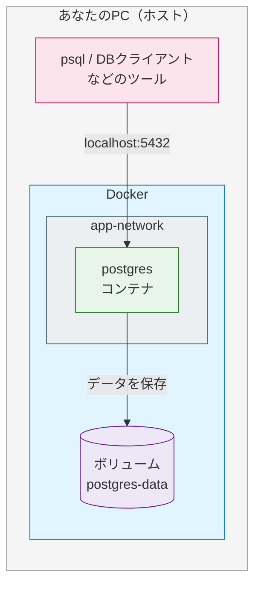
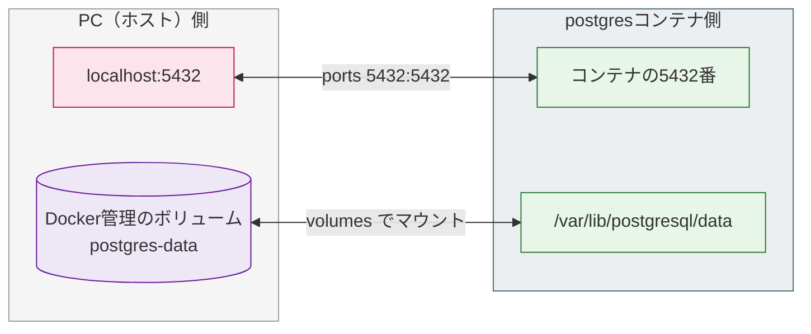
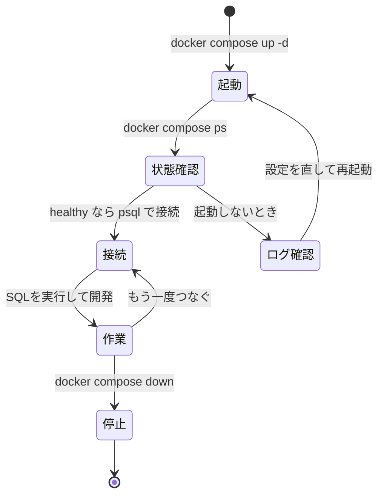

# PostgreSQLコンテナの運用

前のページ（[Docker Compose + PostgreSQL / MySQL](/docker/database_compose/)）では、PostgreSQLとMySQLをComposeで起動しました。このページでは、PostgreSQLコンテナを日常的に使うための確認・ログ・初期化・データ削除を整理します。

ここではアプリやフレームワークは扱いません。目的は、DBコンテナを自分で起動し、状態を確認し、必要に応じて中身を消せるようになることです。

## 学習目標

- PostgreSQLだけの `compose.yaml` を読める
- `healthcheck` でDBの準備完了を確認できる
- `docker compose ps / logs / exec` を使って状態を調べられる
- `psql` でDBへ接続できる
- ボリュームを残す停止と、ボリュームごと消す初期化の違いを説明できる

## ローカル開発環境の全体像

まず、このページで扱うローカル開発環境の全体像を図で見てみましょう。あなたのPC（ホスト）の上でDockerが動き、その中でPostgreSQLコンテナとデータ用のボリュームが動いています。



図の読み方: PCの上のツール（ピンク）から `localhost:5432` でPostgreSQLコンテナ（緑）へ接続します。コンテナはデータをボリューム（紫）に保存します。この「PC → コンテナ → ボリューム」の3層をイメージしておくと、以降の操作が理解しやすくなります。

## PostgreSQLだけのcompose.yaml

作業フォルダに `compose.yaml` を作ります。

```yaml
services:
  postgres:
    image: postgres:16
    environment:
      POSTGRES_USER: postgres
      POSTGRES_PASSWORD: postgres
      POSTGRES_DB: app_db
    ports:
      - "5432:5432"
    volumes:
      - postgres-data:/var/lib/postgresql/data
    healthcheck:
      test: ["CMD-SHELL", "pg_isready -U postgres -d app_db"]
      interval: 5s
      timeout: 5s
      retries: 5

volumes:
  postgres-data:
```

コード解説:

- `image: postgres:16` はPostgreSQL 16の公式イメージを使います
- `environment` で初期ユーザー、パスワード、DB名を指定します
- `ports` でPCの5432番から接続できるようにします
- `volumes` でDBデータをコンテナの外に保存します
- `healthcheck` でPostgreSQLが接続可能な状態か確認します

`ports` と `volumes` は、どちらも「PC側」と「コンテナ側」を線でつなぐ設定です。`compose.yaml` の `左側:右側` が、それぞれどこに対応するのかを図で確認しましょう。



図の読み方: `ports` の `5432:5432` は、PCの入口（ピンク）とコンテナのポート（緑）をつなぎます。`volumes` の `postgres-data:/var/lib/postgresql/data` は、PC側の保存領域（紫）とコンテナ内のデータ置き場（緑）をつなぎます。`左側:右側` の左がPC側、右がコンテナ側だと覚えてください。

## 起動して状態を確認する

```bash
docker compose up -d
docker compose ps
```

`STATUS` に `(healthy)` が出ていれば、PostgreSQLが接続を受け付けられる状態です。

```text
NAME                 IMAGE         SERVICE    STATUS
db-postgres-1        postgres:16   postgres   Up 12 seconds (healthy)
```

コンテナが `Up` でも、PostgreSQLの初期化が終わっていない間は接続できないことがあります。`healthcheck` はその差を見分けるための設定です。

## ログを見る

```bash
docker compose logs postgres
```

リアルタイムでログを追う場合:

```bash
docker compose logs -f postgres
```

DBが起動しないときは、まずログを見ます。パスワード設定、ポート衝突、ボリュームの状態など、原因のヒントが出ます。

## psqlで接続する

```bash
docker compose exec postgres psql -U postgres -d app_db
```

接続できると、次のようなプロンプトになります。

```text
app_db=#
```

よく使うメタコマンド:

| コマンド | 意味 |
|---|---|
| `\conninfo` | 接続先情報を見る |
| `\l` | DB一覧を見る |
| `\dt` | テーブル一覧を見る |
| `\d テーブル名` | テーブル定義を見る |
| `\x auto` | 横に長い結果を自動で縦表示にする |
| `\q` | psqlを終了する |

`psql` を抜ける:

```text
\q
```

## コンテナのシェルに入る

```bash
docker compose exec postgres bash
```

環境変数を確認できます。

```bash
echo $POSTGRES_DB
echo $POSTGRES_USER
```

コンテナの中からpsqlに入ることもできます。

```bash
psql -U postgres -d app_db
```

抜ける:

```bash
exit
```

## 停止する

```bash
docker compose down
```

これはコンテナとネットワークを削除しますが、名前付きボリューム `postgres-data` は残ります。つまり、DBのデータは残ります。

もう一度起動すると、前のデータが残っています。

```bash
docker compose up -d
```

## データごと初期化する

DBの中身も完全に消したい場合は、`-v` を付けます。

```bash
docker compose down -v
```

これはボリュームも削除します。作ったテーブルやINSERTしたデータは戻りません。

| コマンド | コンテナ | ボリューム | DBデータ |
|---|---|---|---|
| `docker compose down` | 消える | 残る | 残る |
| `docker compose down -v` | 消える | 消える | 消える |

学習中に「最初からやり直したい」ときは便利ですが、消える意味を理解してから使ってください。

## ポートが使われているとき

PostgreSQLの標準ポート5432をすでに他のアプリが使っていると、起動に失敗します。その場合は、PC側のポートを変えます。

```yaml
ports:
  - "15432:5432"
```

左側がPC側、右側がコンテナ側です。この例では、PCからは `localhost:15432` で接続します。コンテナ内のPostgreSQLは変わらず5432番で動いています。

## 毎日まわす開発ループ

ここまでのコマンドは、実際の開発では毎日同じ順番でまわすことになります。「起動 → 状態確認 → 接続して作業 → 停止」という1日の流れを図にします。



図の読み方: 通常は「起動 → 状態確認 → 接続 → 作業 → 停止」と上から流れます。`ps` で `healthy` にならないときは、`logs` で原因を調べて設定を直し、もう一度起動に戻ります。コードを直して動かし直す開発のリズムも、この往復のくり返しです。

## このページで必ず覚えること

- `docker compose ps` でコンテナの状態を見る
- `docker compose logs postgres` でログを見る
- `docker compose exec postgres psql -U postgres -d app_db` でDBに入る
- `\x auto` は横に長いSELECT結果を見やすくする
- `docker compose down` はデータを残す
- `docker compose down -v` はデータも消す
- ポート衝突時は `"15432:5432"` のように左側だけ変える

## セルフレビュー

- [ ] PostgreSQLだけのcompose.yamlを読める
- [ ] healthcheckの役割を説明できる
- [ ] psqlで接続し、`\conninfo` と `\dt` を実行できる
- [ ] `down` と `down -v` の違いを説明できる
- [ ] ポートの左側と右側の違いを説明できる

## 次のステップ

DBコンテナを安定して扱えるようになったら、[データベース基礎](/database/)へ進みます。そこでSQLの基本と応用を学び、このPostgreSQLコンテナに対して実際にSQLを実行します。
