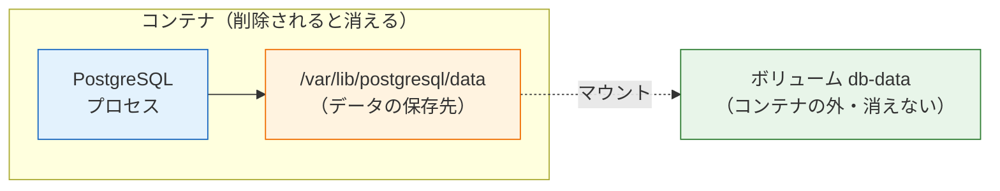
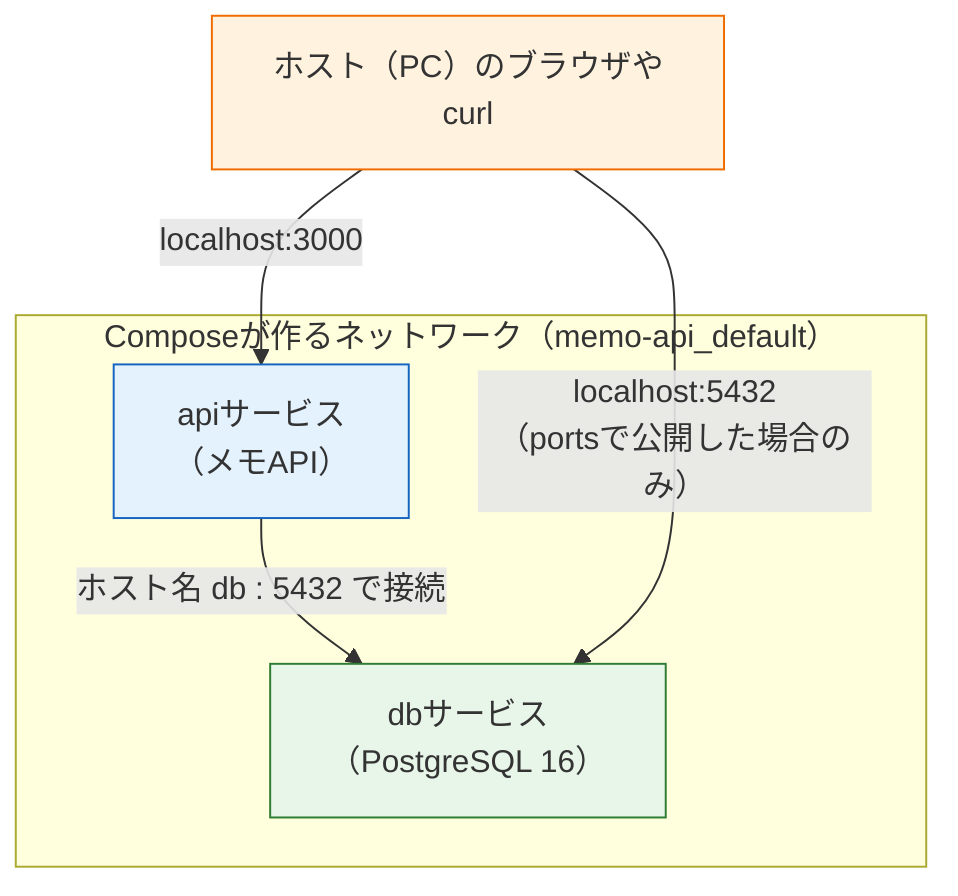

# Docker Composeで複数コンテナを動かす

前のページ（[Dockerfileを書く](/docker/dockerfile/)）で、メモAPIをコンテナとして動かせるようになりました。しかし、実際のアプリは1つのコンテナだけでは完結しません。たとえばこの後の章では「APIコンテナ + データベース（PostgreSQL）コンテナ」という構成になりますし、最終プロジェクトのSNSも同様です。

コンテナが2つ3つと増えてくると、`docker run` をオプション付きで何度も打ち、起動順や接続設定を手で管理するのは現実的ではなくなります。そこで登場するのが **Docker Compose（ドッカーコンポーズ）**です。このページでは、複数コンテナの構成をファイル1つで宣言的に管理する方法と、コンテナ間をつなぐ「ボリューム」「ネットワーク」を学びます。

## 学習目標

- Docker Composeが解決する問題を説明できる
- compose.yamlの基本構造（services / ports / volumes など）を読み書きできる
- `docker compose up / down / ps / logs / exec` で複数コンテナを管理できる
- ボリュームによるデータ永続化の仕組みを説明できる
- サービス間ネットワークで「サービス名で通信できる」ことを説明できる

## Docker Composeとは

Docker Composeは、**複数のコンテナの構成を1つのYAMLファイルに書き、まとめて起動・停止するためのツール**です。Docker Desktopに同梱されているので、追加のインストールは不要です。

`docker run` との違いを見てみましょう。前ページのメモAPIの起動コマンドはこうでした。

```bash
docker build -t memo-api:2.0 .
docker run --name memo-api -d -p 3000:3000 memo-api:2.0
```

このコマンドの内容（イメージ、名前、ポート…）は、実行した本人の頭の中とシェルの履歴にしか残りません。コンテナが増えれば、コマンドも起動順の管理も増えていきます。

Composeでは、同じ内容を **`compose.yaml`** というファイルに書きます。

- 構成がファイルとして残るので、**Gitで管理でき、チームで共有できる**
- `docker compose up` の1コマンドで、**全コンテナがまとめて起動**する
- コンテナ間の**ネットワーク接続を自動で**設定してくれる

「打つコマンド」から「読める設定ファイル」へ。これがComposeの本質です。

## 最初のcompose.yaml — メモAPIをComposeで起動する

まずは前ページのメモAPI1つだけをComposeで動かし、ファイルの書き方とコマンドに慣れましょう。`memo-api` プロジェクトのルート（Dockerfileと同じ場所）に `compose.yaml` を作ります。

**`memo-api/compose.yaml`**

```yaml
services:
  api:
    build: .
    ports:
      - "3000:3000"
```

**コード解説**

- `services:` — Composeで管理するコンテナの一覧を書くセクションです。Composeの世界では、管理対象の各コンテナを**サービス（Service）**と呼びます。
- `api:` — 1つ目のサービスの名前です。自由に付けられますが、この名前が後述のネットワークでそのまま「ホスト名」になるため、役割が分かる短い名前にします。
- `build: .` — このサービスのイメージを、カレントディレクトリのDockerfileからビルドして使う、という指定です。既存イメージを使う場合は代わりに `image: イメージ名:タグ` と書きます。
- `ports:` — ポート公開の設定です。`"3000:3000"` は `docker run -p 3000:3000` と同じで、「左がホスト側:右がコンテナ側」です。YAMLでは `8080:80` のような値が時刻と誤解釈されることがあるため、引用符で囲むのが安全です。

なお、設定ファイル名は `compose.yaml` が現在の推奨です（古い資料にある `docker-compose.yml` も動きますが、本カリキュラムは推奨に従います）。コマンドも、旧来の `docker-compose`（ハイフンあり）ではなく `docker compose`（スペース区切り）を使います。

### 起動する: docker compose up

```bash
docker compose up -d
```

実行結果の例:

```
[+] Running 2/2
 ✔ Network memo-api_default  Created
 ✔ Container memo-api-api-1  Started
```

**コード解説**

- `docker compose up` — compose.yamlに書かれた全サービスを（必要ならビルドして）起動します。
- `-d` — `docker run` と同じく、バックグラウンドで起動します。

注目してほしいのは出力の1行目です。コンテナの起動前に `Network memo-api_default` が作られています。Composeは、**このcompose.yaml専用のネットワークを自動で作り、全サービスをそこに参加させます**。この意味はこのページの後半で重要になります。

### 状態確認とログ: docker compose ps / logs

```bash
docker compose ps
```

実行結果の例:

```
NAME             IMAGE          COMMAND                  SERVICE   CREATED          STATUS          PORTS
memo-api-api-1   memo-api-api   "docker-entrypoint.s…"   api       30 seconds ago   Up 29 seconds   0.0.0.0:3000->3000/tcp
```

ログはサービス名で指定します。

```bash
docker compose logs api
```

動作確認をして、いったん止めましょう。

```bash
curl http://localhost:3000/memos
```

### 停止と削除: docker compose down

```bash
docker compose down
```

実行結果の例:

```
[+] Running 2/2
 ✔ Container memo-api-api-1  Removed
 ✔ Network memo-api_default  Removed
```

`down` は全サービスのコンテナを**停止して削除**し、作成したネットワークも片付けます。`docker stop` + `docker rm` を全コンテナ分まとめて実行してくれるイメージです。起動は `up`、片付けは `down`。日々の開発はこの2コマンドが基本になります。

## サービスを増やす — PostgreSQLを追加する

いよいよ本題の「複数コンテナ」です。データベースのPostgreSQL 16を2つ目のサービスとして追加します。PostgreSQL自体の使い方は[データベース基礎](/database/)と[Docker Compose + DB](/docker/database_compose/)で学ぶので、ここでは「複数コンテナを動かす練習台」として扱います。

**`memo-api/compose.yaml`**

```yaml
services:
  api:
    build: .
    ports:
      - "3000:3000"

  db:
    image: postgres:16
    environment:
      POSTGRES_USER: postgres
      POSTGRES_PASSWORD: postgres
      POSTGRES_DB: memo
    ports:
      - "5432:5432"
    volumes:
      - db-data:/var/lib/postgresql/data

volumes:
  db-data:
```

**コード解説**

- `db:` — 2つ目のサービスです。サービスはこのように `services:` の下に並べていくだけで増やせます。
- `image: postgres:16` — 自分でビルドせず、Docker Hubの公式イメージ `postgres:16` をそのまま使います（本カリキュラムはPostgreSQL 16で統一）。
- `environment:` — コンテナに渡す環境変数です。PostgreSQL公式イメージは、初回起動時にこの環境変数を読んで「ユーザー名 `postgres` / パスワード `postgres` / データベース `memo`」を自動作成してくれます。何を設定できるかはイメージごとに決まっており、Docker Hubの各イメージのページに説明があります。
- `ports: - "5432:5432"` — PostgreSQLの標準ポート5432をホストに公開します。これは「ホストのGUIツールなどから直接覗きたい」ためのもので、後述のとおり**コンテナ同士の通信には不要**です。
- `volumes: - db-data:/var/lib/postgresql/data` — **ボリューム**の設定です（次節で詳説）。「`db-data` という名前のボリュームを、コンテナ内の `/var/lib/postgresql/data` に取り付ける」という意味です。
- 最後の `volumes: db-data:` — ファイル末尾のトップレベルで、使用するボリュームを宣言します。サービス内の `volumes:`（使う場所の指定）とセットで書きます。

起動して、2つのコンテナが動くことを確認します。

```bash
docker compose up -d
docker compose ps
```

実行結果の例:

```
NAME             IMAGE          COMMAND                  SERVICE   CREATED          STATUS          PORTS
memo-api-api-1   memo-api-api   "docker-entrypoint.s…"   api       10 seconds ago   Up 9 seconds    0.0.0.0:3000->3000/tcp
memo-api-db-1    postgres:16    "docker-entrypoint.s…"   db        10 seconds ago   Up 9 seconds    0.0.0.0:5432->5432/tcp
```

コマンド1つで「API + DB」が起動しました。

## ボリューム — コンテナが消えてもデータを残す

コンテナには重要な性質があります。**コンテナを削除すると、その中で作られたデータも一緒に消える**ことです（[コンテナとは何か](/docker/what_is_container/)で学んだとおり、コンテナの変更はそのコンテナ限りでした）。

アプリのコンテナなら作り直せば済みますが、データベースは困ります。`docker compose down` のたびに全データが消えるデータベースでは使い物になりません。

そこで使うのが**ボリューム（Volume）**です。ボリュームは、Dockerが管理する「コンテナの外にあるデータ置き場」で、コンテナ内の特定のディレクトリに取り付けて（マウントして）使います。コンテナを削除しても、ボリュームは残ります。



図のとおり、PostgreSQLがデータを書き込むディレクトリ `/var/lib/postgresql/data` の実体は、コンテナの外にあるボリューム `db-data`（緑）です。コンテナが消えてもボリュームは残り、新しいコンテナに再び取り付ければデータが戻ります。

実際に確かめてみましょう。データベースにテーブルを1つ作ってから、コンテナを消して作り直します。`psql` はPostgreSQL付属の対話ツールです（詳しくは[PostgreSQLのセットアップ](/database/postgresql_setup/)で学びます。ここでは結果だけ追ってください）。

```bash
docker compose exec db psql -U postgres -d memo -c "CREATE TABLE test (id int);"
```

実行結果の例:

```
CREATE TABLE
```

`docker compose exec サービス名 コマンド` は、`docker exec` のCompose版です。コンテナを削除して、作り直します。

```bash
docker compose down
docker compose up -d
docker compose exec db psql -U postgres -d memo -c "\dt"
```

実行結果の例:

```
        List of relations
 Schema | Name | Type  |  Owner
--------+------+-------+----------
 public | test | table | postgres
(1 row)
```

コンテナを削除・再作成したのに、`test` テーブルが残っています。ボリュームが効いている証拠です。

なお、ボリュームごと削除したい（データベースを完全に初期化したい）ときは、`down` に `-v` を付けます。

```bash
docker compose down -v
```

開発中に「DBをまっさらからやり直したい」場面で使いますが、**データが完全に消える**操作なので、意味を理解して使ってください。

## サービス間ネットワーク — サービス名で通信できる

複数コンテナ構成の核心が、コンテナ間の通信です。この後の章でAPIはPostgreSQLに接続することになりますが、APIコンテナから見て、DBコンテナはどこにいるのでしょうか。

答えはシンプルです。Composeが作るネットワークの中では、**サービス名がそのままホスト名（接続先の名前）になります**。つまりAPIコンテナからは、`db` という名前でPostgreSQLコンテナに接続できます。



この図には2種類の通信が描かれています。

- **ネットワーク内の通信（青→緑）**: `api` から `db` へは、サービス名 `db` とコンテナ側ポート `5432` で直接つながります。`ports:` の設定は**関係ありません**。同じネットワークにいるコンテナ同士は、最初から通信できます。
- **ホストからの通信（橙）**: PCのブラウザやcurlからコンテナへ入るには、`ports:` で公開した `localhost:3000` などを通ります。

重要なのは、**コンテナの中では `localhost` の意味が変わる**ことです。APIコンテナの中で `localhost` と言えば「APIコンテナ自身」を指し、ホストPCでもDBコンテナでもありません。「コンテナからDBに `localhost:5432` でつなごうとして失敗する」のはDocker初心者の典型的なつまずきです。**コンテナ間の接続先は、サービス名で指定する**と覚えてください。

本当にサービス名で見つかるのか、確かめてみましょう。APIコンテナの中から、名前 `db` がネットワーク上の住所（IPアドレス）に変換されるかを確認します。

```bash
docker compose up -d
docker compose exec api getent hosts db
```

実行結果の例:

```
172.18.0.2      db
```

`db` という名前が `172.18.0.2` というIPアドレスに解決されました（数値は環境により異なります）。さらに、APIコンテナの中のNode.jsから、`db` の5432番ポートへ実際に接続してみます。

```bash
docker compose exec api node -e "const s=require('net').connect(5432,'db',()=>{console.log('connected to db:5432');s.end();})"
```

実行結果の例:

```
connected to db:5432
```

APIコンテナからDBコンテナへ、サービス名だけで接続できました。次のページでは、この仕組みを使って「APIからPostgreSQLへ接続するための接続文字列」を組み立てます。

確認が済んだら片付けておきます。

```bash
docker compose down
```

## Composeコマンドまとめ

| コマンド | 役割 |
|---|---|
| `docker compose up -d` | 全サービスを（必要ならビルドして）起動する |
| `docker compose down` | 全サービスを停止・削除する（`-v` でボリュームも削除） |
| `docker compose ps` | サービスの状態を一覧する |
| `docker compose logs [-f] サービス名` | ログを見る |
| `docker compose exec サービス名 コマンド` | 実行中のサービス内でコマンドを実行する |
| `docker compose build` | イメージをビルドし直す（`up --build` で起動と同時も可） |

Dockerfileを変更したのに反映されないときは、`docker compose up -d --build` でビルドし直してください（`up` だけではイメージの再ビルドは行われないことがあります）。

## 理解度チェック

**Q1. `docker run` でコンテナを個別に起動するのに比べて、Docker Composeを使う利点を3つ挙げてください。**

<details markdown="1">
<summary>解答を見る</summary>

(1) 構成（イメージ・ポート・環境変数など）がcompose.yamlというファイルに残るため、Gitで管理しチームで共有できる。(2) `docker compose up` の1コマンドで複数コンテナをまとめて起動・停止できる。(3) 専用ネットワークが自動で作られ、サービス名だけでコンテナ間通信ができる。記憶やシェル履歴に頼らず、「読める設定」として環境を再現できることが本質的な利点です。

</details>

**Q2. compose.yamlの `services` の下に書く各項目（サービス）とは何ですか。また `build: .` と `image: postgres:16` の違いは何ですか。**

<details markdown="1">
<summary>解答を見る</summary>

サービスはComposeが管理するコンテナの単位で、サービス名はネットワーク上のホスト名にもなります。`build: .` は「カレントディレクトリのDockerfileからイメージをビルドして使う」指定で、自作アプリに使います。`image: postgres:16` は「レジストリの既存イメージをそのまま使う」指定で、PostgreSQLのような既製ソフトウェアに使います。

</details>

**Q3. DBサービスにボリュームを設定しないと、どのような問題が起きますか。**

<details markdown="1">
<summary>解答を見る</summary>

コンテナ内で作られたデータはコンテナの削除と同時に消えるため、`docker compose down` するたびにデータベースの中身（テーブルやレコード）がすべて失われます。ボリュームはコンテナの外にあるデータ置き場をコンテナ内のディレクトリにマウントする仕組みで、PostgreSQLの保存先 `/var/lib/postgresql/data` をボリュームにしておけば、コンテナを作り直してもデータが残ります。

</details>

**Q4. APIコンテナからPostgreSQLコンテナに接続するとき、接続先のホスト名には何を指定しますか。`localhost` ではだめな理由も説明してください。**

<details markdown="1">
<summary>解答を見る</summary>

compose.yamlで付けたサービス名（この例では `db`）を指定します。Composeのネットワーク内ではサービス名がホスト名として解決されるためです。`localhost` がだめなのは、コンテナの中での `localhost` は「そのコンテナ自身」を指すからです。APIコンテナで `localhost:5432` に接続しようとしても、APIコンテナ自身の5432番には何もいないため失敗します。

</details>

**Q5. `db` サービスの `ports: - "5432:5432"` を削除した場合、(a) APIコンテナからDBへの接続、(b) ホストPCのツールからDBへの接続、はそれぞれどうなりますか。**

<details markdown="1">
<summary>解答を見る</summary>

(a) 影響ありません。コンテナ間の通信はComposeのネットワーク内で直接行われ、`ports:`（ホストへの公開）とは無関係だからです。(b) できなくなります。`ports:` はホストからコンテナへの通り道なので、削除するとホストPCのGUIツールやpsqlから `localhost:5432` で接続できなくなります。つまり `ports:` は「ホストに見せたいかどうか」だけで決めればよい設定です。

</details>

**Q6. `docker compose down` と `docker compose down -v` の違いは何ですか。**

<details markdown="1">
<summary>解答を見る</summary>

どちらもコンテナとネットワークを停止・削除しますが、`-v` を付けるとボリュームも削除されます。つまり `-v` ありではデータベースのデータが完全に消えます。日常の停止は `down`、データベースを初期化してやり直したいときだけ `down -v` と使い分けます。

</details>

## セルフレビュー

- [ ] Composeが解決する問題（docker runの手作業管理の限界）を説明できる
- [ ] services / build / image / ports / environment / volumes の意味を説明できる
- [ ] API + PostgreSQLのcompose.yamlを、写経せずにおおよそ書ける
- [ ] up / down / ps / logs / exec の各コマンドを使い分けられる
- [ ] ボリュームの図を描いて、データが消えない仕組みを説明できる
- [ ] 「コンテナ間はサービス名で通信する」「コンテナ内のlocalhostは自分自身」を説明できる
- [ ] `ports:` がコンテナ間通信に不要である理由を説明できる

## 次のステップ

Composeの仕組み（サービス・ボリューム・ネットワーク）が分かったところで、次のページ[開発環境をComposeで組む](/docker/dev_environment/)では、これを「毎日使える開発環境」に仕上げます。コードを書き換えたら即座に反映されるホットリロードや、起動順の制御など、開発で実際に必要になる設定を加えていきます。

ここで学んだ「サービス名で接続する」「ボリュームでデータを残す」は、[Docker Compose + DB](/docker/database_compose/)と最終プロジェクトの[SNS開発](/sns/)まで、ずっと使い続ける知識です。
