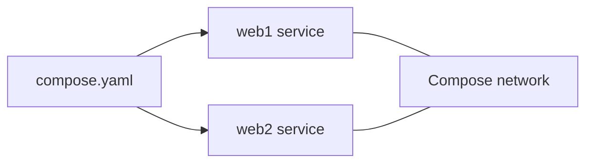

# Docker Composeで複数コンテナを動かす

前のページでは、Dockerfileから静的HTMLを配信するイメージを作りました。このページでは、**Docker Compose**を使って、複数コンテナの設定を1つのファイルで管理する方法を学びます。

ここではアプリやフレームワークは扱いません。題材は**nginxをComposeで起動する**ところから始めます。複数コンテナの考え方は、あとでPostgreSQLやMySQLを立てるときにそのまま使います。

## 学習目標

- Docker Composeが何を解決するか説明できる
- `compose.yaml` の基本構造を読める
- `services`、`image`、`ports`、`volumes` の意味を説明できる
- `docker compose up / down / ps / logs / exec` を使える
- サービス名がCompose内の名前として使われることを理解できる

## Docker Composeとは

Docker Composeは、**コンテナの構成をYAMLファイルに書き、まとめて起動・停止するための仕組み**です。

`docker run` だけでもコンテナは起動できます。しかし、ポート、ボリューム、環境変数、コンテナ名などのオプションが増えると、コマンドが長くなります。

```bash
docker run --name web -d -p 8080:80 nginx:1.27-alpine
```

Composeでは、この設定を `compose.yaml` に書けます。

```yaml
services:
  web:
    image: nginx:1.27-alpine
    ports:
      - "8080:80"
```

コマンドは短くなります。

```bash
docker compose up -d
```

「長い起動コマンド」ではなく、「読める設定ファイル」にするのがComposeの価値です。

## 最初のcompose.yaml

作業フォルダを作ります。

```bash
mkdir compose-nginx-demo
cd compose-nginx-demo
```

`compose.yaml` を作ります。

**`compose.yaml`**

```yaml
services:
  web:
    image: nginx:1.27-alpine
    ports:
      - "8080:80"
```

コード解説:

- `services:` は、Composeで管理するコンテナの一覧です
- `web:` はサービス名です。自由に決められます
- `image: nginx:1.27-alpine` は、nginx公式イメージを使う指定です
- `ports:` は、PC側からコンテナへアクセスするためのポート公開です
- `"8080:80"` は、PCの8080番をコンテナの80番につなぎます

## 起動する

```bash
docker compose up -d
```

確認します。

```bash
docker compose ps
```

ブラウザで開きます。

```text
http://localhost:8080
```

nginxの初期画面が表示されれば成功です。

## ログを見る

```bash
docker compose logs web
```

リアルタイムで追い続ける場合は `-f` を付けます。

```bash
docker compose logs -f web
```

ブラウザで `http://localhost:8080` を再読み込みすると、アクセスログが増えます。

## コンテナの中に入る

```bash
docker compose exec web sh
```

nginxのコンテナはAlpine Linuxなので、`bash` ではなく `sh` を使います。

中に入ったら、公開ディレクトリを確認します。

```sh
ls /usr/share/nginx/html
```

終了します。

```sh
exit
```

## 停止と削除

```bash
docker compose down
```

`docker compose down` は、このComposeプロジェクトで作ったコンテナとネットワークを削除します。

## ファイルをマウントする

次に、手元のHTMLをnginxコンテナにマウントします。

`index.html` を作ります。

**`index.html`**

```html
<!doctype html>
<html lang="ja">
  <head>
    <meta charset="utf-8" />
    <title>Compose Demo</title>
  </head>
  <body>
    <h1>Docker Composeで表示しています</h1>
  </body>
</html>
```

`compose.yaml` を変更します。

```yaml
services:
  web:
    image: nginx:1.27-alpine
    ports:
      - "8080:80"
    volumes:
      - ./index.html:/usr/share/nginx/html/index.html:ro
```

コード解説:

- `volumes:` は、ファイルやディレクトリをコンテナに取り付ける設定です
- `./index.html` は手元のファイルです
- `/usr/share/nginx/html/index.html` はコンテナ内の配置先です
- `:ro` は読み取り専用です。コンテナ側から手元のHTMLを書き換えられないようにします

再起動します。

```bash
docker compose down
docker compose up -d
```

ブラウザで `http://localhost:8080` を開くと、自分で作ったHTMLが表示されます。

## 複数サービスを書く

Composeは複数サービスを同じファイルに書けます。たとえば、2つのnginxを別ポートで起動できます。

```yaml
services:
  web1:
    image: nginx:1.27-alpine
    ports:
      - "8081:80"

  web2:
    image: nginx:1.27-alpine
    ports:
      - "8082:80"
```

起動します。

```bash
docker compose up -d
docker compose ps
```

ブラウザで確認します。

```text
http://localhost:8081
http://localhost:8082
```

このように、Composeでは複数のコンテナを1つの設定ファイルで管理できます。

## サービス名はCompose内の名前になる

Composeでは、`web1` や `web2` のようなサービス名が、Compose内の名前として使われます。



あとでPostgreSQLを立てるとき、`postgres` というサービス名を付けると、同じComposeネットワーク内では `postgres` という名前で参照できます。今は「サービス名はただのラベルではなく、Compose内の名前になる」と覚えておけば十分です。

## このページで必ず覚えること

- `compose.yaml` にコンテナの設定を書く
- `docker compose up -d` で起動する
- `docker compose down` で片付ける
- `services` の下にサービス名を書く
- `image` は使うイメージを指定する
- `ports` はPCからアクセスする入口を作る
- `volumes` は手元のファイルやDockerの保存領域をコンテナへ取り付ける

## セルフレビュー

- [ ] `docker run` とComposeの違いを説明できる
- [ ] `compose.yaml` の `services`、`image`、`ports` を読める
- [ ] `docker compose ps` で状態を確認できる
- [ ] `docker compose logs` でログを確認できる
- [ ] `docker compose exec web sh` でコンテナの中に入れる
- [ ] `volumes` で手元のHTMLをnginxにマウントできる

## 次のステップ

Composeで複数コンテナを管理する基本を学びました。次は独立した教材[Docker Compose + PostgreSQL / MySQL](/docker/database_compose/)で、PostgreSQLとMySQLをComposeで起動します。
