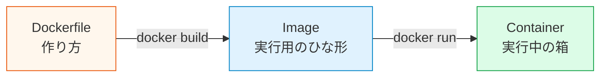
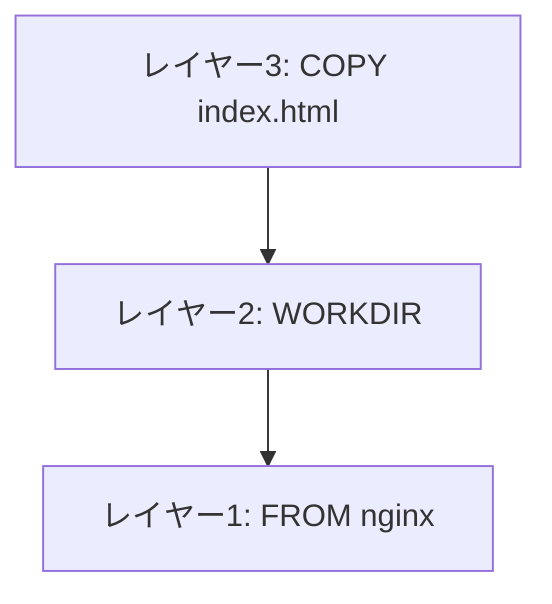

# Dockerfileを書く

前のページ（[Dockerのインストールと基本操作](/docker/install_and_basics/)）では、`hello-world` や `nginx` など、すでに公開されているイメージを使いました。このページでは、**Dockerfile**を書いて、自分で小さなイメージを作ります。

ここではアプリやフレームワークは使いません。題材は**静的なHTMLをnginxで配信するだけ**にします。目的は「Dockerfileの命令が何をしているか」を理解することです。

## 学習目標

- Dockerfileが「イメージの作り方を書くファイル」だと説明できる
- `FROM`、`COPY`、`WORKDIR`、`RUN`、`CMD` の役割を説明できる
- 静的HTMLを含むnginxイメージを自分でビルドできる
- `.dockerignore` の役割を説明できる
- レイヤーとビルドキャッシュの基本を説明できる

## Dockerfileとは

Dockerfileは、**イメージの作り方を記述したテキストファイル**です。



Dockerfileには「どのイメージを土台にするか」「どのファイルを入れるか」「起動時に何を実行するか」を書きます。手順がファイルになるので、人によって環境構築手順がズレにくくなります。

## 作るもの

このページでは、次の構成のフォルダを作ります。

```text
docker-html-demo/
├── Dockerfile
├── .dockerignore
└── index.html
```

`index.html` をnginxの公開ディレクトリにコピーし、ブラウザで表示できるイメージを作ります。

## index.htmlを作る

まず作業フォルダを作ります。

```bash
mkdir docker-html-demo
cd docker-html-demo
```

`index.html` を作ります。

**`index.html`**

```html
<!doctype html>
<html lang="ja">
  <head>
    <meta charset="utf-8" />
    <title>Docker HTML Demo</title>
  </head>
  <body>
    <h1>DockerでHTMLを配信しています</h1>
    <p>このHTMLは、自分で作ったDockerイメージの中に入っています。</p>
  </body>
</html>
```

HTMLそのものは重要ではありません。ここでは「自分のファイルをイメージに入れる」ことが目的です。

## .dockerignoreを作る

Dockerfileを書く前に、`.dockerignore` を作ります。

**`.dockerignore`**

```text
.git
.DS_Store
node_modules
dist
.env
```

`.dockerignore` は、イメージを作るときにDockerへ渡さないファイルを指定するためのファイルです。

| 行 | 意味 |
|---|---|
| `.git` | Git履歴は実行に不要なので除外する |
| `.DS_Store` | macOSが作る管理ファイルなので除外する |
| `node_modules` | 今回は使わない。一般的にも巨大なので除外対象になりやすい |
| `dist` | ビルド成果物を入れる場合も、必要なときだけ明示的にコピーする |
| `.env` | 秘密情報が入る可能性があるため、イメージに入れない |

## 最初のDockerfile

`Dockerfile` という名前のファイルを作ります。拡張子は付けません。

**`Dockerfile`**

```dockerfile
FROM nginx:1.27-alpine

COPY index.html /usr/share/nginx/html/index.html
```

これだけで、自分のHTMLを配信するイメージが作れます。

## FROM: 土台にするイメージ

```dockerfile
FROM nginx:1.27-alpine
```

`FROM` は、どのイメージを土台にするかを指定します。

ここでは `nginx:1.27-alpine` を使っています。nginxはWebサーバーです。`alpine` は軽量なLinuxディストリビューションです。

ゼロからWebサーバーをインストールする手順を書くのではなく、「nginxが入っている公式イメージ」を土台にします。これがDockerfileの強いところです。

## COPY: ファイルをイメージに入れる

```dockerfile
COPY index.html /usr/share/nginx/html/index.html
```

`COPY` は、手元のファイルをイメージの中へコピーします。

| 部分 | 意味 |
|---|---|
| `index.html` | 手元のファイル |
| `/usr/share/nginx/html/index.html` | コンテナ内のコピー先 |

nginx公式イメージでは、`/usr/share/nginx/html/` に置いたファイルがWebで公開されます。つまり、この1行で自分のHTMLをnginxの公開フォルダに入れています。

## イメージをビルドする

Dockerfileのあるフォルダで実行します。

```bash
docker build -t docker-html-demo:1.0 .
```

コード解説:

- `docker build` はDockerfileからイメージを作るコマンドです
- `-t docker-html-demo:1.0` はイメージ名とタグを付けています
- 最後の `.` はビルドコンテキストです。今いるフォルダを材料としてDockerに渡します

ビルドできたら確認します。

```bash
docker images docker-html-demo
```

## コンテナとして起動する

```bash
docker run --name html-demo -d -p 8080:80 docker-html-demo:1.0
```

ブラウザで次を開きます。

```text
http://localhost:8080
```

`DockerでHTMLを配信しています` と表示されれば成功です。

片付けます。

```bash
docker stop html-demo
docker rm html-demo
```

## WORKDIRを使う例

今回のDockerfileは2行で済みますが、作業ディレクトリを決める `WORKDIR` もよく使います。

```dockerfile
FROM nginx:1.27-alpine

WORKDIR /usr/share/nginx/html

COPY index.html ./index.html
```

`WORKDIR /usr/share/nginx/html` と書くと、それ以降の命令はその場所を基準に実行されます。`COPY index.html ./index.html` の `./` は `/usr/share/nginx/html/` を指します。

## RUNとCMDの違い

Dockerfileでよく混乱するのが `RUN` と `CMD` です。

| 命令 | 実行されるタイミング | 例 |
|---|---|---|
| `RUN` | イメージを作るとき | パッケージを追加する、ファイルを加工する |
| `CMD` | コンテナを起動するとき | Webサーバーを起動する |

nginx公式イメージには、すでにnginxを起動する `CMD` が入っています。そのため、今回のDockerfileでは自分で `CMD` を書かなくてもnginxが起動します。

もし確認のために書くなら、次のようになります。

```dockerfile
FROM nginx:1.27-alpine

COPY index.html /usr/share/nginx/html/index.html

CMD ["nginx", "-g", "daemon off;"]
```

`daemon off;` は、nginxをコンテナの前面で動かすための指定です。コンテナでは、メインプロセスが終了するとコンテナも終了します。

## レイヤーとキャッシュ

Dockerイメージは、Dockerfileの命令ごとに作られる**レイヤー**の積み重ねです。



Dockerは、変更がないレイヤーをキャッシュして再利用します。たとえば `index.html` だけを変更した場合、土台のnginxイメージを毎回取り直す必要はありません。変更されたCOPY以降だけが作り直されます。

この考え方は、後で別の種類のソフトウェアをコンテナ化するときにも重要になります。ただし、今は「上から順に命令が実行され、変更がない部分は再利用される」と理解できれば十分です。

## セルフレビュー

- [ ] Dockerfileが何のためのファイルか説明できる
- [ ] `FROM nginx:1.27-alpine` の意味を説明できる
- [ ] `COPY index.html /usr/share/nginx/html/index.html` が何をしているか説明できる
- [ ] `docker build -t 名前:タグ .` の最後の `.` の意味を説明できる
- [ ] `RUN` と `CMD` の違いを説明できる
- [ ] `.dockerignore` に `.env` を入れる理由を説明できる

## 次のステップ

Dockerfileで自分の小さなイメージを作れるようになりました。次は[Docker Composeで複数コンテナを動かす](/docker/docker_compose/)で、複数のコンテナを1つの設定ファイルで管理します。
