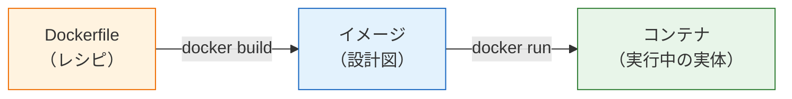
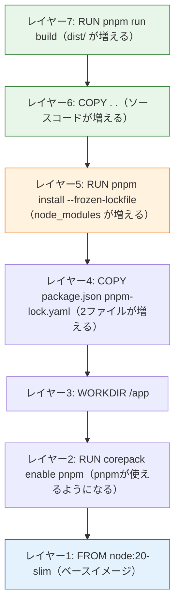

# Dockerfileを書く

前のページ（[Dockerのインストールと基本操作](/docker/install_and_basics/)）では、nginxなど「他人が作ったイメージ」を動かしました。このページでは、**Dockerfile（ドッカーファイル）**を書いて、自分のアプリのイメージを作ります。

題材は、[バックエンド基礎](/backend/)の[CRUD実践](/backend/crud_practice/)で作ったNestJSのメモAPIです。「Node.jsが入っていない環境でも、コマンド1つでメモAPIが動く」イメージを完成させます。後半では、イメージを軽く・安全にする**マルチステージビルド**まで扱います。これは[AWSデプロイ](/aws/)の章でECSにデプロイするとき、そのまま使う書き方です。

## 学習目標

- Dockerfileとは何か、各命令（FROM/WORKDIR/COPY/RUN/CMDなど）の意味を説明できる
- NestJSアプリのDockerfileを書き、`docker build` でイメージを作成できる
- イメージのレイヤー構造とビルドキャッシュの仕組みを説明できる
- 「依存関係のファイルを先にCOPYする」理由をキャッシュの観点から説明できる
- マルチステージビルドの目的と書き方を理解している

## Dockerfileとは

Dockerfileは、**イメージの作り方を記述したテキストファイル**です。「このイメージをベースに、これらのファイルを入れて、このコマンドでセットアップし、起動時にはこれを実行する」という手順を、1行1命令の形式で書きます。

前ページの言葉で言えば、イメージは「設計図」でした。Dockerfileはさらにその元、つまり「設計図の作り方を書いたレシピ」です。



Dockerfileをリポジトリに含めておけば、環境構築の手順書は不要になります。誰でも（そしてCI/CDのような自動化の仕組みでも）`docker build` 一発で同じイメージを再現できるからです。

## 準備: メモAPIプロジェクトの確認

[CRUD実践](/backend/crud_practice/)で作ったメモAPIのプロジェクト（`memo-api`）を使います。プロジェクトのルートで次の構成になっていることを確認してください。

```
memo-api/
├── src/
│   ├── main.ts
│   ├── app.module.ts
│   └── memos/        ← メモのController/Service/DTO
├── package.json
├── pnpm-lock.yaml
├── tsconfig.json
└── nest-cli.json
```

まず、コンテナ化する前にローカルでビルドが通ることを確認します。

```bash
cd memo-api
pnpm run build
```

実行結果の例:

```
> memo-api@0.0.1 build
> nest build
```

成功すると `dist/` ディレクトリが作られ、その中にコンパイル済みのJavaScript（`dist/main.js` など）が生成されます。NestJSの本番実行は「TypeScriptを `nest build` でJavaScriptに変換し、`node dist/main.js` で起動する」という流れです（[コンパイルとは](/typescript/compile/)で学んだ内容の実践です）。Dockerfileでも、この流れをコンテナの中で再現します。

## .dockerignoreを作る

Dockerfileを書く前に、もう1つ準備があります。プロジェクトのルートに **`.dockerignore`** というファイルを作ります。

**`memo-api/.dockerignore`**

```
node_modules
dist
.git
.env
```

**コード解説**

- `node_modules` — 依存パッケージはコンテナの中で改めてインストールするので、手元のものはコピーしません。OSが違うと動かないパッケージがあるうえ、サイズも巨大だからです。
- `dist` — ビルド成果物もコンテナ内で作り直すので除外します。
- `.git` — Gitの履歴データはアプリの実行に不要です。
- `.env` — 環境変数ファイルには秘密情報が入るため、イメージに焼き込んではいけません（イメージを共有すると秘密も一緒に漏れます）。

`.gitignore`（[基本コマンド](/git/basic_commands/)で学習）のDocker版だと考えてください。「イメージ作成時にコピー対象から除外するファイル」を列挙します。

## 最初のDockerfile

それでは本体です。プロジェクトのルートに `Dockerfile` という名前のファイル（拡張子なし）を作ります。

**`memo-api/Dockerfile`**

```dockerfile
FROM node:20-slim

RUN corepack enable pnpm && corepack prepare pnpm@9 --activate

WORKDIR /app

COPY package.json pnpm-lock.yaml ./

RUN pnpm install --frozen-lockfile

COPY . .

RUN pnpm run build

ENV NODE_ENV=production

EXPOSE 3000

CMD ["node", "dist/main.js"]
```

たった10行程度ですが、1行ずつ丁寧に見ていきます。Dockerfileの命令（`FROM` など大文字の単語）は**上から順に実行**されます。

### FROM — ベースイメージを指定する

```dockerfile
FROM node:20-slim
```

すべてのDockerfileは `FROM` で始まります。「どのイメージを土台（ベースイメージ）にするか」の指定です。

`node:20-slim` は、Docker Hubで公開されているNode.js公式イメージのうち、「Node.js 20系が入った、余分なものを省いた軽量（slim）版」です。本カリキュラムはNode.js 20で統一しているので、ここでも20を指定します。ゼロからLinuxにNode.jsをインストールする手順を書く必要はなく、「Node.js入りの土台」から始められるのがベースイメージの便利なところです。

なお、さらに小さい `node:20-alpine`（Alpine Linuxベース）もよく使われます。slimの方が標準的なDebian系Linuxで互換性のトラブルが少ないため、本カリキュラムではslimを使います。

### RUN corepack enable pnpm — コンテナ内でpnpmを使えるようにする

```dockerfile
RUN corepack enable pnpm && corepack prepare pnpm@9 --activate
```

`node:20-slim` イメージにはNode.jsとnpmは入っていますが、本カリキュラムで使っているpnpmは入っていません。そこで、Node.js 20に同梱されているCorepack（コアパック。パッケージマネージャを管理するツール）を使ってpnpmを有効化します。手元のPCでpnpmを導入したときと同じコマンドを、コンテナの中でも実行するわけです。続く `corepack prepare pnpm@9 --activate` は、pnpmのバージョンを9系に固定する指定です。Corepackは固定しないと最新のpnpmを取得し、Node.js 20非対応のバージョンが入って `pnpm install` が失敗することがあるため、9系に固定します。`RUN` 命令の詳しい意味はこの後すぐ説明します。

### WORKDIR — 作業ディレクトリを決める

```dockerfile
WORKDIR /app
```

これ以降の命令を実行する、コンテナ内の作業ディレクトリを `/app` に設定します。ディレクトリが存在しなければ自動で作られます。ターミナルでいう `cd /app` に相当し、以後の `COPY` や `RUN` は `/app` を基準に実行されます。場所はどこでも良いのですが、`/app` が慣習です。

### COPY（1回目）— 依存関係のファイルだけを先にコピーする

```dockerfile
COPY package.json pnpm-lock.yaml ./
```

`COPY コピー元 コピー先` で、手元のPC（正確にはビルドコンテキスト。後述）からコンテナ内へファイルをコピーします。ここでは `package.json` と `pnpm-lock.yaml` の2つだけを、作業ディレクトリ（`./` = `/app`）へコピーしています。

「なぜソースコード全部ではなく、この2ファイルだけ先に？」——これはDockerfileで最も重要なテクニックで、理由は後ほど「レイヤーとキャッシュ」の節で説明します。先に結論だけ言うと、**ビルドを高速にするため**です。

### RUN（2回目）— イメージ作成時にコマンドを実行する

```dockerfile
RUN pnpm install --frozen-lockfile
```

`RUN` は、イメージを作る過程でコンテナ内で実行するコマンドです。先ほどの `corepack enable pnpm` も、この `RUN` を使っていました。ここでは依存パッケージをインストールしています。

`--frozen-lockfile` は、`pnpm-lock.yaml` に記録されたバージョンを**正確にそのまま**インストールするオプションです（frozen lockfile = ロックファイルを凍結した状態で使う）。通常の `pnpm install` と違ってロックファイルの更新やバージョン解決をやり直さず、ロックファイルと `package.json` が食い違っていればエラーで止まります。結果が毎回同じになるため、「誰がいつビルドしても同じイメージ」にしたいDockerビルドや、後の[CI/CD](/cicd/)では `--frozen-lockfile` を付けるのが定石です。

### COPY（2回目）— ソースコード全体をコピーする

```dockerfile
COPY . .
```

今度はプロジェクト全体（1つ目の `.`）を作業ディレクトリ（2つ目の `.` = `/app`）へコピーします。ただし `.dockerignore` に書いたもの（`node_modules` など）は除外されます。

### RUN（3回目）— TypeScriptをビルドする

```dockerfile
RUN pnpm run build
```

コンテナ内で `nest build` を実行し、TypeScriptをJavaScriptにコンパイルして `/app/dist` を生成します。手元で実行したのと同じことを、イメージ作成の工程として行っているだけです。

### ENV — 環境変数を設定する

```dockerfile
ENV NODE_ENV=production
```

`ENV` はコンテナ内の環境変数を設定します。`NODE_ENV=production` は「本番モードで動かす」という、Node.jsエコシステムの慣習的なスイッチです。多くのライブラリがこの値を見て、開発用の冗長な処理を省くなどの最適化を行います。

### EXPOSE — 使用するポートを宣言する

```dockerfile
EXPOSE 3000
```

「このコンテナは3000番ポートで待ち受けます」という**宣言（ドキュメント）**です。NestJSのデフォルトポートが3000なので、それを記しています。

注意点として、`EXPOSE` を書いてもポートが自動公開されるわけではありません。実際の公開は前ページで学んだ `docker run -p` で行います。`EXPOSE` は「このイメージを使う人への案内表示」と考えてください。

### CMD — コンテナ起動時のコマンドを指定する

```dockerfile
CMD ["node", "dist/main.js"]
```

`RUN` が「イメージを**作るとき**に実行するコマンド」だったのに対し、`CMD` は「コンテナを**起動したときに**実行するコマンド」です。1つのDockerfileに1つだけ書けます。

ここでは、ビルド済みの `dist/main.js` をNode.jsで実行し、APIサーバーを起動します。`["コマンド", "引数1", "引数2"]` という配列形式で書くのが推奨スタイルです。

`RUN` と `CMD` の違いは混同しやすいので整理しておきます。

| 命令 | 実行されるタイミング | 例 |
|---|---|---|
| `RUN` | `docker build` 時（イメージ作成中） | 依存インストール、コンパイル |
| `CMD` | `docker run` 時（コンテナ起動時） | サーバーの起動 |

## イメージをビルドする

Dockerfileができたら、イメージを作ります。プロジェクトのルートで実行してください。

```bash
docker build -t memo-api:1.0 .
```

実行結果の例（抜粋）:

```
[+] Building 45.2s (13/13) FINISHED
 => [1/7] FROM docker.io/library/node:20-slim
 => [2/7] RUN corepack enable pnpm && corepack prepare pnpm@9 --activate
 => [3/7] WORKDIR /app
 => [4/7] COPY package.json pnpm-lock.yaml ./
 => [5/7] RUN pnpm install --frozen-lockfile
 => [6/7] COPY . .
 => [7/7] RUN pnpm run build
 => exporting to image
 => => naming to docker.io/library/memo-api:1.0
```

**コード解説**

- `docker build` — Dockerfileに従ってイメージを作成します。
- `-t memo-api:1.0` — 作成するイメージに「名前:タグ」を付けます（t = tag）。
- `.`（最後のドット） — **ビルドコンテキスト**の指定です。「このディレクトリ一式をビルド材料としてDocker Engineに渡す」という意味で、Dockerfile内の `COPY` のコピー元はここが基準になります。忘れやすいので注意してください。

出力の `[1/7]` 〜 `[7/7]` が、Dockerfileの各命令に対応していることが分かります。`docker images` で確認してみましょう。

```bash
docker images memo-api
```

実行結果の例:

```
REPOSITORY   TAG   IMAGE ID       CREATED          SIZE
memo-api     1.0   a1b2c3d4e5f6   30 seconds ago   531MB
```

自分のアプリのイメージができました。

## コンテナとして動かす

前ページで学んだ `docker run` で起動します。

```bash
docker run --name memo-api -d -p 3000:3000 memo-api:1.0
```

ログで起動を確認します。

```bash
docker logs memo-api
```

実行結果の例（抜粋）:

```
[Nest] 1  - 06/12/2026, 10:30:00 AM     LOG [NestFactory] Starting Nest application...
[Nest] 1  - 06/12/2026, 10:30:00 AM     LOG [RoutesResolver] MemosController {/memos}:
[Nest] 1  - 06/12/2026, 10:30:00 AM     LOG [NestApplication] Nest application successfully started
```

別のターミナルからAPIを叩いてみましょう（[コントローラ](/backend/controller/)で学んだエンドポイントです）。

```bash
curl http://localhost:3000/memos
```

実行結果の例:

```
[]
```

メモAPIがコンテナの中で動いています。このコンテナにはNode.jsもnode_modulesもすべて入っているので、**受け取った人のPCにNode.jsがなくても動きます**。確認できたら片付けておきます。

```bash
docker stop memo-api
docker rm memo-api
```

## レイヤーとキャッシュ — COPYを2回に分けた理由

ここで、先送りにしていた疑問——「なぜ `package.json` だけ先にCOPYしたのか」——に答えます。鍵は、イメージの**レイヤー（Layer、層）構造**です。

Dockerのイメージは1つの大きな塊ではなく、**Dockerfileの命令1つごとに作られる「層」の積み重ね**でできています。メモAPIのイメージは、次のような層の積み重ねです。



各レイヤーは「前のレイヤーからの差分（追加・変更されたファイル）」だけを記録しています。そしてDockerは、ビルド時に**変更がないレイヤーを再利用（キャッシュ）**します。

ルールはこうです。

- ある命令について、命令の内容とコピーされるファイルが前回ビルド時と同じなら、その層はキャッシュが使われる（一瞬で終わる）
- **ある層が変わると、それより上（後）の層はすべて作り直し**になる

このルールを踏まえて、開発中に最も頻繁に起こる「ソースコードだけ修正して再ビルド」を考えてみましょう。

- `src/` のコードを修正 → レイヤー1〜5は無関係なので**キャッシュが効く** → 時間のかかる `pnpm install`（橙色の層）がスキップされ、レイヤー6・7だけ作り直し → 再ビルドは数秒〜十数秒
- もし `COPY . .` を先に書いていたら → コードを1文字変えるだけでCOPY層が変わる → その上にある `pnpm install` も毎回やり直し → 再ビルドのたびに数分待つ

実際に試してみてください。何も変更せずもう一度ビルドすると、ほぼ一瞬で終わります。

```bash
docker build -t memo-api:1.0 .
```

実行結果の例（抜粋）:

```
[+] Building 1.3s (13/13) FINISHED
 => CACHED [2/7] RUN corepack enable pnpm && corepack prepare pnpm@9 --activate
 => CACHED [3/7] WORKDIR /app
 => CACHED [4/7] COPY package.json pnpm-lock.yaml ./
 => CACHED [5/7] RUN pnpm install --frozen-lockfile
 => CACHED [6/7] COPY . .
 => CACHED [7/7] RUN pnpm run build
```

各行に `CACHED` と表示されています。「**変更されにくいもの（依存関係）を下の層に、変更されやすいもの（ソースコード）を上の層に**」——これがDockerfileの基本設計方針です。

## マルチステージビルド

最初のDockerfileは動きますが、本番用としては無駄があります。`docker images` で見たサイズ（例では531MB）の内訳を考えてみると、実行に**不要なもの**がたくさん入っています。

- TypeScriptのソースコード（実行するのは `dist/` のJavaScriptだけ）
- TypeScriptコンパイラなどの開発用パッケージ（`devDependencies`）

ビルドには必要だが実行には不要——こうした材料を最終イメージから取り除く仕組みが**マルチステージビルド（Multi-stage Build）**です。Dockerfileの中に `FROM` を複数書いて「ビルド用ステージ」と「実行用ステージ」を分け、実行用ステージには成果物だけをコピーします。

Dockerfileを次のように書き換えます。

**`memo-api/Dockerfile`**

```dockerfile
# ---- ステージ1: ビルド用（builderと名付ける） ----
FROM node:20-slim AS builder

RUN corepack enable pnpm && corepack prepare pnpm@9 --activate

WORKDIR /app

COPY package.json pnpm-lock.yaml ./

RUN pnpm install --frozen-lockfile

COPY . .

RUN pnpm run build

# ---- ステージ2: 実行用（最終イメージになる） ----
FROM node:20-slim

RUN corepack enable pnpm && corepack prepare pnpm@9 --activate

WORKDIR /app

ENV NODE_ENV=production

COPY package.json pnpm-lock.yaml ./

RUN pnpm install --prod --frozen-lockfile

COPY --from=builder /app/dist ./dist

EXPOSE 3000

CMD ["node", "dist/main.js"]
```

**コード解説**

- `FROM node:20-slim AS builder` — 1つ目のステージに `builder` という名前を付けます。このステージの役割は「ビルドすること」だけです。
- ステージ1の `COPY`〜`RUN pnpm run build` — 先ほどと同じ流れで、`devDependencies` も含めてインストールし、`dist/` を生成します。
- 2つ目の `FROM node:20-slim` — ここから**まっさらな新しいステージ**が始まります。最終的なイメージになるのはこちらだけで、ステージ1は使い捨てです。pnpmもステージごとに有効化が必要なので、`RUN corepack enable pnpm` をもう一度書きます。
- `RUN pnpm install --prod --frozen-lockfile` — `--prod` を付けると `devDependencies`（TypeScriptコンパイラ、テストツールなど）を除いた本番用パッケージだけがインストールされます。
- `COPY --from=builder /app/dist ./dist` — マルチステージビルドの核心です。コピー元を手元のPCではなく **`builder` ステージの中**に指定し、ビルド成果物 `dist/` だけを受け取ります。TypeScriptのソースコードは最終イメージに入りません。

ビルドしてサイズを比べてみましょう。

```bash
docker build -t memo-api:2.0 .
docker images memo-api
```

実行結果の例:

```
REPOSITORY   TAG   IMAGE ID       CREATED          SIZE
memo-api     2.0   f6e5d4c3b2a1   20 seconds ago   316MB
memo-api     1.0   a1b2c3d4e5f6   15 minutes ago   531MB
```

サイズが大きく減りました（数値は環境により異なります）。動作も確認しておきます。

```bash
docker run --name memo-api -d -p 3000:3000 memo-api:2.0
curl http://localhost:3000/memos
docker stop memo-api && docker rm memo-api
```

イメージが小さいことには、サイズ以上の意味があります。

- **転送が速い** — デプロイのたびにイメージをレジストリへアップロード/ダウンロードするため、小ささは速さに直結します。
- **攻撃対象が減る** — 本番イメージに開発ツールやソースコードが入っていないことは、セキュリティ上も望ましい状態です。

このマルチステージ版Dockerfileは、[AWSデプロイ](/aws/)の章でほぼこのままECR（AWSのイメージレジストリ）にプッシュし、ECS（コンテナ実行サービス）で動かします（→ [ECR/ECSへのデプロイ](/aws/ecr_ecs/)）。「本番で使う形」をここで手に入れたことになります。

## 理解度チェック

**Q1. Dockerfile・イメージ・コンテナの3つの関係を説明してください。**

<details markdown="1">
<summary>解答を見る</summary>

Dockerfileは「イメージの作り方を書いたレシピ」、イメージは「Dockerfileから `docker build` で作られる、アプリ＋実行環境の設計図」、コンテナは「イメージから `docker run` で起動される実行中の実体」です。Dockerfile → (build) → イメージ → (run) → コンテナ、という流れになります。

</details>

**Q2. `RUN` と `CMD` の違いを、メモAPIのDockerfileの具体例を挙げて説明してください。**

<details markdown="1">
<summary>解答を見る</summary>

`RUN` はイメージを作るとき（`docker build` 時）に実行される命令で、例えば `RUN pnpm install --frozen-lockfile`（依存インストール）や `RUN pnpm run build`（コンパイル）です。`CMD` はコンテナを起動したとき（`docker run` 時）に実行される命令で、`CMD ["node", "dist/main.js"]`（サーバー起動）が該当します。ビルドは1回、起動はコンテナを作るたびに行われる点が異なります。

</details>

**Q3. `COPY . .` の前に `COPY package.json pnpm-lock.yaml ./` と `RUN pnpm install --frozen-lockfile` を書くのはなぜですか。**

<details markdown="1">
<summary>解答を見る</summary>

ビルドキャッシュを効かせるためです。Dockerはレイヤー単位でキャッシュし、ある層が変わるとそれより後の層はすべて作り直しになります。ソースコードは頻繁に変わりますが、依存関係（package.json/pnpm-lock.yaml）はめったに変わりません。依存インストールをソースコードのCOPYより前（下の層）に置くことで、コード修正時の再ビルドで時間のかかる `pnpm install` をスキップできます。

</details>

**Q4. `.dockerignore` に `node_modules` と `.env` を書くべき理由をそれぞれ説明してください。**

<details markdown="1">
<summary>解答を見る</summary>

`node_modules` は、コンテナ内で `pnpm install --frozen-lockfile` により改めてインストールするため手元のものをコピーする必要がなく、OSの違いで動かないパッケージが混入する危険やビルドコンテキストの肥大化を避けるためです。`.env` は、APIキーやパスワードなどの秘密情報をイメージに焼き込むと、イメージを共有した相手に秘密が漏れてしまうためです。秘密情報は実行時に渡します。

</details>

**Q5. マルチステージビルドでは何がどう分かれており、最終イメージには何が入りませんか。**

<details markdown="1">
<summary>解答を見る</summary>

「ビルド用ステージ（builder）」と「実行用ステージ」に分かれます。builderではdevDependenciesを含む全パッケージで `pnpm run build` を行い、実行用ステージは `COPY --from=builder` でビルド成果物（`dist/`）だけを受け取ります。最終イメージには、TypeScriptのソースコードやTypeScriptコンパイラなどのdevDependenciesが入らないため、イメージが小さく、転送が速く、セキュリティ面でも望ましくなります。

</details>

**Q6. `docker build -t memo-api:1.0 .` の最後の `.` は何を意味しますか。**

<details markdown="1">
<summary>解答を見る</summary>

ビルドコンテキストの指定です。「このディレクトリ（カレントディレクトリ）一式をビルドの材料としてDocker Engineに渡す」という意味で、Dockerfile内の `COPY` のコピー元はこのディレクトリが基準になります。`.dockerignore` は、このビルドコンテキストから除外するファイルを指定するファイルです。

</details>

## セルフレビュー

- [ ] Dockerfileの各命令（FROM/WORKDIR/COPY/RUN/ENV/EXPOSE/CMD）の役割を説明できる
- [ ] メモAPIのシンプルなDockerfileを、写経せずに書ける
- [ ] `docker build -t 名前:タグ .` でイメージを作成し、起動・動作確認・片付けまでできる
- [ ] イメージがレイヤーの積み重ねであることを図で説明できる
- [ ] 「依存関係を先にCOPYする」理由をキャッシュの観点から説明できる
- [ ] `--frozen-lockfile` と通常の `pnpm install` の違い、`--prod` の意味を説明できる
- [ ] マルチステージビルドの目的（イメージの軽量化・安全化）と `COPY --from=` の働きを説明できる
- [ ] `.dockerignore` に何を書くべきか判断できる

## 次のステップ

メモAPI単体をコンテナ化できました。しかし実際のアプリは「API + データベース」のように複数のコンテナで構成されます。`docker run` を何度も打って個別に管理するのは大変です。次のページ[Docker Composeで複数コンテナを動かす](/docker/docker_compose/)では、複数コンテナをファイル1つで宣言的に管理する方法を学びます。

また、ここで作ったマルチステージ版Dockerfileは、[CI/CD](/cicd/)で自動ビルドされ、[ECR/ECSへのデプロイ](/aws/ecr_ecs/)で本番環境に配置されます。この先の章で何度も再会することになるので、レイヤーとキャッシュの考え方をしっかり押さえておいてください。
