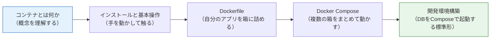

# Docker基礎

このセクションでは、コンテナ（Container）技術の代表である Docker（ドッカー）を学びます。

前のセクション（[バックエンド基礎（NestJS）](/backend//)）では、自分のPCにNode.jsをインストールしてメモAPIを動かしました。しかし実際の開発現場では、「自分のPCでは動くのに、他の人のPCやサーバーでは動かない」という問題が頻繁に起こります。Dockerは、アプリケーションを「どこでも同じように動く箱」に詰めることで、この問題を解決する技術です。

## なぜDockerを学ぶのか

現代のWeb開発において、Dockerは避けて通れない基盤技術になっています。本カリキュラムでも、この後のセクションで繰り返しDockerを使います。

- **データベースの章**（[データベースとPrisma](/database//)）では、Dockerを使ってPostgreSQLを起動します。PCに直接インストールするより、はるかに簡単で安全です。
- **AWSデプロイの章**（[AWSデプロイ](/aws//)）では、NestJSアプリをDockerイメージにしてECS（コンテナ実行サービス）にデプロイします。
- **最終プロジェクトのSNS開発**でも、PostgreSQLをDockerで起動して開発を進めます。

つまり、ここでDockerを身につけておくことが、この先のすべての土台になります。

## このセクションで学ぶこと

| ページ | 内容 |
|---|---|
| [コンテナとは何か](/docker/what_is_container/) | コンテナの概念、仮想マシン（VM）との違い、なぜ使われるのか |
| [Dockerのインストールと基本操作](/docker/install_and_basics/) | Docker Desktopの導入、イメージとコンテナ、基本コマンド |
| [Dockerfileを書く](/docker/dockerfile/) | NestJSのメモAPIをコンテナ化する。レイヤー構造とマルチステージビルド |
| [Docker Composeで複数コンテナを動かす](/docker/docker_compose/) | compose.yamlの書き方、ボリューム、コンテナ間ネットワーク |
| [開発環境をComposeで組む](/docker/dev_environment/) | PostgreSQL 16をComposeで起動し、ローカルのAPIとつなぐ開発環境の標準形を作る |

## 学習の流れ

このセクションは「概念 → 操作 → 構築」の順に進みます。

最初の2ページで「コンテナとは何か」「どう操作するか」を理解し、後半の3ページで前章までに作ったメモAPIを実際にコンテナ化していきます。概念だけ・コマンドだけを覚えるのではなく、「自分のアプリをDockerで動かせる」状態をゴールにします。

## 前提条件

- [バックエンド基礎（NestJS）](/backend//)を修了し、メモAPI（[CRUD実践](/backend/crud_practice/)で作成）が手元にあること
- [ターミナルの使い方](/environment/terminal/)に慣れていること

それでは、[コンテナとは何か](/docker/what_is_container/)から始めましょう。
