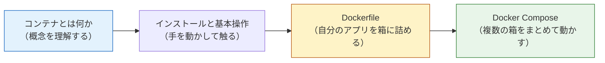
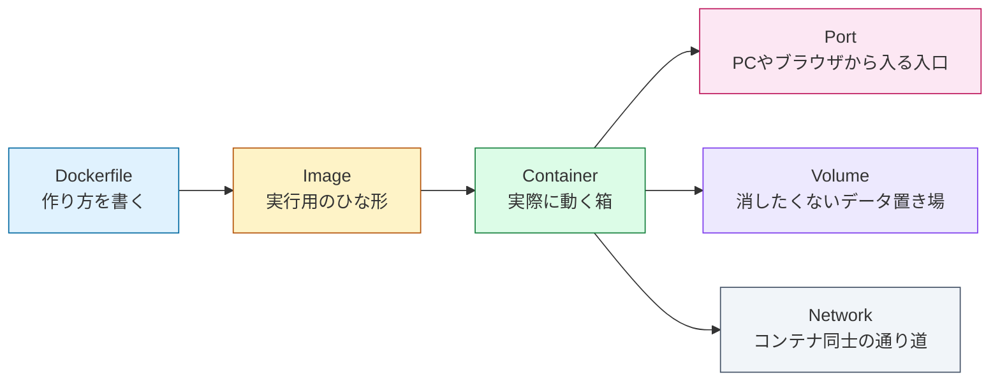
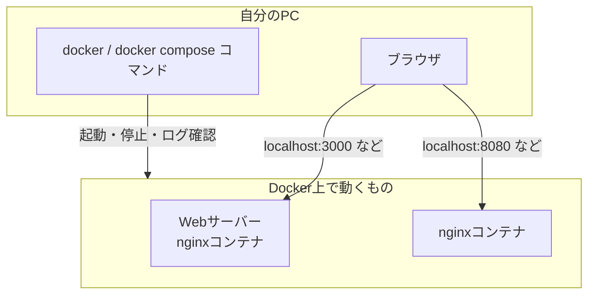
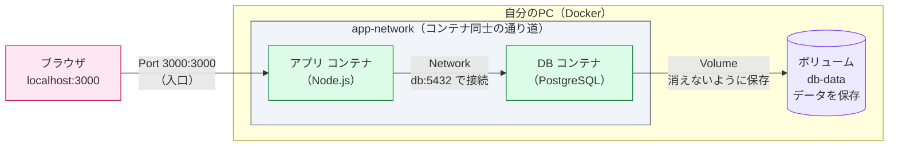

# Docker基礎

このセクションでは、コンテナ（Container）技術の代表である Docker（ドッカー）を学びます。

実際の開発現場では、「自分のPCでは動くのに、他の人のPCやサーバーでは動かない」という問題が頻繁に起こります。Dockerは、ソフトウェアを「どこでも同じように動く箱」に詰めることで、この問題を解決する技術です。

## なぜDockerを学ぶのか

現代のWeb開発において、Dockerは避けて通れない基盤技術になっています。本カリキュラムでも、この後のセクションで繰り返しDockerを使います。

- **Docker Compose + DB**の教材では、Dockerを使ってPostgreSQLやMySQLを起動します。PCに直接インストールするより、はるかに簡単で安全です。
- **デプロイの章**では、作成したアプリをDockerイメージにしてサーバー上で動かします。
- **最終プロジェクトのSNS開発**でも、PostgreSQLをDockerで起動して開発を進めます。

つまり、ここでDockerを身につけておくことが、この先のすべての土台になります。

## このセクションで学ぶこと

| ページ | 内容 |
|---|---|
| [コンテナとは何か](/docker/what_is_container/) | コンテナの概念、仮想マシン（VM）との違い、なぜ使われるのか |
| [Dockerのインストールと基本操作](/docker/install_and_basics/) | Docker Desktopの導入、イメージとコンテナ、基本コマンド |
| [Dockerfileを書く](/docker/dockerfile/) | 静的HTMLをnginxイメージに入れ、Dockerfileの基本命令を学ぶ |
| [Docker Composeで複数コンテナを動かす](/docker/docker_compose/) | compose.yamlの書き方、ボリューム、コンテナ間ネットワーク |

DBをComposeで立てる実践は、この章とは別の[Docker Compose + DB](/docker/database_compose/)で扱います。Docker基礎ではまず、イメージ、コンテナ、Dockerfile、ネットワーク、ボリュームの意味を理解することに集中します。

## 学習の流れ

このセクションは「概念 → 操作 → 構築」の順に進みます。

最初の2ページで「コンテナとは何か」「どう操作するか」を理解し、後半で静的HTMLとnginxを題材にDockerfileとComposeを学びます。まだアプリ開発には進まず、Dockerそのものの考え方と操作に集中します。

## Dockerの全体像

Dockerで混乱しやすいのは、イメージ、コンテナ、ポート、ボリューム、ネットワークが同時に出てくる点です。まずは次の関係で整理してください。

実務で使うDockerは、ほとんどこの組み合わせです。

Port・Volume・Networkという言葉は、最初は抽象的でピンと来ないかもしれません。そこで、この先の実践でよく作る「Webアプリ＋データベース」の構成を具体例として見てみましょう。下の図のように、ブラウザは**ポート**を通ってアプリに入り、アプリは**ネットワーク**を通ってDBにつながり、DBの中身は**ボリューム**に保存されてコンテナを消しても残ります。

この1枚に、Port（入口）・Network（コンテナ同士の通り道）・Volume（消したくないデータ置き場）が全部入っています。今は「こういう絵を組み立てていくんだな」と眺めるだけで十分です。それぞれの作り方は各ページで1つずつ手を動かして学びます。

この章では「箱を作る」「箱を起動する」「箱の中のログや状態を見る」ことを中心に学びます。DBの永続化や接続は、独立した実践教材で扱います。

## 前提条件

- [ターミナルの使い方](/environment/terminal/)に慣れていること

それでは、[コンテナとは何か](/docker/what_is_container/)から始めましょう。
